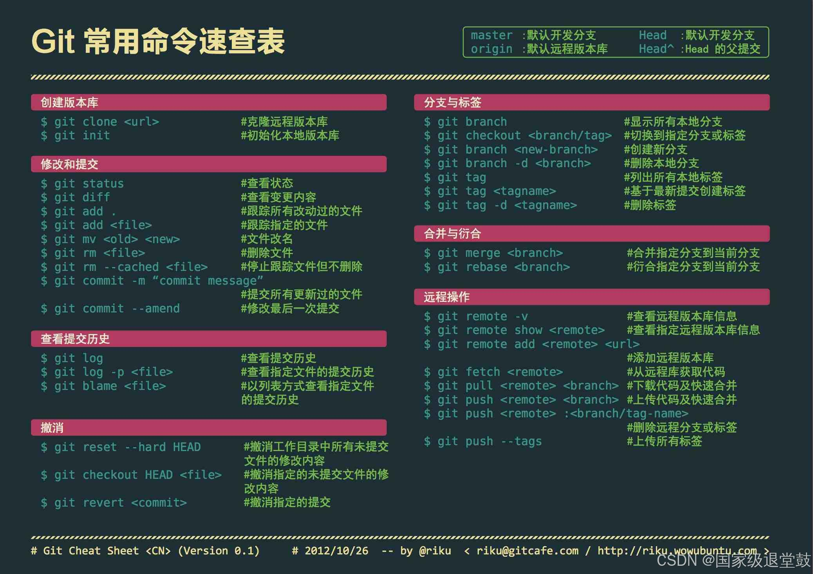

## 常用命令

查看**Git版本**，检测是否安装成功

```git
git --version
```

配置用户名和邮箱

```git 
git config --global user.name "Deng ZJ"
git config --global user.email Deng@gmail.com
```

查看配置信息

```
git config --global --list
```

初始化仓库。在本地文件目录中执行命令 `git init`，将这个目录变成 Git 仓库。系统命令窗口回显已经`初始化`了一个空的仓库，且路径行出现一个**master**分支

```
git init
```

新建仓库，取名为my-repo的仓库

```
git init my-repo
```

`删除`仓库，master标志也会消失

```
rm -rf .git
```



---

## 设置忽略文件

在工作空间中有些文件是不需要记录到版本库中的（例如.idea、target、.iml文件），可以通过设置忽略提交来实现

- 在工作空间的根目录（项目的根目录）中创建一个名为`.gitignore`文件
- 在`.gitignore`文件配置忽略过滤条件

常见的规则示例：

```python
# 忽略所有 .log 文件
*.log
 
# 忽略特定文件 mysecretfile.txt
mysecretfile.txt
 
# 忽略整个目录
node_modules/
 
# 忽略所有 .pdf 文件，但跟踪特定的 mydoc.pdf
*.pdf
!mydoc.pdf
 
# 忽略所有文件，但跟踪 .gitignore 和 foo.bar 文件
*
!.gitignore
!foo.bar
```

如果你已经提交了某个文件，但后来决定将其添加到.gitignore文件中以忽略它，你需要执行一些额外的步骤来删除已提交的文件。

首先，你应该从你的工作副本中删除该文件。你可以使用以下命令完成这个步骤：

```
git rm --cached 文件名
```

接下来，你需要提交.gitignore文件的更改和删除的文件。你可以使用以下命令将这些更改提交到版本控制库：

```g
git commit -m "更新.gitignore文件并删除文件"
```

若是文件夹

```
git rm -r --cached folder/
```

---

## 添加和提交文件

| 命令                             | 解释                                                         |
| -------------------------------- | ------------------------------------------------------------ |
| `git status`                     | 查看仓库的状态                                               |
| `git add file1.txt file2.py ...` | 将文件添加到暂存区                                           |
| `git add *.txt`                  | 通过通配符`*`来add添加多个文件                               |
| `git add .`                      | 添加当前文件夹的`所有文件`(用`. `表示)到暂存区               |
| `git commit -m "提示信息"`       | 提交文件，只会提交暂存区的文件                               |
| `git log`                        | 查看仓库提交历史记录<br/>添加`--oneline`参数可查看简洁的历史记录 |
| `git commit -a -m “输入信息”`    | 一次性完成添加和暂存                                         |

提交文件，不带m参数就会进入vim文件编辑器(不会使用需学习Linux基础知识)界面，首行编辑第二次提交即可，vim的使用方法自行查阅

进入界面，先输入`i`进入编辑界面，编辑文字`这是第二次提交`后，按Esc退出输入模式。进入命令模式，界面输入`:wq`即可

---

## 回退版本

| 命令                              | 解释                                                         |
| --------------------------------- | ------------------------------------------------------------ |
| `git reset –soft 回退的版本号`    | 回退版本，工作区内容保留，暂存区内容保留                     |
| `git reset –hard 回退的版本号`    | 回退版本，工作区内容清空，暂存区内容清空                     |
| `git reset [–mixed] 回退的版本号` | `mixed`为默认参数，回退版本，工作区内容保留，暂存区内容清空  |
| `git restore filename`            | 让你能够放弃最后一次提交后对指定文件所做的所有修改           |
| `git restore .`                   | 放弃最后一次提交后对所有文件所做的所有修改，从而将项目恢复到最后一次提交的状态 |


## 查看差异

| 命令                       | 解释                                 |
| -------------------------- | ------------------------------------ |
| `git diff HEAD`            | 工作区和版本库之间的差异             |
| `git diff --cached`        | 暂存区和版本库之间的差异             |
| `git diff 9ff62d0 e27c26b` | 比较版本差异，只需要加入版本的ID即可 |


## 删除文件

| 命令                          | 解释                                                       |
| ----------------------------- | ---------------------------------------------------------- |
| `git rm file2.txt`            | 可以一次性删除工作区和暂存区的相同文件                     |
| `git rm --cached 文件名`      | 删除版本库的文件                                           |
| `git commit -m "delete file"` | 删除的文件需要提交到版本库中，这样版本库中的文件才能被删除 |


## 分支

| 分支命令                                                     | 解释                        |
| ------------------------------------------------------------ | --------------------------- |
| `git branch`                                                 | 查看当前仓库的所有分支      |
| `git branch dev`                                             | 创建一个名为dev的新分支     |
| `git checkout dev`<br />`git switch dev`                     | 切换到新的分支              |
| `git merge dev`                                              | 将dev分支进行合并到当前分支 |
| `git branch -d 分支名(已合并)`<br />`git branch -D 分支名(未合并)` | 删除分支                    |
| `git branch -m 原分支名 目标分支名`                          | 修改分支名                  |


## 远程

配置教程 https://blog.csdn.net/Charles_Tian/article/details/80842439

| 远程命令                              | 解释                          |
| ------------------------------------- | ----------------------------- |
| `git push origin mian`                | 将本地`main`分支上传到 github |
| `git push --set-upstream origin main` |                               |
| `git push --force origin main`        | 强制推送，忽略远程的更新      |

**问题：**

（1）Please make sure you have the correct access rights and the repository exists.

解决：把 github 上的 SSH Key 删除后重新创建

---

## 标签

#### **创建标签**

**创建轻量标签**：

```
git tag v1.0.0
```

**创建附注标签**（推荐）：

```
git tag -a v1.0.0 -m "Release version 1.0.0"
```

#### **查看标签**

**列出所有标签**：

```
git tag                        列出中本地的标签
git tag -l "v.*"               -l 即 --list , 列出仓库中的标签基础上,支持更多选项和模式匹配
```

**查看标签详情**（仅附注标签）：

```
git show v1.0.0
```

**查看远程标签**

```
git ls-remote --tags origin
```

#### **推送标签到远程仓库**

默认情况下，`git push` 不会推送标签，需显式推送：

**推送单个标签**：

```
git push origin v1.0.0
```

**推送所有标签**：

```
git push origin --tags
```

#### **删除标签**

**删除本地标签**：

```
git tag -d v1.0.0
```

**删除远程标签**：

```
git push origin :refs/tags/v1.0.0
```

#### **检出标签对应的代码**

标签通常用于标记不可变的历史节点，若需要修改，建议基于标签创建分支：

```
git checkout -b release-v1.0.0 v1.0.0
```

