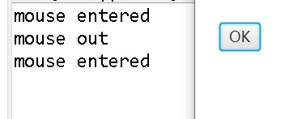

# UI控件

## 标签

　　标签（label)是一个显示小段文字、一个节点或同时显示两者的区域。它经常用来给其他组件（通常为文本域）做标签。标签和按钮共享许多共同的属性。这些共同属性定义在`Labeled`类中。

Labeled 类的UML图：

| `javafx.scene.control.Labeled`                    | 作用                                                         |
| ------------------------------------------------- | ------------------------------------------------------------ |
| `-alignment: ObjectProperty<Pos>`                 | 指定labeled中文本和节点的对齐方式                            |
| `-contentDisplay: ObjectProperty<ContentDisplay>` | 使用ContentDisplay中定义的常置TOP、BOTTOM、LEFT和RIGHT指定节点相对于文本的位置 |
| `-graphic: ObjectProperty<Node>`                  | 用于labeled的图形                                            |
| `-graphlcTextCap: DoubleProperty`                 | 图形和文本之间的间隔                                         |
| `-textFill: ObjectProperty<Paint>`                | 用于填充文本的图画                                           |
| `-text: StringProperty`                           | 用于标签的文本                                               |
| `-underline: BooleanProperty`                     | 文本是否需要加下划线                                         |
| `-wrapText: BooleanProperty`                      | 如果文本超过了宽度，是否要换至下一行                         |

Label 类的UML图：

| `javafx.scene.control.Label`       | 作用                         |
| ---------------------------------- | ---------------------------- |
| `+Label()`                         | 创建一个空Lable              |
| `+Label(text:String)`              | 创建一个特定文本的标签       |
| `+Label(text:String,graphic:Node)` | 创建一个特定文本和图形的标签 |
| `+setFont(Font value)`             | 设置文本字体                 |
| `+setTextFill(Paint value)`        | 设置字体颜色                 |
| `+setText(String text)`            | 设置标签的文本标题           |
| `+setGraphic(Node graphic)`        | 设置图形图标                 |
| `+setGraphicTextGap()`             | 设置文本和图标之间的差距     |

Graphic属性可以是任何一个节点，比如一个形状、一个图像或一个控件。

实例：

```java 
import javafx.application.Application;
import javafx.scene.Scene;
import javafx.scene.control.ContentDisplay;
import javafx.scene.control.Label;
import javafx.scene.image.ImageView;
import javafx.scene.layout.Pane;
import javafx.scene.layout.StackPane;
import javafx.scene.paint.Color;
import javafx.stage.Stage;

public class Main extends Application{

	@Override
	public void start(Stage primaryStage) {
		Pane pane = new StackPane();
		
		ImageView imgView = new ImageView("file:D:\\精选壁纸\\萤火虫唯美动漫4k壁纸_彼岸图网.jpg");
		imgView.setFitWidth(240);
		imgView.setFitHeight(320);
		Label label = new Label("万家灯火", imgView);
		label.setTextFill(Color.RED);
		label.setContentDisplay(ContentDisplay.BOTTOM);
		pane.getChildren().add(label);
		
		Scene scene = new Scene(pane, 640, 480);
		primaryStage.setTitle("白生");
		primaryStage.setScene(scene);
		primaryStage.show();
	}
	
	public static void main(String[] args) {
		launch(args);
	}
	
}
```

结果：


---

## 按钮

按钮（button)是单击时触发动作事件的组件。JavaFX提供了常规按钮、开关按钮、复选框按钮和单选按钮。这些按钮的公共特性在`ButtonBase`和`Labeled`类中定义。

Button类扩展标记的类，它可以显示文本，图像，或两者兼而有之。

Labeled类定义了标签和按钮的共同属性。按钮和标签非常类似，除了按钮具有定义在ButtonBase类中的onAction属性，该属性设置一个用于处理按钮动作的处理器

| `javafx.scene.control.ButtonBase`                      | 作用                         |
| ------------------------------------------------------ | ---------------------------- |
| `-onAction: ObjectProperty<EventHandler<Act1onEvent>>` | 定义一个处理按钮动作的处理器 |

Button 类的UML图：

| `javafx.scene.control.Button`       | 作用                                                         |
| ----------------------------------- | ------------------------------------------------------------ |
| `+Button()`                         | 创建一个空按钮                                               |
| `+Button(text:String)`              | 创建一个特定文本的按钮                                       |
| `+Button(text:String,graphic:Node)` | 创建一个特定文本和图形的按钮                                 |
| `+setDisable()`                     | 设置按钮是否报废                                             |
| `+setWrapText(boolean bool);`       | 是指是否文本换行（如果文本太长，无法显示在按钮内的一行上，则文本将被拆分为多行）。 |

实例-1：

```Java
import javafx.application.Application;
import javafx.event.ActionEvent;
import javafx.event.EventHandler;
import javafx.scene.Scene;
import javafx.scene.control.Button;
import javafx.scene.layout.StackPane;
import javafx.stage.Stage;

public class Main extends Application {
    public static void main(String[] args) {
        launch(args);
    }
    @Override
    public void start(Stage primaryStage) {
        primaryStage.setTitle("Hello World!");
        Button btn = new Button();
        btn.setText("Say \"Hello World\"");
        btn.setOnAction(new EventHandler<ActionEvent>() {
            @Override
            public void handle(ActionEvent event) {
                System.out.println("Hello World!");
            }
        });
        
        StackPane root = new StackPane();
        root.getChildren().add(btn);
        primaryStage.setScene(new Scene(root, 300, 250));
        primaryStage.show();
    }
}
```

结果：

当点击按钮时会输出"Hello World!"。


实例-2：

```Java
import javafx.application.Application;
import javafx.event.EventHandler;
import javafx.scene.Group;
import javafx.scene.Scene;
import javafx.scene.control.Button;
import javafx.scene.input.MouseEvent;
import javafx.scene.layout.VBox;
import javafx.stage.Stage;

public class Main extends Application {
  public static void main(String[] args) {
    launch(args);
  }

  @Override
  public void start(Stage stage) {
    Scene scene = new Scene(new Group());
    stage.setWidth(300);
    stage.setHeight(190);

    VBox vbox = new VBox();
    vbox.setLayoutX(20);
    vbox.setLayoutY(20);

    final Button button1 = new Button("OK");

    button1.addEventHandler(MouseEvent.MOUSE_ENTERED,
        new EventHandler<MouseEvent>() {
          @Override
          public void handle(MouseEvent e) {
            System.out.println("mouse entered");
          }
        });

    button1.addEventHandler(MouseEvent.MOUSE_EXITED,
        new EventHandler<MouseEvent>() {
          @Override
          public void handle(MouseEvent e) {
            System.out.println("mouse out");
          }
        });

    vbox.getChildren().add(button1);
    ((Group) scene.getRoot()).getChildren().add(vbox);

    stage.setScene(scene);
    stage.show();
  }
}
```

结果：

当鼠标放在按钮上时会输出"mouse entered"，当鼠标移开按钮时会输出"mouse out"。



---

## 复选框

复选框用于提供给用户进行选择。如同Button、CheckBox继承了来自ButtonBase和Labeled的所有属性，比如`onAction、text、graphic、alignment、graphicTextGap、textFil、contentDisplay`。

另外，它提供了`selected`属性用于表明一个复选框是否被选中。

CheckBox 类的UML图：

| `javafx.scene.control.CheckBox` | 作用                         |
| ------------------------------- | ---------------------------- |
| `-selected: BooleanProperty`    | 标识一个复选框是否被选中     |
| `+CheckBox()`                   | 创建一个空的复选框           |
| `+CheckBox(text:String)`        | 创建一个具有特定文本的复选框 |
| `+isSelected()`                 | 判断一个复选框是否被选中     |

当一个复选框被单击（选中或者取消选中)，都会触发一个ActionEvent。

复选框状态:

我们可以使用CheckBox来表示三个状态:

- Yes
- No
- Not Applicable

“不适用"状态是调用不确定。如果复选框不在不确定中，可以选择或不选择。选择表示是，未选择表示否。

我们可以选择通过设置支持不确定CheckBox对象的allowIndeterminate属性。

如果设置为true，则复选框应该循环选择所有三个状态:选中，取消选择和未定义。

如果设置为false，复选框将循环选择和取消选择的状态。

实例：

```Java
import javafx.application.Application;
import javafx.event.ActionEvent;
import javafx.event.EventHandler;
import javafx.geometry.Pos;
import javafx.scene.Scene;
import javafx.scene.control.CheckBox;
import javafx.scene.layout.BorderPane;
import javafx.scene.layout.HBox;
import javafx.scene.text.Font;
import javafx.scene.text.FontPosture;
import javafx.scene.text.FontWeight;
import javafx.scene.text.Text;
import javafx.stage.Stage;

public class Main extends Application {
    public static void main(String[] args) {
        launch(args);
    }
    @Override
    public void start(Stage primaryStage) {
    	BorderPane pane = new BorderPane();
    	HBox ckbPane = new HBox();
    	ckbPane.setSpacing(5);
    	ckbPane.setAlignment(Pos.CENTER);
    	
    	Text text = new Text("I wish you happiness in the world.");
    	CheckBox ckb1 = new CheckBox("加粗");
    	CheckBox ckb2 = new CheckBox("斜体");
    	EventHandler<ActionEvent> handler = e->{
    		if (ckb1.isSelected() && ckb2.isSelected()) {
    			text.setFont(Font.font("Times New Roman", FontWeight.BOLD, FontPosture.ITALIC, 20));
    		} else if(ckb1.isSelected()) {
    			text.setFont(Font.font("Times New Roman", FontWeight.BOLD, 20));
    		} else if(ckb2.isSelected()){
    			text.setFont(Font.font("Times New Roman", FontPosture.ITALIC, 20));
    		}
    	};
    	ckb1.setOnAction(handler);
    	ckb2.setOnAction(handler);
    	
    	ckbPane.getChildren().addAll(ckb1, ckb2);
    	pane.setCenter(text);
    	pane.setBottom(ckbPane);
    	
    	Scene scene = new Scene(pane,400,400);
    	primaryStage.setTitle("白生");
    	primaryStage.setScene(scene);
    	primaryStage.show();
    }
}
```

结果：


---

## 单选按钮

单选按钮（radiobutton)也称为选项按钮（optionbutton),它可以让用户从一组选项中选择一个单一的条目。从外观上看，单选按钮类似于复选框。复选框是方形的，可以选中或者不选中；而单选按钮显示一个圆，或是填充的（选中时)，或是空白的（未选中时)。

**RadioButton是ToggleButton的子类。**单选按钮和开关按钮的不同之处是，单选按钮显示一个圆，而开关按钮渲染成类似于按钮。

ToggleButton 类的UML图：

| `javafx.scene.control.ToggleButton`         | 作用                             |
| ------------------------------------------- | -------------------------------- |
| `-selected: BooleanProperty`                | 表明按钮是否被选中               |
| `-toggleGroup: ObjectProperty<ToggleCroup>` | 指定按钮厲于的按钮组             |
| `+TogoleButton()`                           | 创建一个空开关按钮               |
| `+ToggleButton(text:String)`                | 创建一个具有指定文本的按钮       |
| `+ToggleButton(text:String,graphic:Node)`   | 创建一个具有指定文本和图形的按钮 |

RadioButton 类的UML图：

| `javafx.scene.control.RadioButton` | 作用                           |
| ---------------------------------- | ------------------------------ |
| `+RadioButton()`                   | 创建一个空单选按钮             |
| `+RadioButton(text:String)`        | 创建一个具有指定文本的单选按钮 |
| `+isSelected()`                    | 判断一个单选按钮是否选中       |

实例：

```Java
import javafx.application.Application;
import javafx.geometry.Pos;
import javafx.scene.Scene;
import javafx.scene.control.RadioButton;
import javafx.scene.control.ToggleGroup;
import javafx.scene.layout.BorderPane;
import javafx.scene.layout.HBox;
import javafx.scene.paint.Color;
import javafx.scene.text.Font;
import javafx.scene.text.Text;
import javafx.stage.Stage;

public class Main extends Application {
    public static void main(String[] args) {
        launch(args);
    }
    @Override
    public void start(Stage primaryStage) {
    	BorderPane pane = new BorderPane();
    	HBox ckbPane = new HBox();
    	ckbPane.setPrefWidth(20);
    	ckbPane.setPrefHeight(20);
    	ckbPane.setSpacing(5);
    	ckbPane.setAlignment(Pos.CENTER);
    	
    	Text text = new Text("I wish you happiness in the world.");
    	text.setFont(new Font(15));
    	
    	RadioButton rbRed = new RadioButton("Red");
    	RadioButton rbGreen = new RadioButton("Green");
    	RadioButton rbYellow = new RadioButton("Yellow");
    	ToggleGroup rbGroup = new ToggleGroup();
    	// 将三个按钮键入同一个按钮组
    	rbRed.setToggleGroup(rbGroup);
    	rbGreen.setToggleGroup(rbGroup);
    	rbYellow.setToggleGroup(rbGroup);
    	// 事件处理
    	rbRed.setOnAction(e->{
    		text.setFill(Color.RED);
    	});
    	rbGreen.setOnAction(e->{
    		text.setFill(Color.GREEN);
    	});
    	rbYellow.setOnAction(e->{
    		text.setFill(Color.YELLOW);
    	});
    	
    	ckbPane.getChildren().addAll(rbRed, rbGreen, rbYellow);
    	pane.setCenter(text);
    	pane.setBottom(ckbPane);
    	
    	Scene scene = new Scene(pane,400,200);
    	primaryStage.setTitle("白生");
    	primaryStage.setScene(scene);
    	primaryStage.show();
    }
}
```

结果：


---

## 文本域

文本域（textfield)可用于输入或显示一个字符串。TextField是TextlnputControl的子类。

当你将光标移至文本域并按下冋车键时，它将触发一个ActionEvent事件。

TextInputControl 类的UML图：

| `javafx.scene.control.TextInputControl` | 作用                       |
| --------------------------------------- | -------------------------- |
| `-text: StringProperty`                 | 该组件中的文本内容         |
| `-editable: BooleanProperty`            | 表明文本是否可以被用户编辑 |

TextField 类 的UML图：

| `javafx.scene.control.TextField`                      | 作用                                                         |
| ----------------------------------------------------- | ------------------------------------------------------------ |
| `-alignment: ObjectProperty<Pos>`                     | 指定文本在文本域中如何对齐                                   |
| `-prefColumnCount: IntegerProperty`                   | 指定文本域优先列数                                           |
| `-onAction: ObjectProperty<EventHandler<ActionEven>>` | 指定文本域上动作亊件的处理器                                 |
| `+TextF1eld()`                                        | 创建一个空的文本域                                           |
| `+TextF1eld(text:String)`                             | 创建一个具有指定文本的文本域                                 |
| `+setText()`                                          | 设置文本域的文本                                             |
| `+clear()`                                            | 清空文本域的文本                                             |
| `+getText()`                                          | 获取文本                                                     |
| `+setPrefColumnCount()`                               | 设置文本字段的大小                                           |
| `+setPromptText`                                      | 定义显示在文本字段中的字符串。无法通过getText方法获取提示文本。 |
| `+copy()`                                             | 将所选文本设置为剪贴板                                       |
| `+cut()`                                              | 将所选文本设置为剪贴板并删除当前选择。                       |
| `+selectAll()`                                        | 选择文本输入中的所有文本                                     |
| `+paste()`                                            | 将剪贴板中的内容设置为此文本并替换当前选择                   |

实例-1：

以下代码显示如何将字符串值从TextField绑定到Stage Title。

```Java
import javafx.application.Application;
import javafx.beans.property.SimpleStringProperty;
import javafx.beans.property.StringProperty;
import javafx.scene.Scene;
import javafx.scene.control.Label;
import javafx.scene.control.TextField;
import javafx.scene.layout.HBox;
import javafx.stage.Stage;

public class Main extends Application {
  StringProperty title = new SimpleStringProperty();
  
  public static void main(String[] args) {
    Application.launch(args);
  }
  
  @Override
  public void start(Stage stage) {
    TextField titleTextField;
    titleTextField = new TextField();
    titleTextField.setText("Stage Coach");
    titleTextField.setPrefColumnCount(15);

    HBox hBox = new HBox();
    hBox.setSpacing(10);
    hBox.getChildren().add(new Label("title:"));
    hBox.getChildren().add(titleTextField);

    Scene scene  = new Scene(hBox,270,270);
    title.bind(titleTextField.textProperty());		// 属性绑定
    
    stage.setScene(scene);
    stage.titleProperty().bind(title);


    stage.show();
  }
}
```

结果：


实例-2：

以下代码显示了如何将ContextMenu添加到TextField

```Java
import javafx.application.Application;
import javafx.event.ActionEvent;
import javafx.event.EventHandler;
import javafx.geometry.Insets;
import javafx.scene.Group;
import javafx.scene.Scene;
import javafx.scene.control.ContextMenu;
import javafx.scene.control.Label;
import javafx.scene.control.MenuItem;
import javafx.scene.control.TextField;
import javafx.scene.layout.GridPane;
import javafx.stage.Stage;
import javafx.stage.WindowEvent;

public class Main extends Application {
  public static void main(String[] args) {
    launch(args);
  }

  @Override
  public void start(Stage stage) {
    Scene scene = new Scene(new Group(), 450, 250);

    TextField notification = new TextField();

    final ContextMenu contextMenu = new ContextMenu();
    contextMenu.setOnShowing(new EventHandler<WindowEvent>() {
      public void handle(WindowEvent e) {
        System.out.println("showing");
      }
    });
    contextMenu.setOnShown(new EventHandler<WindowEvent>() {
      public void handle(WindowEvent e) {
        System.out.println("shown");
      }
    });

    MenuItem item1 = new MenuItem("About");
    item1.setOnAction(new EventHandler<ActionEvent>() {
      public void handle(ActionEvent e) {
        System.out.println("About");
      }
    });
    MenuItem item2 = new MenuItem("Preferences");
    item2.setOnAction(new EventHandler<ActionEvent>() {
      public void handle(ActionEvent e) {
        System.out.println("Preferences");
      }
    });
    contextMenu.getItems().addAll(item1, item2);

    notification.setContextMenu(contextMenu);
    GridPane grid = new GridPane();
    grid.setVgap(4);
    grid.setHgap(10);
    grid.setPadding(new Insets(5, 5, 5, 5));
    grid.add(new Label("To: "), 0, 0);
    grid.add(notification, 1, 0);

    Group root = (Group) scene.getRoot();
    root.getChildren().add(grid);
    stage.setScene(scene);
    stage.show();
  }
}
```

结果：

在文本域上点击鼠标右键就会出现一个列表，还会触发一些动作


实例-3：

覆盖replaceText和replaceSelection以创建自定义的TextField

```Java
import javafx.application.Application;
import javafx.scene.Group;
import javafx.scene.Scene;
import javafx.scene.control.TextField;
import javafx.scene.paint.Color;
import javafx.stage.Stage;

public class Main extends Application {
  public static void main(String[] args) {
    Application.launch(args);
  }

  @Override
  public void start(Stage primaryStage) {
    Group root = new Group();
    Scene scene = new Scene(root, 300, 250, Color.WHITE);

    TextField field = new TextField() {
      @Override
      public void replaceText(int start, int end, String text) {
        if (!text.matches("[a-z]")) {
          super.replaceText(start, end, text);
        }
      }

      @Override
      public void replaceSelection(String text) {
        if (!text.matches("[a-z]")) {
          super.replaceSelection(text);
        }
      }
    };

    root.getChildren().add(field);
    primaryStage.setScene(scene);
    primaryStage.show();
  }
}
```

结果：

文本域过滤了小写字母，无法想文本域中输入小写字母


---

## 多行文本

如果你希望让用户输人多行文本，你可以创建多个TextField的实例。然而，一个更好的选择是使用TextArea,它允许用户输入多行文本。

`TextArea` 类 是 `TextInputControl` 类的子类。

TextArea 类的UML图：

| `javafx.scene.control.TextArea`     | 作用                           |
| ----------------------------------- | ------------------------------ |
| `-prefColumnCount: IntegerProperty` | 指定文本的优先列数             |
| `-prefRowCount: IntegerProperty`    | 指定文本的优先行数             |
| `-wrapText: BooleanProperty`        | 指定文本是否要折到下一行       |
| `+TextArea()`                       | 创建一个空的文本区域           |
| `+TextArea(text:String)`            | 创建一个具有指定文本的文本区域 |

实例：

```Java
import javafx.application.Application;
import javafx.scene.Scene;
import javafx.scene.control.ScrollPane;
import javafx.scene.control.TextArea;
import javafx.stage.Stage;

public class Main extends Application {
  public static void main(String[] args) {
    Application.launch(args);
  }

  @Override
  public void start(Stage primaryStage) {
	  TextArea textarea = new TextArea();		// 多行文本
	  textarea.setPrefColumnCount(20);			// 20列
	  textarea.setPrefRowCount(5);				// 5行
	  textarea.setWrapText(true);				// 允许文本折到下一行
	  
	  /* 方法一 */
//	  ScrollPane pane = new ScrollPane(textarea);
	  /* 方法二 */
	  ScrollPane pane = new ScrollPane();
	  pane.setContent(textarea);
	  
	  Scene scene = new Scene(pane, 200, 200);
	  primaryStage.setTitle("白生");
	  primaryStage.setScene(scene);
	  primaryStage.show();
  }
}
```

结果：


---

## 密码字段

PasswordField用于密码输入。用户键入的字符通过显示回显字符串被隐藏。

| `javafx.scene.control.PasswordField` | 作用             |
| ------------------------------------ | ---------------- |
| `+setText()`                         | 设置文本字符串   |
| `+getText()`                         | 获取密码字段的值 |
| `+setPromptText()`                   | 设置提示文本     |

实例：

```Java
import javafx.application.Application;
import javafx.scene.Scene;
import javafx.scene.control.Label;
import javafx.scene.control.PasswordField;
import javafx.scene.control.TextField;
import javafx.scene.layout.FlowPane;
import javafx.scene.layout.Pane;
import javafx.stage.Stage;

public class Main extends Application {
  public static void main(String[] args) {
    Application.launch(args);
  }

  @Override
  public void start(Stage primaryStage) {
	  Label label = new Label("输入密码:");
	  
	  PasswordField pwd = new PasswordField();
	  pwd.setPromptText("输入密码");			// 提示文本
	  
	  pwd.setOnAction(e->{
		  System.out.println(pwd.getText());		// 获取密码并输出
	  });
	  
	  TextField text = new TextField("你好");
	  
	  Pane pane = new FlowPane();
	  pane.getChildren().addAll(label, pwd, text);
	  
	  Scene scene = new Scene(pane, 200, 200);
	  primaryStage.setTitle("白生");
	  primaryStage.setScene(scene);
	  primaryStage.show();
	  
  }
}
```

结果：


---

## 超链接

`Hyperlink`类

超链接类扩展了`Labeled`类，我们可以为超链接设置字体和填充，可以将图像添加到超链接控件

实例：

```Java

import javafx.application.Application;
import javafx.scene.Scene;
import javafx.scene.control.Hyperlink;
import javafx.scene.image.ImageView;
import javafx.scene.layout.FlowPane;
import javafx.scene.layout.Pane;
import javafx.scene.text.TextAlignment;
import javafx.stage.Stage;

public class Main extends Application {
  public static void main(String[] args) {
    Application.launch(args);
  }

  @Override
  public void start(Stage primaryStage) {
	  Hyperlink link = new Hyperlink("www.baidu.com");
	  link.setText("百度");		// 设置连接文字
	  link.setTextAlignment(TextAlignment.LEFT);
	  ImageView imgView = new ImageView("file:D:\\精选壁纸\\劳特布龙嫩山谷4k壁纸_彼岸图网.jpg");
	  imgView.setFitWidth(100);
	  imgView.setFitHeight(100);
	  link.setGraphic(imgView);				// 将图像添加到超链接控件
	  
	  Pane pane = new FlowPane();
	  pane.getChildren().addAll(link);
	  
	  Scene scene = new Scene(pane, 200, 200);
	  primaryStage.setTitle("白生");
	  primaryStage.setScene(scene);
	  primaryStage.show();
	  
  }
}
```

结果：


---

## 组合框

组合框（combo box)也称为选择列表（choice list)或下拉式列表（drop-down list),它包含一个条目列表，用户能够从中进行选择。

使用组合框可以限制用户的选择范围，并避免对输人数据有效性进行繁琐的检査。

ComboBox定义为一个泛型类。泛型T为保存在一个组合框中的元素指定元素类型。

`ComboxBox` 类是 `ComboBoxBase` 类的子类。

ComboBoxBase 类的UML图：

| `javafx.scene.control.ComboBoxBase<T>`                 | 作用                       |
| ------------------------------------------------------ | -------------------------- |
| `-value: 0bjectProperty<T>`                            | 在一个组合框中选择的值     |
| `-editable: BooleanProperty`                           | 指定组合框是否允许用户输入 |
| `-onAction: ObjectProperty<EventHandler<ActionEvent>>` | 指定处理动作事件的处理器   |

ComboxBox 类的UML图：

​	

| `javafx.scene.control.ComboBox<T>`          | 作用                                                         |
| ------------------------------------------- | ------------------------------------------------------------ |
| `-items: ObjectProperty<ObservableList<T>>` | 在组合框弹出的部分条目                                       |
| `-v1sibleRowCount: IntegerProperty`         | 组合框弹出部分最多可以显示的条目行数                         |
| `+ComboBox()`                               | 创建一个空的组合框                                           |
| `+ComboBox(iterns:ObservableList<T>)`       | 创建一个具有指定条目的组合框                                 |
| `+setValue()`                               | 设置在组合框中选择的项目,即使值不在组合框项目列表中，selectionModel属性的选定项也会更改为此值。 |

ComboBox可以触发一个ActionEvent事件。当一个条目被选中时，一个ActionEvent事件被触发


**创建组合框：**

以下代码将选项列表包装到ObservableList中，然后使用observable列表实例化ComboBox类。

```
ObservableList<String> options = 
    FXCollections.observableArrayList(
        "1",
        "2",
        "3"
    );
ComboBox comboBox = new ComboBox(options);
```

我们还可以使用空构造函数创建一个组合框，并调用其setItems方法设置数据。

```
ComboBox comboBox = new ComboBox(options);
comboBox.setItems(options);
```

向具有新值的项目的组合框中添加更多项目。

```
comboBox.getItems().addAll(
    "4",
    "5",
    "6"
);
```

**实例-1**：

```Java
import javafx.application.Application;
import javafx.scene.Scene;
import javafx.scene.control.ComboBox;
import javafx.scene.layout.FlowPane;
import javafx.scene.layout.Pane;
import javafx.stage.Stage;

public class Main extends Application {
  public static void main(String[] args) {
    Application.launch(args);
  }

  @Override
  public void start(Stage primaryStage) {
	  ComboBox<String> cmb = new ComboBox<>();
	  cmb.getItems().addAll("China", "America", "English", "France");
	  cmb.setVisibleRowCount(3);		// 最多显示3行
	  cmb.setPromptText("country");		// 提示
	  cmb.setEditable(true);			// 允许编辑
	  cmb.setOnAction(e->{				// 事件处理
		  System.out.println(cmb.getValue());
	  });
	  
	  Pane pane = new FlowPane();
	  pane.getChildren().addAll(cmb);
	  
	  Scene scene = new Scene(pane, 200, 200);
	  primaryStage.setTitle("白生");
	  primaryStage.setScene(scene);
	  primaryStage.show();
	  
  }
}
```

结果：


**实例-2：**

```Java
import javafx.application.Application;
import javafx.scene.Scene;
import javafx.scene.control.ComboBox;
import javafx.scene.layout.FlowPane;
import javafx.scene.layout.Pane;
import javafx.scene.paint.Color;
import javafx.scene.shape.Rectangle;
import javafx.stage.Stage;

public class Main extends Application {
  public static void main(String[] args) {
    Application.launch(args);
  }

  @Override
  public void start(Stage primaryStage) {
	  ComboBox<Rectangle> cmb = new ComboBox<>();
	  cmb.getItems().addAll(
			  new Rectangle(10, 10, Color.RED),
			  new Rectangle(10, 10, Color.GREEN),
			  new Rectangle(10, 10, Color.YELLOW),
			  new Rectangle(10, 10, Color.BLACK));
	  cmb.setVisibleRowCount(3);		// 最多显示3行
	  cmb.setPromptText("country");		// 提示
	  cmb.setEditable(true);			// 允许编辑
	  cmb.setOnAction(e->{				// 事件处理
		  System.out.println(cmb.getValue());
	  });
	  cmb.setPrefWidth(20);			// 设置组合框宽度
	  
	  Pane pane = new FlowPane();
	  pane.getChildren().addAll(cmb);
	  
	  Scene scene = new Scene(pane, 200, 200);
	  primaryStage.setTitle("白生");
	  primaryStage.setScene(scene);
	  primaryStage.show();
	  
  }
}
```

结果：


---

## 列表视图

列表视图是一个组件，它完成的功能与组合框基本相同，但它允许用户选择一个或多个值。

ListView定义为一个泛型类。泛型T为存储在一个列表视图中的元素指定了元素类型。

ListView 类的UML图：

| `javafx.scene.control.ListView<T>`                           | 作用                                                       |
| ------------------------------------------------------------ | ---------------------------------------------------------- |
| `-items: ObjectProperty<ObservableList<T>>`                  | 列表视图中的条目                                           |
| `-orientation: BooleanProperty`                              | 指明条目在列表视图中是水平还是垂直显示                     |
| `-selectionModel: objectProperty<HultipieSelectionModel<T>>` | 指定条目是如何被选定的，SelectionModel还用于获得选择的条目 |
| `+ListView()`                                                | 创建一个空的列表视图                                       |
| `+ListView(iterns:ObservableList<T>)`                        | 创建一个指定条目的列表视图                                 |

---

## 滚动条

滚动条（ScrollBar)是一个允许用户从一个范围内的值中进行选择的组件。

通常，用户通过鼠标操作改变滚动条的值。例如，用户可以上下拖动滚动块，或者单击滚动条轨道，或者单击滚动条的左按钮或者右按钮。

滚动条有四个区域：

- thumb
- 右按钮或向下按钮
- 左按钮或向上按钮
- track

| `javafx.scene.control.ScrollBar`            | 作用                                                   |
| ------------------------------------------- | ------------------------------------------------------ |
| `-blocklncrement: DoublePropcrty`           | 单击滚动条轨道时的调节值（默认值：10)                  |
| `-max: DoubleProperty`                      | 滚动条代表的最大值（默认值：10）                       |
| `-min: DoubleProperty`                      | 滚动条代表的最小值（默认值：0）                        |
| `-unltlncrement: DoubleProperty`            | 当increment()和decrement()方法被调用时对滚动条的调节值 |
| `-value: DoubleProperty`                    | 滾动条的当前值（默认值：                               |
| `-visibleAmount: DoubleProperty`            | 滚动条的宽度（默认值：15）                             |
| `-orientation: ObjectProperty<0r1entation>` | 指定滚动条的方向（默认值：HORIZONTAL)                  |
| `+ScrollBar()`                              | 创建一个默认的水平滚动条                               |
| `+increment()`                              | 以unitlncrement值增加滚动条的值                        |
| `+decrement()`                              | 以unitDecrement值减少滚动条的值                        |

注意：滚动条的轨道宽度对应于max+visibleAmount。当一个滾动条设置为它的最大值时，块的左側位于max，右侧位于max+visibleAmount。

当用户改变滚动条的值时，它通知监听器这个改变。可以在滚动条的valueProperty上面注册一个监听器来对这个改变进行反应。

实例：

```Java
import javafx.application.Application;
import javafx.beans.value.ObservableValue;
import javafx.scene.Group;
import javafx.scene.Scene;
import javafx.scene.control.ScrollBar;
import javafx.stage.Stage;

public class Main extends Application {
    @Override
    public void start(Stage stage) {
        Group root = new Group();
        Scene scene = new Scene(root, 500, 200);
        stage.setScene(scene);

        ScrollBar s1 = new ScrollBar();

        // 监听器
        s1.valueProperty().addListener((ObservableValue<? extends Number> ov, 
            Number old_val, Number new_val) -> {
                System.out.println(-new_val.doubleValue());
        });         
        root.getChildren().add(s1);
        stage.show();
    }
    public static void main(String[] args) {
        launch(args);
    }
}
```

结果：

当点击有按钮，滚动条就往右移动单位1，并输出此时滚动条的进度。拖动thumb时也会输出滚动条的进度，并且是一个比较精准的值。


---

## 进度条

| `javafx.scene.control.ProgressBar` | 作用                                |
| ---------------------------------- | ----------------------------------- |
| `+ProgressBar()`                   | 空构造函数                          |
| `+ProgressBar(double progress)`    | 通过传递progress值来创建ProgressBar |
| `+setProgress()`                   | 分配值                              |

实例：

```Java
import javafx.application.Application;
import javafx.beans.value.ChangeListener;
import javafx.beans.value.ObservableValue;
import javafx.concurrent.Task;
import javafx.event.ActionEvent;
import javafx.event.EventHandler;
import javafx.geometry.Pos;
import javafx.scene.Group;
import javafx.scene.Scene;
import javafx.scene.control.Button;
import javafx.scene.control.Label;
import javafx.scene.control.ProgressBar;
import javafx.scene.layout.BorderPane;
import javafx.scene.layout.HBox;
import javafx.scene.paint.Color;
import javafx.stage.Stage;

public class Main extends Application {
  Task copyWorker;

  public static void main(String[] args) {
    Application.launch(args);
  }

  @Override
  public void start(Stage primaryStage) {
    Group root = new Group();
    Scene scene = new Scene(root, 330, 120, Color.WHITE);

    BorderPane mainPane = new BorderPane();
    root.getChildren().add(mainPane);

    final Label label = new Label("Files Transfer:");
    final ProgressBar progressBar = new ProgressBar(0);

    final HBox hb = new HBox();
    hb.setSpacing(5);
    hb.setAlignment(Pos.CENTER);
    hb.getChildren().addAll(label, progressBar);
    mainPane.setTop(hb);

    final Button startButton = new Button("Start");
    final Button cancelButton = new Button("Cancel");
    final HBox hb2 = new HBox();
    hb2.setSpacing(5);
    hb2.setAlignment(Pos.CENTER);
    hb2.getChildren().addAll(startButton, cancelButton);
    mainPane.setBottom(hb2);
    startButton.setOnAction(new EventHandler<ActionEvent>() {
      public void handle(ActionEvent event) {
        startButton.setDisable(true);		// 将start按钮报废
        progressBar.setProgress(0);
        cancelButton.setDisable(false);
        copyWorker = createWorker();
        progressBar.progressProperty().unbind();
        progressBar.progressProperty().bind(copyWorker.progressProperty());
        copyWorker.messageProperty().addListener(new ChangeListener<String>() {
          public void changed(ObservableValue<? extends String> observable,
              String oldValue, String newValue) {
            System.out.println(newValue);
          }
        });
        new Thread(copyWorker).start();
      }
    });
    cancelButton.setOnAction(new EventHandler<ActionEvent>() {
      public void handle(ActionEvent event) {
        startButton.setDisable(false);
        cancelButton.setDisable(true);
        copyWorker.cancel(true);
        progressBar.progressProperty().unbind();
        progressBar.setProgress(0);
        System.out.println("cancelled.");
      }
    });
    primaryStage.setScene(scene);
    primaryStage.show();
  }

  public Task createWorker() {
    return new Task() {
      @Override
      protected Object call() throws Exception {
        for (int i = 0; i < 10; i++) {
          Thread.sleep(2000);
          updateMessage("2000 milliseconds");
          updateProgress(i + 1, 10);
        }
        return true;
      }
    };
  }
}
```

结果：


---

## 进度显示器

`ProgressIndicator` 类

实例：

```Java
import javafx.application.Application;
import javafx.scene.Scene;
import javafx.scene.control.ProgressIndicator;
import javafx.scene.layout.FlowPane;
import javafx.stage.Stage;

public class Main extends Application {

  @Override
  public void start(Stage stage) {
    FlowPane root = new FlowPane();
    root.setHgap(25);
    root.setVgap(25);
    Scene scene = new Scene(root, 260, 80);
    stage.setScene(scene);


    ProgressIndicator p1 = new ProgressIndicator();
    p1.setProgress(0.25F);
    ProgressIndicator p2 = new ProgressIndicator();
    
    root.getChildren().addAll(p1, p2);
    
    stage.show();
  }

  public static void main(String[] args) {
    launch(args);
  }
}
```

结果：


---

## 日期选择器

JavaFX DatePicker允许从给定日历中选择一天。

DatePicker控件包含一个带有日期字段和日期选择器的组合框。

JavaFX DatePicker控件使用JDK 8日期时间API。

**DatePicker创建**：

我们可以创建一个DatePicker并在类构造函数中设置一个特定的日期值。

```Java
dateP = new DatePicker(LocalDate.of(2014, 10, 8));
```

我们还可以使用setValue方法设置日期值。

```java
checkInDatePicker.setValue(LocalDate.of(2014, 10, 8));
checkInDatePicker.setValue(LocalDate.now());
```

以下代码使用setValue向结束DatePicker添加更多时间。

```java
import java.time.LocalDate;

import javafx.application.Application;
import javafx.scene.Scene;
import javafx.scene.control.DatePicker;
import javafx.scene.control.Label;
import javafx.scene.layout.VBox;
import javafx.stage.Stage;

public class Main extends Application {
  public static void main(String[] args) {
    launch(args);
  }

  @Override
  public void start(Stage stage) {
    VBox vbox = new VBox(20);
    Scene scene = new Scene(vbox, 400, 400);
    stage.setScene(scene);
    DatePicker startDatePicker = new DatePicker();
    DatePicker endDatePicker = new DatePicker();
    
    startDatePicker.setValue(LocalDate.now());
    endDatePicker.setValue(startDatePicker.getValue().plusDays(1));	// startDatePicker时间的后一天

    vbox.getChildren().add(new Label("Start Date:"));
    vbox.getChildren().add(startDatePicker);
    vbox.getChildren().add(new Label("End Date:"));
    vbox.getChildren().add(endDatePicker);
    stage.show();
  }
}
```

结果：


---

## 颜色选择器

颜色选择器控件使用户能够从可用范围中选择颜色，或通过指定RGB或HSB组合设置附加颜色。

JavaFX ColorPicker控件具有颜色选择器，调色板和自定义颜色对话框窗口。

## ColorPicker创建

以下代码使用空构造函数和创建颜色选择器控件颜色选择器控件使用默认颜色，即WHITE。

```
ColorPicker colorPicker1 = new ColorPicker();
```

我们还可以提供颜色常量作为当前选择的颜色。

```
ColorPicker colorPicker2 = new ColorPicker(Color.BLUE);
```

我们还可以提供网络颜色值作为当前选择的颜色

```
ColorPicker colorPicker3 = new ColorPicker(Color.web("#EEEEEE"选择器));
```

例子：

```Java
import javafx.application.Application;
import javafx.event.ActionEvent;
import javafx.scene.Scene;
import javafx.scene.control.ColorPicker;
import javafx.scene.layout.HBox;
import javafx.scene.paint.Color;
import javafx.scene.text.Text;
import javafx.stage.Stage;

public class Main extends Application {
  public static void main(String[] args) {
    launch(args);
  }

  @Override
  public void start(Stage stage) {
    Scene scene = new Scene(new HBox(20), 400, 100);
    HBox box = (HBox) scene.getRoot();
    final ColorPicker colorPicker = new ColorPicker();
    colorPicker.setValue(Color.RED);

    final Text text = new Text("Color picker:");
    text.setFill(colorPicker.getValue());

    colorPicker.setOnAction((ActionEvent t) -> {
      text.setFill(colorPicker.getValue());
    });

    box.getChildren().addAll(colorPicker, text);

    stage.setScene(scene);
    stage.show();
  }
}
```

结果：


---

## 文件选择器

FileChooser允许用户导航文件系统并选择一个文件或文件夹。

FileChooser类位于javafx.stage包中。

### 打开文件

文件选择器可用作打开文件对话框，用于选择单个文件或多个文件，或作为文件保存对话框。

以下代码创建一个FileChooser对象并设置其标题，然后显示到用户。

```java
FileChooser fileChooser = new FileChooser();
fileChooser.setTitle("Open Resource File");
fileChooser.showOpenDialog(stage);
```

我们可以通过设置initialDirectory和title属性来配置文件选择器对话框窗口。

### 扩展过滤器

我们可以设置扩展过滤器来确定在文件选择器中打开哪些文件。

```java
fileChooser.setTitle("View Pictures");
fileChooser.setInitialDirectory(new File(System.getProperty("user.home"))
);                 
fileChooser.getExtensionFilters().addAll(
    new FileChooser.ExtensionFilter("All Images", "*.*"),
    new FileChooser.ExtensionFilter("JPG", "*.jpg"),
    new FileChooser.ExtensionFilter("GIF", "*.gif"),
    new FileChooser.ExtensionFilter("BMP", "*.bmp"),
    new FileChooser.ExtensionFilter("PNG", "*.png")
);
```

### 保存文件

FileChooser API允许用户指定文件名及其文件夹用于由应用程序保存的文件。

showSaveDialog方法打开保存对话框窗口。

```Java
FileChooser fileChooser1 = new FileChooser();
fileChooser1.setTitle("Save Image");
System.out.println(pic.getId());
File file = fileChooser1.showSaveDialog(stage);
System.out.println(file);
```

### 例子

```java
import java.io.File;

import javafx.application.Application;
import javafx.event.ActionEvent;
import javafx.event.EventHandler;
import javafx.scene.Group;
import javafx.scene.Scene;
import javafx.scene.control.Button;
import javafx.scene.control.ScrollPane;
import javafx.scene.control.TextArea;
import javafx.scene.control.TextAreaBuilder;
import javafx.scene.layout.VBox;
import javafx.scene.layout.VBoxBuilder;
import javafx.stage.FileChooser;
import javafx.stage.Stage;
 
public class Main extends Application {
    public static void main(String[] args) {
        launch(args);
    }
    @Override
    public void start(final Stage primaryStage) {
        Group root = new Group();
         
        Button buttonLoad = new Button("Load");
        buttonLoad.setOnAction(new EventHandler<ActionEvent>(){
             @Override
            public void handle(ActionEvent arg0) {
                FileChooser fileChooser = new FileChooser();
                FileChooser.ExtensionFilter extFilter = new FileChooser.ExtensionFilter("TXT files (*.txt)", "*.txt");
                fileChooser.getExtensionFilters().add(extFilter);
                File file = fileChooser.showOpenDialog(primaryStage);
                System.out.println(file);
            }
        });
        VBox vBox = VBoxBuilder.create()
                .children(buttonLoad)
                .build();
        root.getChildren().add(vBox);
        primaryStage.setScene(new Scene(root, 500, 400));
        primaryStage.show();
    }

}
```

上面的代码生成以下结果。


---

## 菜单

菜单是桌面应用程序选择选项的标准方法。

菜单和菜单项可以具有用于选择选项的键组合，称为键盘快捷键。

### 创建菜单和菜单项

我们必须创建一个菜单栏` javafx.scene.control.MenuBar `对象来保存` javafx.scene.control.Menu `对象。

菜单对象可以包含 Menu 和 javafx.scene.control.MenuItem 对象。菜单可以包含其他菜单作为子菜单。MenuItems 是 Menu 对象内的子选项。

以下代码显示如何创建菜单栏并添加菜单和菜单项。

菜单类是 MenuItem 的子类，它有一个 `getItems()`。`add() `方法，它能够添加例如其他 Menu 和 MenuItem 实例。

```Java
import javafx.application.Application;
import javafx.application.Platform;
import javafx.scene.Scene;
import javafx.scene.control.CheckMenuItem;
import javafx.scene.control.Menu;
import javafx.scene.control.MenuBar;
import javafx.scene.control.MenuItem;
import javafx.scene.control.RadioMenuItem;
import javafx.scene.control.SeparatorMenuItem;
import javafx.scene.control.ToggleGroup;
import javafx.scene.layout.BorderPane;
import javafx.scene.paint.Color;
import javafx.stage.Stage;

public class Main extends Application {

  @Override
  public void start(Stage primaryStage) {
    BorderPane root = new BorderPane();
    Scene scene = new Scene(root, 300, 250, Color.WHITE);

    MenuBar menuBar = new MenuBar();
    menuBar.prefWidthProperty().bind(primaryStage.widthProperty()); // 使菜单的宽度与面板的宽度的一致
    root.setTop(menuBar);

    // File menu - new, save, exit
    Menu fileMenu = new Menu("File");
    MenuItem newMenuItem = new MenuItem("New");
    MenuItem saveMenuItem = new MenuItem("Save");
    MenuItem exitMenuItem = new MenuItem("Exit");
    exitMenuItem.setOnAction(actionEvent -> Platform.exit());		// 退出程序

    fileMenu.getItems().addAll(newMenuItem, saveMenuItem,
        new SeparatorMenuItem(), exitMenuItem);

    Menu webMenu = new Menu("Web");
    CheckMenuItem htmlMenuItem = new CheckMenuItem("HTML");
    htmlMenuItem.setSelected(true);
    webMenu.getItems().add(htmlMenuItem);

    CheckMenuItem cssMenuItem = new CheckMenuItem("CSS");
    cssMenuItem.setSelected(true);
    webMenu.getItems().add(cssMenuItem);

    Menu sqlMenu = new Menu("SQL");
    ToggleGroup tGroup = new ToggleGroup();
    RadioMenuItem mysqlItem = new RadioMenuItem("MySQL");
    mysqlItem.setToggleGroup(tGroup);

    RadioMenuItem oracleItem = new RadioMenuItem("Oracle");
    oracleItem.setToggleGroup(tGroup);
    oracleItem.setSelected(true);

    sqlMenu.getItems().addAll(mysqlItem, oracleItem,
        new SeparatorMenuItem());

    Menu tutorialManeu = new Menu("Tutorial");
    tutorialManeu.getItems().addAll(
        new CheckMenuItem("Java"),
        new CheckMenuItem("JavaFX"),
        new CheckMenuItem("Swing"));

    sqlMenu.getItems().add(tutorialManeu);

    menuBar.getMenus().addAll(fileMenu, webMenu, sqlMenu);

    primaryStage.setScene(scene);
    primaryStage.show();
  }
  public static void main(String[] args) {
    launch(args);
  }
}
```

结果：


### 特殊菜单项

要将选中的选项或单选按钮添加到菜单，我们可以使用以下选项 MenuItem 类的子类。

以下列表显示了可用作菜单选项的可用 MenuItem 子类。

- javafx.scene.control.CheckMenuItem
- javafx.scene.control.RadioMenuItem
- javafx.scene.control.CustomMenuItem
- javafx.scene.control.SeparatorMenuItem
- javafx.scene.control.Menu

CheckMenuItem 菜单项类似于复选框控件，允许用户选择项目。

RadioMenuItem 菜单项类似于 RadioButton 控件，允许用户从项目组中仅选择一个项目。

要创建自定义菜单项，我们可以使用 CustomMenuItem 类。

SeparatorMenuItem 是 CustomMenuItem 类型的派生类显示用于分隔菜单项的视线。

```java 
/* 使用 CustomMenuItem 将 Button 添加到 MenuItem */
CustomMenuItem customMenuItem = new CustomMenuItem(new Button("this a button"));
customMenuItem.setHideOnClick(false);		// 当为true时，点击控件后菜单会回到主菜单；当为false，则保持不变
menu.getItems().add(customMenuItem);
```

### 菜单事件处理程序

要向菜单项添加事件处理程序，我们可以使用 `setOnAction() `方法，它接收一个类型为 `EventHandler <ActionEvent>` 的功能接口，它是在选择菜单项时调用的处理程序代码。

```java 
Menu fileMenu = new Menu("File");
MenuItem exitMenuItem = new MenuItem("Exit");
fileMenu.getItems().add(exitMenuItem);
exitMenuItem.setOnAction(actionEvent -> Platform.exit());		// 退出程序

```

当选择exit菜单时，便会退出程序。

### 关键助记符

标准菜单通常具有键盘助记符，以在不使用鼠标的情况下选择菜单项。

用户可以点击` Alt `键和带下划线` _ `的字母来激活菜单，然后使用箭头键导航。

要向菜单添加键助记符，我们使用String值和调用构造函数在菜单或菜单项的文本中，在所选字母前面放置一个下划线字符。

然后我们将 `true` 传递给`setMnemonicParsing(true)`方法。

以下代码创建一个使用字母“F"作为助记符的文件菜单。

```Java
Menu fileMenu = new Menu("_File");
fileMenu.setMnemonicParsing(true);
```

注意：只能用于英文字母

### 键组合（不懂）

键组合是用于选择菜单选项的键击的组合。键组合称为键盘快捷键。

例如，在 Windows平台上，Ctrl + S 的组合键可以保存文件。在Mac OS平台上，组合键为 Command + S.

Ctrl，Command，Alt，Shift 和 Meta 等键称为修饰键。

通常，修饰符与单个字母组合使用。

要创建键组合，使用 KeyCode 组合对象并传递击键和修饰符。

以下代码创建 (Ctrl或Meta)+ S 的键代码组合。

```
MenuItem saveItem = new MenuItem("_Save");
saveItem.setMnemonicParsing(true);
saveItem.setAccelerator(new KeyCodeCombination(KeyCode.S, KeyCombination.SHORTCUT_DOWN));
```

代码使用 KeyCombination.SHORTCUT_DOWN 值作为键修饰符而不是 CONTROL_DOWN 或 META_DOWN。 SHORTCUT_DOWN 的值将启用应用程序跨平台。

值 CONTROL_DOWN和META_DOWN 是系统依赖于 Windows 和 MacOS 平台，但 SHORTCUT_DOWN 适用于所有平台。

### 上下文菜单

上下文菜单是当用户右键单击鼠标按钮时显示的弹出菜单。

要创建上下文菜单，使用` ContextMenu `类。ContextMenu 菜单有一个 `getItems()`。`add()`方法来添加菜单项。

以下代码显示了使用菜单项 (exitItem) 实例化的上下文菜单:

```
ContextMenu  contextFileMenu = new ContextMenu(exitItem);
```

要响应鼠标右键单击，请添加事件处理程序以侦听右键单击事件调用上下文菜单的`show()`方法。

以下代码设置了一个事件处理程序来显示和隐藏上下文菜单基于右或左鼠标点击。

`hide()`方法是通过主鼠标单击(左键单击)以删除上下文菜单。

```
primaryStage.addEventHandler(MouseEvent.MOUSE_CLICKED,  (MouseEvent  me) ->  {
    if (me.getButton() == MouseButton.SECONDARY  || me.isControlDown())  {
        contextFileMenu.show(root, me.getScreenX(), me.getScreenY());
    }  else  {
        contextFileMenu.hide();
    }
});
```

---

## 分隔符

Separator类表示水平或垂直分隔线。它分割元素，不产生任何动作。

我们可以设计风格，应用视觉效果，并为分隔符设置动画。

默认情况下，分隔符是水平的。我们可以使用setOrientation方法改变它的方向。

Separator类扩展了Node类。

### 创建分隔符

创建水平分隔符

```
Separator separator1 = new Separator();
```

创建垂直分隔符

```
Separator separator2 = new Separator();
separator2.setOrientation(Orientation.VERTICAL);
```

setMaxWidth方法定义了一个特定的宽度。

setValignment方法指定垂直位置。

---

## HTMLEditor

HTMLEditor控件是一个富文本编辑器，具有以下功能。

- 粗体
- 斜体
- 下划线
- 删除线
- 字体系列
- 字体大小
- 前景色
- 背景颜色
- 缩进
- 项目符号列表
- 编号列表
- 对齐
- 水平线
- 复制文本片段
- 粘贴文本片段

HTMLEditor类返回HTML字符串中的编辑内容。

实例：

```Java
import javafx.application.Application;
import javafx.event.ActionEvent;
import javafx.scene.Scene;
import javafx.scene.control.Button;
import javafx.scene.layout.VBox;
import javafx.scene.web.HTMLEditor;
import javafx.stage.Stage;

public class Main extends Application {
 
    @Override
    public void start(Stage stage) {
        HTMLEditor htmlEditor = new HTMLEditor();
        htmlEditor.setPrefHeight(245);
        String INITIAL_TEXT = "画中的你低着头说话";
        htmlEditor.setHtmlText(INITIAL_TEXT);
        
        Button showHTMLButton = new Button("Produce HTML Code");
        
        showHTMLButton.setOnAction((ActionEvent arg0) -> {
          System.out.println(htmlEditor.getHtmlText());
        });
        
        VBox vbox = new VBox();
        vbox.getChildren().addAll(htmlEditor,showHTMLButton);
        Scene scene = new Scene(vbox);       
        stage.setScene(scene);
        stage.show();
    } 
    public static void main(String[] args) {
        launch(args);
    }
}
```

结果：


---

## 视频和音频

可以使用Media类来获得媒体源，使用MediaPlayer类来播放和控制媒体，使用MediaView来显示视頻。

媒体（视频和音频）对于开发富因特网应用是必要的。JavaFX提供了Media、MediaPlayer和MediaView类用于媒体编程。目前，JavaFX支持MP3、AIFF、WAV以及MPEG-4音频格式，以及FLV和MPEG-4视频格式。
　	Media类代表了一个媒体源，具有属性duration、width以及height。可以从一个InternetURL字符串中构建一个Media对象。

UML图：

| `javafx.scene.media.Media`                     | 作用                         |
| ---------------------------------------------- | ---------------------------- |
| `-duration: ReadOnlyObjectProperty<0uration》` | 源媒体以秒计时的持续时间     |
| `-width: ReadOnlyIntegerProperty`              | 源视頻以像索为单位的宽度     |
| `-height: ReadOnlyIntegerProperty`             | 源视频以像索为单位的高度     |
| `+Media(source:String)`                        | 从一个URL源构建一个Media对象 |

MediaPlayer类播放媒体，并通过一些属性来控制媒体播放，比如autoPlay、currentCount、cycleCount„mute、volume和totalDuration。可以从一个媒体对象来构建一个MediaPlayer对象，并使用pause()和play()方法来暂停和继续播放。

MediaPlayer 类的UML图：

| `javafx.scene.media.MediaPlayer`                   | 作用                                 |
| -------------------------------------------------- | ------------------------------------ |
| `-autoPlay: BooleanProperty`                       | 指定一个播放是否应该自动开始         |
| `-currentCount: ReadOnlylntegerProperty`           | 已经完成的循环重放数                 |
| `-cycleCount: IntegerProperty`                     | 指定媒体播放的次数                   |
| `-mute: BooleanProperty`                           | 指定音频是否禁音                     |
| `-volume: DoubleProperty`                          | 音频的音童                           |
| `-totalDuration: ReadOnlyObjectProperty<Duration>` | 从幵始到结束播放媒体的持续时间       |
| `+MediaPlaye(media:Media)`                         | 为指定媒体创建一个播放器             |
| `+play():void`                                     | 播放媒体                             |
| `+pause():void`                                    | 暂停媒体播放                         |
| `+seek():void`                                     | 将播放器定位到一个新的重新播放时间点 |

MediaView类是Node的子类，提供了MediaPlayer播放的Media的视图。MediaView类提供了一些属性用于观看媒体.

MediaView 类的UML图：

| `javafx.scene.media.MediaView`              | 作用                                 |
| ------------------------------------------- | ------------------------------------ |
| `-x: DoubleProperty`                        | 指定媒体视图的当前x坐标              |
| `-y: DoubleProperty`                        | 指定媒体视图的当前y坐标              |
| `-mediaPlayer: ObjectProperty<MediaPlayer>` | 为媒体视图指定一个媒体播放器         |
| `-fitWidth: DoubleProperty`                 | 为媒体指定一个适合的视图宽度         |
| `-fitHeight: DoubleProperty`                | 为媒体指定一个适合的视图高度         |
| `+MediaView()`                              | 构违一个空的媒体视图                 |
| `+MediaView(mediaPlayer:MediaPlayer)`       | 构建一个具有指定媒体播放器的媒体视图 |

—个Media对象支持实时流媒体。你现在可以下载一个大的媒体文件并且同时播放它。一个Media对象可以被多个媒体播放器共享，并且不同的视图可以使用同一个MediaPlayer对象。

```java
// 打开本地视频

// 绝对路劲
String url = "file:///f:/xxx/xxx.mp4";
Media media = new Media(url);
// 相对路劲
Media bangMedia = new Media(new File("烟花爆炸.wav").toURI().toURL().toString());			// 爆炸声
```

- 网易云获取外连接的方式：

将下面网址的ID改为歌曲的ID即可

```
http://music.163.com/song/media/outer/url?id=1403528956.mp3
```

示例：

```Java
import javafx.application.Application;
import javafx.scene.Scene;
import javafx.scene.layout.Pane;
import javafx.scene.media.Media;
import javafx.scene.media.MediaPlayer;
import javafx.scene.media.MediaView;
import javafx.stage.Stage;

public class test extends Application {
	public static void main(String[] args) {
		launch(args);
	}

	@Override
	public void start(Stage primaryStage) throws Exception {
		Pane pane = new Pane();
		
		Media media = new Media("http://music.163.com/song/media/outer/url?id=1403528956.mp3");
		MediaPlayer mp = new MediaPlayer(media);
		mp.setAutoPlay(true);		// 自动播放
		MediaView mv = new MediaView(mp);
		
		pane.getChildren().add(mv);
		Scene scene = new Scene(pane, 640, 480);
		primaryStage.setScene(scene);
		primaryStage.show();
	}
}
```

