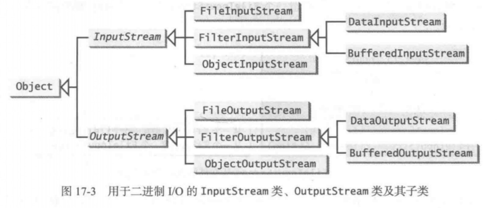
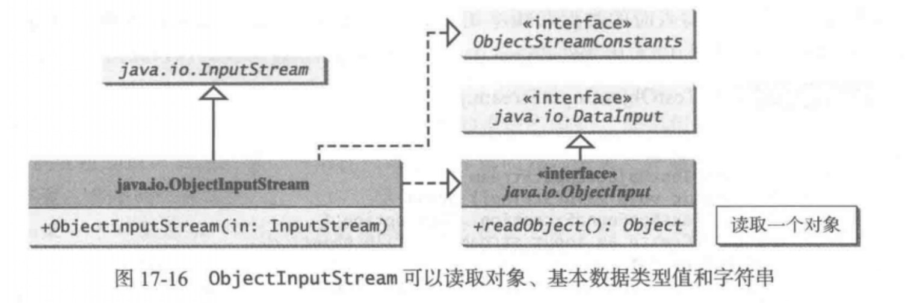
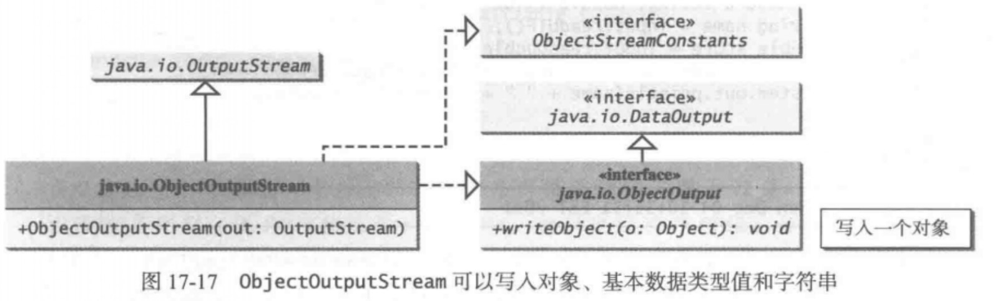
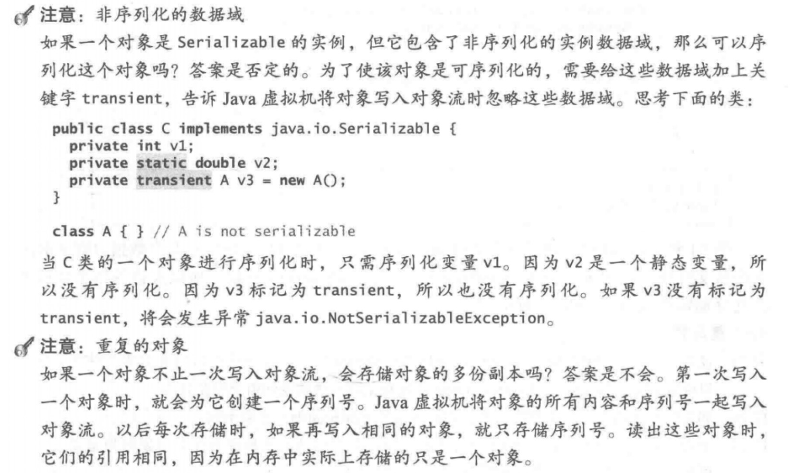

---

## File 类

File类包含了获得一个文件/目录的属性，以及对文件/目录进行改名和删除的方法。

File类意图提供了一种抽象，这种抽象是指以不依赖机器的方式来处理很多依赖于机器的文件和路径名的复杂性。File类包含许多获取文件属性的方法，以及重命名和删除文件和目录的方法。但是，**File类不包含读写文件内容的方法**。

所在包 java.io.File

1、`File(pathname: String)`

​		为一个指定的路径名创建一个File对象。路径名可能是一个目录或者一个文件

2、`File(parent: String, child: String)`

　　在目录parent下创建一个子路径的File对象，子路径可能是一个目录或者一个文件

3、`File(parent: File, child: String)`

　　在目录parent下创建一个子路径的File对象。parent是一个File对象。之前的构造方法中，parent是一个字符串

4、`exists(): boolean	`

​		File 对象代表的文件和目录存在，返回 true

5、 `canRead(): boolean`		

​		File 对象代表的文件存在且可读，返回true

6、`canWrite(): boolean` 		

​		File 对象代表的文件存在且可写，返回 true

7、`isDirectory(): boolean` 	

​		File 对象代表的是一个目录，返回 true

8、 `isFile(): boolean` 		 

​		File 对象代表的是一个文件，返回 true

9、`isAbsolute(): boolean`	

​		对象是采用绝对路径名创建，返回 true

10、 `isHidden(): boolean` 		

​		如果 File 对象代表的文件是隐藏的，返回 true。

11、 `getAbsolutePath(): String`	

​		返回 File 对象代表的文件和目录的完整绝对路径名

12、 `lastModified(): long`		

​		返回文件最后修改时间

13、`length(): long`			

​		返回文件的大小，如果不存在的或者是一个目录的话.返回 0

14、`delete(): boolean`			

​		删除 File 对象代表的文件或者目录。如果删除成功，方法返回 true

15、`mkdir(): boolean`			

​		创建该 File 对象代表的目录。如果目录成功创建. 则返回 true

16、`mkdirs(): boolean`

​		和`mkdir()`相同，除开在父目录不存在的情况下，将和父目录一起创建


**警告**：在Windows中目录的分隔符是反斜杠( \\ )。但是在Java中，反斜杠是一个特殊的字符，应该写成 \\\ 的形式。

**注意**：构建一个File实例并不会在机器上创建一个文件。不管文件是否存在，都可以创建任意文件名的File实例。可以调用File实例上的exists()方法来判断这个文件是否存在。

　　在程序中，不要直接使用绝对文件名，尽量使用相对文件名，这样便于程序在各个平台均能运行。

---

## 文件的输入输出

使用`Scanner`类从文件中读取文本数据，使用`Printwriter`类向文本文件写入数据。

`Scanner`和`PrintWriter`类主要从（向）文本文件读（写)字符串和数值信息。

---

### 使用 PrintWrite 写数据

java.io.Printwriter 类可用来创建一个文件并向文本文件写入数据。首先，必须为一个文本文件创建一个 Printwriter对象，如下所示:

```
Printwriter output = new Printwriter(filename);
```

然后，可以调用Printerwriter对象上的`print`、`println`和 `printf`方法向文件写入数据。

常用方法如下：

| java.io.Printwriter             | 作用                                        |
| ------------------------------- | ------------------------------------------- |
| `+PrintWriter(file: File)`      | 为指定的文件对象创建一个PrintWriter对象     |
| `+PrintWrite(filename: String)` | 为指定的文件名字符串创建一个PrintWriter对象 |
| `+print(数据): void`            | 将数据写入文件中                            |
| `+println(数据): void`          | 将数据写入文件中                            |
| `+printf(数据): void`           | 将数据写入文件中                            |

示例-1：

```Java
import java.io.File;
import java.io.IOException;
import java.io.PrintWriter;

public class Main{
	
	public static void main(String[] args) throws IOException {
		File file = new File("abc.txt");
		
		PrintWriter output = new PrintWriter(file);
		output.println("落花有意随流水，流水无情恋落花");
		
		output.close();
	}
}
```

如果文件不存在，调用Printwriter的构造方法会创建一个新文件。如果文件已经存在，那么文件的当前内容将在不和用户确认的情况下被**废弃**。

---

### 使用try-with-resources自动关闭资源

程序员经常会忘记关闭文件。JDK 7提供了下面的新的try-with-resources语法来自动关闭文件。

```
try( 声明和创建资源 ){
	使用资源来处理文件
}
```

用这种方法重写示例-1如下：

示例-2：

```Java
import java.io.File;
import java.io.IOException;
import java.io.PrintWriter;

public class Main{
	
	public static void main(String[] args) throws IOException {
		File file = new File("abc.txt");
		
		try(
            PrintWriter output = new PrintWriter(file);
        ){
			output.println("落花有意随流水，流水无情恋落花");
		}
		
	}
}
```

---

关键字try后声明和创建了一个资源。注意，资源放在括号中。资源必须是AutoCloseab1e的子类型，比如 Printerwriter，具有

有一个c1ose()方法。资源的声明和创建必须在同一行语句中，可以在括号中进行多个资源的声明和创建。紧接着资源声明的块中的语句使用资源。块结束后，资源的close()方法自动调用以关闭资源。使用try-with-resourse不仅可以避免错误，而且可以简化代码。

---

### 使用 Scanner 读数据

Scanner可以将输入分为由空白字符分隔的标记。为了能从键盘读取，需要为System.in创建一个Scanner，如下所示:

```
Scanner input = new Scanner(System.in);
```

为了从文件中读取，为文件创建一个Scanner，如下所示：

```
Scanner input = new Scanner(new File(filename)) ;
```

常用方法如下：

| java.util.Scanner                         | 作用                                                         |
| ----------------------------------------- | ------------------------------------------------------------ |
| `+Scanner(sourse: File)`                  | 创建一个Scanner,从指定的文件中扫描标记                       |
| `+Scanner(sourse: String)`                | 创建一个Scanner，从指定的字符串中扫描标记                    |
| `+next(): String`                         | 获取一个单词                                                 |
| `+nextInt() : int`                        | 获取一个int型的整数                                          |
| `+nextDouble() : double`                  | 获取一个double型的浮点数                                     |
| `+nextLine() : string`                    | 获取从当前文件指针的位置到这一行末的内容                     |
| `+hasNext(): boolean`                     | 如果 Scanner 还有更多数据读取，则返回true                    |
| `+close(): void`                          | 关闭该 Scanner                                               |
| `+useDelimiter(pattern: String): Scanner` | 设置改 Scanner 的分割符，并且返回该Scanner（默认空格为分界符） |

示例-3：

```Java
import java.io.File;
import java.io.IOException;
import java.util.Scanner;

public class Main{
	
	public static void main(String[] args) throws IOException {
		File file = new File("abc.txt");
		
		try(
				Scanner in = new Scanner(file);
			){
			String str;
			while( in.hasNextLine() ) {
				str = in.nextLine();
				System.out.println(str);
			}
		}
	}
}
```

Scanner 也可以从一个字符串扫描数据，如示例-4：

示例-4：

```Java
import java.util.Scanner;

public class Main{
	
	public static void main(String[] args){
		Scanner in = new Scanner("12 34");
		int h = in.nextInt() + in.nextInt();
		System.out.println(h);
		in.close();
	}
}

// 结果为46
```

**注意**：换行输入时存在的问题

示例-5：

```Java
import java.util.Scanner;

public class Main{
	
	public static void main(String[] args){
		Scanner in = new Scanner(System.in);
		int h = in.nextInt();
		String line = in.nextLine();
		System.out.println(h);
		System.out.println(line);
		System.out.println("...");
		in.close();
	}
}

// 输入
23<回车>
    
// 输出
23
    
...
```

line 接受的是 回车,也就是字符 '\n'

---

### 从 Web 上读取数据

如同从电脑中的文件中读取教据一样，也可以从Web上的文件中读取数据

为了读取一个文件，首先要使用java.net.URL类的这个构造方法，为该文件创建一个URL对象。

```
public URL(String spec) throws Ma1formedURLException
```

例如，下面给出的语句为https://www.baidu.com/index.html创建一个URL对象。

```Java
try {
	URL url = new URL("https://www.baidu.com/index.html");
} catch (MalformedURLException e) {
	e.printStackTrace();
}
```

如果URL字符串出现语法错误的话，将会有一个MalformedURLException被抛出。注意，要让URL类来识别一个有效的URL，前缀http://是必需的。

创建一个URL对象后，可以使用URL类中定义的openStream()方法来打开输人流和用输入流创建如下Scanner对象。

```
Scanner in = new Scanner(url.openStream());
```

现在可以从输人流中读取数据了，如同从本地文件中读取一样。

---

## 二进制 I/O 类

抽象类 InputStream 是读取二进制数据的根类，抽象类 OutputStream 是写入二进制数据的根类。



InputStream 类的UML图：

| java.io.InputStream                         | 作用                                                         |
| ------------------------------------------- | ------------------------------------------------------------ |
| `+read(): int`                              | 从输人流中读取下一个字节数据。宇节值以 0 到 2S5 取值范围的 int 值返回。如果因为已经达到流的最后而没有可读的字节，则返回值 -1 |
| `+read(b: byte[]): int`                     | 从输人流中读取 b.length 个字节到败组 b中，并且返回实际读取的宇节数。到流的最后时返回-1 |
| `+read(b: byte[], off: int, len: int): int` | 从输人流中读取字节并且将它们保存在 b[off], b[off + 1],… ，b[off + len-1] 中。返回实际读取的宇节数。到流的最后时返回 -1 |
| `+available(): int`                         | 返回可以从输入流中读取的宇节数的估计值                       |
| `+close()：void`                            | 关闭输入流，释放其占用的任何系统资源                         |
| `+skip(n: long): long`                      | 从输人流中跳过并且丢弃 n 字节的败据。返回实际跳过的宇节数    |
| `+markSupportedO: boolean`                  | 测试该输人流是否支持mark和reset方法                          |
| `+mark(readlimit:int): void`                | 在该输人流中标记当前位置                                     |
| `+reset(): void`                            | 将该流重新定位到最后一次调用mark方法时的位置                 |

**注意**：二进制I/O类中的所有方法都声明为抛出 java.io.IOExecption 或 java.io.IOException 的子类

OutputSttream 类的UML图：

| java.io.OutputStream                          | 作用                                                         |
| --------------------------------------------- | ------------------------------------------------------------ |
| `+write(int b): void`                         | 将指定的字节写入到该输出流中。参数 b 是一个 int 值。（byte)b 写入到输出流中 |
| `+write(b: byte[]): void`                     | 将数组 b 中的所有字节写出到输出流中                          |
| `+write(b: byte[], off: int, len: int): void` | 将 b[off],  b[off+l],…，b[off+len-l]到输出流中               |
| `+close(): void`                              | 关闭该输出流，并且释放其占用的任何系统资源                   |
| `+flush(): void`                              | 清掉输出流，强制写出任何缓冲的输出字节                       |

---

### FileInputStream 和 FileOutputStream

FilelnputStream 类和 FileOutputStream 类用于从/向文件读取/写人字节。它们的所有方法都是从 InputStream 类和 OutputStream 类继承的。FilelnputStream 类和 FileOutputStream 类没有引入新的方法。为了构造一个 FilelnputStream 对象，使用下面的构造方法

| java.io.FileInputStream              | 作用                                  |
| ------------------------------------ | ------------------------------------- |
| `+FileInputStream(file: File)`       | 从一个File对象创建一个FilelnputStream |
| `+FileInputStream(filename: String)` | 从一个文件名创建一个FilelnputStream   |

如果试图为一个不存在的文件创建FilelnputStream对象，将会发生java.io.FileNotFoundException异常


要构造一个FileOutputStream对象，使用如下图所示的构造方法

| java.io.FileOutputStream                               | 作用                                          |
| ------------------------------------------------------ | --------------------------------------------- |
| `+FileOutputStream(file: File)`                        | 从一个File对象构建一个FileOutputStream        |
| `+FileOutputStream(filename: String)`                  | 从一个文件名创建一个FileOutputStream          |
| `+FileOutputStream(file: File, append: boolean)`       | 如果append为true,数据将追加到已经存在的文件中 |
| `+FileOutputStream(filename: String, append: boolean)` | 如果append为true,数据将追加到已经存在的文件中 |

如果这个文件不存在，就会创建一个新文件。如果这个文件已经存在，前两个构造方法将会删除文件的当前内容。为了既保留文件现有的内容又可以给文件追加新数据，将最后两个构造方法中的参数append设置为true。

**注意**：几乎所有的 I/O 类中的方法都会抛出异常;java.io.IOException。

示例-6：

下面程序作用为向文件 "123.dat" 写入10个数字并再把他们从文件中读取出来

```Java
import java.io.File;
import java.io.FileInputStream;
import java.io.FileOutputStream;
import java.io.IOException;

public class Main{
	
	public static void main(String[] args){
		try {
			File file = new File("123.dat");
			// 向文件写入数据
			FileOutputStream out = new FileOutputStream(file);
			for(int i=0; i<10; i++) {
				out.write(i);
			}
			System.out.println("写入完成！");
			out.close();
			
			// 从文件中读取数据
			FileInputStream in = new FileInputStream(file);
			int b;
			while( (b = in.read()) != -1 ) {
				System.out.print(b+" ");
			}
			in.close();
		} catch (IOException e) {
			e.printStackTrace();
		}
	}
}
```

结果：

```
写入完成！
0 1 2 3 4 5 6 7 8 9 
```

**注意**：若将读取文件部分的输出语句改为 `System.out.print(b+' ');`其结果为：

```
写入完成！
32333435363738394041
```

可见，在原程序中该语句暗含类型转换。

**注意**：当流不再需要使用时，记得将其关闭。

FilelnputStream 类的实例可以作为参数去构造一个 Scanner 对象，而 FileOutputStream 类的实例可以作为参数构造一个PrinterWriter 对象。可以创建一个 PrinterWriter 对象来向文件中追加文本。如果temp.txt不存在，就会创建这个文件。如果temp.txt文件已经存在，就将新数据追加到该文件中。

示例-7：

向文件 "abc.txt" 中追加数据

```Java
import java.io.File;
import java.io.FileInputStream;
import java.io.FileOutputStream;
import java.io.IOException;
import java.io.PrintWriter;
import java.util.Scanner;

public class Main{
	
	public static void main(String[] args){
		try {
			File file = new File("abc.txt");
			// 向文件中写入数据
			PrintWriter out = new PrintWriter(new FileOutputStream(file, true));
			out.write("未能常见，心中挂念");
			System.out.println("写入完成!");
			out.close();
			// 从文件中读取数据
			Scanner in = new Scanner(new FileInputStream(file));
			while( in.hasNextLine() ) {
				System.out.println(in.nextLine());
			}
			in.close();
		} catch (IOException e) {
			e.printStackTrace();
		}
	}
}
```

结果：

```
写入完成!
落花有意随流水，流水无情恋落花
我本将心向明月，奈何明月照沟渠
未能常见，心中挂念
```

---

### FilterInputStream 和 FilterOutputStream

过滤器数据流（ filter stream )是为某种目的过滤字节的数据流。基本字节输入流提供的读取方法read只能用来读取字节。如果要读取整数值、双精度值或字符串，那就需要一个过滤器类来包装字节输入流。使用过滤器类就可以读取整数值、双精度值和字符串，而不是字节或字符。FilterInputStream类和Fi1terOutputStream类是过滤数据的基类。需要处理基本数值类型时，就使用DataInputStream类和DataOutputStream类来过滤字节。

---

### DataInputStream 和 DataOutputStream 

DataInputStream 从数据流读取字节，并且将它们转换为合适的基本类型值或字符串。DataOutputStream 将基本类型的值或字符串转换为字节，并且将字节输出到数据流。

DataInputStream 类扩展 FilterInputStream 类，并实现 DataInput 接口。DataOutputStream 类扩展 FilterOutputStream 类，并实现DataOutput接口。

接口 DataInput 的UML图：

| 《interface》java.io.DataInput | 作用                          |
| ------------------------------ | ----------------------------- |
| `+readBoolean(): boolean`      | 从输入流中读取一个 boolean 值 |
| `+readByte(): byte`            | 从输入流中读取一个 byte 值    |
| `+readChar(): char`            | 从输入流中读取一个字符        |
| `+readFloat(): float`          | 从输入流中读取一个 float 值   |
| `+readDouble() : double`       | 从输入流中读取一个 double 值  |
| `+readint(): int`              | 从输入流中读取一个int 值      |
| `+readLong(): long`            | 从输入流中读取一个 long 值    |
| `+readShort(): short`          | 从输入流中读取一个 short值    |
| `+readLine()：String`          | 从输人流中读取一行字符        |
| `+readUTF(): String`           | 以 UTF 格式读取一个宇符串     |

接口 DataOutput 中的方法大致如下：

```Java
writeBoolean(b : boolean) : void
writeByte(v: int) : void			// 向输出流中写参数 V 的 8 位低位比特
writeBytes(s: String) : void		// 向输出流中写一个宇符串中字符的低位宇节
writeChar(c : char) : void			// 向输出流中写一个字符（由两个字节组成)
writeChars(s: String): void			// 向输出流中依次写一个宇符串 S 中的每个	字符，每个字符 2 个宇节
writeF1oat(v: float): void
writeDouble(v: double): void
writelnt(v: int): void
writeLong(v: long): void
writeShort(v: short): void
writeUTF(s: String): void
```

DataInputStream 实现了定义在 DataInput 接口中的方法来读取基本数据类型值和字符串。DataOutputStream 实现了定义在DataOutput 接口中的方法来写入基本数据类型值和字符串。基本类型的值不需要做任何转化就可以从内存复制到输出数据流。

可以将 DataInputStream/FileInputStream 和 DataOutputStream/FileOuputStream 看作工作在一个管道线中，如下图所示。


**警告**：应该按存储的顺序和格式读取文件中的数据。

**检测文件的末尾**：如果到达InputStream的末尾之后还继续从中读取数据，就会发生EOFException异常。这个异常可以用来检査是否已经到达文件末尾，如示例-8所示：

示例-8：

```Java
import java.io.DataInputStream;
import java.io.DataOutputStream;
import java.io.EOFException;
import java.io.File;
import java.io.FileInputStream;
import java.io.FileOutputStream;
import java.io.IOException;

public class Main{
	
	public static void main(String[] args){
		File file = new File("123.dat");
		try {
			// 向文件中写数据
			try( DataOutputStream out = new DataOutputStream(new FileOutputStream(file)); ){
				out.writeUTF("烽烟起，寻爱似浪淘沙");
				out.writeUTF("不要返航，这里不是家");
			}
			
			// 从文件中读数据
			try( DataInputStream in = new DataInputStream(new FileInputStream(file)) ){
				while( true ) {
					System.out.println(in.readUTF());
				}
			}
			
		} catch( EOFException ex ) {
			System.out.println("输出完毕！");
		} catch (IOException e) {
			e.printStackTrace();
		}
		
	}
}
```

结果：

```
烽烟起，寻爱似浪淘沙
不要返航，这里不是家
输出完毕！
```

---

### BufferedlnputStream 和 BufferedOutputStream 

BufferedInputStream 类和 BufferedOutputStream 类可以通过减少磁盘读写次数来提高输人和输出的速度。使用BufferdInputStream 时，磁盘上的整块数据一次性地读入到内存中的缓冲区中。然后从缓冲区中将个别的数据传递到程序中，如下图a所示。使用 BufferedOutputStream，个别的数据首先写入到内存中的缓冲区中。当缓冲区已满时，缓冲区中的所有数据一次性写入到磁盘中，如下图b所示。


BufferedInputStream 类和 BufferedOutputStream 类没有包含新的方法。BufferedInput-Stream 类和 BufferedOutputStream 中的所有方法都是从 InputStream 类和 OutputStream 类继承而来的。BufferedInputStream 类和 BufferedOutputStream 类在后台管理了一个缓冲区，根据要求自动从磁盘中读取数据和写入数据。

BufferedInputStream 类的构造方法如下：

```Java
1、从一个InputStream对象创建-个BufferedInputStream
BufferedInputStream(in: InpuStream)

2、从一个InputStream对象创建-个BufferedInputStream，并指定缓冲区大小
BufferedInputStream(in: InputStream, bufferedSize:int)

如：
DataInputStream in = new DataInputStream(
									new BufferedInputStream(
											new FileInputStream("123.dat")));
```

如果没有指定缓冲区大小，默认的大小是512个字节

BufferedOutputStream 类的构造方法如下：

```Java
1、从一个OutputStream对象创建-个BufferedInputStream
BufferedOutputStream(out: OutpuStream)

2、从一个OutputStream对象创建-个BufferedOutputStream，并指定缓冲区大小
BufferedOutputStream(out: OutputStream, bufferedSize: int)

如：
DataOutputStream out = new DataOutputStream(
									new BufferedOutputStream(
											new FileOutputStream("123.dat")));
```

**注意**：应该总是使用缓冲区 I/O 来加速输入和输出。对于小文件，我们可能注意不到性能的提升。但是，对于超过10MB的大文件，我们将会看到使用缓冲的 I/O 带来的实质性的性能提升。

---

## 对象 I/O

DataInputStream 类和 DataOutputStream 类可以实现基本数据类型与字符串的输入和输出。而 ObjectInputStream 类和 ObjectOutputStream 类除了可以实现基本数据类型与字符串的输入和输出之外，还可以实现对象的输入和输出。由于 ObjectInputStream 类和 ObjectOutputStream 类包含 DataInputStream 类和 DataOutputStream 类的所有功能，所以，完全可以用ObjectInputStream 类和 ObjectoutputStream 类代替 DataInputStream 类和 Data0utputStream 类。

ObjectInputStream 扩展 InputStream 类，并实现接口 ObjectInput 和 ObjectStreamConstants，如图17-16所示。ObjectInput 是 DataInput 的子接口。ObjectStreamConstants 包含支持 ObjectInputStream 类和 ObjectOutputStream 类所用的常量。

ObjectOutputStream 扩展 OutputStream 类，并实现接口 ObjectOutput 与 ObjectStreamConstants。ObjectOutput 是DataOutput 的子接口。

可以使用下面的构造方法包装任何一个InputStream和OutputStream，构建 ObjectInputStream和 ObjectOutputStream:






可以向数据流中写人多个对象或基本类型数据。从对应的ObjectInputStream中读回这些对象时，必须与其写人时的类型和顺序相同。为了得到所需的类型，必须使用Java安全的类型转换。

---

### Serializable 接口

并不是每一个对象都可以写到输出流。可以写入输出流中的对象称为可序列化的( serializable)。因为可序列化的对象是java.io.Serializable 接口的实例，所以，可序列化对象的类必须实现 Serializable 接口。

Serializable接口是一种标记接口。因为它没有方法，所以，不需要在类中为实现Serializable接口增加额外的代码。实现这个接口可以启动Java的序列化机制，自动完成存储对象和数组的过程。

Java提供一个内在机制自动完成写对象的过程。这个过程称为对象序列化( object serialization)，它是在 ObjectOutputStream 中实现的。与此相反，读取对象的过程称作对象反序列化 ObjectInputStream 类中实现的。

试图存储一个不支持 Serializable 接口的对象会引起一个 NotSerializableException 异常。

**注意**：



---

### 序列化数组

如果数组中的所有元素都是可序列化的，这个数组就是可序列化的。一个完整的数组可以用`write0bject`方法存人文件，随后用`read0bject`方法恢复。

示例-9存储由五个int元素构成的数组和由三个字符串构成的数组，然后将它们从文件中读取出来显示在控制台上。

```Java
import java.io.File;
import java.io.FileInputStream;
import java.io.FileOutputStream;
import java.io.IOException;
import java.io.ObjectInputStream;
import java.io.ObjectOutputStream;

public class Main{
	
	public static void main(String[] args){
		File file = new File("123.dat");
		int[] nums = {1,2,3,4,5};
		String[] strs = {"int", "double", "String"};
		
		try {
			// 向文件中写入数据
			try( ObjectOutputStream out = new ObjectOutputStream(
					new FileOutputStream(file)) ){
				out.writeObject(nums);
				out.writeObject(strs);
			}
			// 从文件中读取数据
			try( ObjectInputStream in = new ObjectInputStream(
					new FileInputStream(file)) ){
				int[] fileNums =  (int[])in.readObject();			// 强制类型转换
				String[] fileStrs = (String[])in.readObject();		// 强制类型转换
				for(int i: fileNums)
					System.out.print(i+" ");
				System.out.println();
				for(String s: fileStrs)
					System.out.print(s+' ');
			} 
		} catch (ClassNotFoundException e) {
			e.printStackTrace();
		} catch( IOException e ) {
			e.printStackTrace();
		}
	}
}
```

结果：

```
1 2 3 4 5 
int double String 
```

---

## 随机访问文件

Java提供了`RandomAccessFile`类，允许从文件的任何位置进行数据的读写。

到现在为止，所使用的所有流都是只读的(read.only)或只写的(write.only)。这些流称为顺序( sequential)流。使用顺序流打开的文件称为顺序访问文件。顺序访问文件的内容不能更新。然而，经常需要修改文件。Java提供了RandomAccessFile类，允许在文件的任意位置上进行读写。使用RandomAccessFile类打开的文件称为随机访问文件。

`RandomAccessFile` 类实现了 DataInput 和 DataOutput 接口。DataInput 接口定义了读取基本数据类型和字符串的方法（例如，readInt、readDouble、readChar、readBoolean和 readUTF)。DataOutput 接口定义了输出基本数据类型和字符串的方法(例如，writeInt、writeDouble、writeChar、writeBoolean和 writeUTF)。

RandomAccessFile 类的UML图：

| java.io.RandomAccessFile                        | 作用                                                         |
| ----------------------------------------------- | ------------------------------------------------------------ |
| `+RandomAccessFile(file: File, mode: String)`   | 使用指定的File对象和模式创建RandomAccessFile流（"r"或"rw"模式） |
| `+RandomAccessFile(name: String, mode: String)` | 使用指定的文件名字符串和模式创建RandomAccessFile流           |
| `+close(): void`                                | 关闭淹并且释放相关资源                                       |
| `+getFilePointer(): long`                       | 返回以字节计算的从文件开始的偏移量.下一个read或者write将从该位置进行 |
| `+length(): long`                               | 返回该文件中的字节数                                         |
| `+read(): int`                                  | 从该文件中读取一个字节数据，在流的末尾返回-1                 |
| `+read(b: byte[]): int`                         | 从该文件中读取b.length个字节数据到一个字节数组中             |
| `+read(b: byte[], off: int, len: int): int`     | 从该文件中读取len个字节数据到一个字节数组中                  |
| `+seek(pos: long): void`                        | 设置从流开始位置计算的偏移量（在pos值中设置的以字节为单位的)，下一个read或者write将从该位置进行 |
| `+setLength(newLength: long): void`             | 为该文件设置一个新的长度                                     |
| `+skipBytes(int n): int`                        | 跳过n个字节的输入                                            |
| `+write(b: byte[]): void`                       | 从指定的字节数组中写b.length个字节到该文件中。从当前的文件指针开始写入 |
| `+write(b: byte[], off: int, len: int): void`   | 从偏移量off开始,从指定的字节数组中写len个字节到该文件中      |

当创建一个RandomAccessFile时，可以指定两种模式("r"或"rw")之一。模式 "r" 表明这个数据流是只读的，模式 "rw" 表明这个数据流既允许读也允许写。

随机访问文件是由字节序列组成的。一个称为文件指针( file pointer)的特殊标记定位这些字节中的某个字节的位置。文件的读写操作就是在文件指针所指的位置上进行的。打开文件时，文件指针置于文件的起始位置。在文件中进行读写数据后，文件指针就会向前移到下一个数据项。例如，如果使用readInt()方法读取一个int数据，Java 虚拟机就会从文件指针处读取4个字节，现在，文件指针就会从它之前的位置向前移动4个字节，如下图所示：


　　设raf是RandomAccessFile的一个对象，`raf.seek(0)`方法将文件指针移到文件的起始位置，而`raf.seek(raf.length())`方法则将文件指针移到文件的末尾。

`raf.setLength(0)`语句将文件长度设置为0。这样做的效果是将文件的原有内容删除。