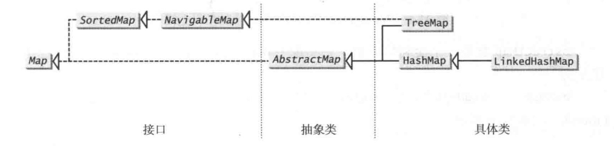
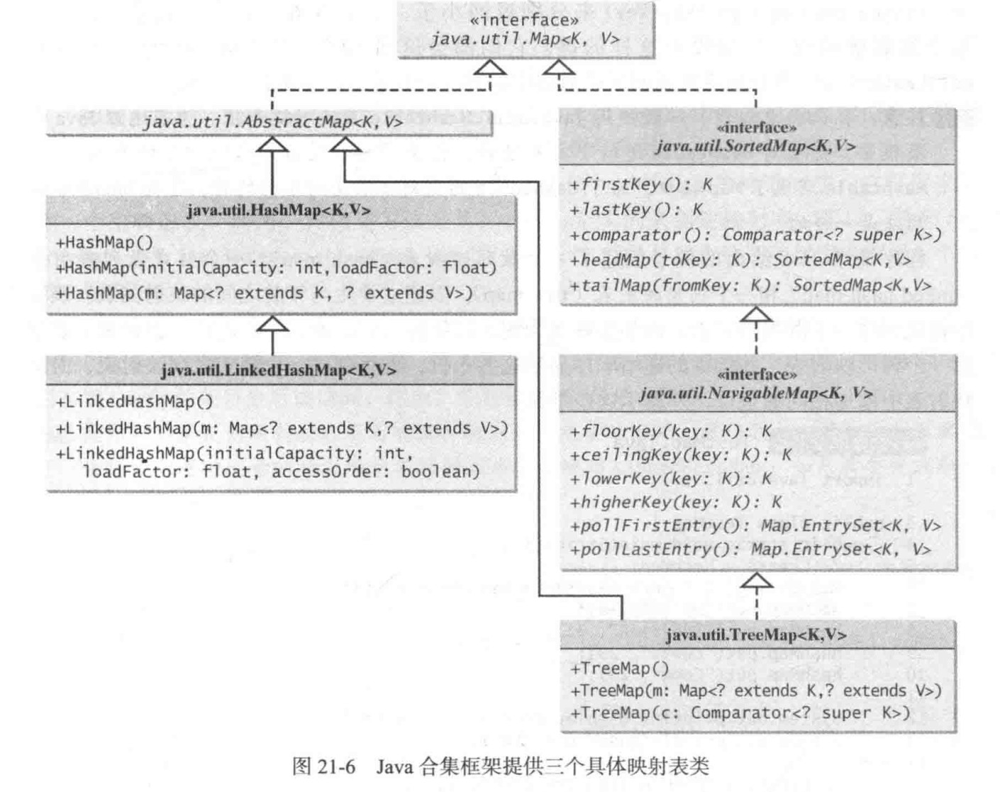

## 泛型

### ArrayList 类

| java.util.ArrayList                                          | 作用                                          |
| ------------------------------------------------------------ | --------------------------------------------- |
| `ArrayList()`                                                | 构造方法                                      |
| [add()]()                                                    | 将元素插入到指定位置的 arraylist 中           |
| [addAll()](https://www.runoob.com/java/java-arraylist-addall.html) | 添加集合中的所有元素到 arraylist 中           |
| [clear()](https://www.runoob.com/java/java-arraylist-clear.html) | 删除 arraylist 中的所有元素                   |
| [clone()](https://www.runoob.com/java/java-arraylist-clone.html) | 复制一份 arraylist                            |
| [contains()](https://www.runoob.com/java/java-arraylist-contains.html) | 判断元素是否在 arraylist                      |
| [get()]()                                                    | 通过索引值获取 arraylist 中的元素             |
| [indexOf()]()                                                | 返回 arraylist 中元素的索引值                 |
| [removeAll()]()                                              | 删除存在于指定集合中的 arraylist 里的所有元素 |
| [remove()]()                                                 | 删除 arraylist 里的单个元素                   |
| [size()]()                                                   | 返回 arraylist 里元素数量                     |
| [isEmpty()](https://www.runoob.com/java/java-arraylist-isempty.html) | 判断 arraylist 是否为空                       |
| [subList()](https://www.runoob.com/java/java-arraylist-sublist.html) | 截取部分 arraylist 的元素                     |
| `set(indes, s)`                                              | 替换 arraylist 中指定索引的元素               |
| [sort()]()                                                   | 对 arraylist 元素进行排序                     |
| [toArray()](https://www.runoob.com/java/java-arraylist-toarray.html) | 将 arraylist 转换为数组                       |
| [toString()](https://www.runoob.com/java/java-arraylist-tostring.html) | 将 arraylist 转换为字符串                     |
| [ensureCapacity()](l)                                        | 设置指定容量大小的 arraylist                  |
| [lastIndexOf()]()                                            | 返回指定元素在 arraylist 中最后一次出现的位置 |
| [retainAll()]()                                              | 保留 arraylist 中在指定集合中也存在的那些元素 |
| [containsAll()](https://www.runoob.com/java/java-arraylist-containsall.html) | 查看 arraylist 是否包含指定集合中的所有元素   |
| [trimToSize()](https://www.runoob.com/java/java-arraylist-trimtosize.html) | 将 arraylist 中的容量调整为数组中的元素个数   |
| [removeRange()](https://www.runoob.com/java/java-arraylist-removerange.html) | 删除 arraylist 中指定索引之间存在的元素       |
| [replaceAll()](https://www.runoob.com/java/java-arraylist-replaceall.html) | 将给定的操作内容替换掉数组中每一个元素        |
| [removeIf()](https://www.runoob.com/java/java-arraylist-removeif.html) | 删除所有满足特定条件的 arraylist 元素         |
| [forEach()](https://www.runoob.com/java/java-arraylist-foreach.html) | 遍历 arraylist 中每一个元素并执行特定操作     |

- 排序

```java
* ArrayList<String> list = new ArrayList<String>(Arrays.asList(strs))// 可以用这个方法将对象数组strs中的内容复制到列表 list 中

\* java.util.Collections.sort( ArrayList list )		// 若 list中的数据是可排序的，则可用此方法对其进行排序

\* java.util.Collections.max( ArrayList list )		// 返回列表中数值的最大值

\* java.util.Collections.min( ArrayList list )		// 返回列表中数值的最小值
```

- 定义数组

```
ArrayList<String>[] list = (ArrayList<String>[])(new ArrayList[10]);

// 该方法会受到一个安全警告，编译时无法确定类型转换能否成功
```

---

### LinkedList

链表（Linked list）是一种常见的基础数据结构，是一种线性表，但是并不会按线性的顺序存储数据，而是在每一个节点里存到下一个节点的地址。

链表可分为单向链表和双向链表。

**以下情况使用 ArrayList :**

- 频繁访问列表中的某一个元素。
- 只需要在列表末尾进行添加和删除元素操作。

**以下情况使用 LinkedList :**

- 你需要通过循环迭代来访问列表中的某些元素。
- 需要频繁的在列表开头、中间、末尾等位置进行添加和删除元素操作。

LinkedList 继承了 AbstractSequentialList 类。

LinkedList 实现了 Queue 接口，可作为队列使用。

LinkedList 实现了 List 接口，可进行列表的相关操作。

LinkedList 实现了 Deque 接口，可作为队列使用。

LinkedList 实现了 Cloneable 接口，可实现克隆。

LinkedList 实现了 java.io.Serializable 接口，即可支持序列化，能通过序列化去传输。

| 方法                                           | 描述                                                         |
| :--------------------------------------------- | :----------------------------------------------------------- |
| public boolean add(E e)                        | 链表末尾添加元素，返回是否成功，成功为 true，失败为 false。  |
| public void add(int index, E element)          | 向指定位置插入元素。                                         |
| public boolean addAll(Collection c)            | 将一个集合的所有元素添加到链表后面，返回是否成功，成功为 true，失败为 false。 |
| public boolean addAll(int index, Collection c) | 将一个集合的所有元素添加到链表的指定位置后面，返回是否成功，成功为 true，失败为 false。 |
| public void addFirst(E e)                      | 元素添加到头部。                                             |
| public void addLast(E e)                       | 元素添加到尾部。                                             |
| public boolean offer(E e)                      | 向链表末尾添加元素，返回是否成功，成功为 true，失败为 false。 |
| public boolean offerFirst(E e)                 | 头部插入元素，返回是否成功，成功为 true，失败为 false。      |
| public boolean offerLast(E e)                  | 尾部插入元素，返回是否成功，成功为 true，失败为 false。      |
| public void clear()                            | 清空链表。                                                   |
| public E removeFirst()                         | 删除并返回第一个元素。                                       |
| public E removeLast()                          | 删除并返回最后一个元素。                                     |
| public boolean remove(Object o)                | 删除某一元素，返回是否成功，成功为 true，失败为 false。      |
| public E remove(int index)                     | 删除指定位置的元素。                                         |
| public E poll()                                | 删除并返回第一个元素。                                       |
| public E remove()                              | 删除并返回第一个元素。                                       |
| public boolean contains(Object o)              | 判断是否含有某一元素。                                       |
| public E get(int index)                        | 返回指定位置的元素。                                         |
| public E getFirst()                            | 返回第一个元素。                                             |
| public E getLast()                             | 返回最后一个元素。                                           |
| public int indexOf(Object o)                   | 查找指定元素从前往后第一次出现的索引。                       |
| public int lastIndexOf(Object o)               | 查找指定元素最后一次出现的索引。                             |
| public E peek()                                | 返回第一个元素。                                             |
| public E element()                             | 返回第一个元素。                                             |
| public E peekFirst()                           | 返回头部元素。                                               |
| public E peekLast()                            | 返回尾部元素。                                               |
| public E set(int index, E element)             | 设置指定位置的元素。                                         |
| public Object clone()                          | 克隆该列表。                                                 |
| public Iterator descendingIterator()           | 返回倒序迭代器。                                             |
| public int size()                              | 返回链表元素个数。                                           |
| public ListIterator listIterator(int index)    | 返回从指定位置开始到末尾的迭代器。                           |
| public Object[] toArray()                      | 返回一个由链表元素组成的数组。                               |
| public T[] toArray(T[] a)                      | 返回一个由链表元素转换类型而成的数组。                       |

---

### 通配泛型

```
ArrayList<Number> father = new ArrayList<Integer>();	
```

上面的语句会报错，尽管 `Integer` 是 `Number` 的子类型，但是 `ArrayList<Integer>` 不是 `ArrayList<Number>` 的子类型。

通配泛型类型有三种形式：`?`、`? extends T` 或者 `? super T`。其中 T 是泛型。

- 第一种形式 ? 称为非受限通配（unbounded wildcard)，它和`? extends Object`是一样的。
- 第二种形式` ? extends T `称为受限通配（bounded wildcard)，表示T或T的一个子类型。
- 第三种形式 `? super T` 称为下限通配(lower-bound wildcard)，表示T或T的一个父类型。

上面报错语句可改成如下形式：

```
ArrayList<? extends Number> father = new ArrayList<Integer>();
```

---

## 集合

可以使用集合的三个具体类HashSet、LinkedHashSet 、TreeSet来创建集合。

- HashSet

元素按添加的时间顺序排列

- LinkedHashSet 

LinkedHashSet用一个链表实现来扩展HashSet类，它支持对集合内的元素排序。HashSet中的元素是没有被排序的，而LinkedHashSet中的元素可以按照它们插入集合的顺序提取。

- TreeSet

SortedSet是set的一个子接口，它可以确保集合中的元素是有序的。另外，它还提供方法first()和1ast()以返回集合中的第一个元素和最后一个元素，以及方法headSet(toElement)和tailSet(fromElement)以分别返回集合中元素小于toElement和大于或等于fromElement的那一部分。

TreeSet 实现了SortedSet接口。只要对象是可以互相比较的，就可以将它们添加到一个树形集（tree set)中。

### HashSet

在增加集合的容量之前，负载系数( load factor)测量该集合允许多满。当元素个数超过了容量与负载系数的乘积，容量就会自动翻倍。例如，如果容量是16而负载系数是0.75,那么当尺寸达到12(16×0.75=12)时，容量将会翻倍到32。比较高的负载系数会降低空间开销，但是会增加查找时间。通常情况下，默认的负载系数是0.75，它是在时间开销和空间开销上一个很好的权衡。

| 构造器                                           | 描述                                                         |
| :----------------------------------------------- | :----------------------------------------------------------- |
| `HashSet()`                                      | 构造一个新的空集; 支持`HashMap`实例具有默认初始容量（16）和加载因子（0.75）。 |
| `HashSet(int initialCapacity)`                   | 构造一个新的空集; 支持`HashMap`实例具有指定的初始容量和默认加载因子（0.75）。 |
| `HashSet(int initialCapacity, float loadFactor)` | 构造一个新的空集; 支持`HashMap`实例具有指定的初始容量和指定的加载因子。 |
| `HashSet(Collection<? extends E> c)`             | 构造一个包含指定集合中元素的新集合。                         |

| 变量和类型       | 方法                 | 描述                                                         |
| :--------------- | :------------------- | :----------------------------------------------------------- |
| `boolean`        | `add(E e)`           | 如果指定的元素尚不存在，则将其添加到此集合中。               |
| `void`           | `clear()`            | 从该集中删除所有元素。                                       |
| `Object`         | `clone()`            | 返回此 `HashSet`实例的浅表副本：未克隆元素本身。             |
| `boolean`        | `contains(Object o)` | 如果此set包含指定的元素，则返回 `true` 。                    |
| `boolean`        | `isEmpty()`          | 如果此集合不包含任何元素，则返回 `true` 。                   |
| `Iterator<E>`    | `iterator()`         | 返回此set中元素的迭代器。                                    |
| `boolean`        | `remove(Object o)`   | 如果存在，则从该集合中移除指定的元素。                       |
| `int`            | `size()`             | 返回此集合中的元素数（基数）。                               |
| `Spliterator<E>` | `spliterator()`      | 在此集合中的元素上创建*[late-binding](https://www.runoob.com/manual/jdk11api/java.base/java/util/Spliterator.html#binding)*和*失败快速* [`Spliterator`](https://www.runoob.com/manual/jdk11api/java.base/java/util/Spliterator.html) 。 |

---

## 映射表

相当于python中的字典。

可以使用三个具体的类来创建一个映射表:HashMap 、LinkedHashMap、 TreeMap。

图的类型有三种:散列映射表HashMap、链式散列映射表LinkedHashMap和树形映射表TreeMap。这些映射表的通用特性都定义在Map接口中，它们的关系如图21-3所示。



| 《interface》 java.util.Map<K,V>               | 作用                                                |
| ---------------------------------------------- | --------------------------------------------------- |
| `+clear():void`                                | 从该映射表中删除所有条目                            |
| `+containsKey(key:Object):boolean`             | 如果该映射表包含了指定键的条目，则返回true          |
| `+containsValue(value:Object):boolean`         | 如果该映射表将一个或者多个键映射到指定值,则返回true |
| `+entrySet():Set<Map.Entry<K,V>>`              | 返回一个包含了该映射表中条目的集合                  |
| `+get(key:Object):V`                           | 返回该映射表中指定键对应的值                        |
| `+isEmpty():boolean`                           | 如果该映射表中没有包含任何条目，则返回true          |
| `+keySet():Set<K>`                             | 返回一个包含该映射表中所有键的集合                  |
| `+put(key: K, value: V): V`                    | 将一个条目放入该映射表中                            |
| `+putAll(m:Map<? extends k,? extends V>):void` | 将m中的所有条目添加到该映射表中                     |
| `+remove(key: Object):V`                       | 删除指定键对应的条目                                |
| `+size():int`                                  | 返回该映射表中的条目数                              |
| `+values(): Collection<V>`                     | 返回该映射表中所有值组成的合集                      |

方法 `entrySet()` 返回一个所有条目的集合。这些条目是`Map.Entry<K,V>`接口的实例，这里Entry是Map接口的一个内部接口，该集合中的每个条目都是所在映射表中一个特定的键/值对。

| 《interface》java.util.Map.Entry<K,V> | 作用                     |
| ------------------------------------- | ------------------------ |
| `+getKey():K`                         | 返回该条目的键           |
| `+getValue():V`                       | 返回该条目的值           |
| `+setValue():void`                    | 将该条目中的值赋以新的值 |

AbstractMap类是一个便利抽象类，它实现了Map接口中除了entrySet()方法之外的所有方法。

HashMap、LinkedHashMap和TreeMap类是Map接口的三个具体实现。



对于定位一个值、插人一个条目以及删除一个条目而言，HashMap类是高效的。

LinkedHashMap类用链表实现来扩展HashMap类，它支持映射表中条目的排序。HashMap类中的条目是没有顺序的，但是在LinkedHashMap中，元素既可以按照它们插入映射表的顺序排序(称为插入顺序( insertion order))，也可以按它们被最后一次访问时的顺序，从最早到最晚(称为访问顺序( access order))排序。无参构造方法是以插入顺序来创建LinkedHashMap对象的。要按访问顺序创建LinkedHashMap对象。应该使用构造方法

```
LinkedHashMap (initia1Capacity, loadFactor,true)
```

TreeMap类在遍历排好顺序的键时是很高效的。键可以使用Comparable接口或Comparator接口来排序。如果使用它的无参构造方法创建一个TreeMap对象，假定键的类实现了Comparable接口，则可以使用Comparable接口中的compareTo方法来对映射表内的键进行比较。要使用比较器，必须使用构造方法TreeMap(Comparator comparator)来创建一个有序映射表，这样，该映射表中的条目就能使用比较器中的compare方法按键进行排序。

SortedMap是Map的一个子接口，使用它可确保映射表中的条目是排好序的。除此之外，它还提供方法`firstKey()`和`lastKey()`来返回映射表中的第一个和最后一个键，而方法`headMap(toKey)`和 `tailMap(fromKey)`分别返回键小于toKey的那部分映射表和键大于或等于fromKey的那部分映射表。

NavigableMap继承了SortedMap，以提供导航方法`lowerKey(key)`、`floorKey (key)` 、`ceilingKey(key`)和 `higherKey(key)`来分别返回小于、小于或等于、大于或等于、大于某个给定键的键，如果没有这样的键，它们都会返回null。方法 `pollFirstEntry()`和`pollLastEntry()`分别删除并返回树映射表中的第一个和最后一个条目。