## PyQt6 模块

PyQt6 类是由一系列模块组成的，包括如下的模块：

- QtCore

- QtGui

- QtWidgets

- QtDBus

- QtNetwork

- QtHelp

- QtXml

- QtSvg

- QtSql

- QtTest

  QtDBus 是使用 D-Bus 处理 IPC 通讯的类。QtNetwork 是网络变成类，这些类使网络编程变得更容易，可移植性也更好，方便了 TCP/IP 和 UDP 服务端和客户端编程。 QtHelp 包含了创建、查看和搜索文档的类。

  QtXml 包含了处理 XML 文件的类，实现了 SAX 和 DOM API。QtSvg 提供了显示 SVG 的类，可缩放矢量图形(SVG)是一种描述二维图像和图像应用的 XML 语言。QtSql 模块提供了数据库的类，QtTest 提供了可以对 PyQt6 应用进行单元测试的工具。

## PyQt6 日期和时间

PyQt6 有 QDate, QDateTime, QTime 类处理日期和时间。QDate 是用于处理公历中的日期的类。它有获取、比较或操作日期的方法。QTime 类用于处理时间。它提供了比较时间、确定时间和其他各种时间操作方法。QDateTime 是 QDate 和 QTime 的组合。

```python
from PyQt6.QtCore import QDate, QTime, QDateTime, Qt

now = QDate.currentDate()

print(now.toString(Qt.DateFormat.ISODate))
print(now.toString(Qt.DateFormat.RFC2822Date))

datetime = QDateTime.currentDateTime()

print(datetime.toString())

time = QTime.currentTime()
print(time.toString(Qt.DateFormat.ISODate))
```

```
2024-09-18
18 Sep 2024
Wed Sep 18 09:59:26 2024
09:59:26
```

### PyQt6 UTC 时间

我们的星球是一个球体，绕着它自己的轴旋转。地球向东旋转，所以太阳在不同的时间在不同的地点升起。地球大约每24小时自转一次。因此，世界被划分为24个时区。在每个时区，都有不同的当地时间。当地时间通常会被夏时制进一步修改。

实际上也需要一个标准时间。一个标准时间有助于避免时区和夏令时的混淆。选择UTC(通用协调时间)作为主要的时间标准。UTC时间用于航空、天气预报、飞行计划、空中交通管制许可和地图。与当地时间不同，UTC时间不随季节变化而变化。

```python
from PyQt6.QtCore import QDateTime, Qt

now = QDateTime.currentDateTime()

print('Local datetime: ', now.toString(Qt.DateFormat.ISODate))
print('Universal datetime: ', now.toUTC().toString(Qt.DateFormat.ISODate))

print(f'The offset from UTC is: {now.offsetFromUtc()} seconds')
# 本例获取了标准时间和本地时间。

print('Local datetime: ', now.toString(Qt.DateFormat.ISODate))
```

```
Local datetime:  2024-09-18T10:02:02
Universal datetime:  2024-09-18T02:02:02Z
The offset from UTC is: 28800 seconds
Local datetime:  2024-09-18T10:02:02
```

`currentDateTime` 方法返回了本地时间的当前时间。我们可以使用 `toLocalTime` 方法把标准时间转换成本地时间。

我们使用 `toUTC` 方法从时间对象里获取了标准时间。

`offsetFromUtc` 方法给出了本地时间与标准时间的差，以秒为单位。

### PyQt6 天数

`daysInMonth` 方法返回了指定月份的天数，`daysInYear` 方法返回了指定年份的天数。

```python
from PyQt6.QtCore import QDate

now = QDate.currentDate()

d = QDate(1945, 5, 7)

print(f'Days in month: {d.daysInMonth()}')
print(f'Days in year: {d.daysInYear()}')
```

```
Days in month: 31
Days in year: 365
```

本例打印了指定年份和月份的天数。

### PyQt6 天数差

`daysTo` 方法返回了一个日期到另外一个日期的差。

```python
from PyQt6.QtCore import QDate, Qt

now = QDate.currentDate()
y = now.year()

print(f'today is {now.toString(Qt.DateFormat.ISODate)}')

xmas1 = QDate(y-1, 12, 25)
xmas2 = QDate(y, 12, 25)

dayspassed = xmas1.daysTo(now)
print(f'{dayspassed} days have passed since last XMas')

nofdays = now.daysTo(xmas2)
print(f'There are {nofdays} days until next XMas')
```

该示例计算出了从上一个圣诞节到下一个圣诞节的天数。

```
today is 2024-09-18
268 days have passed since last XMas
There are 98 days until next XMas
```

### PyQt6 时间的计算

我们经常需要对天，秒或者年进行加减等计算。

```python
from PyQt6.QtCore import QDateTime, Qt

now = QDateTime.currentDateTime()

print(f'Today: {now.toString(Qt.DateFormat.ISODate)}')
print(f'Adding 12 days: {now.addDays(12).toString(Qt.DateFormat.ISODate)}')
print(f'Subtracting 22 days: {now.addDays(-22).toString(Qt.DateFormat.ISODate)}')

print(f'Adding 50 seconds: {now.addSecs(50).toString(Qt.DateFormat.ISODate)}')
print(f'Adding 3 months: {now.addMonths(3).toString(Qt.DateFormat.ISODate)}')
print(f'Adding 12 years: {now.addYears(12).toString(Qt.DateFormat.ISODate)}')
```

该示例展示了对当前日期时间添加或减去天、秒、月或年。

```
Today: 2024-09-18T10:10:11
Adding 12 days: 2024-09-30T10:10:11
Subtracting 22 days: 2024-08-27T10:10:11
Adding 50 seconds: 2024-09-18T10:11:01
Adding 3 months: 2024-12-18T10:10:11
Adding 12 years: 2036-09-18T10:10:11
```

### PyQt6 daylight saving time

夏令时 (DST) 是在夏季调快时间，使晚上变得更长。 初春时调前调一小时，秋季时调后调至标准时间。

```python
from PyQt6.QtCore import QDateTime, QTimeZone, Qt

now = QDateTime.currentDateTime()

print(f'Time zone: {now.timeZoneAbbreviation()}')

if now.isDaylightTime():
    print('The current date falls into DST time')
else:
    print('The current date does not fall into DST time')
```

该例判断一个时间是不是夏令时。

```
Time zone: 中国标准时间
The current date does not fall into DST time
```

`timeZoneAbbreviation` 方法返回了时区的缩写。

`isDaylightTime` 判断日期是不是夏令时。

### PyQt6 unix 纪元

计算机也有它的时代。 最受欢迎的时代之一是 Unix 时代。 Unix 纪元是 1970 年 1 月 1 日 UTC 时间 00:00:00（或 1970-01-01T00:00:00Z ISO 8601）。 计算机中的日期和时间是根据自该计算机或平台定义的纪元以来经过的秒数或时钟滴答数确定的。

Unix 时间是自 Unix 纪元以来经过的秒数。

```python
from PyQt6.QtCore import QDateTime, Qt

now = QDateTime.currentDateTime()

unix_time = now.toSecsSinceEpoch() 
print(unix_time)

d = QDateTime.fromSecsSinceEpoch(unix_time)
print(d.toString(Qt.DateFormat.ISODate))
```

```
1726625823
2024-09-18T10:17:03
```

该例展示了 Unix 时间，并把它转换成了 `QDateTime`。

`toSecsSinceEpoch` 返回了 Unix 时间。

使用 `fromSecsSinceEpoch` 方法把 Unix 时间转换成 `QDateTime`。

### PyQt6 Julian day

儒略日是指自儒略时期开始以来的连续天数。 它主要由天文学家使用。 它不应与儒略历混淆。 它开始于公元前 4713 年。第 0 天是公元前 4713 年 1 月 1 日中午的那天。

儒略日数 (JDN) 是自此期间开始以来经过的天数。 任何时刻的儒略日期 (JD) 是前一个中午的儒略日数加上自该时刻起当天的分数。 （Qt 不计算这个分数。）除了天文学，儒略日期经常被军事和大型机程序使用。

```python
from PyQt6.QtCore import QDate, Qt

now = QDate.currentDate()

print('Gregorian date for today:', now.toString(Qt.DateFormat.ISODate))
print('Julian day for today:', now.toJulianDay())
```

```
Gregorian date for today: 2024-09-18
Julian day for today: 2460572
```

该例中，我们得到了今天在公历中的表达和在儒略日的表达。

### 历史战役

使用儒略日可以进行跨越几个世纪的计算。

```python
from PyQt6.QtCore import QDate, Qt

borodino_battle = QDate(1812, 9, 7)
slavkov_battle = QDate(1805, 12, 2)

now = QDate.currentDate()

j_today = now.toJulianDay()
j_borodino = borodino_battle.toJulianDay()
j_slavkov = slavkov_battle.toJulianDay()

d1 = j_today - j_slavkov
d2 = j_today - j_borodino

print(f'Days since Slavkov battle: {d1}')
print(f'Days since Borodino battle: {d2}')
```

```
Days since Slavkov battle: 79914
Days since Borodino battle: 77443
```

该示例计算自两个历史事件以来经过的天数。

## PyQt6 的第一个程序

每个 PyQt6 应用程序都必须创建一个应用程序对象。`sys.argv` 参数是来自命令行的参数列表。Python 脚本可以从 shell 运行，这是应用启动的一种方式。

`resize` 方法改变了小部件的尺寸。

`move` 方法把小部件移动到屏幕的指定坐标。

`setWindowTitle` 给窗口设置标题，标题显示在标题栏

`show` 方法是在屏幕上显示小部件的方法。显示一个部件的步骤是首先在内存里创建，然后在屏幕上显示。

### PyQt6 tooltip

我们可以为程序创建一个气泡提示。

```python
import sys
from PyQt6.QtWidgets import (QWidget, QToolTip,
    QPushButton, QApplication)
from PyQt6.QtGui import QFont


class Example(QWidget):

    def __init__(self):
        super().__init__()

        self.initUI()


    def initUI(self):

        QToolTip.setFont(QFont('SansSerif', 10))

        self.setToolTip('This is a <b>QWidget</b> widget')

        btn = QPushButton('Button', self)
        btn.setToolTip('This is a <b>QPushButton</b> widget')
        btn.resize(btn.sizeHint())
        btn.move(50, 50)

        self.setGeometry(300, 300, 300, 200)
        self.setWindowTitle('Tooltips')
        self.show()


def main():

    app = QApplication(sys.argv)
    ex = Example()
    sys.exit(app.exec())


if __name__ == '__main__':
    main()
```

该示例中，我们给两个小部件创建了一个气泡提示框。

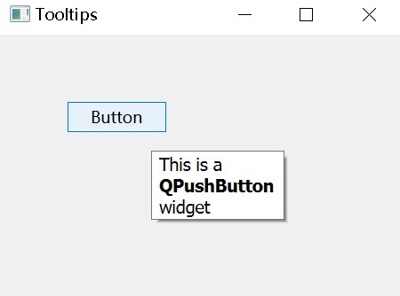

该示例中，我们给两个小部件创建了一个气泡提示框。

```
QToolTip.setFont(QFont('SansSerif', 10))
```


这个静态方法给气泡提示框设置了字体，这里使用了10pt 的 SansSerif 字体。

```
self.setToolTip('This is a <b>QWidget</b> widget')
```


调用 setTooltip 方法创建气泡提示框，可以使用富文本内容。

```
btn = QPushButton('Button', self)
btn.setToolTip('This is a <b>QPushButton</b> widget')
```

`sizeHint` 方法是给按钮一个系统建议的尺寸

### PyQt6 退出按钮

关闭窗口的明显方法是单击标题栏上的 x 标记。在下一个示例中，我们将展示如何以编程方式关闭窗口。 我们将简要介绍信号和插槽。

本例中使用 `QPushButton` 部件完成这个功能。

```python
import sys
from PyQt6.QtWidgets import QWidget, QPushButton, QApplication

class Example(QWidget):

    def __init__(self):
        super().__init__()

        self.initUI()


    def initUI(self):

        qbtn = QPushButton('Quit', self)
        qbtn.clicked.connect(QApplication.instance().quit)
        qbtn.resize(qbtn.sizeHint())
        qbtn.move(50, 50)

        self.setGeometry(300, 300, 350, 250)
        self.setWindowTitle('Quit button')
        self.show()

def main():

    app = QApplication(sys.argv)
    ex = Example()
    sys.exit(app.exec())


if __name__ == '__main__':
    main()
```

### PyQt6 弹窗

默认情况下，如果我们点击标题栏上的 x 按钮，`QWidget` 会被关闭。有时我们想修改这个默认行为。 例如，如果在编辑器中打开了一个文件，修改了部分内容，我们需要显示一个消息框来确认退出程序的操作。

```python
import sys
from PyQt6.QtWidgets import QWidget, QMessageBox, QApplication


class Example(QWidget):

    def __init__(self):
        super().__init__()

        self.initUI()

    def initUI(self):

        self.setGeometry(300, 300, 350, 200)
        self.setWindowTitle('Message box')
        self.show()

    def closeEvent(self, event):

        reply = QMessageBox.question(self, 'Message',
                    "Are you sure to quit?", QMessageBox.StandardButton.Yes |
                    QMessageBox.StandardButton.No, QMessageBox.StandardButton.No)

        if reply == QMessageBox.StandardButton.Yes:

            event.accept()
        else:

            event.ignore()


def main():
    app = QApplication(sys.argv)
    ex = Example()
    sys.exit(app.exec())


if __name__ == '__main__':
    main()
```

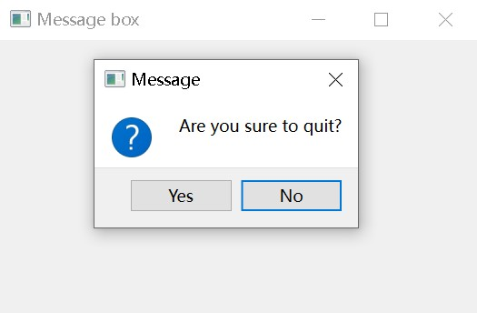

关闭 `QWidget` 操作会产生 `QCloseEvent` 事件。重新实现 `closeEvent` 事件处理，替换部件的默认行为。

这里创建了一个带有两个按钮的消息框：是和否。第一个参数是标题栏，第二个参数是对话框显示的消息文本，第三个参数是对话框中的按钮组合，最后一个参数是默认选中的按钮。返回值存储在变量 `reply` 中。

### PyQt6 窗口居中

下面的脚本会在屏幕上显示一个居中的窗口。

```python
import sys
from PyQt6.QtWidgets import QWidget, QApplication


class Example(QWidget):

    def __init__(self):
        super().__init__()

        self.initUI()

    def initUI(self):

        self.resize(350, 250)
        self.center()

        self.setWindowTitle('Center')
        self.show()

    def center(self):

        qr = self.frameGeometry()
        cp = self.screen().availableGeometry().center()

        qr.moveCenter(cp)
        self.move(qr.topLeft())


def main():

    app = QApplication(sys.argv)
    ex = Example()
    sys.exit(app.exec())


if __name__ == '__main__':
    main()
```

## PyQt6 的菜单和工具栏

### PyQt6 QMainWindow

`QMainWindow` 类提供了主程序窗口。在这里可以创建一个具有状态栏、工具栏和菜单栏的经典应用程序框架。（自带）

### PyQt6 状态栏

状态栏是显示状态信息的小部件。

```python
import sys
from PyQt6.QtWidgets import QMainWindow, QApplication


class Example(QMainWindow):

    def __init__(self):
        super().__init__()

        self.initUI()


    def initUI(self):

        self.statusBar().showMessage('Ready')	# 就这一句话

        self.setGeometry(300, 300, 350, 250)
        self.setWindowTitle('Statusbar')
        self.show()


def main():

    app = QApplication(sys.argv)
    ex = Example()
    sys.exit(app.exec())


if __name__ == '__main__':
    main()
```

### PyQt6 简单菜单

菜单栏在GUI应用程序中很常见，它是位于各种菜单中的一组命令。(Mac OS 对菜单栏的处理是不同的，要得到类似的结果，我们可以添加下面这行: `menubar.setNativeMenuBar(False)`

```python
import sys
from PyQt6.QtWidgets import QMainWindow, QApplication
from PyQt6.QtGui import QIcon, QAction


class Example(QMainWindow):

    def __init__(self):
        super().__init__()

        self.initUI()


    def initUI(self):

        exitAct = QAction(QIcon('exit.png'), '&Exit', self)	# 创建菜单项
        exitAct.setShortcut('Ctrl+Q')
        exitAct.setStatusTip('Exit application')
        exitAct.triggered.connect(QApplication.instance().quit)

        self.statusBar()

        menubar = self.menuBar()
        fileMenu = menubar.addMenu('File')	# 创建菜单并将菜单加入带菜单栏中
        fileMenu.addAction(exitAct)

        self.setGeometry(300, 300, 350, 250)
        self.setWindowTitle('Simple menu')
        self.show()


def main():

    app = QApplication(sys.argv)
    ex = Example()
    sys.exit(app.exec())


if __name__ == '__main__':
    main()
```

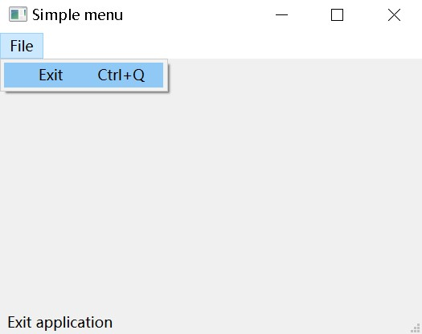

上面的示例中，创建了有一个菜单的菜单栏。这个菜单命令是终止应用，也绑定了快捷键 `Ctrl+Q`。示例中也创建了一个状态栏。

`QAction` 是行为抽象类，包括菜单栏，工具栏，或自定义键盘快捷方式。在上面的三行中，创建了一个带有特定图标和 ‘Exit’ 标签的行为。此外，还为该行为定义了一个快捷方式。第三行创建一个状态提示，当我们将鼠标指针悬停在菜单项上时，状态栏中就会显示这个提示。

`menuBar` 方法创建了一个菜单栏，然后使用 `addMenu` 创建一个文件菜单，使用 `addAction` 创建一个行为。

`menuBar` 也可以直接添加`QAction` 。

### PyQt6 子菜单

子菜单是位于菜单里的菜单。

```python
import sys
from PyQt6.QtWidgets import QMainWindow, QMenu, QApplication
from PyQt6.QtGui import QAction


class Example(QMainWindow):

    def __init__(self):
        super().__init__()

        self.initUI()


    def initUI(self):

        menubar = self.menuBar()
        fileMenu = menubar.addMenu('File')

        impMenu = QMenu('Import', self)
        impAct = QAction('Import mail', self)
        impMenu.addAction(impAct)

        newAct = QAction('New', self)

        fileMenu.addAction(newAct)
        fileMenu.addMenu(impMenu)

        self.setGeometry(300, 300, 350, 250)
        self.setWindowTitle('Submenu')
        self.show()


def main():

    app = QApplication(sys.argv)
    ex = Example()
    sys.exit(app.exec())


if __name__ == '__main__':
    main()
```

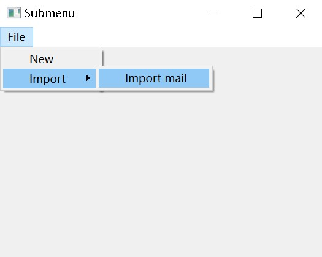

### PyQt6 勾选菜单

下面的示例中，创建了一个可以勾选的菜单。

```python
import sys
from PyQt6.QtWidgets import QMainWindow, QApplication
from PyQt6.QtGui import QAction


class Example(QMainWindow):

    def __init__(self):
        super().__init__()

        self.initUI()


    def initUI(self):

        self.statusbar = self.statusBar()
        self.statusbar.showMessage('Ready')

        menubar = self.menuBar()
        viewMenu = menubar.addMenu('View')

        viewStatAct = QAction('View statusbar', self, checkable=True)
        viewStatAct.setStatusTip('View statusbar')
        viewStatAct.setChecked(True)
        viewStatAct.triggered.connect(self.toggleMenu)

        viewMenu.addAction(viewStatAct)

        self.setGeometry(300, 300, 350, 250)
        self.setWindowTitle('Check menu')
        self.show()


    def toggleMenu(self, state):

        if state:
            self.statusbar.show()
        else:
            self.statusbar.hide()


def main():

    app = QApplication(sys.argv)
    ex = Example()
    sys.exit(app.exec())


if __name__ == '__main__':
    main()
```

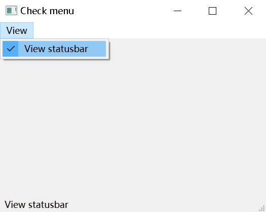

创建只有一个行为的 View 菜单。这个行为用来展现或者隐藏状态栏，如果状态栏可见，菜单是勾选的状态。

### PyQt6 上下文菜单

上下文菜单，也称为弹出菜单，是在某些上下文下出现的命令列表。例如，在 Opera 浏览器中，在网页上按下鼠标右键，我们会得到一个上下文菜单，这个菜单上，可以重新加载页面、返回或查看页面源代码。如果右击工具栏，会得到另一个用于管理工具栏的上下文菜单。

```python
import sys
from PyQt6.QtWidgets import QMainWindow, QMenu, QApplication


class Example(QMainWindow):

    def __init__(self):
        super().__init__()

        self.initUI()


    def initUI(self):

        self.setGeometry(300, 300, 350, 250)
        self.setWindowTitle('Context menu')
        self.show()


    def contextMenuEvent(self, event):

        cmenu = QMenu(self)

        newAct = cmenu.addAction("New")
        openAct = cmenu.addAction("Open")
        quitAct = cmenu.addAction("Quit")
        action = cmenu.exec(self.mapToGlobal(event.pos()))

        if action == quitAct:
            QApplication.instance().quit()


def main():

    app = QApplication(sys.argv)
    ex = Example()
    sys.exit(app.exec())


if __name__ == '__main__':
    main()
```

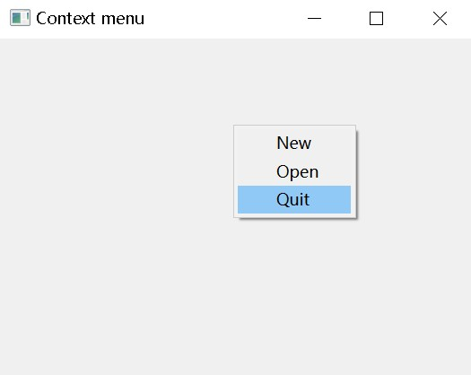

重新实现 `contextMenuEvent` 方法，调出一个上下文菜单。

使用 `exec` 方法调出上下文菜单，通过鼠标事件对象获得鼠标坐标点，再调用 `mapToGlobal` 方法把组件的坐标设置成全局的屏幕坐标。

### PyQt6 工具栏

菜单包含了一个应用程序里所有需要使用到的命令，工具栏则是放置常用命令的地方。

```python
import sys
from PyQt6.QtWidgets import QMainWindow,  QApplication
from PyQt6.QtGui import QIcon, QAction


class Example(QMainWindow):

    def __init__(self):
        super().__init__()

        self.initUI()


    def initUI(self):

        exitAct = QAction(QIcon('exit24.png'), 'Exit', self)
        exitAct.setShortcut('Ctrl+Q')
        exitAct.triggered.connect(QApplication.instance().quit)

        self.toolbar = self.addToolBar('Exit')
        self.toolbar.addAction(exitAct)

        self.setGeometry(300, 300, 350, 250)
        self.setWindowTitle('Toolbar')
        self.show()


def main():

    app = QApplication(sys.argv)
    ex = Example()
    sys.exit(app.exec())


if __name__ == '__main__':
    main()
```

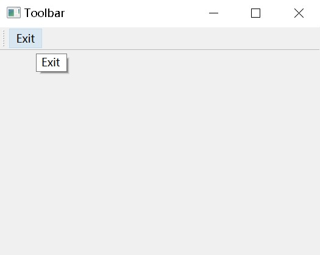

上面的示例中创建了一个简单的工具栏，只有一个行为，关闭应用。

使用 `addToolBar` 方法创建工具栏，然后使用 `addAction` 方法添加行为。

### PyQt6 主窗口

这里创建一个菜单栏，一个工具栏和一个状态栏，并增加一个中心布局组件。

```python
import sys
from PyQt6.QtWidgets import QMainWindow, QTextEdit, QApplication
from PyQt6.QtGui import QIcon, QAction


class Example(QMainWindow):

    def __init__(self):
        super().__init__()

        self.initUI()


    def initUI(self):

        textEdit = QTextEdit()
        self.setCentralWidget(textEdit)

        exitAct = QAction(QIcon('exit24.png'), 'Exit', self)
        exitAct.setShortcut('Ctrl+Q')
        exitAct.setStatusTip('Exit application')
        exitAct.triggered.connect(self.close)

        self.statusBar()

        menubar = self.menuBar()
        fileMenu = menubar.addMenu('&File')
        fileMenu.addAction(exitAct)

        toolbar = self.addToolBar('Exit')		# 添加提示气泡
        toolbar.addAction(exitAct)

        self.setGeometry(300, 300, 350, 250)
        self.setWindowTitle('Main window')
        self.show()


def main():

    app = QApplication(sys.argv)
    ex = Example()
    sys.exit(app.exec())


if __name__ == '__main__':
    main()
```

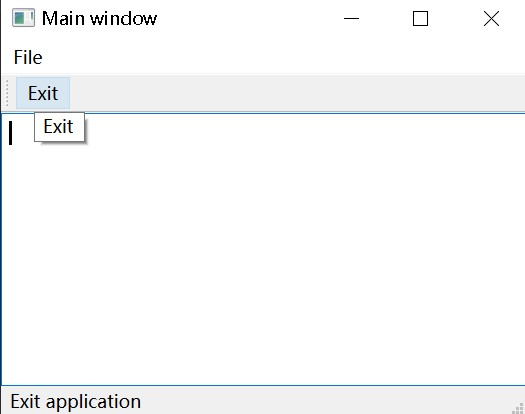

## PyQt6 的布局管理

布局管理是我们在应用程序窗口中放置小部件的方式。我们可以使用绝对定位或布局类来放置小部件。使用布局管理器管理布局是组织小部件的首选方法。

绝对定位
以像素为单位指定每个小部件的位置和大小。在使用绝对定位时，我们必须了解以下局限性:

-如果我们调整窗口大小，窗口小部件的大小和位置不会改变
-应用程序在不同的平台上看起来可能不同，改变应用程序的字体可能会破坏布局
-如果要改变布局，我们必须完全重做我们的布局，这很繁琐耗时

下面的示例以绝对坐标来定位小部件。

```python
import sys
from PyQt6.QtWidgets import QWidget, QLabel, QApplication


class Example(QWidget):

    def __init__(self):
        super().__init__()

        self.initUI()


    def initUI(self):

        lbl1 = QLabel('ZetCode', self)
        lbl1.move(15, 10)

        lbl2 = QLabel('tutorials', self)
        lbl2.move(35, 40)

        lbl3 = QLabel('for programmers', self)
        lbl3.move(55, 70)

        self.setGeometry(300, 300, 350, 250)
        self.setWindowTitle('Absolute')
        self.show()


def main():

    app = QApplication(sys.argv)
    ex = Example()
    sys.exit(app.exec())


if __name__ == '__main__':
    main()
```

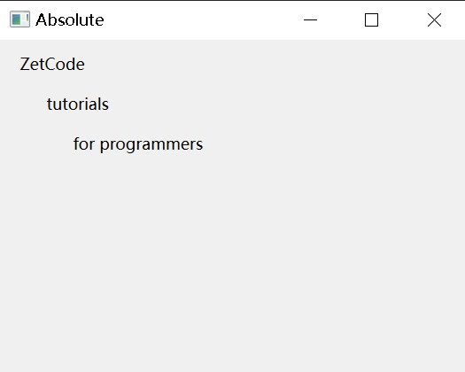

我们使用 `move` 方法来定位小部件。在本例中也就是标签。我们通过提供x和y坐标来定位。坐标系的起始点在左上角，x值从左到右递增。y值从上到下递增。

### PyQt6 QHBoxLayout

`QHBoxLayout` 和 `QVBoxLayout` 是基本的布局类，用于水平和垂直地排列小部件。

假设我们想在右下角放置两个按钮。为了创建这样的布局，我们使用一个水平框和一个垂直框。为了创造必要的空间，我们添加了一个“拉伸因子”。

```python
import sys
from PyQt6.QtWidgets import (QWidget, QPushButton,
        QHBoxLayout, QVBoxLayout, QApplication)


class Example(QWidget):

    def __init__(self):
        super().__init__()

        self.initUI()


    def initUI(self):

        okButton = QPushButton("OK")
        cancelButton = QPushButton("Cancel")

        hbox = QHBoxLayout()
        hbox.addStretch(1)
        hbox.addWidget(okButton)
        hbox.addWidget(cancelButton)

        vbox = QVBoxLayout()
        vbox.addStretch(1)
        vbox.addLayout(hbox)

        self.setLayout(vbox)

        self.setGeometry(300, 300, 350, 250)
        self.setWindowTitle('Buttons')
        self.show()


def main():

    app = QApplication(sys.argv)
    ex = Example()
    sys.exit(app.exec())


if __name__ == '__main__':
    main()
```

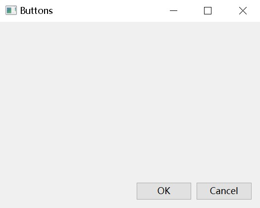

窗口的右下角有两个按钮。当我们调整应用程序窗口的大小时，它们仍然在那里。这里使用了 `HBoxLayout` 和 `QVBoxLayout`。

创建一个水平框布局，并添加一个拉伸因子和两个按钮。拉伸在两个按钮之前增加了一个可拉伸的空间，这将把他们推到窗口的右边。

```python
# 方法一
hbox = QHBoxLayout()
hbox.addStretch(1)
hbox.addWidget(okButton)
hbox.addWidget(cancelButton)

# 方法二
hbox = QHBoxLayout()
spacer = QSpacerItem(20, 20, QSizePolicy.Policy.Expanding, QSizePolicy.Policy.Minimum)
hbox.addItem(spacer)
hbox.addWidget(okButton)
hbox.addWidget(cancelButton)
```

如果要去除拉伸因子

```python
# 方法一
hbox.removeItem(hbox.itemAt(0))  # 假设拉伸因子在索引0处

# 方法二
hbox.removeItem(spacer)
```

### PyQt6 QGridLayout

`QGridLayout` 是最常用的布局类，它能把空间分为多行多列。

```python
import sys
from PyQt6.QtWidgets import (QWidget, QGridLayout,
        QPushButton, QApplication)


class Example(QWidget):

    def __init__(self):
        super().__init__()

        self.initUI()


    def initUI(self):

        grid = QGridLayout()
        self.setLayout(grid)

        names = ['Cls', 'Bck', '', 'Close',
                 '7', '8', '9', '/',
                 '4', '5', '6', '*',
                 '1', '2', '3', '-',
                 '0', '.', '=', '+']

        positions = [(i, j) for i in range(5) for j in range(4)]

        for position, name in zip(positions, names):

            if name == '':
                continue

            button = QPushButton(name)
            grid.addWidget(button, *position)

        self.move(300, 150)
        self.setWindowTitle('Calculator')
        self.show()


def main():

    app = QApplication(sys.argv)
    ex = Example()
    sys.exit(app.exec())


if __name__ == '__main__':
    main()
```

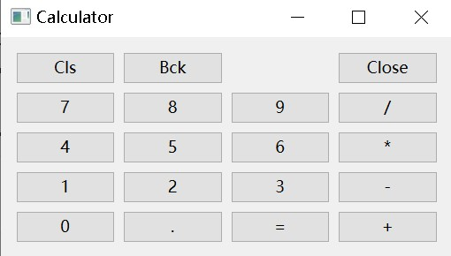

组件可以跨越多个行和列，下面的示例来演示这个。

```python
reviewEdit = QTextEdit()
grid.addWidget(reviewEdit, 3, 1, 5, 1)
```

在第3行1列添加一个文本框，跨5行，跨1列。

## PyQt6 事件和信号

### PyQt6 中的事件

GUI 应用程序是事件驱动的。事件主要由应用程序的用户触发，但也可以通过其他方式生成，例如 Internet 连接、窗口管理器或定时器。当我们调用应用程序的 `exec()` 方法时，应用程序进入主循环。 主循环获取事件并将它们发送到对象。

在事件模型里，有三个要素：

事件源 event source
事件对象 event object
事件目标 event target
事件源是状态改变的对象，它会产生事件。event object（事件）封装了事件源中的状态变化。 event target 是要被通知的对象。事件源对象将处理事件的任务委托给事件目标。

PyQt6 有独特的信号和插槽机制来处理事件，用于对象之间的通信，当特定事件发生时触发。插槽可以是任意可调用的 Python 脚本。当发出连接的信号时，调用插槽脚本

### PyQt6 信号和插槽

下面的示例展示了 PyQt6 的信号和插槽。

```python
import sys
from PyQt6.QtCore import Qt
from PyQt6.QtWidgets import (QWidget, QLCDNumber, QSlider,
        QVBoxLayout, QApplication)


class Example(QWidget):

    def __init__(self):
        super().__init__()

        self.initUI()


    def initUI(self):

        lcd = QLCDNumber(self)
        sld = QSlider(Qt.Orientation.Horizontal, self)

        vbox = QVBoxLayout()
        vbox.addWidget(lcd)
        vbox.addWidget(sld)

        self.setLayout(vbox)
        sld.valueChanged.connect(lcd.display)

        self.setGeometry(300, 300, 350, 250)
        self.setWindowTitle('Signal and slot')
        self.show()


def main():
    
    app = QApplication(sys.argv)
    ex = Example()
    sys.exit(app.exec())


if __name__ == '__main__':
    main()
```

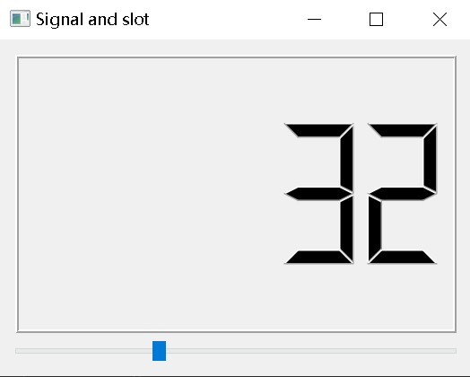

本例中，展示了 `QtGui.QLCDNumber` 和 `QtGui.QSlider`。我们可以通过拖动滑块改变显示器里的数字。

```python
sld.valueChanged.connect(lcd.display)
```

把滑块的 `valueChanged` 事件和 显示器 `display` 插槽绑定到一起。*sender* 是触发信号的对象， *receiver* 是接收信号的对象，*slot* 是对信号做出反应的方法。

### PyQt6 重新实现事件处理器

PyQt6里，事件的处理器一般都会重新实现。

译注：所有的事件处理器都有默认的实现，也就是默认事件。默认事件可能有自己的逻辑，比如拖选，点击，有的可能只是一个空函数。空函数都需要重新覆盖原来的实现，达到事件处理的目的。有默认事件处理函数的，也有可能被覆盖实现，比如禁用自带的拖选，或者重写拖选的效果等。

```python
import sys
from PyQt6.QtCore import Qt
from PyQt6.QtWidgets import QWidget, QApplication


class Example(QWidget):

    def __init__(self):
        super().__init__()

        self.initUI()


    def initUI(self):

        self.setGeometry(300, 300, 350, 250)
        self.setWindowTitle('Event handler')
        self.show()


    def keyPressEvent(self, e):
        
        if e.key() == Qt.Key.Key_Escape.value:
            self.close()


def main():

    app = QApplication(sys.argv)
    ex = Example()
    sys.exit(app.exec())


if __name__ == '__main__':
    main()
```

按下 Escape 按钮，应用会退出。

### PyQt6 事件对象

事件对象是一个 Python object，包含了一系列描述这个事件的属性，具体内容要看触发的事件。

```python
import sys
from PyQt6.QtCore import Qt
from PyQt6.QtWidgets import QWidget, QApplication, QGridLayout, QLabel


class Example(QWidget):

    def __init__(self):
        super().__init__()

        self.initUI()


    def initUI(self):

        grid = QGridLayout()

        x = 0
        y = 0

        self.text = f'x: {x},  y: {y}'

        self.label = QLabel(self.text, self)
        grid.addWidget(self.label, 0, 0, Qt.AlignmentFlag.AlignTop)

        self.setMouseTracking(True)
        self.setLayout(grid)

        self.setGeometry(300, 300, 450, 300)
        self.setWindowTitle('Event object')
        self.show()


    def mouseMoveEvent(self, e):

        x = int(e.position().x())
        y = int(e.position().y())

        text = f'x: {x},  y: {y}'
        self.label.setText(text)


def main():

    app = QApplication(sys.argv)
    ex = Example()
    sys.exit(app.exec())


if __name__ == '__main__':
    main()
```

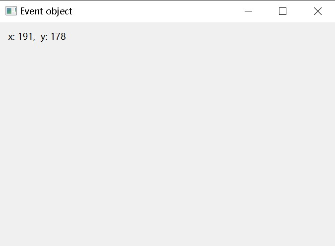

```
self.setMouseTracking(True)
```

鼠标跟踪默认是关闭的，鼠标移动时，组件只能在鼠标按下的时候接收到事件。开启鼠标跟踪，只移动鼠标不按下鼠标按钮，也能接收到事件。

`e` 是事件对象，它包含了事件触发时候的数据。通过 `position().x()` 和 `e.position().y()` 方法，能获取到鼠标的坐标值。

### PyQt6 事件触发者

某些时候，需要知道事件的触发者是谁，PyQt6 有获取事件触发者的方法。

```python
import sys
from PyQt6.QtWidgets import QMainWindow, QPushButton, QApplication


class Example(QMainWindow):

    def __init__(self):
        super().__init__()

        self.initUI()


    def initUI(self):

        btn1 = QPushButton("Button 1", self)
        btn1.move(30, 50)

        btn2 = QPushButton("Button 2", self)
        btn2.move(150, 50)

        btn1.clicked.connect(self.buttonClicked)
        btn2.clicked.connect(self.buttonClicked)

        self.statusBar()

        self.setGeometry(300, 300, 450, 350)
        self.setWindowTitle('Event sender')
        self.show()


    def buttonClicked(self):

        sender = self.sender()

        msg = f'{sender.text()} was pressed'
        self.statusBar().showMessage(msg)


def main():

    app = QApplication(sys.argv)
    ex = Example()
    sys.exit(app.exec())


if __name__ == '__main__':
    main()
```

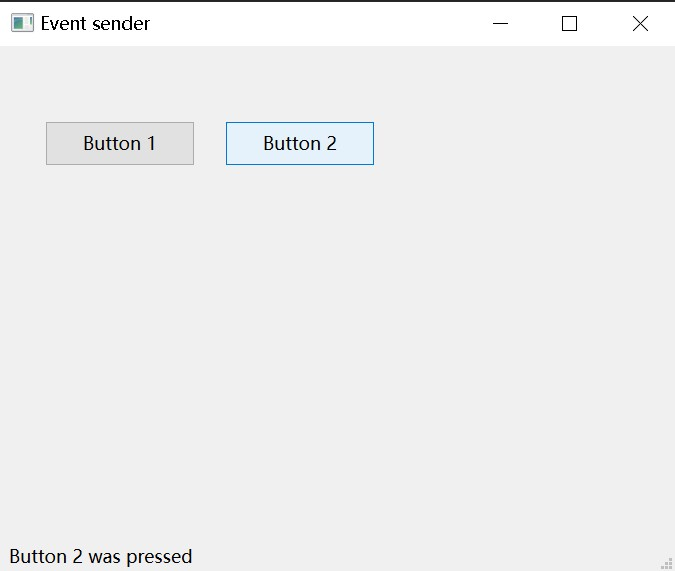

本例中有两个按钮。 `buttonClicked` 调用触发者方法确定了是哪个按钮触发的事件。

```
btn1.clicked.connect(self.buttonClicked)
btn2.clicked.connect(self.buttonClicked)
```

两个按钮绑定了同一个插槽。

```
def buttonClicked(self):

    sender = self.sender()

    msg = f'{sender.text()} was pressed'
    self.statusBar().showMessage(msg)
```

### PyQt6 触发信号

`QObject` 可以主动触发信号。下面的示例显示了如果触发自定义信号。

```python
import sys
from PyQt6.QtCore import pyqtSignal, QObject
from PyQt6.QtWidgets import QMainWindow, QApplication


class Communicate(QObject):

    closeApp = pyqtSignal()


class Example(QMainWindow):

    def __init__(self):
        super().__init__()

        self.initUI()


    def initUI(self):

        self.c = Communicate()
        self.c.closeApp.connect(self.close)

        self.setGeometry(300, 300, 450, 350)
        self.setWindowTitle('Emit signal')
        self.show()


    def mousePressEvent(self, e):

        self.c.closeApp.emit()


def main():

    app = QApplication(sys.argv)
    ex = Example()
    sys.exit(app.exec())


if __name__ == '__main__':
    main()
```

创建了一个叫 `closeApp` 的信号，在鼠标按下的时候触发，和关闭插槽 `QMainWindow` 绑定。

```python
class Communicate(QObject):

    closeApp = pyqtSignal()
```

外部 Communicate 类的属性 `pyqtSignal` 创建信号。

```
self.c = Communicate()
self.c.closeApp.connect(self.close)
```

自定义信号 `closeApp` 绑定到 `QMainWindow` 的关闭插槽上。

```
def mousePressEvent(self, event):

    self.c.closeApp.emit()
```

在窗口上点击鼠标按钮的时候，触发 `closeApp` 信号，程序终止。

注：这个例子有点复杂了

## PyQt6 的对话框

对话是两个或更多人之间的交谈。在计算机程序中，对话框是用于与应用程序“交谈”的窗口，用于诸如从用户那里获取数据或更改应用程序设置之类的事情。

### PyQt6 QInputDialog

`QInputDialog` 提供了一个简单方便的对话框来从用户那里获取输入。输入值可以是字符串、数字或列表中的项目。

```python
from PyQt6.QtWidgets import (QWidget, QPushButton, QLineEdit,
        QInputDialog, QApplication)
import sys


class Example(QWidget):

    def __init__(self):
        super().__init__()

        self.initUI()


    def initUI(self):

        self.btn = QPushButton('Dialog', self)
        self.btn.move(20, 20)
        self.btn.clicked.connect(self.showDialog)

        self.le = QLineEdit(self)
        self.le.move(130, 22)

        self.setGeometry(300, 300, 450, 350)
        self.setWindowTitle('Input dialog')
        self.show()


    def showDialog(self):

        text, ok = QInputDialog.getText(self, 'Input Dialog',
                                        'Enter your name:')

        if ok:
            self.le.setText(str(text))


def main():

    app = QApplication(sys.argv)
    ex = Example()
    sys.exit(app.exec())


if __name__ == '__main__':
    main()
```

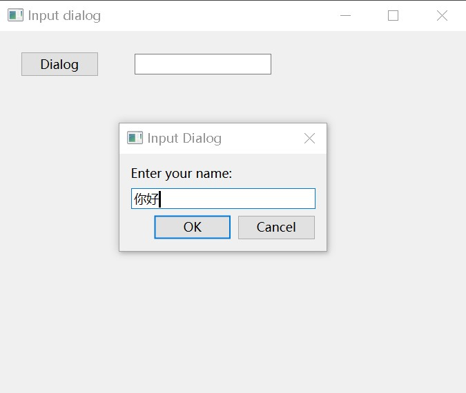

这个示例有一个按钮和行内编辑部件，按钮打开输入一个对话框，对话框里有一个文本输入框，用户输入的文本会显示在行内编辑部件里.

```
text, ok = QInputDialog.getText(self, 'Input Dialog',
    'Enter your name:')
```

这行代码打开了输入对话框，第一个参数是对话框标题，第二个参数是对话框里的提示信息。对话框会返回输入的文本和一个布尔值。如果点击 OK 按钮，这个布尔值是 `true`。

```
if ok:
    self.le.setText(str(text))
```

使用 `setText()` 从对话框里获取输入的文本。

### PyQt6 QColorDialog

`QColorDialog` 是可以选择颜色对话框。

```python
from PyQt6.QtWidgets import (QWidget, QPushButton, QFrame,
        QColorDialog, QApplication)
from PyQt6.QtGui import QColor
import sys


class Example(QWidget):

    def __init__(self):
        super().__init__()

        self.initUI()


    def initUI(self):

        col = QColor(0, 0, 0)

        self.btn = QPushButton('Dialog', self)
        self.btn.move(20, 20)

        self.btn.clicked.connect(self.showDialog)

        self.frm = QFrame(self)
        self.frm.setStyleSheet("QWidget { background-color: %s }"
                               % col.name())
        self.frm.setGeometry(130, 22, 200, 200)

        self.setGeometry(300, 300, 450, 350)
        self.setWindowTitle('Color dialog')
        self.show()


    def showDialog(self):

        col = QColorDialog.getColor()

        if col.isValid():

            self.frm.setStyleSheet("QWidget { background-color: %s }" 
                                   % col.name())


def main():

    app = QApplication(sys.argv)
    ex = Example()
    sys.exit(app.exec())


if __name__ == '__main__':
    main()
```

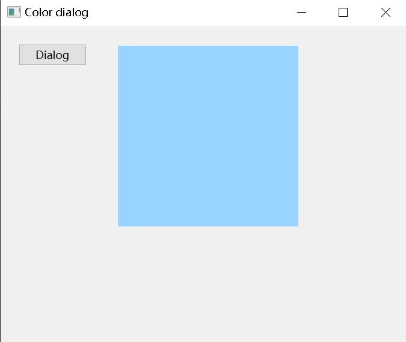

### PyQt6 QFontDialog

`QFontDialog` 是选择字体的对话框。

```python
from PyQt6.QtWidgets import (QWidget, QVBoxLayout, QPushButton,
        QSizePolicy, QLabel, QFontDialog, QApplication)
import sys


class Example(QWidget):

    def __init__(self):
        super().__init__()

        self.initUI()


    def initUI(self):

        vbox = QVBoxLayout()

        btn = QPushButton('Dialog', self)
        btn.setSizePolicy(QSizePolicy.Policy.Fixed, QSizePolicy.Policy.Fixed)
        btn.move(20, 20)

        vbox.addWidget(btn)

        btn.clicked.connect(self.showDialog)

        self.lbl = QLabel('Knowledge only matters', self)
        self.lbl.move(130, 20)

        vbox.addWidget(self.lbl)
        self.setLayout(vbox)

        self.setGeometry(300, 300, 450, 350)
        self.setWindowTitle('Font dialog')
        self.show()


    def showDialog(self):

        font, ok = QFontDialog.getFont()

        if ok:
            self.lbl.setFont(font)


def main():

    app = QApplication(sys.argv)
    ex = Example()
    sys.exit(app.exec())


if __name__ == '__main__':
    main()
```

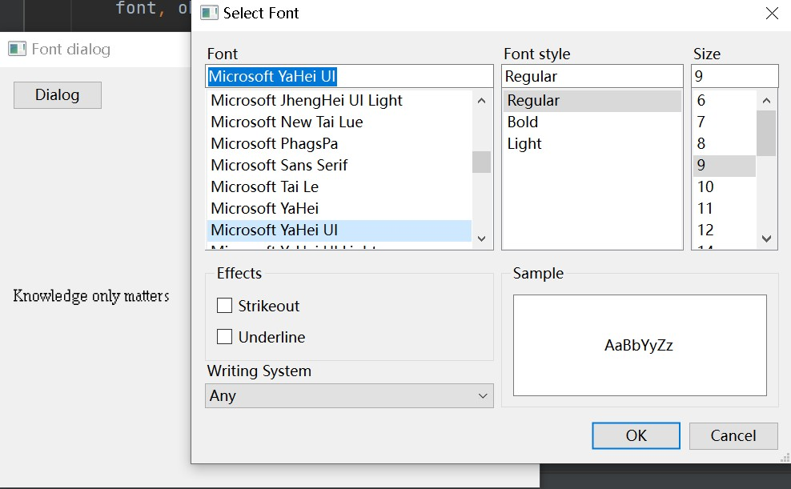

### PyQt6 QFileDialog

`QFileDialog` 是选择文件或者文件夹的对话框，可以用作选择或者保存操作。

```python
from PyQt6.QtWidgets import (QMainWindow, QTextEdit,
        QFileDialog, QApplication)
from PyQt6.QtGui import QIcon, QAction
from pathlib import Path
import sys


class Example(QMainWindow):

    def __init__(self):
        super().__init__()

        self.initUI()


    def initUI(self):

        self.textEdit = QTextEdit()
        self.setCentralWidget(self.textEdit)
        self.statusBar()

        openFile = QAction(QIcon('open.png'), 'Open', self)
        openFile.setShortcut('Ctrl+O')
        openFile.setStatusTip('Open new File')
        openFile.triggered.connect(self.showDialog)

        menubar = self.menuBar()
        fileMenu = menubar.addMenu('&File')
        fileMenu.addAction(openFile)

        self.setGeometry(300, 300, 550, 450)
        self.setWindowTitle('File dialog')
        self.show()


    def showDialog(self):

        home_dir = str(Path.home())
        fname = QFileDialog.getOpenFileName(self, 'Open file', home_dir)

        if fname[0]:

            f = open(fname[0], 'r')

            with f:

                data = f.read()
                self.textEdit.setText(data)


def main():

    app = QApplication(sys.argv)
    ex = Example()
    sys.exit(app.exec())


if __name__ == '__main__':
    main()
```

```python
home_dir = str(Path.home())
fname = QFileDialog.getOpenFileName(self, 'Open file', home_dir)
```

这里弹出 `QFileDialog`。`getOpenFileName` 的第一个参数字符串是标题，第二个字符串指定对话框工作目录。我们使用 `path` 模块来确定用户的主目录。默认情况下，文件过滤器设置为所有文件 (*)。

```python
fileDialog = QFileDialog()
        fileDialog.setFileMode(QFileDialog.FileMode.ExistingFiles)  # 设置选择模式为多个文件
        filepaths, _ = fileDialog.getOpenFileNames(self, '选择文件', '', '文件类型(*pdf *txt *docx)')
```

同时选择多个文件，并指定文件类型。返回的第二个数据为选择文件的类型。

---

## 参考文献

https://blog.csdn.net/John_Lenon/article/details/131366882