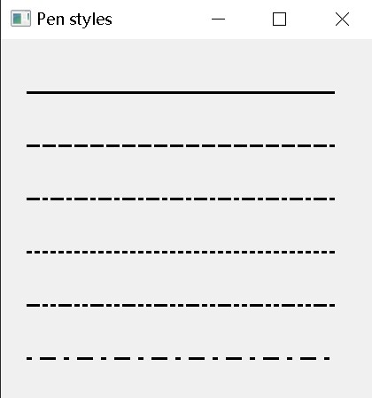

## PyQt6 组件（一）

组件是应用程序的基础组成部分。PyQt6 具有各种各样的小部件，包括按钮、复选框、滑块或列表框。在本节教程中，我们将介绍几个有用的小部件：QCheckBox、QPushButton、QSlider、QProgressBar和QCalendarWidget。

### 选择框

`QCheckBox` 组件有两个状态：选中和非选中。由个选框和文字组成，主要用于表示某个属性时开启还是关闭。

```python
from PyQt6.QtWidgets import QWidget, QCheckBox, QApplication
from PyQt6.QtCore import Qt
import sys


class Example(QWidget):

    def __init__(self):
        super().__init__()

        self.initUI()


    def initUI(self):

        cb = QCheckBox('Show title', self)
        cb.move(20, 20)
        cb.toggle()
        cb.stateChanged.connect(self.changeTitle)

        self.setGeometry(300, 300, 350, 250)
        self.setWindowTitle('QCheckBox')
        self.show()


    def changeTitle(self, state):

        if state == Qt.CheckState.Checked.value:
            self.setWindowTitle('QCheckBox')
        else:
            self.setWindowTitle(' ')


def main():

    app = QApplication(sys.argv)
    ex = Example()
    sys.exit(app.exec())


if __name__ == '__main__':
    main()
```


把用户定义的 `changeTitle` 方法和 `stateChanged` 信号连接起来。`changeTitle` 方法用来切换窗口标题。

组件的状态是 `changeTitle` 方法改变变量得到的。如果选中组件，就设置窗口的标题。否则，标题栏是一个空字符串。

###  按钮

切换按钮是 `QPushButton` 的一个特殊情况。它又两个状态：按下与否，鼠标点击触发。

```python
from PyQt6.QtWidgets import (QWidget, QPushButton,
        QFrame, QApplication)
from PyQt6.QtGui import QColor
import sys


class Example(QWidget):

    def __init__(self):
        super().__init__()

        self.initUI()


    def initUI(self):

        self.col = QColor(0, 0, 0)

        redb = QPushButton('Red', self)
        redb.setCheckable(True)
        redb.move(10, 10)

        redb.clicked[bool].connect(self.setColor)

        greenb = QPushButton('Green', self)
        greenb.setCheckable(True)
        greenb.move(10, 60)

        greenb.clicked[bool].connect(self.setColor)

        blueb = QPushButton('Blue', self)
        blueb.setCheckable(True)
        blueb.move(10, 110)

        blueb.clicked[bool].connect(self.setColor)

        self.square = QFrame(self)
        self.square.setGeometry(150, 20, 100, 100)
        self.square.setStyleSheet("QWidget { background-color: %s }" %
                                  self.col.name())

        self.setGeometry(300, 300, 300, 250)
        self.setWindowTitle('Toggle button')
        self.show()


    def setColor(self, pressed):

        source = self.sender()

        if pressed:
            val = 255
        else:
            val = 0

        if source.text() == "Red":
            self.col.setRed(val)
        elif source.text() == "Green":
            self.col.setGreen(val)
        else:
            self.col.setBlue(val)

        self.square.setStyleSheet("QFrame { background-color: %s }" %
                                  self.col.name())


def main():

    app = QApplication(sys.argv)
    ex = Example()
    sys.exit(app.exec())


if __name__ == '__main__':
    main()
```

给每个按钮绑定了事件处理函数。

### 滑块

QSlider是一个有简单手柄的小部件，这个手柄可以前后拖动。通过这种方式，我们可以为特定的任务选择一个值。有时使用滑块比输入数字或使用旋转框更自然。

在我们的示例中，我们显示了一个滑块和一个标签。标签显示一个图像。滑块控制标签。

```python
from PyQt6.QtWidgets import (QWidget, QSlider,
        QLabel, QApplication)
from PyQt6.QtCore import Qt
from PyQt6.QtGui import QPixmap
import sys


class Example(QWidget):

    def __init__(self):
        super().__init__()

        self.initUI()


    def initUI(self):

        sld = QSlider(Qt.Orientation.Horizontal, self)
        sld.setFocusPolicy(Qt.FocusPolicy.NoFocus)
        sld.setGeometry(30, 40, 200, 30)
        sld.valueChanged[int].connect(self.changeValue)

        self.label = QLabel(self)
        self.label.setPixmap(QPixmap('mute.png'))
        self.label.setGeometry(250, 40, 80, 30)

        self.setGeometry(300, 300, 350, 250)
        self.setWindowTitle('QSlider')
        self.show()


    def changeValue(self, value):

        if value == 0:

            self.label.setPixmap(QPixmap('mute.png'))
        elif 0 < value <= 30:

            self.label.setPixmap(QPixmap('min.png'))
        elif 30 < value < 80:

            self.label.setPixmap(QPixmap('med.png'))
        else:

            self.label.setPixmap(QPixmap('max.png'))


def main():

    app = QApplication(sys.argv)
    ex = Example()
    sys.exit(app.exec())


if __name__ == '__main__':
    main()
```


```
sld = QSlider(Qt.Orientation.Horizontal, self)
```

创建一个水平的 `QSlider`。

### 进度条

进度条是一个用于处理冗长任务的小部件。它是动态的，以便用户知道任务正在进行中。QProgressBar 小部件在 PyQt6 工具包中提供了一个水平或垂直的进度条。可以设置进度条的最小值和最大值，默认值为0和99。

```python
from PyQt6.QtWidgets import (QWidget, QProgressBar,
        QPushButton, QApplication)
from PyQt6.QtCore import QBasicTimer
import sys


class Example(QWidget):

    def __init__(self):
        super().__init__()

        self.initUI()


    def initUI(self):

        self.pbar = QProgressBar(self)
        self.pbar.setGeometry(30, 40, 200, 25)

        self.btn = QPushButton('Start', self)
        self.btn.move(40, 80)
        self.btn.clicked.connect(self.doAction)

        self.timer = QBasicTimer()
        self.step = 0

        self.setGeometry(300, 300, 280, 170)
        self.setWindowTitle('QProgressBar')
        self.show()


    def timerEvent(self, e):

        if self.step >= 100:

            self.timer.stop()
            self.btn.setText('Finished')
            return

        self.step = self.step + 1
        self.pbar.setValue(self.step)


    def doAction(self):

        if self.timer.isActive():
            self.timer.stop()
            self.btn.setText('Start')
        else:
            self.timer.start(100, self)
            self.btn.setText('Stop')


def main():

    app = QApplication(sys.argv)
    ex = Example()
    sys.exit(app.exec())


if __name__ == '__main__':
    main()
```


每个`QObject` 和它的后代都有一个 `timerEvent` 事件处理器，这里实现一些函数处理这些事件。

```python
# 定时器
self.timer = QTimer()
self.timer.timeout.connect(self.updateProgress)

self.timer.start(100)		# 每100毫秒更新一次

'''更新进度条进度'''
def updateProgress(self):
  if self.progress >= 95:
    self.timer.stop()  # 停止定时器
    else:
      self.progress += 1
      self.progressBar.setValue(self.progress)
```

还可以这样写。

### 日历

`QCalendarWidget` 提供了一个月视图的日历组件，它能让用户简单直观的选择日期。

```python
from PyQt6.QtWidgets import (QWidget, QCalendarWidget,
        QLabel, QApplication, QVBoxLayout)
from PyQt6.QtCore import QDate
import sys


class Example(QWidget):

    def __init__(self):
        super().__init__()

        self.initUI()


    def initUI(self):

        vbox = QVBoxLayout(self)

        cal = QCalendarWidget(self)
        cal.setGridVisible(True)
        cal.clicked[QDate].connect(self.showDate)

        vbox.addWidget(cal)

        self.lbl = QLabel(self)
        date = cal.selectedDate()
        self.lbl.setText(date.toString())

        vbox.addWidget(self.lbl)

        self.setLayout(vbox)

        self.setGeometry(300, 300, 350, 300)
        self.setWindowTitle('Calendar')
        self.show()


    def showDate(self, date):
        self.lbl.setText(date.toString())


def main():

    app = QApplication(sys.argv)
    ex = Example()
    sys.exit(app.exec())


if __name__ == '__main__':
    main()
```


## PyQt6 组件（二）

本章继续介绍 PyQt6 组件，包含了`QPixmap`, `QLineEdit`, `QSplitter` 和 `QComboBox`。	

### 图像

`QPixmap` 是用于处理图像的小组件，为显示图像进行了优化。下面是使用 `QPixmap` 渲染图像的示例。

```python
# file: pixmap.py
#!/usr/bin/python

"""
PyQt6 tutorial

In this example, we display an image
on the window.
"""
from PyQt6.QtCore import Qt
from PyQt6.QtWidgets import (QWidget, QHBoxLayout,
        QLabel, QApplication)
from PyQt6.QtGui import QPixmap
import sys


class Example(QWidget):

    def __init__(self):
        super().__init__()

        self.initUI()


    def initUI(self):

        hbox = QHBoxLayout(self)
        pixmap = QPixmap('resources/backgroung_img.jpg')
        pixmap = pixmap.scaled(400, 400, Qt.AspectRatioMode.KeepAspectRatio)  # 设置图像尺度（宽度和高度）,保持图像比例

        lbl = QLabel(self)
        lbl.setPixmap(pixmap)

        hbox.addWidget(lbl)
        self.setLayout(hbox)

        self.move(300, 200)
        self.setWindowTitle('Sid')
        self.show()


def main():

    app = QApplication(sys.argv)
    ex = Example()
    sys.exit(app.exec())


if __name__ == '__main__':
    main()
```


### 文本框

QLineEdit是一个可以输入单行文本的组件，它有撤消和重做、剪切和粘贴以及拖放功能。

```python
import sys
from PyQt6.QtWidgets import (QWidget, QLabel,
        QLineEdit, QApplication)


class Example(QWidget):

    def __init__(self):
        super().__init__()

        self.initUI()


    def initUI(self):

        self.lbl = QLabel(self)
        qle = QLineEdit(self)

        qle.move(60, 100)
        self.lbl.move(60, 40)

        qle.textChanged[str].connect(self.onChanged)

        self.setGeometry(300, 300, 350, 250)
        self.setWindowTitle('QLineEdit')
        self.show()


    def onChanged(self, text):

        self.lbl.setText(text)
        self.lbl.adjustSize()


def main():

    app = QApplication(sys.argv)
    ex = Example()
    sys.exit(app.exec())


if __name__ == '__main__':
    main()
```

```
qle.textChanged[str].connect(self.onChanged)
```

如果编辑器的文本发生了变化，就调用 `onChanged` 方法。

```
def onChanged(self, text):
    
    self.lbl.setText(text)
    self.lbl.adjustSize()
```

在 `onChanged` 里，把输入的文本设置到标签组件里，同时使用 `adjustSize` 方法调整文字显示。

### PyQt6 QSplitter

`QSplitter` 允许用户通过拖动子部件之间的边界来控制子部件的大小。下面是被两个分割条分开的三个`QFrame` 组件的示例。

```python
import sys

from PyQt6.QtCore import Qt
from PyQt6.QtWidgets import (QWidget, QHBoxLayout, QFrame,
        QSplitter, QApplication)


class Example(QWidget):

    def __init__(self):
        super().__init__()

        self.initUI()


    def initUI(self):

        hbox = QHBoxLayout(self)

        topleft = QFrame(self)
        topleft.setFrameShape(QFrame.Shape.StyledPanel)

        topright = QFrame(self)
        topright.setFrameShape(QFrame.Shape.StyledPanel)

        bottom = QFrame(self)
        bottom.setFrameShape(QFrame.Shape.StyledPanel)

        splitter1 = QSplitter(Qt.Orientation.Horizontal)
        splitter1.addWidget(topleft)
        splitter1.addWidget(topright)

        splitter2 = QSplitter(Qt.Orientation.Vertical)
        splitter2.addWidget(splitter1)
        splitter2.addWidget(bottom)

        hbox.addWidget(splitter2)
        self.setLayout(hbox)

        self.setGeometry(300, 300, 450, 400)
        self.setWindowTitle('QSplitter')
        self.show()


def main():

    app = QApplication(sys.argv)
    ex = Example()
    sys.exit(app.exec())


if __name__ == '__main__':
    main()
```


这里有三个 QFrame 组件和连个 QSplitter 组件，注意，在某些主题里，分割条可能不容易看到。

```python
topleft = QFrame(self)
topleft.setFrameShape(QFrame.Shape.StyledPanel)
```

给框架组件设置一些样式，这样更容易看清楚边界。

```
splitter1 = QSplitter(Qt.Orientation.Horizontal)
splitter1.addWidget(topleft)
splitter1.addWidget(topright)
```

创建一个有俩框架组件的 `QSplitter` 组件

```
splitter2 = QSplitter(Qt.Orientation.Vertical)
splitter2.addWidget(splitter1)
```

再添加一个分割条和一个框架组件。

### 下拉选框

`QComboBox` 是下拉选框组件，能让用户在一系列选项中进行选择。

```python
import sys

from PyQt6.QtWidgets import (QWidget, QLabel,
        QComboBox, QApplication)


class Example(QWidget):

    def __init__(self):
        super().__init__()

        self.initUI()


    def initUI(self):

        self.lbl = QLabel('Ubuntu', self)

        combo = QComboBox(self)

        combo.addItem('Ubuntu')
        combo.addItem('Mandriva')
        combo.addItem('Fedora')
        combo.addItem('Arch')
        combo.addItem('Gentoo')

        combo.move(50, 50)
        self.lbl.move(50, 150)

        combo.textActivated[str].connect(self.onActivated)

        self.setGeometry(300, 300, 450, 400)
        self.setWindowTitle('QComboBox')
        self.show()


    def onActivated(self, text):

        self.lbl.setText(text)
        self.lbl.adjustSize()


def main():

    app = QApplication(sys.argv)
    ex = Example()
    sys.exit(app.exec())


if __name__ == '__main__':
    main()
```


## PyQt6 中的拖拽操作

计算机图形界面中，拖拽操作是点击一个对象不放，把它放在另外一个地方或者另外一个对象上面的操作。一般来说，这会触发很多类型的行为，或者在两个对象上建立多种关系。

在计算机图形用户界面中，拖放是（或支持）点击虚拟对象并将其拖到不同位置或另一个虚拟对象上的动作。 一般来说，它可以用来调用多种动作，或者在两个抽象对象之间创建各种类型的关联。

拖放是图形界面的一部分，使用户能够直观地做复杂的事情。

通常，我们可以拖放两个东西：数据或图形对象。将图像从一个应用程序拖到另一个应用程序，操作的是二进制数据。如果在 Firefox 中拖动一个选项卡并将其移动到另一个位置，操作的是一个图形组件。

### QDrag

`QDrag` 提供对基于 `MIME` 的拖放数据传输的支持。它处理拖放操作的大部分细节。传输的数据包含在 `QMimeData` 对象中

示例中，有一个 `QLineEdit` 和 `QPushButton` 部件，我们将纯文本从行编辑小部件拖放到按钮小部件上，以改变按钮的标签。

```python
import sys

from PyQt6.QtWidgets import (QPushButton, QWidget,
        QLineEdit, QApplication)


class Button(QPushButton):

    def __init__(self, title, parent):
        super().__init__(title, parent)

        self.setAcceptDrops(True)


    def dragEnterEvent(self, e):

        if e.mimeData().hasFormat('text/plain'):
            e.accept()
        else:
            e.ignore()


    def dropEvent(self, e):

        self.setText(e.mimeData().text())


class Example(QWidget):

    def __init__(self):
        super().__init__()

        self.initUI()


    def initUI(self):

        edit = QLineEdit('', self)
        edit.setDragEnabled(True)
        edit.move(30, 65)

        button = Button("Button", self)
        button.move(190, 65)

        self.setWindowTitle('Simple drag and drop')
        self.setGeometry(300, 300, 300, 150)


def main():

    app = QApplication(sys.argv)
    ex = Example()
    ex.show()
    app.exec()


if __name__ == '__main__':
    main()
```


为了完成把文本拖到 `QPushButton` 部件上，我们必须实现某些方法才可以，所以这里创建了一个继承自 `QPushButton` 的 `Button` 类。

使用 `setAcceptDrops` 方法处理部件的释放事件。

`dragEnterEvent` 方法，定义了我们接受的数据类型————纯文本。

`dragEnterEvent` 方法，定义了我们接受的数据类型————纯文本。

`QLineEdit` 部件支持拖放操作，这里只需要调用 `setDragEnabled` 方法激活它。

### 拖放按钮组件

接下来的示例演示了如何拖放按钮组件。

```python
import sys

from PyQt6.QtCore import Qt, QMimeData
from PyQt6.QtGui import QDrag
from PyQt6.QtWidgets import QPushButton, QWidget, QApplication


class Button(QPushButton):

    def __init__(self, title, parent):
        super().__init__(title, parent)


    def mouseMoveEvent(self, e):

        if e.buttons() != Qt.MouseButton.RightButton:
            return

        mimeData = QMimeData()

        drag = QDrag(self)
        drag.setMimeData(mimeData)

        drag.setHotSpot(e.position().toPoint() - self.rect().topLeft())

        dropAction = drag.exec(Qt.DropAction.MoveAction)


    def mousePressEvent(self, e):

        super().mousePressEvent(e)

        if e.button() == Qt.MouseButton.LeftButton:
            print('press')


class Example(QWidget):

    def __init__(self):
        super().__init__()

        self.initUI()


    def initUI(self):

        self.setAcceptDrops(True)

        self.button = Button('Button', self)
        self.button.move(100, 65)

        self.setWindowTitle('Click or Move')
        self.setGeometry(300, 300, 550, 450)


    def dragEnterEvent(self, e):

        e.accept()


    def dropEvent(self, e):

        position = e.position()
        self.button.move(position.toPoint())

        e.setDropAction(Qt.DropAction.MoveAction)
        e.accept()


def main():
    
    app = QApplication(sys.argv)
    ex = Example()
    ex.show()
    app.exec()


if __name__ == '__main__':
    main()
```

本例中，窗口里有个 `QPushButton`，鼠标左键点击它，会在控制台打印 'press’消息，鼠标右键可以点击拖拽它。

基于 `QPushButton` 创建了一个 `Button` 类，并实现了两个 `QPushButton` 方法：`mouseMoveEvent` 和 `mousePressEvent`。`mouseMoveEvent` 方法是处理拖放操作开始的地方。

定义鼠标右键为触发拖拽操作的按钮，鼠标左键只会触发点击事件。

创建 `QDrag` 对象，以提供基于 MIME 数据类型的拖拽操作。

`drag` 对象的 `exec` 方法执行拖拽操作。

如果鼠标左键点击按钮，会在控制台打印 ‘press’ 消息，注意，这里在父级上也调用了 `mousePressEvent` 方法，不然按钮按下的动作不会展现出来。

`dropEvent` 方法处理鼠标释放按钮后的操作————把组件的位置修改为鼠标当前坐标。

使用 `setDropAction` 指定拖放操作的类型————鼠标移动。

## PyQt6 的绘制

PyQt6绘画系统能够呈现矢量图形、图像和基于字体的文本轮廓。想要更改或增强现有的小部件，或者从头创建自定义小部件时，需要 PyQt6 工具包提供的绘图 API 进行绘制。

### QPainter

QPainter 在小部件和其他可绘制单元上执行底层绘制。从简单的线条到复杂的形状，它可以画任何东西。

### paintEvent 方法

绘制时由 paintEvent 方法完成的。绘制代码位于 QPainter 对象的开始和结束方法之间。它在小部件和其他绘制单元上执行底层绘制。

### PyQt6 绘制文本

从绘制一些 Unicode 文本开始。

```python
import sys
from PyQt6.QtWidgets import QWidget, QApplication
from PyQt6.QtGui import QPainter, QColor, QFont
from PyQt6.QtCore import Qt


class Example(QWidget):

    def __init__(self):
        super().__init__()

        self.initUI()


    def initUI(self):

        self.text = "Лев Николаевич Толстой\nАнна Каренина"

        self.setGeometry(300, 300, 350, 300)
        self.setWindowTitle('Drawing text')
        self.show()


    def paintEvent(self, event):

        qp = QPainter()
        qp.begin(self)
        self.drawText(event, qp)
        qp.end()


    def drawText(self, event, qp):

        qp.setPen(QColor(168, 34, 3))
        qp.setFont(QFont('Decorative', 10))
        qp.drawText(event.rect(), Qt.AlignmentFlag.AlignCenter, self.text)	# 定义了绘制文本的笔触和字体


def main():

    app = QApplication(sys.argv)
    ex = Example()
    sys.exit(app.exec())


if __name__ == '__main__':
    main()
```


`QPainter` 类负责所有的底层绘制。所有的绘制都在开始和结束方法之间。实际的绘制被委托给 drawText 方法。

drawText 方法在窗口上绘制文本。paintEvent 的rect方法返回需要更新的矩形。用 `Qt.AlignmentFlag.AlignCenter` 在两个维度上对齐文本。

### PyQt6 绘制点

点是绘制里最简单的图形对象。

```python
from PyQt6.QtWidgets import QWidget, QApplication
from PyQt6.QtGui import QPainter
from PyQt6.QtCore import Qt
import sys, random


class Example(QWidget):

    def __init__(self):
        super().__init__()

        self.initUI()


    def initUI(self):

        self.setMinimumSize(50, 50)
        self.setGeometry(300, 300, 350, 300)
        self.setWindowTitle('Points')
        self.show()


    def paintEvent(self, e):

        qp = QPainter()
        qp.begin(self)
        self.drawPoints(qp)
        qp.end()


    def drawPoints(self, qp):

        qp.setPen(Qt.GlobalColor.red)	# 用预定义 Qt.GlobalColor.red 常量常量把笔触设置为红色
        size = self.size()	# 获取界面尺寸

        for i in range(1000):

            x = random.randint(1, size.width() - 1)
            y = random.randint(1, size.height() - 1)
            qp.drawPoint(x, y)


def main():

    app = QApplication(sys.argv)
    ex = Example()
    sys.exit(app.exec())


if __name__ == '__main__':
    main()
```


每次改变窗口大小，都会产生一个绘制事件。获得当前窗口大小，根据这个大小把点分布到窗口上的各个位置。

`drawPoint` 方法绘制点。

###  PyQt6 颜色
颜色是表示红色、绿色和蓝色 (RGB) 强度值组合的对象。有效的 RGB 值的范围是0到255。可以用不同的方法定义一种颜色。最常见的是RGB十进制值或十六进制值。还可以使用 RGBA 值，它代表红色、绿色、蓝色和 Alpha 通道，添加了透明度信息。Alpha 值为255定义完全不透明，0表示完全透明，也就是颜色不可见。

```python
from PyQt6.QtWidgets import QWidget, QApplication
from PyQt6.QtGui import QPainter, QColor
import sys


class Example(QWidget):

    def __init__(self):
        super().__init__()

        self.initUI()


    def initUI(self):

        self.setGeometry(300, 300, 350, 100)
        self.setWindowTitle('Colours')
        self.show()


    def paintEvent(self, e):

        qp = QPainter()
        qp.begin(self)
        self.drawRectangles(qp)
        qp.end()


    def drawRectangles(self, qp):

        col = QColor(0, 0, 0)
        col.setNamedColor('#d4d4d4')
        qp.setPen(col)

        qp.setBrush(QColor(200, 0, 0))
        qp.drawRect(10, 15, 90, 60)

        qp.setBrush(QColor(255, 80, 0, 160))
        qp.drawRect(130, 15, 90, 60)

        qp.setBrush(QColor(25, 0, 90, 200))
        qp.drawRect(250, 15, 90, 60)


def main():

    app = QApplication(sys.argv)
    ex = Example()
    sys.exit(app.exec())


if __name__ == '__main__':
    main()
```


`drawRect` 方法接受四个参数，前两个是轴上的x和y值，第三和第四个参数是矩形的宽度和高度，使用选择的笔触和笔刷绘制矩形。

`setBrush` 设置笔刷

`QColor(红, 绿, 蓝, 透明度)`

`setPen` 设置图形边框

### PyQt6 QPen

`QPen` 是一个基本图形对象，可以绘制线条，曲线和矩形，椭圆，多边形等形状的轮廓。

```python
from PyQt6.QtWidgets import QWidget, QApplication
from PyQt6.QtGui import QPainter, QPen
from PyQt6.QtCore import Qt
import sys


class Example(QWidget):

    def __init__(self):
        super().__init__()

        self.initUI()


    def initUI(self):

        self.setGeometry(300, 300, 280, 270)
        self.setWindowTitle('Pen styles')
        self.show()


    def paintEvent(self, e):

        qp = QPainter()
        qp.begin(self)
        self.drawLines(qp)
        qp.end()


    def drawLines(self, qp):

      # 创建了一个 QPen 对象，颜色是黑色，宽度2像素，Qt.SolidLine 是一个预定义的笔触。
        pen = QPen(Qt.GlobalColor.black, 2, Qt.PenStyle.SolidLine)

        qp.setPen(pen)
        qp.drawLine(20, 40, 250, 40)

        pen.setStyle(Qt.PenStyle.DashLine)
        qp.setPen(pen)
        qp.drawLine(20, 80, 250, 80)

        pen.setStyle(Qt.PenStyle.DashDotLine)
        qp.setPen(pen)
        qp.drawLine(20, 120, 250, 120)

        pen.setStyle(Qt.PenStyle.DotLine)
        qp.setPen(pen)
        qp.drawLine(20, 160, 250, 160)

        pen.setStyle(Qt.PenStyle.DashDotDotLine)
        qp.setPen(pen)
        qp.drawLine(20, 200, 250, 200)

        pen.setStyle(Qt.PenStyle.CustomDashLine)	# 自定义笔触
        pen.setDashPattern([1, 4, 5, 4])
        qp.setPen(pen)
        qp.drawLine(20, 240, 250, 240)


def main():
    
    app = QApplication(sys.argv)
    ex = Example()
    sys.exit(app.exec())


if __name__ == '__main__':
    main()
```



示例中，我们画了6条线。线条是用六种不同的笔触风格样式的。有五种预定义的笔触。我们也可以创建自定义笔触样式。最后一条线是使用自定义笔触风格样式的。

这里我们自定义了一个笔触。样式设置为 `Qt.PenStyle.CustomDashLine`，用 `setDashPattern `方法设置具体样式，参数一定是偶数个，奇数定义破折号，偶数定义空格。数字越大，空格或破折号就越大。这里设置的是1px横线，4px空格，5px横线，4px空格等等。
`drawLine(startX, startY, endX, endY)` 绘制直线

### PyQt6 QBrush

`QBrush` 是一个基本图形对象。它用于绘制矩形、椭圆等形状的背景。笔刷有三种类型：预定义的笔刷、渐变或纹理模式。

```python
from PyQt6.QtWidgets import QWidget, QApplication
from PyQt6.QtGui import QPainter, QBrush
from PyQt6.QtCore import Qt
import sys


class Example(QWidget):

    def __init__(self):
        super().__init__()

        self.initUI()


    def initUI(self):

        self.setGeometry(300, 300, 355, 280)
        self.setWindowTitle('Brushes')
        self.show()


    def paintEvent(self, e):

        qp = QPainter()
        qp.begin(self)
        self.drawBrushes(qp)
        qp.end()


    def drawBrushes(self, qp):

        brush = QBrush(Qt.BrushStyle.SolidPattern)
        qp.setBrush(brush)
        qp.drawRect(10, 15, 90, 60)

        brush.setStyle(Qt.BrushStyle.Dense1Pattern)
        qp.setBrush(brush)
        qp.drawRect(130, 15, 90, 60)

        brush.setStyle(Qt.BrushStyle.Dense2Pattern)
        qp.setBrush(brush)
        qp.drawRect(250, 15, 90, 60)

        brush.setStyle(Qt.BrushStyle.DiagCrossPattern)
        qp.setBrush(brush)
        qp.drawRect(10, 105, 90, 60)

        brush.setStyle(Qt.BrushStyle.Dense5Pattern)
        qp.setBrush(brush)
        qp.drawRect(130, 105, 90, 60)

        brush.setStyle(Qt.BrushStyle.Dense6Pattern)
        qp.setBrush(brush)
        qp.drawRect(250, 105, 90, 60)

        brush.setStyle(Qt.BrushStyle.HorPattern)
        qp.setBrush(brush)
        qp.drawRect(10, 195, 90, 60)

        brush.setStyle(Qt.BrushStyle.VerPattern)
        qp.setBrush(brush)
        qp.drawRect(130, 195, 90, 60)

        brush.setStyle(Qt.BrushStyle.BDiagPattern)
        qp.setBrush(brush)
        qp.drawRect(250, 195, 90, 60)


def main():

    app = QApplication(sys.argv)
    ex = Example()
    sys.exit(app.exec())


if __name__ == '__main__':
    main()
```


示例中绘制了9个不同的矩形

`drawRect()`绘制矩形

### 贝塞尔曲线

贝塞尔曲线是三次方曲线。PyQt6 中的贝塞尔曲线可以用 `QPainterPath` 创建。画线路径是由许多图形构建块(如矩形、椭圆、直线和曲线)组成的对象。

```python
import sys

from PyQt6.QtGui import QPainter, QPainterPath
from PyQt6.QtWidgets import QWidget, QApplication


class Example(QWidget):

    def __init__(self):
        super().__init__()

        self.initUI()


    def initUI(self):

        self.setGeometry(300, 300, 380, 250)
        self.setWindowTitle('Bézier curve')
        self.show()


    def paintEvent(self, e):

        qp = QPainter()
        qp.begin(self)
        qp.setRenderHint(QPainter.RenderHint.Antialiasing)
        self.drawBezierCurve(qp)
        qp.end()


    def drawBezierCurve(self, qp):
    
        path = QPainterPath()
        path.moveTo(30, 30)
        path.cubicTo(30, 30, 200, 350, 350, 30)

        qp.drawPath(path)


def main():

    app = QApplication(sys.argv)
    ex = Example()
    sys.exit(app.exec())


if __name__ == '__main__':
    main()
```


```
path = QPainterPath()
path.moveTo(30, 30)
path.cubicTo(30, 30, 200, 350, 350, 30)
```

使用 `QPainterPath` 创建贝塞尔曲线路径。使用 `cubicTo` 方法绘制曲线，该方法需要三个点：起始点，控制点，结束点。

## PyQt6 自定义部件

PyQt6 已经有丰富的部件，但是没有任何工具包能提供开发者开发应用中需要的全部部件。工具包通常只提供最常见的小部件，如按钮、文本小部件或滑块。如果需要满足特定需求的小部件，我们必须自己创建。

自定义小部件是使用工具包提供的绘图工具创建的。基本上有两种方式：程序员可以修改或增强现有的小部件，或者他可以从头开始创建自定义小部件。

### PyQt6 烧录部件

这个部件可以在 Nero、K3B 或其他的 CD/DVD 烧录软件里看到。

```python
from PyQt6.QtWidgets import (QWidget, QSlider, QApplication,
        QHBoxLayout, QVBoxLayout)
from PyQt6.QtCore import QObject, Qt, pyqtSignal
from PyQt6.QtGui import QPainter, QFont, QColor, QPen
import sys


class Communicate(QObject):
    updateBW = pyqtSignal(int)


class BurningWidget(QWidget):

    def __init__(self):
        super().__init__()

        self.initUI()


    def initUI(self):

        self.setMinimumSize(1, 30)	# 设置部件的高，默认的高度有点小。
        self.value = 75
        self.num = [75, 150, 225, 300, 375, 450, 525, 600, 675]


    def setValue(self, value):

        self.value = value


    def paintEvent(self, e):

        qp = QPainter()
        qp.begin(self)
        self.drawWidget(qp)
        qp.end()


    def drawWidget(self, qp):

        MAX_CAPACITY = 700
        OVER_CAPACITY = 750

        font = QFont('Serif', 7, QFont.Weight.Light)
        qp.setFont(font)

        size = self.size()
        w = size.width()
        h = size.height()

        step = int(round(w / 10))

        till = int(((w / OVER_CAPACITY) * self.value))
        full = int(((w / OVER_CAPACITY) * MAX_CAPACITY))

        if self.value >= MAX_CAPACITY:

            qp.setPen(QColor(255, 255, 255))
            qp.setBrush(QColor(255, 255, 184))
            qp.drawRect(0, 0, full, h)
            qp.setPen(QColor(255, 175, 175))
            qp.setBrush(QColor(255, 175, 175))
            qp.drawRect(full, 0, till - full, h)

        else:

            qp.setPen(QColor(255, 255, 255))
            qp.setBrush(QColor(255, 255, 184))
            qp.drawRect(0, 0, till, h)

        pen = QPen(QColor(20, 20, 20), 1,
                   Qt.PenStyle.SolidLine)

        qp.setPen(pen)
        qp.setBrush(Qt.BrushStyle.NoBrush)
        qp.drawRect(0, 0, w - 1, h - 1)

        j = 0

        for i in range(step, 10 * step, step):

            qp.drawLine(i, 0, i, 5)
            metrics = qp.fontMetrics()
            fw = metrics.horizontalAdvance(str(self.num[j]))

            x, y = int(i - fw/2), int(h / 2)
            qp.drawText(x, y, str(self.num[j]))
            j = j + 1


class Example(QWidget):

    def __init__(self):
        super().__init__()

        self.initUI()


    def initUI(self):

        OVER_CAPACITY = 750

        sld = QSlider(Qt.Orientation.Horizontal, self)
        sld.setFocusPolicy(Qt.FocusPolicy.NoFocus)
        sld.setRange(1, OVER_CAPACITY)
        sld.setValue(75)
        sld.setGeometry(30, 40, 150, 30)

        self.c = Communicate()
        self.wid = BurningWidget()
        self.c.updateBW[int].connect(self.wid.setValue)

        sld.valueChanged[int].connect(self.changeValue)
        hbox = QHBoxLayout()
        hbox.addWidget(self.wid)
        vbox = QVBoxLayout()
        vbox.addStretch(1)
        vbox.addLayout(hbox)
        self.setLayout(vbox)

        self.setGeometry(300, 300, 390, 210)
        self.setWindowTitle('Burning widget')
        self.show()


    def changeValue(self, value):

        self.c.updateBW.emit(value)
        self.wid.repaint()


def main():

    app = QApplication(sys.argv)
    ex = Example()
    sys.exit(app.exec())


if __name__ == '__main__':
    main()
```


这个示例中，有一个 QSlider 和一个自定义小部件——滑块控制自定义小部件。此小部件以图形方式显示介质的总容量和可用的可用空间。自定义小部件的最小值为 1，最大值为 OVER_CAPACITY。 如果值达到 MAX_CAPACITY ，会变成红色，代表需要烧录的数据大于介质的容量。

烧录部件位于窗口底部。用 `QHBoxLayout` 和 `QVBoxLayout` 实现。

烧录组件基于 `QWidget`。

部件是动态渲染的。窗口越大，部件就越大，反之亦然。所以我们需要动态计算部件的大小必须计算在其上绘制自定义小部件的小部件的大小。参数 `till` 决定了部件的总大小，这个值来自于滑块部件，它是相对整个区域的一个比例。参数 `full` 是红色色块的起点。

绘图包括三个步骤，先绘制有黄色或红色和黄色的矩形，然后绘制垂直线，将小部件分成几个部分，最后画出表示介质容量的数字。

```python
metrics = qp.fontMetrics()
fw = metrics.horizontalAdvance(str(self.num[j]))

x, y = int(i - fw/2), int(h / 2)
qp.drawText(x, y, str(self.num[j]))
```

我们使用字体材料来绘制文本，所以必须知道文本的宽度才能使其垂直居中。

```python
def changeValue(self, value):

    self.c.updateBW.emit(value)
    self.wid.repaint()
```

移动滑块时，调用 `changeValue` 方法。在方法内部，触发一个带有参数的自定义 `updateBW` 信号，参数是滑块的当前值，这个值也要用于计算要绘制的 `Burning` 小部件的容量，这样，这个部件就绘制出来了。