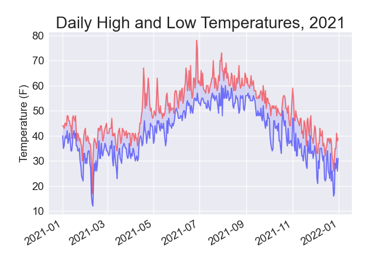
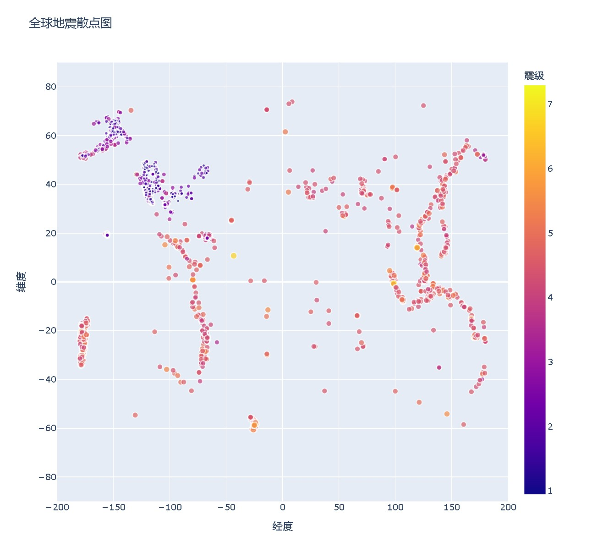

## 折线图

```python
import matplotlib.pyplot as plt

squares = [1, 4, 9, 16, 25, 36]

fig, ax = plt.subplots()
ax.plot(squares)

plt.show()
```

```python
import matplotlib.pyplot as plt

squares = [1, 4, 9, 16, 25, 36]

fig, ax = plt.subplots()
ax.plot(squares, linewidth=3)

ax.set_title('Squares Numbers')
ax.set_xlabel("Value", fontsize=14)
ax.set_ylabel("Square of Value", fontsize=14)

ax.tick_params(labelsize=14)

plt.show()
```

##  随机游走图（点图）

```python
import matplotlib.pyplot as plt
from random import choice

class RandomWalk:
    def __init__(self, nun_points=5000):
        self.num_points = nun_points

        self.x_values = [0]
        self.y_values = [0]

    def fill_walk(self):
        while len(self.x_values) < self.num_points:
            x_direction = choice([-1, 1])
            x_distance = choice([0 ,1 ,2, 3, 4])
            x_step = x_direction * x_distance

            y_direction = choice([-1, 1])
            y_distance = choice([0, 1, 2, 3, 4])
            y_step = y_direction * y_distance

            if x_step == 0 and y_step == 0:
                continue

            x = self.x_values[-1] + x_step
            y = self.y_values[-1] + y_step
            self.x_values.append(x)
            self.y_values.append(y)

while True:
    rw = RandomWalk()
    rw.fill_walk()

    fig, ax = plt.subplots()
    point_number = range(rw.num_points)
    ax.scatter(rw.x_values, rw.y_values, c=point_number, cmap=plt.cm.get_cmap('Blues'), edgecolors='none' ,s=15)
    ax.set_aspect('equal')      # 指定两条轴上的间距必须相等

    ax.scatter(rw.x_values[0], rw.y_values[0], c='green', edgecolors='none' ,s=100)
    ax.scatter(rw.x_values[-1], rw.y_values[-1], c='red', edgecolors='none' ,s=100)


    plt.show()
    keep_running = input('是否继续? Y/N')
    if keep_running == 'Y':
        continue
    elif keep_running == 'N':
        break
```

## 隐藏坐标轴

```python
ax.get_xaxis().set_visible(False)
ax.get_yaxis().set_visible(False)
```

##  直方图

```python
from random import randint
import plotly.express as px

class Die:
    def __init__(self, num_sides=6):
        self.num_sides = num_sides

    def roll(self):
        return randint(1, self.num_sides)

die_1 = Die()
die_2 = Die()

results = []
for roll_num in range(1000):
    result = die_1.roll() + die_2.roll()
    results.append(result)

frequencies = []
max_result = die_1.num_sides + die_2.num_sides
poss_result = range(2, max_result)
for num in poss_result:
    frequence = results.count(num)
    frequencies.append(frequence)

title = '1000次丢两颗骰子统计'
labels = {'x':'Result', 'y':'Frequency of Result'}
fig = px.bar(x=poss_result, y=frequencies, title=title, labels=labels)
fig.update_layout(xaxis_dtick=1)
fig.show()
```

保存图形：

```
fig.write_html('文件路径')
```

##  温度图：

```python
from pathlib import Path
import csv
import matplotlib.pyplot as plt
from datetime import datetime

path = Path("resource/weather_data/sitka_weather_2021_simple.csv")
lines = path.read_text().splitlines()

reader = csv.reader(lines)
header_row= next(reader)
print(header_row)

for index, column_header in enumerate(header_row):
    print(index, column_header)

# 提取每日最高温度
dates, highs, lows = [], [], []
for row in reader:
    current_date = datetime.strptime(row[2], '%Y-%m-%d')
    try:
        high = int(row[4])
        low = int(row[5])
    except ValueError:
        print(f"Missing data for {current_date}")
    else:
        dates.append(current_date)
        highs.append(high)
        lows.append(low)

plt.style.use('seaborn-v0_8')
fig, ax = plt.subplots()
ax.plot(dates, highs, color='red', alpha=0.5)
ax.plot(dates, lows, color='blue', alpha=0.5)
ax.fill_between(dates, highs, lows, facecolor='blue', alpha=0.1)     # 给图中区域着色

ax.set_title("Daily High and Low Temperatures, 2021", fontsize=24)
ax.set_xlabel("", fontsize=16)
ax.set_ylabel("Temperature (F)", fontsize=16)
ax.tick_params(labelsize=16)

fig.autofmt_xdate()     # 绘制倾斜的⽇期标签，以免他们彼此重叠

plt.show()
```



##  地震分布图

```python
from pathlib import Path
import json
import plotly.express as px
import pandas as pd

path = Path('resource/eq_data/eq_data_30_day_m1.geojson')
try:
    contents = path.read_text()
except:
    contents = path.read_text(encoding='utf-8')
all_eq_data = json.loads(contents)

all_eq_dicts = all_eq_data['features']
print(len(all_eq_dicts))

# path = Path('resource/eq_data/readable_eq_data.geojson')
# readable_contents = json.dumps(all_eq_data, indent=4)   # indent 为嵌套元素缩进量
# path.write_text(readable_contents)


mags = [eq_dict['properties']['mag'] for eq_dict in all_eq_dicts]
titles = [eq_dict['properties']['title'] for eq_dict in all_eq_dicts]
lons = [eq_dict['geometry']['coordinates'][0] for eq_dict in all_eq_dicts]
lats = [eq_dict['geometry']['coordinates'][1] for eq_dict in all_eq_dicts]

data = pd.DataFrame(
    data=zip(lons, lats, titles, mags), columns=['经度', '维度', '位置', '震级']
)
data.head()

fig = px.scatter(
    data,
    x='经度',
    y='维度',
    labels={'x':'经度', 'y':'维度'},
    range_x = [-200, 200],
    range_y = [-90, 90],
    width=800,
    height=800,
    title='全球地震散点图',
    size='震级',
    size_max=10,
    color='震级',
    hover_name='位置',
)
fig.write_html('resource/eq_data/global_earthquakes.html')
fig.show()
```



