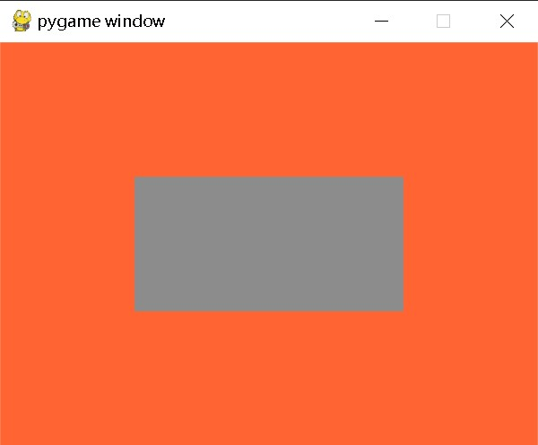

---
Color类
---

## class pygame.Color

Pygame 中用于描述颜色的对象。

Color(name) -> Color

Color(r, g, b, a) -> Color

Color(rgbvalue) -> Color

---

## 方法 & 属性

- pygame.Color.r — 获取或设置 Color 对象的红色值
- pygame.Color.g — 获取或设置 Color 对象的绿色值
- pygame.Color.b — 获取或设置 Color 对象的蓝色值
- pygame.Color.a — 获取或设置 Color 对象的 alpha 值
- pygame.Color.cmy — 获取或设置 Color 对象表示的 CMY 值
- pygame.Color.hsva — 获取或设置 Color 对象表示的 HSVA 值
- pygame.Color.hsla — 获取或设置 Color 对象表示的 HSLA 值
- pygame.Color.i1i2i3 — 获取或设置 Color 对象表示的 I1I2I3 值
- pygame.Color.normalize() — 返回 Color 对象的标准化 RGBA 值
- pygame.Color.correct_gamma() — 应用一定的伽马值调整 Color 对象
- pygame.Color.set_length() — 设置 Color 对象的长度（成员数量）
- pygame.Color.grayscale()  — 返回颜色的灰度
- pygame.Color.lerp() — 返回给定颜色的线性插值
- pygame.Color.premul_alpha() — 返回 r、g、b 分量已与 alpha 相乘的颜色
- pygame.Color.update() — 设置颜色的元素

Pygame 使用 Color 类表示 RGBA 颜色值，每个颜色值的取值范围是 0 ~ 255。允许通过基本的算术运算创造新的颜色值，支持转换为其他颜色空间，例如 HSV 或 HSL，并让你调整单个颜色通道。当没有给出 alpha 的值是，默认是 255（不透明）。

“RGB值”可以是一个颜色名，一个 HTML 颜色格式的字符串，一个 16 进制数的字符串，或者一个整型像素值。HTML 格式是 "#rrggbbaa"，其中 "rr"，"gg"，"bb"，"aa" 都是 2 位的 16 进制数。代表 alpha 的 "aa" 是可选的。16 进制数的字符串组成形式为 "0xrrggbbaa"，当然，其中的 "aa" 也是可选的。

Pygame 1.9.0 之后，颜色对象支持与其他颜色对象进行等值比较（3 或 4 整型元组）。

在 Pygame 1.8.1 中有一个 bug，就是 alpha 的默认值被设置为 0，而不是 255。

Color 对象采用 C 级别的接口输出。输出为只读的一维无符号字节数组，分配与 color 对象相同的长度。对于 CPython 2.6 以后的版本，新的缓冲区接口（与数组接口具有相同的特性）也会被输出。Pygame 1.9.2 新增加的。

Color 的新实现在 Pygame 1.8.1 中完成。

---

## 方法 & 属性详解

### r

获取或设置 Color 对象的红色值。

r -> int

Color 对象的红色值。

### g

获取或设置 Color 对象的绿色值。

g -> int

Color 对象的绿色值。

### b

获取或设置 Color 对象的蓝色值。

b -> int

Color 对象的蓝色值。

### a

获取或设置 Color 对象的 alpha 值。

a -> int

Color 对象的 alpha 值（透明度）。

### cmy

获取或设置 Color 对象表示的 CMY 值。

cmy -> tuple

Color 对象表示的 CMY 值。CMY 每个分量的范围是 C = [0, 1]，M = [0, 1]，Y = [0, 1]。

注意：由于 RGB 值应设为 0 ~ 255，而 CMY 值为 0 ~ 1，因此无法绝对准确地返回所有 RGB 值对应的 CMY 值，会有少许偏差。

温馨提示：CMY 是青（Cyan）、洋红或品红（Magenta）和黄（Yellow）三种颜色的简写，是相减混色模式，用这种方法产生的颜色之所以称为相减色，乃是因为它减少了为视觉系统识别颜色所需要的反射光。由于彩色墨水和颜料的化学特性，用三种基本色得到的黑色不是纯黑色，因此在印刷术中，常常加一种真正的黑色（black ink），这种模型称为 CMYK 模型，广泛应用于印刷术。每种颜色分量的取值范围为0~100；CMY常用于纸张彩色打印方面。

### hsva

获取或设置 Color 对象表示的 HSVA 值。

hsva -> tuple

Color 对象表示的 HSVA 值。HSVA 每个分量的范围是 H = [0, 360]，S = [0, 100]，V = [0, 100]，A = [0, 100]。

注意：由于 RGB 值应设为 0 ~ 255，而 HSV 值为 0 ~ 100 和 0 ~ 360，因此无法绝对准确地返回所有 RGB 值对应的 HSV 值，会有少许偏差。

温馨提示：HSV 色彩模型中颜色的参数分别是：色调（H），饱和度（S），亮度（V）。RGB 和 CMY 颜色模型都是面向硬件的，而 HSV（Hue Saturation Value）颜色模型是面向用户的。HSV 模型的三维表示从 RGB 立方体演化而来。设想从 RGB 沿立方体对角线的白色顶点向黑色顶点观察，就可以看到立方体的六边形外形。六边形边界表示色彩，水平轴表示纯度，明度沿垂直轴测量。

### hsla

获取或设置 Color 对象表示的 HSLA 值。

hsla -> tuple

Color 对象表示的 HSLA 值。HSLA 每个分量的范围是 H = [0, 360]，S = [0, 1]，L = [0, 1]，A = [0, 1]。

注意：由于 RGB 值应设为 0 ~ 255，而 HSL 值为 0 ~ 1 和 0 ~ 360，因此无法绝对准确地返回所有 RGB 值对应的 HSL 值，会有少许偏差。

温馨提示：HSL 色彩模型是工业界的一种颜色标准，是通过对色相（H）、饱和度（S）、明度（L）三个颜色通道的变化以及它们相互之间的叠加来得到各式各样的颜色的，HSL 即是代表色相，饱和度，明度三个通道的颜色，这个标准几乎包括了人类视力所能感知的所有颜色，是目前运用最广的颜色系统之一。

### i1i2i3

获取或设置 Color 对象表示的 I1I2I3 值。

Color 对象表示的 I1I2I3 值。I1I2I3 每个分量的范围是 I1 = [0, 1]，I2 = [-0.5, 0.5]，I3 = [-0.5, 0.5]。

注意：由于 RGB 值应设为 0 ~ 255，而 I1I2I3 值为 0 ~ 1 和 -0.5 ~ 0.5，因此无法绝对准确地返回所有 RGB 值对应的 I1I2I3 值，会有少许偏差。

温馨提示：I1I2I3 是与 RGB 类似的颜色空间，转化公式为：I1 = (R + G + B) / 3，I2 = (G - B) / 2，I3 = (2G - R - B) / 4。

### normalize()

返回 Color 对象的标准化 RGBA 值。

normalize() -> tuple

返回 Color 对象的标准化 RGBA 值。每个分量的值是浮点数表示。

温馨提示：但这里每个分量的值不是整数范围 0 ~ 255，而是转化为浮点数范围 0 ~ 1。

### correct_gamma()

应用一定的伽马值调整 Color 对象。

correct_gamma (gamma) -> Color

应用一定的伽马值调整 Color 对象，并返回调整后的 RGBA 值。

### set_length()

设置 Color 对象的长度（成员数量）。

set_length(len) -> None

默认值是 4，它可以被设置为 1，2，3 或 4。这对于解压为 r，g，b 而不是 r，g，b，a 很有用。如果你希望得到一个 Color 对象的长度，你可以使用 len(color) 获得。

温馨提示：color.set_length(2) 它只是修改了 **len**()，而不是真的把其中两个成员扔掉……

### grayscale()

用于将颜色转换为灰度值的方法。这个方法可以帮助你快速得到一个给定颜色的灰度表示。

grayscale() -> Color

示例：

```python
import pygame
import sys

# 初始化 Pygame
pygame.init()

# 设置显示窗口
screen = pygame.display.set_mode((400, 300))
clock = pygame.time.Clock()

# 定义一种颜色
color = pygame.Color(255, 100, 50)  # 一个红色偏橙的颜色

while True:
    for event in pygame.event.get():
        if event.type == pygame.QUIT:
            pygame.quit()
            sys.exit()

    # 将颜色转换为灰度
    grayscale_color = color.grayscale()

    # 用原始颜色填充屏幕
    screen.fill(color)

    # 在屏幕上绘制灰度颜色的矩形
    pygame.draw.rect(screen, grayscale_color, (100, 100, 200, 100))

    # 更新显示
    pygame.display.flip()
    clock.tick(60)  # 限制帧率为 60 FPS
```

结果：



### **lerp**()

用于在两个颜色之间进行线性插值的方法。这对于创建渐变、过渡或平滑的颜色变化动画非常有用。

lerp(Color, float) -> Color

- **color**: 一个 `pygame.Color` 对象，表示你想要插值到的目标颜色。

- factor: 一个介于 0 和 1 之间的浮点数，决定插值的程度：

  - `0` 返回原始颜色。
  - `1` 返回目标颜色。
  - 在 `0` 和 `1` 之间的值返回两者颜色的混合。

  示例：

  ```python
  import pygame
  import sys
  
  # 初始化 Pygame
  pygame.init()
  
  # 设置显示窗口
  screen = pygame.display.set_mode((400, 300))
  clock = pygame.time.Clock()
  
  # 定义两种颜色
  color1 = pygame.Color(255, 0, 0)  # 红色
  color2 = pygame.Color(0, 0, 255)  # 蓝色
  
  # 插值因子
  factor = 0.0
  
  while True:
      for event in pygame.event.get():
          if event.type == pygame.QUIT:
              pygame.quit()
              sys.exit()
  
      # 随时间增加因子
      factor += 0.01
      if factor > 1:
          factor = 0  # 重置因子以实现循环
  
      # 获取插值颜色
      interpolated_color = color1.lerp(color2, factor)
  
      # 用插值颜色填充屏幕
      screen.fill(interpolated_color)
  
      # 更新显示
      pygame.display.flip()
      clock.tick(60)  # 限制帧率为 60 FPS
  ```

  ### premul_alpha()

  ​		用于将颜色的 RGB 组件与其 Alpha 透明度进行预乘的一个方法。预乘操作通常用于处理带有透明度的图形，以便在渲染时更有效地合成颜色。

  premul_alpha() -> Color

  示例：

  ```python
  import pygame
  import sys
  
  # 初始化 Pygame
  pygame.init()
  
  # 设置显示窗口
  screen = pygame.display.set_mode((400, 300))
  clock = pygame.time.Clock()
  
  # 定义一种颜色和透明度
  color = pygame.Color(255, 0, 0, 128)  # 半透明红色
  
  # 预乘 Alpha
  premultiplied_color = color.premul_alpha()
  
  while True:
      for event in pygame.event.get():
          if event.type == pygame.QUIT:
              pygame.quit()
              sys.exit()
  
      # 用原始颜色填充屏幕
      screen.fill(color)  # 填充白色背景
  
      # 在屏幕上绘制预乘的颜色
      pygame.draw.rect(screen, premultiplied_color, (100, 100, 200, 100))
  
      # 更新显示
      pygame.display.flip()
      clock.tick(60)  # 限制帧率为 60 FPS
  ```

  结果：

  

### update()

用于更新颜色对象的一个方法。你可以使用这个方法来改变现有 `pygame.Color` 对象的颜色值，包括其红色、绿色、蓝色和透明度（Alpha）分量。

update(r, g, b) -> None

update(r, g, b, a=255) -> None

update(color_value) -> None

示例

```python
import pygame
import sys

# 初始化 Pygame
pygame.init()

# 设置显示窗口
screen = pygame.display.set_mode((400, 300))
clock = pygame.time.Clock()

# 创建初始颜色
color = pygame.Color(100, 150, 200)

while True:
    for event in pygame.event.get():
        if event.type == pygame.QUIT:
            pygame.quit()
            sys.exit()

        # 按键事件更新颜色
        if event.type == pygame.KEYDOWN:
            if event.key == pygame.K_r:  # 按 R 键更新为红色
                color.update(255, 0, 0)
            elif event.key == pygame.K_g:  # 按 G 键更新为绿色
                color.update(0, 255, 0)
            elif event.key == pygame.K_b:  # 按 B 键更新为蓝色
                color.update(0, 0, 255)
            elif event.key == pygame.K_a:  # 按 A 键更新为半透明
                color.update(100, 100, 100, 128)

    # 用当前颜色填充屏幕
    screen.fill((255, 255, 255))  # 填充白色背景
    pygame.draw.rect(screen, color, (100, 100, 200, 100))

    # 更新显示
    pygame.display.flip()
    clock.tick(60)  # 限制帧率为 60 FPS
```

---

## 参考文献

https://www.pygame.org/docs/ref/color.html

https://www.kancloud.cn/lchy0987/pydic/3060853

chatgpt