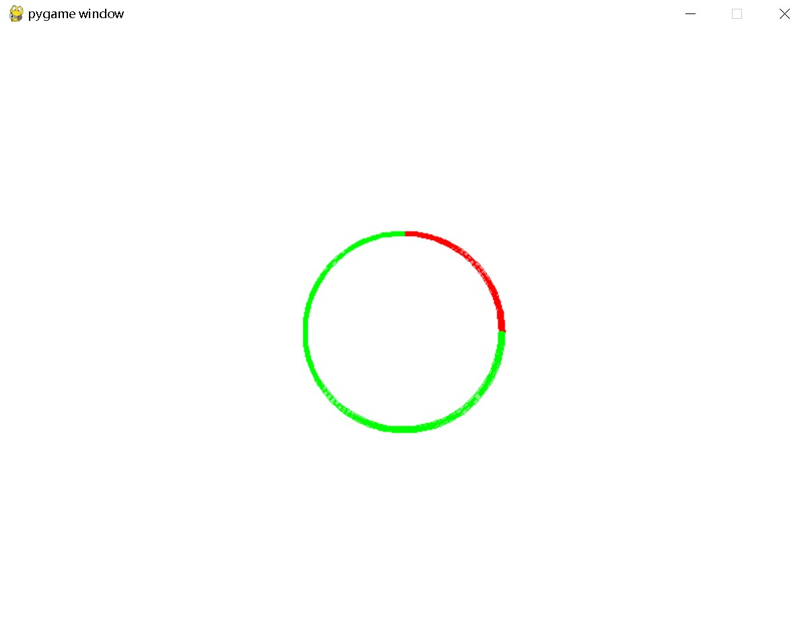
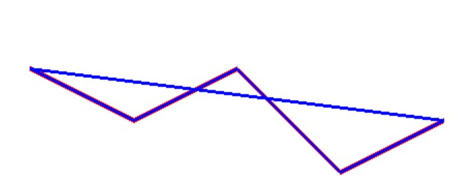
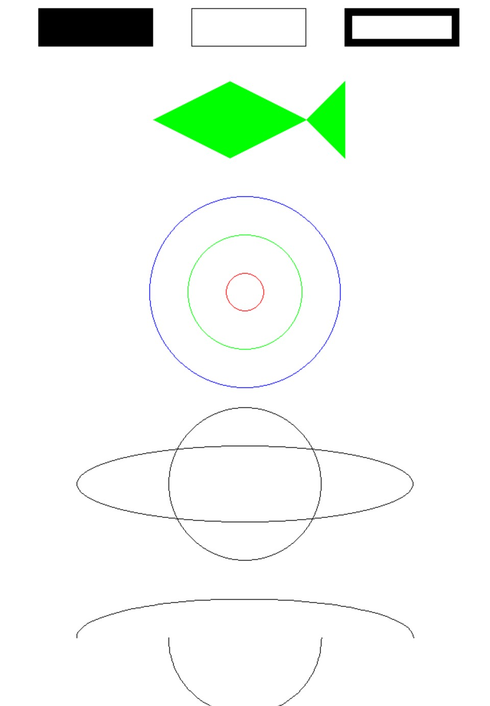

---
draw 模块
---

## **pygame.draw**

Pygame 中绘制图形的模块。

---

## **函数**

- pygame.draw.rect() — 绘制矩形
- pygame.draw.polygon() — 绘制多边形
- pygame.draw.circle() — 根据圆心和半径绘制圆形
- pygame.draw.ellipse() — 根据限定矩形绘制一个椭圆形
- pygame.draw.arc() — 绘制弧线
- pygame.draw.line() — 绘制线段
- pygame.draw.lines() — 绘制多条连续的线段
- pygame.draw.aaline() — 绘制抗锯齿的线段
- pygame.draw.aalines() — 绘制多条连续的线段（抗锯齿）

该模块用于在 Surface 对象上绘制一些简单的形状。这些函数将渲染到任何格式的 Surface 对象上。硬件渲染会比普通的软件渲染更耗时。

大部分函数用 width 参数指定图形边框的大小，如果 width = 0 则表示填充整个图形。

所有的绘图函数仅能在 Surface 对象的剪切区域生效。这些函数返回一个 Rect，表示包含实际绘制图形的矩形区域。

大部分函数都有一个 color 参数，传入一个表示 RGB 颜色值的三元组，当然也支持 RGBA 四元组。其中的 A 是 Alpha 的意思，用于控制透明度。不过该模块的函数并不会绘制透明度，而是直接传入到对应 Surface 对象的 pixel alphas 中。color 参数也可以是已经映射到 Surface 对象的像素格式中的整型像素值。

当这些函数在绘制时，必须暂时锁定 Surface 对象。许多连续绘制的函数可以通过一次性锁定直到画完再解锁来提高效率。

## **函数详解**

### **pygame.draw.rect()**

绘制矩形。

rect(Surface, color, Rect, width=0) -> Rect

- `surface`: 目标表面（例如窗口或图像），矩形将被绘制在此表面上。
- `color`: 矩形的颜色，可以是 RGB 元组，如 `(255, 0, 0)` 表示红色。
- `Rect`: 一个四元组 `(x, y, width, height)`，表示矩形的位置和大小，其中 `(x, y)` 是矩形的左上角坐标。也可以是一个Rect对象。
- `width`: 矩形边框的宽度。如果设置为 `0`，将绘制一个填充的矩形；如果设置为正数，则绘制一个边框矩形。

### **pygame.draw.polygon()**

绘制多边形。

polygon(Surface, color, pointlist, width=0) -> Rect

在 Surface 对象上绘制一个多边形。pointlist 参数指定多边形的各个顶点（元组或列表）。width 参数指定边框的宽度，如果设置为 0 则表示填充该矩形。

### **pygame.draw.circle()**

根据圆心和半径绘制圆形。

circle(Surface, color, pos, radius, width=0) -> Rect

在 Surface 对象上绘制一个圆形。pos 参数指定圆心的位置，radius 参数指定圆的半径。width 参数指定边框的宽度，如果设置为 0 则表示填充该矩形。

示例：

```python
import pygame
import sys

# 初始化 Pygame
pygame.init()

# 创建一个窗口
screen = pygame.display.set_mode((800, 600))

# 定义颜色
RED = (255, 0, 0)
GREEN = (0, 255, 0)

# 主循环
while True:
    for event in pygame.event.get():
        if event.type == pygame.QUIT:
            pygame.quit()
            sys.exit()

    # 填充背景色
    screen.fill((255, 255, 255))  # 白色背景

    # 绘制填充圆
    pygame.draw.circle(screen, RED, (400, 300), 100)  # 红色填充圆

    # 绘制边框圆
    pygame.draw.circle(screen, GREEN, (400, 300), 150, width=5)  # 绿色边框圆

    # 更新显示
    pygame.display.flip()
```

### **pygame.draw.ellipse()**

根据限定矩形绘制一个椭圆形。

ellipse(Surface, color, Rect, width=0) -> Rect

在 Surface 对象上绘制一个椭圆形。Rect 参数指定椭圆外围的限定矩形。width 参数指定边框的宽度，如果设置为 0 则表示填充该矩形。

### **pygame.draw.arc()**

绘制弧线。

arc(Surface, color, Rect, start_angle, stop_angle, width=1) -> Rect

在 Surface 对象上绘制一条弧线。Rect 参数指定弧线所在的椭圆外围的限定矩形。两个 angle 参数指定弧线的开始和结束位置。width 参数指定边框的宽度。

示例：

```python
import pygame
import sys
import math

# 初始化 Pygame
pygame.init()

# 创建一个窗口
screen = pygame.display.set_mode((800, 600))

# 定义颜色
RED = (255, 0, 0)
GREEN = (0, 255, 0)

# 主循环
while True:
    for event in pygame.event.get():
        if event.type == pygame.QUIT:
            pygame.quit()
            sys.exit()

    # 填充背景色
    screen.fill((255, 255, 255))  # 白色背景

    # 绘制圆弧
    rect = (300, 200, 200, 200)  # 定义圆弧的边界矩形
    start_angle = 0  # 起始角度（弧度）
    stop_angle = math.pi / 2  # 结束角度（弧度）

    # 绘制红色圆弧
    pygame.draw.arc(screen, RED, rect, start_angle, stop_angle, width=5)

    # 绘制绿色圆弧
    pygame.draw.arc(screen, GREEN, rect, stop_angle, 2 * math.pi, width=5)  # 绘制从90°到360°

    # 更新显示
    pygame.display.flip()
```

结果：



### **pygame.draw.line()**

绘制线段。

line(surface, color, start_pos, end_pos, width=1)-> Rect

- `surface`: 目标表面（例如窗口或图像），直线将被绘制在该表面上。
- `color`: 直线的颜色，可以是 RGB 元组，例如 `(255, 0, 0)` 表示红色。
- `start_pos`: 直线的起始位置，格式为 `(x, y)`。
- `end_pos`: 直线的结束位置，格式为 `(x, y)`。
- `width`: 直线的宽度，默认为 `1`。

在 Surface 对象上绘制一条线段。两端以方形结束。

### **pygame.draw.lines()**

绘制多条连续的线段。

lines(surface, color, closed, pointlist, width=1) -> Rect

- `surface`: 目标表面（例如窗口或图像），折线将被绘制在该表面上。
- `color`: 线条的颜色，可以是 RGB 元组，例如 `(255, 0, 0)` 表示红色。
- `closed`: 一个布尔值，指定是否闭合线段。如果为 `True`，则最后一个点将与第一个点连接。
- `pointlist`: 一个包含多个点的列表，每个点的格式为 `(x, y)`。
- `width`: 线条的宽度，默认为 `1`。

在 Surface 对象上绘制一系列连续的线段。pointlist 参数是一系列短点。如果 closed 参数设置为 True，则绘制首尾相连。

示例：

```python
import pygame
import sys

# 初始化 Pygame
pygame.init()

# 创建一个窗口
screen = pygame.display.set_mode((800, 600))

# 定义颜色
RED = (255, 0, 0)
BLUE = (0, 0, 255)

# 点列表
points = [(100, 100), (200, 150), (300, 100), (400, 200), (500, 150)]

# 主循环
while True:
    for event in pygame.event.get():
        if event.type == pygame.QUIT:
            pygame.quit()
            sys.exit()

    # 填充背景色
    screen.fill((255, 255, 255))  # 白色背景

    # 绘制折线
    pygame.draw.lines(screen, RED, False, points, width=5)  # 非闭合折线
    pygame.draw.lines(screen, BLUE, True, points, width=3)   # 闭合折线

    # 更新显示
    pygame.display.flip()
```

结果：



### **pygame.draw.aaline()**

绘制抗锯齿的线段。

aaline(surface, color, start_pos, end_pos) -> Rect

aaline(surface, color, start_pos, end_pos, blend=1) -> Rect

- `surface`: 目标表面（例如窗口或图像），直线将被绘制在该表面上。
- `color`: 直线的颜色，可以是 RGB 元组，例如 `(255, 0, 0)` 表示红色。
- `start_pos`: 直线的起始位置，格式为 `(x, y)`。
- `end_pos`: 直线的结束位置，格式为 `(x, y)`。
- `blend`: 控制抗锯齿效果的参数，取值范围为 `0` 到 `1`，默认值为 `1`。`1` 表示使用抗锯齿效果，`0` 则表示不使用。

在 Surface 对象上绘制一条抗锯齿的线段。blend 参数指定是否通过绘制混合背景的阴影来实现抗锯齿功能。该函数的结束位置允许使用浮点数。

### **pygame.draw.aalines()**

绘制多条连续的线段（抗锯齿）。

aalines(surface, color, closed, points) -> Rect

aalines(surface, color, closed, points, blend=1) -> Rect

- `surface`: 目标表面（例如窗口或图像），折线将被绘制在该表面上。
- `color`: 折线的颜色，可以是 RGB 元组，例如 `(255, 0, 0)` 表示红色。
- `closed`: 一个布尔值，指定是否闭合线段。如果为 `True`，则最后一个点将与第一个点连接。
- `pointlist`: 一个包含多个点的列表，每个点的格式为 `(x, y)`。
- `blend`: 控制抗锯齿效果的参数，取值范围为 `0` 到 `1`。`1` 表示使用抗锯齿效果，`0` 则表示不使用。

在 Surface 对象上绘制一系列连续的线段（抗锯齿）。如果 closed 参数为 True，则首尾相连。blend 参数指定是否通过绘制混合背景的阴影来实现抗锯齿功能。该函数的结束位置允许使用浮点数。

---

## 示例

```python
import pygame
import sys
import math
from pygame.locals import *
pygame.init()
WHITE = (255, 255, 255)
BLACK = (0, 0, 0)
GREEN = (0, 255, 0)
RED = (255, 0, 0)
BLUE = (0, 0, 255)
points = [(200, 175), (300, 125), (400, 175), (450, 125), (450, 225), (400, 175), (300, 225)]
size = width, height = 640, 1000
screen = pygame.display.set_mode(size)
pygame.display.set_caption("Python Demo")
clock = pygame.time.Clock()
while True:
    for event in pygame.event.get():
        if event.type == QUIT:
            sys.exit()
    screen.fill(WHITE)
    pygame.draw.rect(screen, BLACK, (50, 30, 150, 50), 0)
    pygame.draw.rect(screen, BLACK, (250, 30, 150, 50), 1)
    pygame.draw.rect(screen, BLACK, (450, 30, 150, 50), 10)
    pygame.draw.polygon(screen, GREEN, points, 0)
    pygame.draw.circle(screen, RED, (320, 400), 25, 1)
    pygame.draw.circle(screen, GREEN, (320, 400), 75, 1)
    pygame.draw.circle(screen, BLUE, (320, 400), 125, 1)
    pygame.draw.ellipse(screen, BLACK, (100, 600, 440, 100), 1)
    pygame.draw.ellipse(screen, BLACK, (220, 550, 200, 200), 1)
    pygame.draw.arc(screen, BLACK, (100, 800, 440, 100), 0, math.pi, 1)
    pygame.draw.arc(screen, BLACK, (220, 750, 200, 200), math.pi, math.pi * 2, 1)
    pygame.display.flip()
    clock.tick(10)
```

结果：


---

## 参考文献

https://www.pygame.org/docs/ref/draw.html#pygame.draw.line

 https://www.kancloud.cn/lchy0987/pydic/3060855

chatgpt