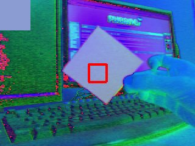
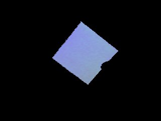
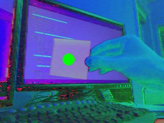

---
camera 模块
---

# pygame.camera

用于相机使用的 pygame 模块。

Pygame 目前原生支持 Linux（V4L2）和 Windows（MSMF）摄像头，并通过集成的 OpenCV 后端提供更广泛的平台支持。

在 Pygame 2.0.2 中新增：Windows 原生摄像头支持

在 Pygame 2.0.3 中新增：新的 OpenCV 后端

**实验性！**：此 API 可能在后续的 Pygame 版本中发生变化或消失。如果使用此 API，您的代码很可能会在下一个 Pygame 版本中中断。

---

# 函数 & 类

| 函数 & 类                                                    | 描述                 |
| ------------------------------------------------------------ | -------------------- |
| [pygame.camera.init](https://www.pygame.org/docs/ref/camera.html#pygame.camera.init) | 模块初始化           |
| [pygame.camera.get_backends](https://www.pygame.org/docs/ref/camera.html#pygame.camera.get_backends) | 获取该系统支持的后端 |
| [pygame.camera.colorspace](https://www.pygame.org/docs/ref/camera.html#pygame.camera.colorspace) | 表面颜色空间转换。   |
| [pygame.camera.list_cameras](https://www.pygame.org/docs/ref/camera.html#pygame.camera.list_cameras) | 返回可用相机的列表。 |
| [pygame.camera.Camera](https://www.pygame.org/docs/ref/camera.html#pygame.camera.Camera) | 加载相机的类         |

---

# 函数详解

## pygame.camera.**init**()

模块初始化

init(backend = None) -> None

此函数启动摄像头模块，选择系统上能够找到的最佳网络摄像头后端。并不保证一定成功，并且可能会尝试导入第三方模块，例如 OpenCV。如果您想覆盖其后端选择，可以将所需后端的名称传递给此函数。有关后端的更多信息，请参见 [`get_backends()`](https://www.pygame.org/docs/ref/camera.html#pygame.camera.get_backends)。

*在 pygame 2.0.3 中更改：* 可以显式选择后端的选项。

## pygame.camera.**get_backends**()

获取该系统支持的后端

get_backends() -> [str]

此函数返回它认为在您的系统上有可能工作的所有后端，并按优先级排序。

Pygame 摄像头后端：

```
Backend           OS        Description
---------------------------------------------------------------------------------
_camera (MSMF)    Windows   内置，可在 Windows 8+ Python3 上运行
_camera (V4L2)    Linux     内置
OpenCV            Any       使用 `opencv-python` 模块，无法枚举摄像机
OpenCV-Mac        Mac       与 OpenCV 相同，但具有摄像机枚举功能
VideoCapture      Windows   使用废弃的 “VideoCapture ”模块，无法枚举摄像机，将来可能被移除
```

后端之间有两个主要区别。

首先，**_camera 后端**是内置于 pygame 自身的，不需要第三方导入。其他所有后端都需要第三方模块。例如，OpenCV 和 VideoCapture 后端需要在您的系统上安装相应的模块。

另一个主要区别是“摄像头枚举”。一些后端无法列出摄像头名称，甚至无法显示系统上的摄像头数量。在这些情况下，[`list_cameras()`](https://www.pygame.org/docs/ref/camera.html#pygame.camera.list_cameras) 将返回类似 `[0]` 的结果。如果您知道系统上有多个摄像头，则可以通过将其作为 `device` 参数使用，这些后端端口将传递一个“摄像头索引号”。

*在 pygame 2.0.3 中新增。*

## pygame.camera.**colorspace**()

表面颜色空间转换。

colorspace(Surface, format, DestSurface = None) -> Surface

允许将“RGB”转换为目标颜色空间“HSV”或“YUV”。源和目标表面必须具有相同的大小和像素深度。这对于处理能力有限的设备上的计算机视觉非常有用。尽可能捕获较小的图像，使用 `transform.scale()` 进一步缩小，然后在进行任何处理之前将颜色空间转换为 `YUV` 或 `HSV`。

## pygame.camera.**list_cameras**()

返回可用相机的列表。

list_cameras() -> [cameras]

检查计算机上的可用摄像头，并返回一个字符串列表，包含摄像头名称，准备供 [`pygame.camera.Camera`](https://www.pygame.org/docs/ref/camera.html#pygame.camera.Camera) 加载使用。

如果摄像头后端不支持网络摄像头枚举，则将返回类似 `[0]` 的结果。有关更多信息，请参见 [`get_backends()`](https://www.pygame.org/docs/ref/camera.html#pygame.camera.get_backends)。

----

# **Camera** 类

Camera(device, (width, height), format) -> Camera

加载相机

加载摄像头。在 Linux 上，设备通常类似于 "/dev/video0"。默认宽度和高度为 640 x 480。格式是输出的目标颜色空间，这对于计算机视觉非常有用。默认颜色空间是 RGB。支持的颜色空间包括：

- **RGB** - 红色、绿色、蓝色
- **YUV** - 亮度（Luma）、蓝色色度（Blue Chrominance）、红色色度（Red Chrominance）
- **HSV** - 色相（Hue）、饱和度（Saturation）、明度（Value）

## 方法

| 方法                                                         | 描述                                 |
| ------------------------------------------------------------ | ------------------------------------ |
| [pygame.camera.Camera.start](https://www.pygame.org/docs/ref/camera.html#pygame.camera.Camera.start) | 打开、初始化并开始捕获摄像头视频流。 |
| [pygame.camera.Camera.stop](https://www.pygame.org/docs/ref/camera.html#pygame.camera.Camera.stop) | 停止、反初始化并关闭摄像头。         |
| [pygame.camera.Camera.get_controls](https://www.pygame.org/docs/ref/camera.html#pygame.camera.Camera.get_controls) | 获取用户控制的当前值。               |
| [pygame.camera.Camera.set_controls](https://www.pygame.org/docs/ref/camera.html#pygame.camera.Camera.set_controls) | 如果摄像头支持，改变摄像头设置。     |
| [pygame.camera.Camera.get_size](https://www.pygame.org/docs/ref/camera.html#pygame.camera.Camera.get_size) | 返回正在录制的图像的尺寸。           |
| [pygame.camera.Camera.query_image](https://www.pygame.org/docs/ref/camera.html#pygame.camera.Camera.query_image) | 检查帧是否准备好。                   |
| [pygame.camera.Camera.get_image](https://www.pygame.org/docs/ref/camera.html#pygame.camera.Camera.get_image) | 将图像捕获为一个 Surface。           |
| [pygame.camera.Camera.get_raw](https://www.pygame.org/docs/ref/camera.html#pygame.camera.Camera.get_raw) | 返回未修改的图像作为字节数据。       |

---

## 方法详解

### **start**()

打开、初始化并开始捕获摄像头视频流。

start() -> None

打开摄像头设备，尝试初始化，并开始将图像录制到缓冲区。在使用以下任何函数之前，必须先启动摄像头。

### **stop**()

停止、反初始化并关闭摄像头。

stop() -> None

停止录制，反初始化摄像头并关闭它。一旦摄像头被停止，以下函数在重新启动之前无法使用。

### **get_controls**()

获取用户控制的当前值。

get_controls() -> (hflip = bool, vflip = bool, brightness)

如果摄像头支持，`get_controls` 将返回当前的水平和垂直图像翻转设置（以布尔值表示）以及亮度（以整数表示）。如果不支持，将返回默认值 (0, 0, 0)。请注意，这里的返回值可能与 `set_controls` 返回的值不同，但更可能是正确的。

### **set_controls**()

如果摄像头支持，改变摄像头设置。

set_controls(hflip = bool, vflip = bool, brightness) -> (hflip = bool, vflip = bool, brightness)

允许您更改摄像头设置（如果摄像头支持）。如果摄像头声称成功，返回值将是输入值；如果未成功，则返回先前使用的值。每个参数都是可选的，可以通过提供关键字来选择所需的参数，例如 `hflip`。请注意，摄像头实际使用的设置可能与 `set_controls` 返回的值不同。在 Windows 上，`hflip` 和 `vflip` 由 Pygame 实现，而非摄像头，因此它们应该始终有效，但 `brightness` 不受支持。

### **get_size**()

返回正在录制的图像的尺寸。

get_size() -> (width, height)

返回相机正在捕获的图像的当前尺寸。此方法将返回实际大小，如果相机不支持初始化时指定的大小，则可能与指定的大小不同。

### **query_image**()

检查帧是否准备好。

query_image() -> bool

如果图像准备好获取，则返回 true。否则返回 false。请注意，一些网络摄像头会始终返回 false，只有在使用像 [`get_image()`](https://www.pygame.org/docs/ref/camera.html#pygame.camera.Camera.get_image) 这样的阻塞函数调用时才会排队一个帧。在 Windows（MSMF）和 OpenCV 后端中，[`query_image()`](https://www.pygame.org/docs/ref/camera.html#pygame.camera.Camera.query_image) 应该是可靠的。这对于将游戏的帧率与相机的帧率分开非常有用，而无需使用线程。

### **get_image**()

将图像捕获为一个 Surface。

get_image(Surface = None) -> Surface

从缓冲区提取图像作为 `RGB` 表面。可以选择重用现有的表面以节省时间。该表面的位深度在 Linux 上为 24 位，在 Windows 上为 32 位，或者与可选提供的表面相同。

### **get_raw**()

返回未修改的图像作为字节数据。

get_raw() -> bytes

从相机获取图像，返回为相机的原生像素格式的字符串。此方法对于与其他库的集成非常有用。返回一个字节对象。

----

# 使用示例

## 导入和初始化

```python
import pygame
import pygame.camera
from pygame.locals import *

pygame.init()
pygame.camera.init()
```

由于摄像头模块是可选的，因此需要手动导入和初始化，如上所示。

## 捕获单个图像

现在我们将讨论打开摄像头并捕获帧作为表面的最简单情况。在下面的示例中，我们假设计算机上有一个位于 /dev/video0 的摄像头，并将其初始化为 640x480 的大小。名为 image 的表面是调用 get_image() 时摄像头所看到的内容。

```python
cam = pygame.camera.Camera("/dev/video0",(640,480))
cam.start()
image = cam.get_image()
```

## 列出已连接的相机

您可能会想，如果我们不知道摄像头的确切路径怎么办？我们可以请求模块提供连接到计算机的摄像头列表，并初始化列表中的第一个摄像头。

```python
camlist = pygame.camera.list_cameras()
if camlist:
    cam = pygame.camera.Camera(camlist[0],(640,480))
```

## 使用摄像机控制

大多数摄像头支持控制功能，如翻转图像和调整亮度。可以在调用 `start()` 之后的任何时刻使用 `set_controls()` 和 `get_controls()`。

```python
cam.set_controls(hflip = True, vflip = False)
print camera.get_controls()
```

## 捕获实时流

本教程的其余部分将围绕捕获实时图像流进行。为此，我们将使用下面的类。正如所描述的，它将不断地将摄像头帧绘制到屏幕上，从而有效地显示实时视频。基本上，这就是您所期望的，循环调用 `get_image()`、将图像绘制到显示表面，并进行翻转。出于性能考虑，我们将每次都向摄像头提供相同的表面进行使用。

```python
import pygame
import pygame.camera
from pygame.locals import *

pygame.init()
pygame.camera.init()

class Capture:
    def __init__(self):
        self.size = (640, 480)
        # 创建一个显示表面。标准的 pygame 设置
        self.display = pygame.display.set_mode(self.size, 0)

        # 这与我们之前看到的相同
        self.clist = pygame.camera.list_cameras()
        if not self.clist:
            raise ValueError("抱歉，未检测到摄像头。")
        self.cam = pygame.camera.Camera(self.clist[0], self.size)
        self.cam.start()
        self.cam.set_controls(hflip=True, vflip=False)  # 水平翻转图像

        # 创建一个用于捕获的表面。为了性能考虑
        # 位深度与显示表面的位深度相同。
        self.snapshot = pygame.surface.Surface(self.size, 0, self.display)

    def get_and_flip(self):
        # 如果您不想将帧率与摄像头绑定，可以检查
        # 摄像头是否准备好了图像。请注意，尽管这在大多数摄像头上有效，
        # 但有些摄像头将永远不会返回 true。
        if self.cam.query_image():
            self.snapshot = self.cam.get_image(self.snapshot)

        # 将其绘制到显示表面上。简单！
        self.display.blit(self.snapshot, (0, 0))
        pygame.display.flip()

    def main(self):
        going = True
        while going:
            events = pygame.event.get()
            for e in events:
                if e.type == QUIT or (e.type == KEYDOWN and e.key == K_ESCAPE):
                    # 安全关闭摄像头
                    self.cam.stop()
                    going = False

            self.get_and_flip()

capture = Capture()
capture.main()
```

由于 `get_image()` 是一个阻塞调用，在慢速摄像头上可能需要花费相当长的时间，因此这个示例使用 `query_image()` 来检查摄像头是否准备就绪。这使您可以将游戏的帧率与摄像头的帧率分开。如果您发现摄像头无法正确支持 `query_image()` 函数，也可以通过在单独的线程中捕获图像来获得大致相同的性能提升。

## 基本计算机视觉

通过使用 camera、transform 和 mask 模块，pygame 可以实现一些基本的计算机视觉。

### 色彩空间

在初始化摄像头时，颜色空间是一个可选参数，可以选择 'RGB'、'YUV' 和 'HSV'。通常，YUV 和 HSV 对于计算机视觉来说比 RGB 更有用，因为它们更容易进行颜色阈值处理，这一点我们将在教程后面详细讨论。

```python
self.cam = pygame.camera.Camera(self.clist[0], self.size, "RGB")
```


```python
self.cam = pygame.camera.Camera(self.clist[0], self.size, "YUV")
```


```python
self.cam = pygame.camera.Camera(self.clist[0], self.size, "HSV")
```


### 阈值

使用 `transform` 模块中的 `threshold()` 函数，可以实现简单的绿幕效果或在场景中隔离特定颜色的对象。在下面的示例中，我们只对绿色树木进行阈值处理，使图像的其余部分变为黑色。有关 `threshold()` 函数的详细信息，请查阅参考文档。

```python
self.thresholded = pygame.surface.Surface(self.size, 0, self.display)
self.snapshot = self.cam.get_image(self.snapshot)
pygame.transform.threshold(self.thresholded,self.snapshot,(0,255,0),(90,170,170),(0,0,0),2)
```


当然，这只有在你已经知道要寻找的对象的确切颜色时才有用。为了使阈值处理在现实世界中可用，我们需要添加一个校准阶段，以识别对象的颜色并用它进行阈值处理。我们将使用 `transform` 模块中的 `average_color()` 函数来完成这项工作。下面是一个示例校准函数，你可以在按下某个键等事件之前循环执行，并附上了一个图像示例，展示了它的效果。框内的颜色将用于阈值处理。请注意，下面的图像使用的是 HSV 颜色空间。

```python
def calibrate(self):
    # capture the image
    self.snapshot = self.cam.get_image(self.snapshot)
    # blit it to the display surface
    self.display.blit(self.snapshot, (0,0))
    # make a rect in the middle of the screen
    crect = pygame.draw.rect(self.display, (255,0,0), (145,105,30,30), 4)
    # get the average color of the area inside the rect
    self.ccolor = pygame.transform.average_color(self.snapshot, crect)
    # fill the upper left corner with that color
    self.display.fill(self.ccolor, (0,0,50,50))
    pygame.display.flip()
```



```python
pygame.transform.threshold(self.thresholded,self.snapshot,self.ccolor,(30,30,30),(0,0,0),2)
```



你可以使用相同的思路来实现简单的绿屏/蓝屏效果，首先获取一个背景图像，然后进行阈值处理。下面的示例将摄像头对准一面空白的白色墙壁，使用的是 HSV 颜色空间。

```python
def calibrate(self):
    # capture a bunch of background images
    bg = []
    for i in range(0,5):
      bg.append(self.cam.get_image(self.background))
    # average them down to one to get rid of some noise
    pygame.transform.average_surfaces(bg,self.background)
    # blit it to the display surface
    self.display.blit(self.background, (0,0))
    pygame.display.flip()
```


```【ython
pygame.transform.threshold(self.thresholded,self.snapshot,(0,255,0),(30,30,30),(0,0,0),1,self.background)
```


### 使用 Mask 模块

上面的内容很适合仅用于显示图像，但使用 mask 模块，你还可以将摄像头作为游戏的输入设备。例如，回到阈值处理特定对象的例子，我们可以找到该对象的位置，并用它来控制屏幕上的物体。

```python
def get_and_flip(self):
    self.snapshot = self.cam.get_image(self.snapshot)
    # threshold against the color we got before
    mask = pygame.mask.from_threshold(self.snapshot, self.ccolor, (30, 30, 30))
    self.display.blit(self.snapshot,(0,0))
    # keep only the largest blob of that color
    connected = mask.connected_component()
    # make sure the blob is big enough that it isn't just noise
    if mask.count() > 100:
        # find the center of the blob
        coord = mask.centroid()
        # draw a circle with size variable on the size of the blob
        pygame.draw.circle(self.display, (0,255,0), coord, max(min(50,mask.count()/400),5))
    pygame.display.flip()
```



这只是最基本的示例。你可以跟踪多种不同颜色的斑点，找到物体的轮廓，实现现实与游戏对象之间的碰撞检测，获取物体的角度以实现更精细的控制等等。玩得开心！

---

# 参考文献

https://www.pygame.org/docs/ref/camera.html

https://www.pygame.org/docs/tut/CameraIntro.html