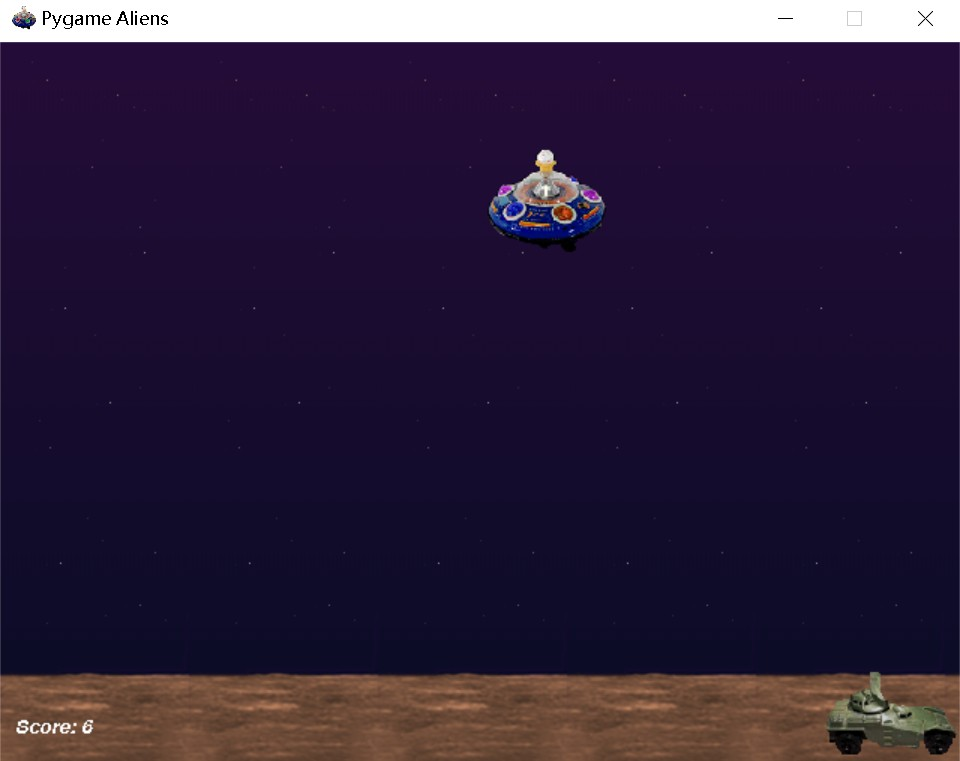
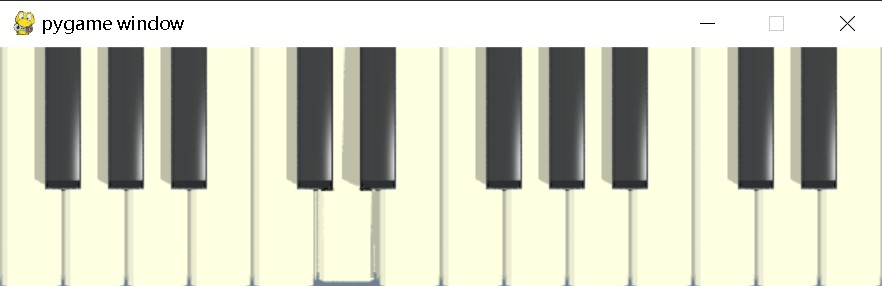

---
examples 
---

# pygame.examples

*示例程序模块*

---

# 函数

---

| 函数                                                         | 描述                                      |
| ------------------------------------------------------------ | ----------------------------------------- |
| [pygame.examples.aliens.main](https://www.pygame.org/docs/ref/examples.html#pygame.examples.aliens.main) | 播放完整的外星人示例                      |
| [pygame.examples.stars.main](https://www.pygame.org/docs/ref/examples.html#pygame.examples.stars.main) | 运行简单的星空示例                        |
| [pygame.examples.chimp.main](https://www.pygame.org/docs/ref/examples.html#pygame.examples.chimp.main) | 击打移动的猩猩                            |
| [pygame.examples.moveit.main](https://www.pygame.org/docs/ref/examples.html#pygame.examples.moveit.main) | 在屏幕上显示动画对象                      |
| [pygame.examples.fonty.main](https://www.pygame.org/docs/ref/examples.html#pygame.examples.fonty.main) | 运行字体渲染示例                          |
| [pygame.examples.freetype_misc.main](https://www.pygame.org/docs/ref/examples.html#pygame.examples.freetype_misc.main) | 运行 FreeType 渲染示例                    |
| [pygame.examples.vgrade.main](https://www.pygame.org/docs/ref/examples.html#pygame.examples.vgrade.main) | 显示垂直渐变                              |
| [pygame.examples.eventlist.main](https://www.pygame.org/docs/ref/examples.html#pygame.examples.eventlist.main) | 显示 pygame 事件                          |
| [pygame.examples.arraydemo.main](https://www.pygame.org/docs/ref/examples.html#pygame.examples.arraydemo.main) | 展示各种 surfarray 效果                   |
| [pygame.examples.sound.main](https://www.pygame.org/docs/ref/examples.html#pygame.examples.sound.main) | 加载并播放声音                            |
| [pygame.examples.sound_array_demos.main](https://www.pygame.org/docs/ref/examples.html#pygame.examples.sound_array_demos.main) | 播放各种 sndarray 效果                    |
| [pygame.examples.liquid.main](https://www.pygame.org/docs/ref/examples.html#pygame.examples.liquid.main) | 显示动画液体效果                          |
| [pygame.examples.glcube.main](https://www.pygame.org/docs/ref/examples.html#pygame.examples.glcube.main) | 使用 OpenGL 显示动画 3D 立方体            |
| [pygame.examples.scrap_clipboard.main](https://www.pygame.org/docs/ref/examples.html#pygame.examples.scrap_clipboard.main) | 访问剪贴板                                |
| [pygame.examples.mask.main](https://www.pygame.org/docs/ref/examples.html#pygame.examples.mask.main) | 显示多个图像通过碰撞检测相互反弹          |
| [pygame.examples.testsprite.main](https://www.pygame.org/docs/ref/examples.html#pygame.examples.testsprite.main) | 展示大量精灵的运动                        |
| [pygame.examples.headless_no_windows_needed.main](https://www.pygame.org/docs/ref/examples.html#pygame.examples.headless_no_windows_needed.main) | 写入一个平滑缩放的输入文件图像文件        |
| [pygame.examples.joystick.main](https://www.pygame.org/docs/ref/examples.html#pygame.examples.joystick.main) | 演示操纵杆功能                            |
| [pygame.examples.blend_fill.main](https://www.pygame.org/docs/ref/examples.html#pygame.examples.blend_fill.main) | 演示各种 surface.fill 方法的混合选项      |
| [pygame.examples.blit_blends.main](https://www.pygame.org/docs/ref/examples.html#pygame.examples.blit_blends.main) | 使用替代的加法填充方法，而非 surface.fill |
| [pygame.examples.cursors.main](https://www.pygame.org/docs/ref/examples.html#pygame.examples.cursors.main) | 显示两个不同的自定义光标                  |
| [pygame.examples.pixelarray.main](https://www.pygame.org/docs/ref/examples.html#pygame.examples.pixelarray.main) | 显示各种 pixelarray 生成的效果            |
| [pygame.examples.scaletest.main](https://www.pygame.org/docs/ref/examples.html#pygame.examples.scaletest.main) | 交互式缩放图像，使用 smoothscale          |
| [pygame.examples.midi.main](https://www.pygame.org/docs/ref/examples.html#pygame.examples.midi.main) | 运行 MIDI 示例                            |
| [pygame.examples.scroll.main](https://www.pygame.org/docs/ref/examples.html#pygame.examples.scroll.main) | 运行 Surface.scroll 示例，显示放大的图像  |
| [pygame.examples.camera.main](https://www.pygame.org/docs/ref/examples.html#pygame.examples.camera.main) | 显示从连接的摄像头实时捕获的视频          |
| [pygame.examples.playmus.main](https://www.pygame.org/docs/ref/examples.html#pygame.examples.playmus.main) | 播放音频文件                              |

这些示例应该能帮助您入门 pygame。以下是关于您可以获得的内容的简要介绍。这些示例的源代码属于公有领域，欢迎随意用于您的项目。

运行这些示例有几种方法。首先，它们可以作为独立程序运行。其次，可以导入这些示例并调用它们的 `main()` 方法（见下文）。最后，最简单的方法是使用 `python -m` 选项：

```
python -m pygame.examples.<example name> <example arguments>
```

例如：

```
python -m pygame.examples.scaletest someimage.png
```

示例所需的资源，例如图像和声音，位于 `pygame/examples/data` 子目录中。

您可以通过在 Python 解释器中使用以下命令来查找示例文件的安装位置。

```python
>>> import pygame.examples.scaletest
>>> pygame.examples.scaletest.__file__
'/usr/lib/python2.6/site-packages/pygame/examples/scaletest.py'
```

在不同的操作系统和 Python 版本中，位置会略有不同。例如，在 Windows 上，它可能位于 `C:/Python26/Lib/site-packages/pygame/examples/`，而在 Mac OS X 上，可能位于 `/Library/Frameworks/Python.framework/Versions/2.6/lib/python2.6/site-packages/pygame/examples/`。

您还可以通过调用每个模块的 `main()` 函数在 Python 解释器中运行这些示例。

```python
>>> import pygame.examples.scaletest
>>> pygame.examples.scaletest.main()
```

我们始终在寻找更多的示例和示例请求。这种代码可能是开始参与 Python 游戏开发的最佳方式。

作为一个包的示例是在 pygame 1.9.0 中引入的，但大多数示例早在之前的版本中就已经随 pygame 一起提供了。

---

# 函数详解

## aliens.main()

播放完整的外星人示例  

`aliens.main() -> None`  

这个示例最初是 SDL 演示“外星人”的移植，现在已经演变成一种有趣的形式。它展示了许多不同的精灵使用和优化的绘制方法。此外，还涉及透明度、颜色键、字体、声音、音乐、操纵杆等功能。

```python
import pygame
from pygame.examples import aliens

pygame.init()
pygame.examples.aliens.main()
```



## stars.main()

运行一个简单的星空示例  

`stars.main() -> None`  

这是一个简单的星空示例。您可以通过在屏幕上左键单击来改变透视中心。

## chimp.**main**()

*击打移动的猩猩*

 `chimp.main() -> None`

 这个简单的示例源自随 pygame 附带的逐行教程。它基于一个“流行”的网页横幅。请注意这里有注释，但有关完整的解释，请参见教程中的内容。.

## moveit.**main**()

*在屏幕上显示动画对象*

 `moveit.main() -> None`

 这是 Pygame 教程“我该如何让它移动”的完整最终示例。它创建了 10 个对象并在屏幕上进行动画。

请注意，这个示例在错误检查方面有些简单，但阅读起来很容易。:] 幸运的是，这是 Python，我们不需要与一堆错误代码作斗争。

## fonty.**main**()

*运行字体渲染示例*

 `fonty.main() -> None`

 这是一个快速且简单的应用程序，演示了使用字体模块渲染字体的不同方法

## freetype_misc.**main**()

*运行 FreeType 渲染示例*

 `freetype_misc.main() -> None`

 这是一个展示 [`pygame.freetype.Font`](https://www.pygame.org/docs/ref/freetype.html#pygame.freetype.Font) 类所提供的渲染特性的示例，除了 [`pygame.font.Font`](https://www.pygame.org/docs/ref/font.html#pygame.font.Font) 中可用的特性外。它演示了直接到表面的渲染，包括垂直文本、旋转文本、不透明文本和半透明文本，以及水平拉伸和垂直拉伸的文本。

## vgrade.**main**()

*显示垂直渐变*

 `vgrade.main() -> None`

 该示例演示了如何使用 `pixelcopy` 和 NumPy 创建垂直渐变。应用程序每半秒创建一个新的渐变，并报告生成和显示图像所需的时间。如果你还没有准备好开始使用 NumPy 数组，不用担心这个示例的源代码是怎样的 :]

## eventlist.**main**()

*显示 Pygame 事件*

 `eventlist.main() -> None`

 该示例展示了 Pygame 事件的一个简单风格，作为学习 Pygame 事件和输入的有用工具。屏幕顶部显示了多个设备值的状态，而底部则滚动显示事件列表。

虽然这不是高质量的“用户界面”代码，但你可以看到如何实现非常非交互式的状态显示，甚至是粗略的文本输出控制。

## arraydemo.**main**()

*显示各种 Surfarray 效果*

 `arraydemo.main(arraytype=None) -> None`

 这是一个展示各种 Surfarray 效果的示例。它需要安装 `surfarray` 和 `image` 模块。这个小示例也可以成为你自己测试 Surfarray 的一个良好起点。

请注意，`arraytype` 参数已经弃用；传递除 'numpy' 之外的任何值将引发 `ValueError`。

## sound.**main**()

*加载并播放声音*

 `sound.main(file_path=None) -> None`

 这是对 Pygame mixer 模块的极其基本的测试。它从命令行加载一个声音并播放。没有图形界面，全部在命令行中进行。

如果提供了 `file_path`，则使用该音频文件；否则使用默认文件。

 `sound.py` 允许的可选命令行参数：一个音频文件。

## sound_array_demos.**main**()

*播放各种 Sndarray 效果*

 `sound_array_demos.main(arraytype=None) -> None`

 该示例使用 `sndarray` 和 NumPy 创建原始声音的偏移渐变副本。目前，它使用硬编码值来设置回声的数量和延迟，方便你根据需要进行重新创建。

请注意，`arraytype` 参数已弃用；传递任何除了 'numpy' 的值将引发 `ValueError`。

## liquid.**main**()

*显示动画液体效果*

 `liquid.main() -> None`

 这个示例是在与 BlitzBasic 游戏语言进行快速比较时创建的。尽管如此，它展示了一个快速的 8 位设置（带有颜色映射）。

## glcube.**main**()

*显示一个动画的 3D 立方体（使用 OpenGL）*

 `glcube.main() -> None`

 使用 PyOpenGL 和 Pygame，这个示例创建了一个旋转的多彩 3D 立方体。

## scrap_clipboard.**main**()[¶](https://www.pygame.org/docs/ref/examples.html#pygame.examples.scrap_clipboard.main)

*访问剪贴板*

 `scrap_clipboard.main() -> None`

 这是一个简单的演示示例，用于展示剪贴板支持功能。

## mask.**main**()

显示多个图像相互反弹（使用碰撞检测）

 `mask.main(*args) -> None`

位置参数：

```
一个或多个图像文件名。
```

这个 `pygame.masks` 示例将显示多个移动的精灵相互反弹。可以提供多个精灵图像。

如果作为程序运行，则 `mask.py` 接受一个或多个图像文件作为命令行参数。

## testsprite.**main**()[¶](https://www.pygame.org/docs/ref/examples.html#pygame.examples.testsprite.main)

*显示许多精灵在四处移动*

testsprite.main(update_rects = True, use_static = False, use_FastRenderGroup = False, screen_dims = [640, 480], use_alpha = False, flags = 0) -> None

可选的关键字参数包括：

```
- **update_rects** - 使用 RenderUpdate 精灵组类
- **use_static** - 包括静态图像
- **use_FastRenderGroup** - 使用 FastRenderGroup 精灵组
- **screen_dims** - pygame 窗口尺寸
- **use_alpha** - 使用透明度混合
- **flags** - 其他显示模式标志
```

像随 SDL 提供的 `testsprite.c` 一样，这个 pygame 版本展示了许多精灵在四处移动。

如果作为独立程序运行，则不接受命令行参数。

## headless_no_windows_needed.**main**()

*写一个图像文件，生成输入文件的平滑缩放副本*

headless_no_windows_needed.main(fin, fout, w, h) -> None

参数：

```
fin - 输入图像文件的名称
fout - 要创建/覆盖的输出文件名称
w - 重新缩放图像的整数宽度
h - 重新缩放图像的整数高度
```

如何在没有窗口系统的情况下使用 Pygame，例如在无头服务器上。

生成缩略图并进行缩放是你可以使用 Pygame 做的一个示例。

`注意`: 如果可用，Pygame 的缩放功能使用 MMX/SSE，并可以在多个线程中运行。

如果 `headless_no_windows_needed.py` 作为程序运行，它接受以下命令行参数：

```
- **-scale** 输入图像 输出图像 新宽度 新高度  
例如：`-scale in.png out.png 50 50`
```

## joystick.**main**()

*演示游戏手柄功能*

`joystick.main() -> None`

这是一个展示完整游戏手柄支持的示例。

*在 Pygame 2.0.2 中新增。*

## blend_fill.**main**()

*演示各种 surface.fill 方法的混合选项*

`blend_fill.main() -> None`

这是一个互动演示，允许用户选择应用于表面的不同 BLEND_xxx 选项。

## blit_blends.**main**()

*使用替代的additive填充方式，而不是surface.fill*

blit_blends.main() -> None

伪加法混合。使用NumPy。它不进行限幅。按下r、g、b，类似于blend_fill。

## cursors.**main**()

*显示两个不同的自定义光标*

cursors.main() -> None

显示带有横杠的箭头或圆形光标。

## pixelarray.**main**()

*显示各种像素数组生成的效果*

pixelarray.main() -> None

显示各种像素数组生成的效果。

## scaletest.**main**()

*通过平滑缩放以交互方式缩放图像*

scaletest.main(imagefile, convert_alpha=False, run_speed_test=True) -> None

参数：

```
imagefile - 源图像的文件名（必填）  
convert_alpha - 是否对表面使用 convert_alpha()（默认值为 False）  
run_speed_test - 是否运行速度测试（默认值为 False）  
```

一个 smoothscale 示例，用于在屏幕上调整图像大小。使用垂直和水平箭头键来改变显示图像的宽度和高度。如果 convert_alpha 选项为 True，则源图像被强制具有源透明度，无论原始图像是否具有透明度。如果 run_speed_test 为 True，则执行背景计时测试，而不是交互式缩放器。

如果 `scaletest.py` 作为程序运行，则命令行选项为：

```
ImageFile [-t] [-convert_alpha]
[-t] = Run Speed Test
[-convert_alpha] = Use convert_alpha() on the surf.
```

## midi.**main**()

*运行 MIDI 示例*

midi.main(mode='output', device_id=None) -> None

参数：

```
mode - 如果为 'output'，则运行 MIDI 键盘输出示例；  
         如果为 'input'，则运行 MIDI 事件记录器输入示例；  
         如果为 'list'，则列出可用的 MIDI 设备；  
       （默认值为 'output'）  

device_id - MIDI 设备编号；如果为 None，则使用系统的默认 MIDI 输入或输出设备。
```

输出示例演示了如何将鼠标点击或计算机键盘事件转换为 MIDI 音符。它实现了一个基本的按钮小部件和状态机。

输入示例则展示了如何将 MIDI 输入转换为 Pygame 事件。

通过使用虚拟 MIDI 补丁线，输出和输入示例可以作为独立进程运行并连接，这样键盘输出可以在控制台上显示。

这是 Pygame 1.9.0 中的新特性。

示例：

```python
import pygame
from pygame.examples import midi

pygame.init()
pygame.examples.midi.main()
```

结果：



## scroll.**main**()

*运行一个 Surface.scroll 示例，显示放大图像*

`pythonCopy Codescroll.main(image_file=None) -> None`

这个示例展示了一个可滚动的图像，其缩放因子为八。它使用 [`Surface.scroll()`](https://www.pygame.org/docs/ref/surface.html#pygame.Surface.scroll) 函数在显示表面上移动图像。一个裁剪矩形保护了边缘区域。如果作为函数调用，此示例接受一个可选的图像文件路径。如果作为程序运行，则接受一个可选的文件路径命令行参数。如果没有提供文件，则使用默认图像文件。

运行时，点击黑色三角形可在三角形指向的方向上移动一个像素。也可以使用箭头键来移动。关闭窗口或按 `ESC` 键退出。

## camera.**main**()

*显示从连接的摄像头实时捕获的视频*

`pythonCopy Codecamera.main() -> None`

这是一个简单的实时视频播放器，它使用系统上找到的第一个可用摄像头。该程序将打开摄像头并实时显示视频流。通过此示例，您可以轻松查看摄像头捕获的画面。

## playmus.**main**()

*播放音频文件*

`pythonCopy Codeplaymus.main(file_path) -> None`

这是一个简单的音乐播放器，具有窗口和键盘播放控制。该程序允许您播放指定路径的音频文件，并提供暂停和rewind到开始的功能。用户可以通过按键控制音乐的播放状态。

---

# 参考文献

https://www.pygame.org/docs/ref/examples.html#pygame.examples.blend_fill.main