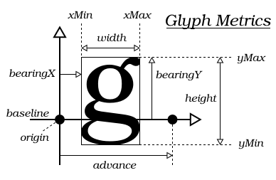
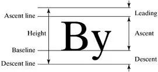
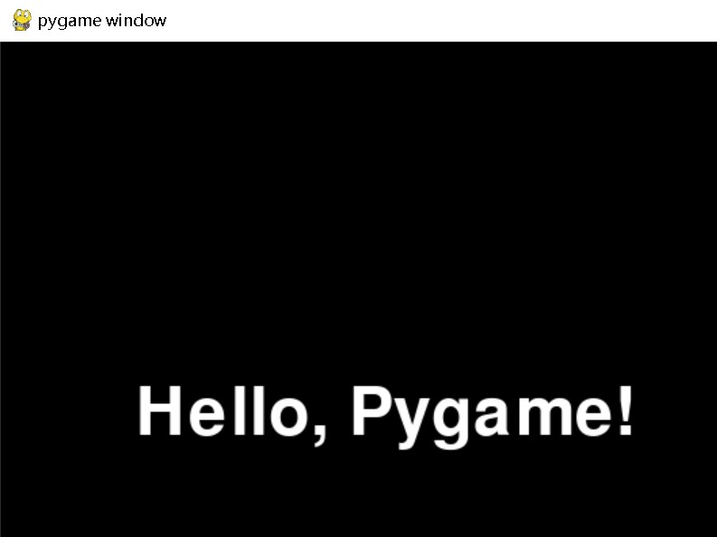

---
font模块
---

## **pygame.font**

Pygame 中加载和表示字体的模块。

---

## **函数**

- pygame.font.init() —— 初始化字体模块
- pygame.font.quit() —— 还原字体模块
- pygame.font.get_init() —— 检查字体模块是否被初始化
- pygame.font.get_default_font() —— 获得默认字体的文件名
- pygame.font.get_sdl_ttf_version()  —— 获取SDL_ttf 版本
- pygame.font.get_fonts() —— 获取所有可使用的字体
- pygame.font.match_font() —— 在系统中搜索一种特殊的字体
- pygame.font.SysFont() —— 从系统字体库创建一个 Font 对象

---

## **类**

- pygame.font.Font —— 从一个字体文件创建一个 Font 对象

字体模块可以在一个新的 Surface 对象上表示 TrueType 字体。它接受所有 UCS-2 字符（’u0001’ 到 ‘uFFFF’）。此模块为可选择模块，并且依赖于 SDL_ttf。在使用之前，你需要先测试该模块是否可用，而且对其进行初始化。

通过使用现有的 Font 对象，可以完成大多数与字体有关的工作。Pygame.font 模块自身仅可以完成常规的初始化以及通过 pygame.font.Font() 创建 Font 对象。

你可以通过使用 pygame.font.SysFont() 函数从系统内加载字体。另外还有其他几个函数可以帮助你搜索系统的字体。

Pygame 配备了内建的默认字体。通过传递 “None” 为文件名访问此字体。

示例：

```python
font = pygame.font.SysFont(None, 48)
```

返回一个Font对象

---

## **模块函数详解**

### **pygame.font.init()**

初始化字体模块。

init() -> None

在调用 pygame.init() 时，该函数会被自动调用。

该函数用于初始化字体模块。在使用其他任何函数前，该模块必须被初始化。

多次调用该函数是安全的。

### **pygame.font.quit()**

还原字体模块。

quit() -> None

用于关闭字体模块的函数。它通常在程序结束时调用，以清理任何与字体相关的资源。虽然在程序运行期间，Pygame 会自动管理字体资源，但在退出程序之前调用 `pygame.font.quit()` 是一个好习惯，尤其是在大型项目中，以确保释放所有使用的内存。

该函数会被 pygame.quit() 自动调用。

即使模块没有被初始化，调用该函数也是安全的。

### **pygame.font.get_init()**

检查字体模块是否被初始化。

get_init() -> bool

如果该字体模块已经初始化，返回 True，否则返回 False。

### **pygame.font.get_default_font()**

获得默认字体的文件名。

get_default_font() -> string

返回系统字体的文件名。

注意，并不是字体文件的完整路径。

这个文件通常与字体模块处于同一文件目录下，但是它也可以在程序附随的独立文档中。

### pygame.font.**get_sdl_ttf_version**()

用于获取 SDL_ttf 库的版本信息。SDL_ttf 是一个用于处理 TrueType 字体的库，Pygame 使用它来提供字体渲染功能。

get_sdl_ttf_version(linked=True) -> (major, minor, patch)

- 此函数返回一个包含三个整数的元组 `(major, minor, patch)`，分别表示主要版本号、次要版本号和补丁版本号。例如，返回 `(2, 20, 1)` 表示版本是 2.20.1。

### **pygame.font.get_fonts()**

获取所有可使用的字体。

get_fonts() -> list of strings

返回系统可使用的字体列表。

字体名将会被设置成小写、所有的空格和标点符号也会将被删除。

该函数在大多数系统内是有效的，但是一些系统如果没有找到字体库会返回一个空的列表。

### **pygame.font.match_font()**

在系统中搜索一种特殊的字体。

match_font(name, bold=False, italic=False) -> path

返回字体文件在系统中的完整路径。

如果你要搜索的字体是粗体或者斜体的，则要把 bold 参数和 italic 参数设置成 True，该函数将会尝试去搜索一个正确的字体族。

尝试搜索的 name 参数可以是一个用逗号隔开的列表。如果根据提供的名字没有找到任何东西，则返回 None 。

例子：

```
print pygame.font.match_font('bitstreamverasans')
# output is: /usr/share/fonts/truetype/ttf-bitstream-vera/Vera.ttf
# (but only if you have Vera on your system)
```

### **pygame.font.SysFont()**

从系统字体库创建一个 Font 对象。

SysFont(name, size, bold=False, italic=False) -> Font

从系统字体库中加载并返回一个新的字体对象。

该字体将会匹配 bold（加粗）和 italic（斜体）参数的要求。

如果找不到一个合适的系统字体，该函数将会回退并加载默认的 pygame 字体。

尝试搜索的 name 参数可以是一个用逗号隔开的列表。

---

## **类 class pygame.font.Font**

从一个字体文件创建一个 Font 对象。

Font(file_path=None, size=12) -> Font

Font(file_path, size) -> Font

Font(pathlib.Path, size) -> Font

Font(object, size) -> Font

## **类属性 & 类方法**

- bold —— 获取或设置字体是否应以（伪）粗体呈现。
- italic —— 获取或设置字体是否应以斜体（伪）呈现。
- underline —— 获取或设置字体是否应以下划线呈现。
- strikethrough —— 获取或设置字体是否应以删除线呈现。

- render() —— 在一个新 Surface 对象上绘制文本（渲染）
- size() —— 确定多大的空间用于表示文本
- set_underline() —— 控制文本是否用下划线渲染
- get_underline() —— 检查文本是否绘制下划线
- set_strikethrough() —— 控制文本是否以删除线呈现
- get_strikethrough() —— 检查文本是否以删除线显示
- set_bold() —— 启动粗体字渲染
- get_bold() —— 检查文本是否使用粗体渲染
- set_italic() —— 启动斜体字渲染
- metrics() —— 获取字符串参数每个字符的参数
- get_italic() —— 检查文本是否使用斜体渲染
- get_linesize() —— 获取字体文本的行高
- get_height() —— 获取字体的高度
- get_ascent() —— 获取字体顶端到基准线的距离
- get_descent() —— 获取字体底端到基准线的距离

根据提供的文件名或者 python 文件对象加载一个新的字体。字体的高度是以像素为单位。如果文件名是 “None”，则加载 Pygame 的默认字体。如果一个字体无法由给定的参数加载，将会产生一个异常。一旦字体已经创建完毕，那么字体的尺寸将不能修改。

字体对象主要被用于在新 Surface 对象中渲染文本。文本可以渲染为仿真的粗体或者斜体特征，但最好是加载的字体本身就带有粗体或者斜体字形。可以用普通字符串或者 Unicode 编码字符来渲染文本。

## **类方法详解**

### render()

在一个新 Surface 对象上绘制文本。

render(text, antialias, color, background=None) -> Surface

- **text**: 要渲染的文本字符串。
- **antialias**: 一个布尔值，指示是否启用抗锯齿。如果为 `True`，文本将更平滑；如果为 `False`，文本将更清晰但边缘可能出现锯齿。
- **color**: 文本颜色，通常是一个 RGB 元组，例如 `(255, 255, 255)` 表示白色。
- **background** (可选): 背景颜色，也可以是一个 RGB 元组。如果提供，文本将会在这个背景下渲染。

该函数创建一个新的 Surface 对象，并在上边渲染指定的文本。Pygame 没有提供直接的方式在一个现有的 Surface 对象上绘制文本，取而代之的方法是：使用 Font.render() 函数创建一个渲染了文本的图像（Surface 对象），然后将这个图像绘制到目标 Surface 对象上。

仅支持渲染一行文本：“换行”字符不会被渲染。空字符（’x00’）被渲染将产生一个 TypeError 错误。Unicode 和 char（字节）字符串都可以被接受。对于 Unicode 字符串，仅 UCS-2 字符范围（’u0001’ 到 ‘uFFFF’）被认为是有效的。任何编码值更大字符的字符会产生一个 UnicodeError 的错误；对于 char 字符串，默认的是使用 LATIN1 编码。color 参数决定的是文本的颜色（例如：(0, 0, 255) 表示蓝色）。可选参数 background 决定了文本的背景颜色。如果没有传递 background 参数，则对应区域内表示的文本背景将会被设置为透明。

返回的 Surface 对象将保持表示文本所需要的尺寸（与 Font.size() 所返回的尺寸相同）。如果将一个空字符串渲染为文本，将会返回一个空白 Surface 对象，它仅有一个像素点的宽度，但高度与字体高度一样。

由于取决于文本背景的类型和抗锯齿功能的使用，该函数将会返回不同类型的 Surface 对象。出于性能上的考虑，了解何种类型的图像会被使用是很有帮助的：如果抗锯齿功能没有被使用，返回的图像将采用二元调色的 8 位图像。此时如果背景是透明的，只设置一个 colorkey 来实现；抗锯齿图像会被渲染为 24 位 RGB 图像。此时如果背景是透明的，每个像素都将包含一个 alpha 通道。

优化：如果你已知文本最终将绘制在一个纯色的背景上，那么文本是抗锯齿的，你可以通过指定文本的背景色来提高性能（将文本背景色设置目标 Surface 对象的颜色）。使用这个技巧，你只需用一个 colorkey 即可保持透明信息，而不需要设置每个像素的 alpha 通道值（这样效率会低很多）。

如果你尝试渲染 ‘\n’，通常是显示为一个矩形（未知字符）。因此，你需要自己想办法处理换行。

字体渲染并不是线程安全的行为：在任何时候仅有一个线程可以渲染文本。


### size()

确定多大的空间用于表示文本。

size(text) -> (width, height)

该函数返回渲染文本所需要的尺寸。这可以被用于在文本显示之前，确定文本的显示位置。当然也有助于实现自动换行和其他布局效果。

注意：大多数字体使用字距调整来调整指定字母间的宽度。例如，”ae” 的宽度并不总是等同于 ‘a’ + ‘e’ 的宽度。

### **set_underline()**

控制文本是否用下划线渲染。

set_underline(bool) -> None

启用后，所有字体的渲染都会包含下划线。下划线一般是和一个像素点一样细，与字体尺寸无关。

该函数可以与粗体和斜体模式混合使用。

### **get_underline()**

检查文本是否绘制下划线。

get_underline() -> bool

如果字体下划线被启用，返回 True。

### set_strikethrough()

控制文本是否以删除线呈现

set_strikethrough(bool) -> None

启用后，所有渲染的字体都将包含删除线。无论字体大小如何，删除线始终为一个像素厚。这可以与粗体、斜体和下划线模式混合使用。

### get_strikethrough()

检查文本是否以删除线显示

get_strikethrough() -> bool

当字体删除线启用时返回 True

### set_bold()

启动粗体字渲染。

set_bold(bool) -> None

该函数启用文本的粗体渲染。该函数是通过虚拟拉伸实现加粗，对大多数字体格式来说并不是很好看。如果可能，请加载真粗体格式的字体文件。当渲染的字体为粗体时，该字体将比普通模式下更宽一些。

该函数可以和斜体及下划线模式混合使用。

### **get_bold()**

检查文本是否使用粗体渲染。

get_bold() -> bool

如果字体的粗体渲染模式被启用，返回 True。

### **set_italic()**

启动斜体字渲染。

set_italic(bool) -> None

该函数启用文本的斜体渲染。该函数是通过虚拟倾斜字体实现斜体，对大多数字体格式来说并不是很好看。如果可能，请加载真斜体格式的字体文件。当渲染的字体为斜体时，该字体将比普通模式下更宽一些。

该函数可以和粗体及下划线模式混合使用。

### **metrics()**

获取字符串参数每个字符的参数。

metrics(text) -> list

返回一个列表，包含每个字符的属性元组。形式如：[(minx, maxx, miny, maxy, advance), (minx, maxx, miny, maxy, advance), …]

元组内各个元素的含义如下图：



列表内不可识别的字符对应的元组内参数均为 None。

### **get_italic()**

检查文本是否使用斜体渲染。

get_italic() -> bool

如果字体的斜体渲染模式被启用，返回 True。

### **get_linesize()**

获取字体文本的行高。

get_linesize() -> int

返回该字体下文本的单行的高度（以像素为单位）。

当需要渲染很多行文本时，推荐使用该返回值作为行间距。

### **get_height()**

获取字体的高度。

get_height() -> int

返回实际渲染的文本的高度（以像素为单位）。

返回值是字体内每个字符的平均规格。

### **get_ascent()**

获取字体顶端到基准线的距离。

get_ascent() -> int

获取字体顶端到基准线的距离（以像素为单位）。

以防大家脑补错方向，补充下图：



### **get_descent()**

获取字体底端到基准线的距离。

get_descent() -> int

获取字体底端到基准线的距离（以像素为单位）。

---

## 示例

示例：

```python
import pygame

# 初始化 Pygame
pygame.init()

# 设置窗口大小
screen = pygame.display.set_mode((800, 600))

# 设置字体和大小
font = pygame.font.Font(None, 74)  # None 为默认字体，大小为 74

# 渲染文本
text_surface = font.render("Hello, Pygame!", True, (255, 255, 255))  # 白色文本

# 主循环
running = True
while running:
    for event in pygame.event.get():
        if event.type == pygame.QUIT:
            running = False

    # 更新窗口
    screen.fill((0, 0, 0))  # 填充背景为黑色
    screen.blit(text_surface, (100, 250))  # 绘制文本，位置 (100, 250)
    pygame.display.flip()

# 退出 Pygame
pygame.quit()
```

结果：


---

## 参考文献

https://www.pygame.org/docs/ref/font.html

https://www.kancloud.cn/lchy0987/pydic/3060857

chatgpt