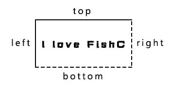
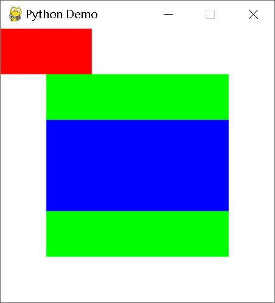
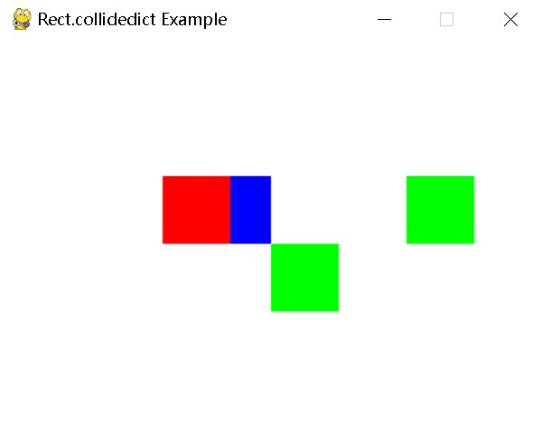

---
Rect对象
---

## **class pygame.Rect**

Rect 是用于存储矩形坐标的 Pygame 对象。

Rect(left, top, width, height) -> Rect

Rect((left, top), (width, height)) -> Rect

Rect(object) -> Rect

---

## **属性 & 方法**

- pygame.Rect.copy() — 拷贝 Rect 对象
- pygame.Rect.move() — 移动 Rect 对象
- pygame.Rect.move_ip() — 原地移动 Rect 对象
- pygame.Rect.inflate() — 放大和缩小 Rect 对象的尺寸
- pygame.Rect.inflate_ip() — 原地放大和缩小 Rect 对象的尺寸
- [pygame.Rect.scale_by()](https://www.pygame.org/docs/ref/rect.html#pygame.Rect.scale_by) — 按给定的乘数缩放矩形
- [pygame.Rect.scale_by_ip](https://www.pygame.org/docs/ref/rect.html#pygame.Rect.scale_by_ip)() — 就地增大或缩小矩形尺寸
- [pygame.Rect.update](https://www.pygame.org/docs/ref/rect.html#pygame.Rect.update)() — 设置矩形的位置和大小
- pygame.Rect.clamp() — 将一个 Rect 对象移动到另一个 Rect 对象的中心
- pygame.Rect.clamp_ip() — 原地将一个 Rect 对象移动到另一个 Rect 对象的中心
- pygame.Rect.clip() — 获取两个 Rect 对象互相重叠的部分
- [pygame.Rect.clipline](https://www.pygame.org/docs/ref/rect.html#pygame.Rect.clipline)() — 在矩形内裁剪直线
- pygame.Rect.union() — 将两个 Rect 对象合并
- pygame.Rect.union_ip() — 原地将两个 Rect 对象合并
- pygame.Rect.unionall() — 将多个 Rect 对象合并
- pygame.Rect.unionall_ip() — 原地将多个 Rect 对象合并
- pygame.Rect.fit() — 按照一定的宽高比调整 Rect 对象
- pygame.Rect.normalize() — 翻转 Rect 对象（如果尺寸为负数）
- pygame.Rect.contains() — 检测一个 Rect 对象是否完全包含在该 Rect 对象内
- pygame.Rect.collidepoint() — 检测一个点是否包含在该 Rect 对象内
- pygame.Rect.colliderect() — 检测两个 Rect 对象是否重叠
- pygame.Rect.collidelist() — 检测该 Rect 对象是否与列表中的任何一个矩形有交集
- pygame.Rect.collidelistall() — 检测该 Rect 对象与列表中的每个矩形是否有交集
- [pygame.Rect.collideobjects](https://www.pygame.org/docs/ref/rect.html#pygame.Rect.collideobjects)() — 测试列表中的任何对象是否相交
- [pygame.Rect.collideobjectsall](https://www.pygame.org/docs/ref/rect.html#pygame.Rect.collideobjectsall)() — 测试列表中的所有对象是否相交
- pygame.Rect.collidedict() — 检测该 Rect 对象是否与字典中的任何一个矩形有交集
- pygame.Rect.collidedictall() — 检测该 Rect 对象与字典中的每个矩形是否有交集

Pygame 通过 Rect 对象存储和操作矩形区域。一个 Rect 对象可以由 left，top，width，height 几个值创建。Rect 也可以是由 Pygame 的对象所创建，它们拥有一个属性叫“rect”。

任何需要一个 Rect 对象作为参数的 Pygame 函数都可以使用以上值构造一个 Rect。这样使得作为参数传递的同时创建 Rect 成为可能。

Rect 对象中的大部分方法在修改矩形的位置、尺寸后会返回一个新的 Rect 拷贝，原始的 Rect 对象不会有任何改变。但有些方法比较特殊，它们会“原地”修改 Rect 对象（也就是说它们会改动原始的 Rect 对象），这些方法都会以 “ip” 作为后缀（小甲鱼温馨提示：”ip” 即 “in-place” 的缩写，“原地”的意思）。

对了方便大家移动和对齐，Rect 对象提供以下这些虚拟属性：

```python
x,y top, left, bottom, right topleft, bottomleft, topright, bottomright midtop, midleft, midbottom, midright center, centerx, centery size, width, height w,h
```

上边这些属性均可以被赋值，例如：

```
rect1.right = 10
rect2.center = (20,30)
```

给 size，width，height 属性赋值将改变矩形的尺寸；给其它属性赋值将移动矩形。注意：一些属性是整数，一些是整数对。

如果一个 Rect 对象的 width 或 height 非 0，那么将在非 0 测试中返回 True。一些方法返回尺寸为 0 的 Rect 对象，用于表示一个非法的矩形。

Rect 对象的坐标都是整数，size 的值可以是负数，但在大多数情况下被认为是非法的。

还有一些方法可以实现矩形间碰撞检测，大多数 Python 的容器可以用于检索其中的元素与某个 Rect 对象是否碰撞。

Rect 对象覆盖的范围并不包含 right 和 bottom 指定的边缘位置。

温馨提示，一图胜千言：



这样的话，如果一个 Rect 对象的 bottom 边框恰好是另一个 Rect 对象的 top 边框（即 rect1.bottom == rect2.top），那么两矩形就恰好没有重叠的显示在屏幕上，rect1.colliderect(rect2) 也将返回 False。

尽管 Rect 对象可以被继承，但 Rect 的方法返回的是一个全新的 Rect 对象，而不是其子对象。

---

## **属性 & 方法详解**

### **copy()**

拷贝 Rect 对象。

copy() -> Rect

返回一个新的 Rect 对象，拥有与该 Rect 对象相同的位置和尺寸。

### **move()**

移动 Rect 对象。

move(x, y) -> Rect

返回一个新的 Rect 对象。x 和 y 参数可以是正数或负数，用于指定新对象的偏移地址。

### **move_ip()**

原地移动 Rect 对象。

move_ip(x, y) -> None

效果跟 move() 方法一样，区别是这个直接作用于当前 Rect 对象，而不是返回一个新的。

### **inflate()**

放大和缩小 Rect 对象的尺寸。

inflate(x, y) -> Rect

返回一个新的 Rect 对象。x 和 y 参数指定新的对象放大或缩小多少像素。新的对象保持与原始 Rect 对象在同一个中心上。负值会缩小矩形。

### **inflate_ip()**

原地放大和缩小 Rect 对象的尺寸。

inflate_ip(x, y) -> None

效果跟 inflate() 方法一样，区别是这个直接作用于当前 Rect 对象，而不是返回一个新的。

### **scale_by**()

按给定的乘数缩放矩形

scale_by(scalar) -> Rect

scale_by(scalex, scaley) -> Rect

返回一个新的矩形，其大小按给定的乘数缩放。矩形仍以当前中心为中心。允许使用单个标量或单独的宽度和高度标量。大于 1 的值会增大矩形的大小，而 0 到 1 之间的值会减小矩形的大小。

### **scale_by_ip**()

*grow or shrink the rectangle size, in place*

就地增大或缩小矩形尺寸

scale_by_ip(scalar) -> None

scale_by_ip(scalex, scaley) -> None

与 Rect.scale_by() 方法相同，但在原处操作。

已在 pygame 2.5.0 中修改： 添加了对关键字参数的支持。

### **update**()

设置矩形的位置和大小

update(left, top, width, height) -> None

update((left, top), (width, height)) -> None

update(object) -> None

### **clamp()**

将一个 Rect 对象移动到另一个 Rect 对象的中心。

clamp(Rect) -> Rect

返回一个新的 Rect 对象，范围是以 Rect 参数指定的对象为中心，保持原始 Rect 对象的尺寸不变。如果原始 Rect 对象的尺寸比 Rect 参数的要大，那么保持中心重叠，尺寸不变。

### **clamp_ip()**

原地将一个 Rect 对象移动到另一个 Rect 对象的中心。

clamp_ip(Rect) -> None

效果跟 clamp() 方法一样，区别是这个直接作用于当前 Rect 对象，而不是返回一个新的。

### **clip()**

获取两个 Rect 对象互相重叠的部分。

clip(Rect) -> Rect

返回一个新的 Rect 对象，范围是原始 Rect 对象与 Rect 参数指定的对象互相重叠的部分。如果两个 Rect 对象没有任何重叠，则返回一个 (0, 0, 0, 0) 的 Rect 对象。

### **clipline**()

在矩形内裁剪直线

clipline(x1, y1, x2, y2) -> ((cx1, cy1), (cx2, cy2))

clipline(x1, y1, x2, y2) -> ()

clipline((x1, y1), (x2, y2)) -> ((cx1, cy1), (cx2, cy2))

clipline((x1, y1), (x2, y2)) -> ()

clipline((x1, y1, x2, y2)) -> ((cx1, cy1), (cx2, cy2))

clipline((x1, y1, x2, y2)) -> ()

clipline(((x1, y1), (x2, y2))) -> ((cx1, cy1), (cx2, cy2))

clipline(((x1, y1), (x2, y2))) -> ()

返回裁剪后完全位于矩形内的直线的坐标。如果直线未与矩形重叠，则返回空元组。

注 此方法可用于矩形和直线之间的碰撞检测

### **union()**

将两个 Rect 对象合并。

union(Rect) -> Rect

返回一个新的 Rect 对象，范围将包含原始 Rect 对象与 Rect 参数指定的对象。由于结果返回一个新的矩形，所以会产生一些多与的空间。

### **union_ip()**

原地将两个 Rect 对象合并。

union_ip(Rect) -> None

效果跟 union() 方法一样，区别是这个直接作用于当前 Rect 对象，而不是返回一个新的。

### **unionall()**

将多个 Rect 对象合并。

unionall(Rect_sequence) -> Rect

返回一个新的 Rect 对象，范围将包含 Rect_sequence 参数指定的序列中所有的 Rect 对象。

### **unionall_ip()**

原地将多个 Rect 对象合并。

unionall_ip(Rect_sequence) -> None

效果跟 unionall() 方法一样，区别是这个直接作用于当前 Rect 对象，而不是返回一个新的。

### **fit()**

按照一定的宽高比调整 Rect 对象。

fit(Rect) -> Rect

返回一个新的 Rect 对象，范围是 Rect 参数的对象按照原始 Rect 对象的宽高比调整得来。

举个例子：

```python
import pygame
import sys
pygame.init()
size = width, height = 300, 300
bg = (255, 255, 255) # RGB 白色
# 创建指定大小的窗口 Surface
screen = pygame.display.set_mode(size)
# 设置窗口标题
pygame.display.set_caption("Python Demo")
clock = pygame.time.Clock()
rect1 = pygame.Rect(0, 0, 100, 50)
rect2 = pygame.Rect(50, 50, 200, 200)
while True:
    for event in pygame.event.get():
        if event.type == pygame.QUIT:
            pygame.quit()
            sys.exit()
    screen.fill(bg)
    pygame.draw.rect(screen, (255, 0, 0), rect1)
    pygame.draw.rect(screen, (0, 255, 0), rect2)
    pygame.draw.rect(screen, (0, 0, 255), rect1.fit(rect2))
    pygame.display.flip()
    clock.tick(10)
```

结果：


### **normalize()**

翻转 Rect 对象（如果尺寸为负数）。

normalize() -> None

如果 width 或 height 存在负数，则做出相应的翻转，使其变为正数。翻转后的 Rect 仍然在原来的位置，只是修改其相应的属性值。

### **contains()**

检测一个 Rect 对象是否完全包含在该 Rect 对象内。

contains(Rect) -> bool

如果 Rect 参数指定的对象完全包含在该 Rect 对象内，返回 True，否则返回 False。

### **collidepoint()**

检测一个点是否包含在该 Rect 对象内。

collidepoint(x, y) -> bool

collidepoint((x,y)) -> bool

如果给定的点在该 Rect 对象内，返回 True，否则返回 False。

一个点在 Rect 的 right 或 bottom 边缘上时，并不被认为包含在该矩形内。

### **colliderect()**

检测两个 Rect 对象是否重叠。

colliderect(Rect) -> bool

如果两个 Rect 对象有任何重叠的地方，返回 True，否则返回 False。

注意：right 和 bottom 指定的边缘位置并不属于对应的矩形。

### **collidelist()**

检测该 Rect 对象是否与列表中的任何一个矩形有交集。

collidelist(list) -> index

返回值是第 1 个有相交的矩形所在列表中的索引号（如果有的话），否则返回 -1。

### **collidelistall()**

检测该 Rect 对象与列表中的每个矩形是否有交集。

collidelistall(list) -> indices

返回一个列表，包含所有与该 Rect 对象有交集的元素；如果一个都没有，返回一个空列表。

### **collidedict()**

检测该 Rect 对象是否与字典中的任何一个矩形有交集。

collidedict(dict) -> (key, value)

collidedict(dict) -> None

collidedict(dict, use_values=0) -> (key, value)

collidedict(dict, use_values=0) -> None

返回值是第 1 个有相交的矩形所在字典中的键和值；如果没有找到，返回 None。如果 use_values 为 0（默认值），则在碰撞检测中使用 dict 的键，否则将使用 dict 的值。

注意：因为 Rect 对象不是哈希值，所以不能作为字典的键存在，因此比较的只有值。

示例：

```python
import pygame
import sys

# 初始化 Pygame
pygame.init()

# 设置窗口
screen = pygame.display.set_mode((400, 300))
pygame.display.set_caption("Rect.collidedict Example")

# 创建一个主矩形
main_rect = pygame.Rect(150, 100, 50, 50)

# 创建一个字典包含多个矩形
rect_dict = {
    "rect1": pygame.Rect(120, 100, 50, 50),
    "rect2": pygame.Rect(200, 150, 50, 50),
    "rect3": pygame.Rect(300, 100, 50, 50)
}

# 主循环
running = True
while running:
    for event in pygame.event.get():
        if event.type == pygame.QUIT:
            running = False

    # 清屏
    screen.fill((255, 255, 255))

    # 检测碰撞
    collided_key = main_rect.collidedict(rect_dict, 1)

    # 绘制主矩形
    pygame.draw.rect(screen, (0, 0, 255), main_rect)

    # 绘制字典中的矩形
    for key, rect in rect_dict.items():
        color = (0, 255, 0)  # 默认颜色为绿色
        if key == collided_key[0]:  # 如果发生碰撞，改变颜色
            color = (255, 0, 0)  # 碰撞时为红色
        pygame.draw.rect(screen, color, rect)

    # 更新屏幕
    pygame.display.flip()

# 退出 Pygame
pygame.quit()
sys.exit()
```

结果：



### **collidedictall()**

检测该 Rect 对象与字典中的每个矩形是否有交集。

collidedictall(dict) -> [(key, value), ...]

collidedictall(dict, use_values=0) -> [(key, value), ...]

返回一个列表，包含所有与该 Rect 对象有交集的键值对；如果一个都没有，返回一个空字典。如果 use_values 为 0（默认值），碰撞检测将使用 dict 的键值，否则将使用 dict 的值。

注意：因为 Rect 对象不是哈希值，所以不能作为字典的键存在，因此比较的只有值。

---

## 参考文献

https://www.pygame.org/docs/ref/rect.html

https://www.kancloud.cn/lchy0987/pydic/3060863

chatgpt