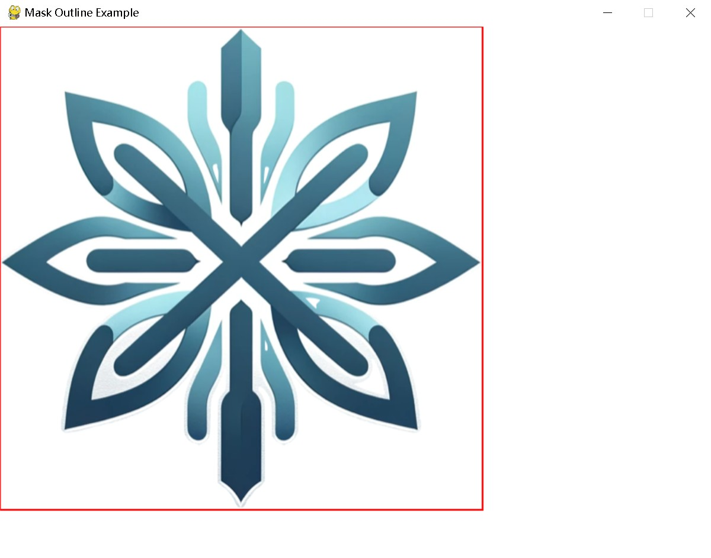

---
mask 模块
---

## **pygame.mask**

用于图像掩码的 pygame 模块。通常用于碰撞检测或透明度管理。用于快速实现完美的碰撞检测，Mask 可以精确到 1 个像素级别的判断。

---

## **函数**

- pygame.mask.from_surface() —— 从指定 Surface 对象中返回一个 Mask
- pygame.mask.from_threshold() —— 从给定阈值的 Surface 对象中创建一个 Mask

## **类**

- pygame.mask.Mask —— 用于表示 2d 位掩码（遮罩）的 Pygame 对象

用于快速实现完美的碰撞检测，Mask 可以精确到 1 个像素级别的判断。

## **函数详解**

### **pygame.mask.from_surface()**

从指定 Surface 对象中返回一个 Mask。

from_surface(surface) -> Mask

from_surface(surface, threshold=127) -> Mask

Surface 对象中透明的部分设置为 1，不透明部分设置为 0。

检查每个像素的 alpha 值是否大于 threshold 参数指定的值。（alpha 通道使用 0 ~ 255 描述像素的透明度）

如果 Surface 对象是基于 colorkeys 实现的透明（而不是基于 pixel alphas），则忽略 threshold 参数。

注：关于 Surface 对象的透明实现，可参考：Pygame详解（十二）：Surface 对象

### **pygame.mask.from_threshold()**

从给定阈值的 Surface 对象中创建一个 Mask。

from_threshold(surface, color) -> Mask

from_threshold(surface, color, threshold=(0, 0, 0, 255), othersurface=None, palette_colors=1) -> Mask

从 Surface 对象中获取 Mask，这个方法更有特色。如果只提供一个 Surface 对象，那么 Surface 对象中所有与 threshold 参数提供颜色匹配的像素均被选入 Mask 中。如果指定了 othersurface 可选参数，那么被选入 Mask 中的像素不仅需要与 threshold 参数提供颜色匹配，还需要包含在 othersurface 指定的 Surface 对象中。

参数：

- **surface** ([*Surface*](https://www.pygame.org/docs/ref/surface.html#pygame.Surface)) -- 创建 mask 的 surface
- **color** ([*Color*](https://www.pygame.org/docs/ref/color.html#pygame.Color) *or* *int* *or* *tuple**(**int**,* *int**,* *int**,* *[**int**]**) or* *list**[**int**,* *int**,* *int**,* *[**int**]**]*) -- 颜色，用于检查surface的像素是否在给定的 “阈值 ”范围内，如果提供了可选的 “othersurface”参数，此参数将被忽略
- **threshold** ([*Color*](https://www.pygame.org/docs/ref/color.html#pygame.Color) *or* *int* *or* *tuple**(**int**,* *int**,* *int**,* *[**int**]**) or* *list**[**int**,* *int**,* *int**,* *[**int**]**]*) -- (可选）用于检查两种颜色差异的阈值范围（默认为 `(0,0,0,255)`）。
- **othersurface** ([*Surface*](https://www.pygame.org/docs/ref/surface.html#pygame.Surface)) -- (可选）用于检查第一个曲面的像素是否在此曲面像素的给定 “阈值 ”范围内（默认为 “无”）。
- **palette_colors** (*int*) -- (可选）表示是否使用调色板颜色，非零值表示使用调色板颜色，0 表示不使用（默认为 1）

## 类 pygame.mask.Mask

表示 2D 位图掩码的 Pygame 对象

Mask(size=(width, height)) -> Mask

Mask(size=(width, height), fill=False) -> Mask

参数：

-  `size` -- 掩码的尺寸（宽度和高度）
- `fill` (bool) -- （可选）创建一个未填充的掩码（默认：False）或填充的掩码（True）

## **方法**

- [pygame.mask.Mask.copy](https://www.pygame.org/docs/ref/mask.html#pygame.mask.Mask.copy)() —— 返回掩码的新副本
- pygame.mask.Mask.get_size() —— 返回 Mask 的大小
- [pygame.mask.Mask.get_rect](https://www.pygame.org/docs/ref/mask.html#pygame.mask.Mask.get_rect)() —— 根据掩码的大小返回一个 Rect
- pygame.mask.Mask.get_at() —— 如果像素 (x, y) 被设置，返回值是非 0
- pygame.mask.Mask.set_at() —— 设置 Mask 中给定位置的值
- pygame.mask.Mask.overlap() —— 返回两个 Mask 在指定偏移处的重叠坐标（如果没有返回 None）
- pygame.mask.Mask.overlap_area() —— 返回两个 Mask 重叠的像素数量
- pygame.mask.Mask.overlap_mask() —— 将两个 Mask 重叠的部分创建一个新的 Mask
- pygame.mask.Mask.fill() —— 将所有的位设置为 1
- pygame.mask.Mask.clear() —— 将所有的位设置为 0
- pygame.mask.Mask.invert() —— 翻转 Mask 中所有的位（0 变 1，1 变 0）
- pygame.mask.Mask.scale() —— 缩放 Mask 的尺寸
- pygame.mask.Mask.draw() —— 将 Mask 绘制到另一个 Mask 上边
- pygame.mask.Mask.erase() —— 用另一个 Mask 擦除 Mask
- pygame.mask.Mask.count() —— 返回 Mask 被设置（为 1）的像素的数量
- pygame.mask.Mask.centroid() —— 返回 Mask 的重心点
- pygame.mask.Mask.angle() —— 返回像素的方向
- pygame.mask.Mask.outline() —— 用列表的形式返回组成对象轮廓的点
- pygame.mask.Mask.convolve() —— 返回其它 Mask 的卷积
- pygame.mask.Mask.connected_component() —— 返回与某像素区域的连接的 Mask
- pygame.mask.Mask.connected_components() —— 返回一组连接某像素区域的 Mask 的列表
- pygame.mask.Mask.get_bounding_rects() —— 返回一组像素边界矩形的列表
- [pygame.mask.Mask.to_surface](https://www.pygame.org/docs/ref/mask.html#pygame.mask.Mask.to_surface)() —— 返回绘制了 mask 的 surface

掩码对象用于表示二维位掩码。掩码中的每一位代表一个像素。1 表示已设置位，0 表示未设置位。掩码中的设置位可用于检测与其他掩码及其设置位的碰撞。

填充掩码的所有位都设置为 1，反之，未填充/清除/空掩码的所有位都设置为 0。可以创建未填充（默认）掩码，也可以使用 fill 参数填充掩码。您还可以使用 pygame.mask.Mask.clear() Sets all bits to 0 和 pygame.mask.Mask.fill() Sets all bits to 1 方法分别清除或填充掩码。

掩码的坐标从左上角 (0, 0) 开始，类似于 pygame.Surface。可以使用 `pygame.mask.Mask.get_at()` 方法获取给定位置的位，并使用 `pygame.mask.Mask.set_at()` 方法设置给定位置的位。

方法 `overlap()`、`overlap_area()`、`overlap_mask()`、`draw()`、`erase()` 和 `convolve()` 使用一个偏移参数来指示另一个掩码的左上角相对于调用掩码的左上角的偏移。调用掩码的左上角被视为原点 (0, 0)。偏移量是由两个值 (x_offset, y_offset) 组成的序列，支持正负偏移值。

---

## **方法详解**

### **copy**()

返回掩码的新副本。

copy() -> Mask

### **get_size()**

返回 Mask 的大小。

get_size() -> width,height

### **get_rect**()

根据掩码的大小返回一个 Rect

get_rect(**kwargs) -> Rect

返回一个新的 `pygame.Rect()` 对象，用于存储基于此掩码大小的矩形坐标。矩形的默认位置为 (0, 0)，其默认宽度和高度与此掩码相同。可以通过传递关键字参数/值来修改矩形的属性。例如，`a_mask.get_rect(center=(10, 5))` 会创建一个以掩码大小为基础、中心位置在给定坐标的 `pygame.Rect()` 对象。

参数  ：

- `kwargs` (dict) -- 适用于 `pygame.Rect()` 对象的关键字参数/值，这些参数将应用于矩形的属性。

### **get_at()**

如果位被设置，则返回 1；如果位未设置，则返回 0。

get_at((x,y)) -> int

跟 Surface 对象一样，(0, 0) 表示左上角坐标。

### **set_at()**

设置 Mask 中给定位置的值。

set_at(pos) -> None

set_at(pos, value=1) -> None

参数  ：

- `pos` -- 要设置的位的位置 (x, y)  
- `value` (int) -- 任何非零整数将把该位设置为 1，0 将把该位设置为 0（默认值为 1）。

### **overlap()**

返回交点。（检查碰撞）

overlap(other, offset) -> (x, y)

overlap(other, offset) -> None

返回此掩码与另一个掩码之间遇到的第一个交点。交点是指两个重叠的设置位。

重叠检测的偏移原理如下（偏移可以为负数）：

```
+----+----------..
|A   | yoffset
|  +-+----------..
+--|B
|xoffset
|  |
:  :
```

参数  ：

- `other` (Mask) -- 要与此掩码重叠的其他掩码  
- `offset` -- 一个包含两个整数的元组 (x, y)，表示第二个遮罩相对于第一个遮罩的位置偏移。

示例：

```python
import pygame

# 初始化 Pygame
pygame.init()

# 创建窗口
screen = pygame.display.set_mode((800, 600))
pygame.display.set_caption("Mask Overlap Example")

# 加载图像并创建遮罩
image1 = pygame.image.load('object1.png').convert_alpha()
image2 = pygame.image.load('object2.png').convert_alpha()

mask1 = pygame.mask.from_surface(image1)
mask2 = pygame.mask.from_surface(image2)

# 设置物体的位置
rect1 = image1.get_rect(topleft=(200, 150))
rect2 = image2.get_rect(topleft=(250, 200))

# 主循环
running = True
while running:
    for event in pygame.event.get():
        if event.type == pygame.QUIT:
            running = False

    # 清屏
    screen.fill((255, 255, 255))

    # 绘制物体
    screen.blit(image1, rect1.topleft)
    screen.blit(image2, rect2.topleft)

    # 检测重叠
    offset = (rect2.x - rect1.x, rect2.y - rect1.y)
    overlap_point = mask1.overlap(mask2, offset)

    if overlap_point:
        print(f"Overlap detected at: {overlap_point}")

    # 更新显示
    pygame.display.flip()

# 退出 Pygame
pygame.quit()
```

### **overlap_area()**

返回两个 Mask 重叠的像素数量。

overlap_area(othermask, offset) -> numpixels

返回两个 Mask 重叠的像素数量，这可以用于查看在某方向上发生碰撞的部分，或者查看两个 Mask 有多少部分发生碰撞。相似的碰撞一般会通过计算重叠部分的梯度差分被发现。

```
dx = Mask.overlap_area(othermask,(x+1,y)) - Mask.overlap_area(othermask,(x-1,y))

dy = Mask.overlap_area(othermask,(x,y+1)) - Mask.overlap_area(othermask,(x,y-1))
```

参数 ： 

- `other` (Mask) -- 要与此掩码重叠的其他掩码  
- `offset` -- 此掩码与其他掩码之间的偏移量，详细信息请参阅掩码偏移说明  

返回  ：重叠的设置位数量。

### **overlap_mask()**

将两个 Mask 重叠的部分创建一个新的 Mask。

overlap_mask(othermask, offset) -> Mask

返回的 Mask 尺寸是原始 Mask 和 othermask 参数指定的 Mask 重叠部分。

### **fill()**

将所有的位设置为 1。

fill() -> None

将 Mask 中所有的位设置为 1。

### **Mask.clear()**

将所有的位设置为 0。

clear() -> None

将 Mask 中所有的位设置为 0。

### **invert()**

翻转 Mask 中所有的位（0 变 1，1 变 0）。

invert() -> None

翻转 Mask 中所有的位（0 变 1，1 变 0）。

### **scale()**

缩放 Mask 的尺寸。

scale((width, height)) -> Mask

Mask 根据指定尺寸缩放后返回一个新的 Mask。

### **draw**

将 Mask 绘制到另一个 Mask 上边。

draw(othermask, offset) -> None

将 Mask 绘制到另一个 Mask 上边，执行的是按位 or 操作。

参数  ：

- `other` (Mask) -- 要绘制到此掩码上的掩码  
- `offset` -- 此掩码与其他掩码之间的偏移量，详细信息请参阅掩码偏移说明。

### **erase()**

用另一个 Mask 擦除 Mask。

erase(othermask, offset) -> None

从 Mask 上擦除 othermask 指定的像素。

### **count()**

返回 Mask 被设置（为 1）的像素的数量。

count() -> bits

返回 Mask 被设置（为 1）的像素的数量。

### **centroid()**

返回 Mask 的重心点。

centroid() -> (x, y)

找到 Mask 的重心点。如果 Mask 是空的，那么返回值是 (0, 0)。

### **angle()**

返回像素的方向。

angle() -> theta

找到图像中像素的大致方向（-90 度 ~ 90 度），这对于实现像素对接很有用。如果 Mask 是空的，那么返回值是 0.0。

### **outline()**

用列表的形式返回组成对象轮廓的点。这对于绘制 mask 的边界或进行碰撞检测时非常有用。

outline() -> [(x, y), ...]

outline(every=1) -> [(x, y), ...]

返回值是一个由点组成的列表，用于描绘穿过 Mask 的第一个对象的轮廓线。

every 可选参数用于设置点的跨度，默认是每 1 个像素。

示例：

```python
import pygame

# 初始化 Pygame
pygame.init()

# 创建窗口
screen = pygame.display.set_mode((800, 600))
pygame.display.set_caption("Mask Outline Example")

# 加载图像并创建遮罩
image = pygame.image.load('resource/logo.png').convert_alpha()
mask = pygame.mask.from_surface(image)

# 设置物体的位置
rect = image.get_rect(topleft=(0, 0))

# 获取轮廓
outline_points = mask.outline()

print(outline_points)

# 主循环
running = True
while running:
    for event in pygame.event.get():
        if event.type == pygame.QUIT:
            running = False

    # 清屏
    screen.fill((255, 255, 255))

    # 绘制物体
    screen.blit(image, rect.topleft)

    # 绘制遮罩轮廓
    for point in outline_points:
        pygame.draw.circle(screen, (255, 0, 0), (rect.x + point[0], rect.y + point[1]), 1)

    # 更新显示
    pygame.display.flip()

# 退出 Pygame
pygame.quit()
```

结果：



### **convolve()**

返回此 mask 与另一个 mask 的卷积结果。

convolve(other) -> Mask

convolve(other, output=None, offset=(0, 0)) -> Mask

返回一个由位组 (i-offset[0], j-offset[1]) 组成的 Mask，如果转换的 othermask 参数在右下角 (i, j) 处，那么会与自身重叠。

如果 outputmask 参数被指定，那么就会在 outputmask 参数上进行绘制，outputmask 参数会被返回。否则这个 Mask 的大小是 self.get_size() + othermask.get_size() - (1, 1)。

### **connected_component()**

返回与某像素区域的连接的 Mask。

connected_component() -> Mask

connected_component((x,y) = None) -> Mask

它会使用 SAUF 算法进行连接需要连接的 Mask。它会连通 8 个点。默认情况下，它会返回在连接图像中最大的 Mask。可选项: 一对指定的坐标，与其相连的组件会被返回。如果像素位置没有被设置，那么返回的这个 Mask 就是空的。这个 Mask 的大小会与原始 Mask 一样。

### **connected_components()**

返回一组连接某像素区域的 Mask 的列表。

connected_components() -> [Mask, ...]

connected_components(minimum=0) -> [Mask, ...]

返回一组连接某像素区的 Mask 的列表。min 可选参数用于对每个连接区的指定部分过滤噪点。

### **get_bounding_rects()**

返回相连组件的边界矩形列表。

get_bounding_rects() -> [Rect, ...]

它会获取连接着像素块的边界矩形。每个边界矩形都是一个连接每个像素的内矩形。

---

## 参考文献

https://www.pygame.org/docs/ref/mask.html#pygame.mask.Mask.outline

https://www.kancloud.cn/lchy0987/pydic/3060870#pygamemaskMaskangle_197

chatgpt