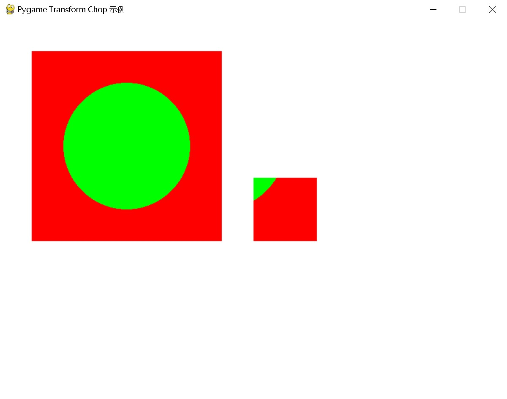

---
transform 模块
---

# **pygame.transform**

用于变换 *surfaces* 的Pygame模块。

---

# 函数

| 函数                                                         | 描述                                                         |
| ------------------------------------------------------------ | ------------------------------------------------------------ |
| [pygame.transform.flip](https://www.pygame.org/docs/ref/transform.html#pygame.transform.flip) | 垂直和水平翻转。                                             |
| [pygame.transform.scale](https://www.pygame.org/docs/ref/transform.html#pygame.transform.scale) | 调整为新分辨率。                                             |
| [pygame.transform.scale_by](https://www.pygame.org/docs/ref/transform.html#pygame.transform.scale_by) | 使用比例因子调整为新分辨率。                                 |
| [pygame.transform.rotate](https://www.pygame.org/docs/ref/transform.html#pygame.transform.rotate) | 旋转图像。                                                   |
| [pygame.transform.rotozoom](https://www.pygame.org/docs/ref/transform.html#pygame.transform.rotozoom) | 滤波缩放和旋转。                                             |
| [pygame.transform.scale2x](https://www.pygame.org/docs/ref/transform.html#pygame.transform.scale2x) | 专业图像倍增器。                                             |
| [pygame.transform.smoothscale](https://www.pygame.org/docs/ref/transform.html#pygame.transform.smoothscale) | 平滑地将表面缩放到任意大小。                                 |
| [pygame.transform.smoothscale_by](https://www.pygame.org/docs/ref/transform.html#pygame.transform.smoothscale_by) | 使用比例因子调整为新分辨率。                                 |
| [pygame.transform.get_smoothscale_backend](https://www.pygame.org/docs/ref/transform.html#pygame.transform.get_smoothscale_backend) | 返回正在使用的平滑缩放滤波版本：“GENERIC”、“MMX”或“SSE”。    |
| [pygame.transform.set_smoothscale_backend](https://www.pygame.org/docs/ref/transform.html#pygame.transform.set_smoothscale_backend) | 将平滑缩放滤波版本设置为以下之一：“GENERIC”、“MMX”或“SSE”。  |
| [pygame.transform.chop](https://www.pygame.org/docs/ref/transform.html#pygame.transform.chop) | 获取一幅图像的副本，并去除内部区域。                         |
| [pygame.transform.laplacian](https://www.pygame.org/docs/ref/transform.html#pygame.transform.laplacian) | 在表面上找到边缘。                                           |
| [pygame.transform.average_surfaces](https://www.pygame.org/docs/ref/transform.html#pygame.transform.average_surfaces) | 从多个表面中找到平均表面。                                   |
| [pygame.transform.average_color](https://www.pygame.org/docs/ref/transform.html#pygame.transform.average_color) | 找到表面的平均颜色。                                         |
| [pygame.transform.grayscale](https://www.pygame.org/docs/ref/transform.html#pygame.transform.grayscale) | 将表面转换为灰度。                                           |
| [pygame.transform.threshold](https://www.pygame.org/docs/ref/transform.html#pygame.transform.threshold) | 找到在阈值范围内的像素数量，这些像素的颜色与 `search_color` 或 `search_surf` 匹配。 |

表面变换是一种操作，它移动或调整像素的大小。所有这些函数都以一个表面作为操作对象，并返回一个新的表面，包含变换后的结果。

某些变换被视为破坏性操作。这意味着每次执行这些操作时，都会丢失像素数据。常见的例子包括调整大小和旋转。因此，最好对原始表面进行重新变换，而不是多次变换同一图像。（例如，假设你正在动画一个弹跳的弹簧，它会膨胀和收缩。如果你在之前的图像上逐步应用大小变化，你将会失去细节。相反，始终从原始图像开始，并缩放到所需的大小。）

在 Pygame 2.0.2 中的变化：变换函数现在支持关键字参数。

---

# 函数详解

## pygame.transform.**flip**()

*垂直和水平翻转*

flip(surface, flip_x, flip_y) -> Surface

这可以将表面垂直、水平或同时翻转。参数 `flip_x` 和 `flip_y` 是布尔值，用于控制是否翻转每个轴。翻转表面是非破坏性的，并返回具有相同尺寸的新表面。

示例：

```python
image = pygame.image.load('resource/test.png')

# 翻转图像
flipped_image = pygame.transform.flip(image, True, False)  # 水平翻转
```

## pygame.transform.**scale**()

调整为新分辨率。

scale(surface, size, dest_surface=None) -> Surface

将表面调整为给定的新大小（宽度，高度）。这是一种快速缩放操作，不会对结果进行采样。

可以使用可选的目标表面，而不是创建一个新的表面。如果你想重复缩放某个内容，这样做会更快。然而，目标表面必须与传入的大小（宽度，高度）相同，并且目标表面必须具有相同的格式。

## pygame.transform.**scale_by**()

*使用比例因子调整到新分辨率*

scale_by(surface, factor, dest_surface=None) -> Surface

**实验性：** 该功能仍在开发中，供测试和反馈使用，可能会发生变化。[请将 scale_by 的反馈留给作者](https://github.com/pygame/pygame/pull/2723)

与 [`scale()`](https://www.pygame.org/docs/ref/transform.html#pygame.transform.scale) 相同，但通过某个比例因子进行缩放，而不是明确指定新大小。例如，`transform.scale_by(surf, 3)` 将使表面在两个维度上都变为三倍大小。可选地，缩放因子可以是两个数的序列，分别控制 x 和 y 的缩放。例如，`transform.scale_by(surf, (2, 1))` 将图像宽度加倍，但保持高度不变。

## pygame.transform.**rotate**()

*旋转图像*

rotate(surface, angle) -> Surface

无过滤的逆时针旋转。角度参数以度为单位，可以是任何浮点值。负角度将使图像顺时针旋转。

除非按 90 度的增量旋转，否则图像会被填充到更大的尺寸以适应新的大小。如果图像具有像素透明度，填充区域将是透明的。否则，pygame 将选择与表面颜色键或左上角像素值匹配的颜色。

## pygame.transform.**rotozoom**()

*滤波缩放和旋转*。

rotozoom(surface, angle, scale) -> Surface

这是一个组合的缩放和旋转变换。结果表面将是一个经过滤波的32位表面。缩放参数是一个浮点值，将与当前分辨率相乘。角度参数是一个浮点值，表示逆时针旋转的度数。负的旋转角度将顺时针旋转。

## pygame.transform.**scale2x**()

*专业图像倍增器*。

scale2x(surface, dest_surface=None) -> Surface

这将返回一幅新图像，大小是原始图像的两倍。它使用 AdvanceMAME Scale2X 算法，对位图图形进行无锯齿缩放。

这对具有纯色的简单图像效果明显。对于照片和抗锯齿图像，它看起来就像常规的未过滤缩放。

可以使用可选的目标表面，而不是创建一个新表面。如果你想重复缩放某个内容，这样做会更快。然而，目标表面必须是源表面的两倍大，并且目标表面必须具有相同的格式。

## pygame.transform.**smoothscale**()

*平滑地将表面缩放到任意大小*。

smoothscale(surface, size, dest_surface=None) -> Surface

使用两种不同算法之一，根据需要缩放输入表面的每个维度。对于缩小，输出像素的颜色是它们覆盖区域的平均值。对于放大，则使用双线性滤波器。对于 x86-64 和 i686 架构，包含优化的 `MMX` 例程，运行速度比其他机器类型快。尺寸是一个包含（宽度，高度）的两个数字序列。此函数仅适用于 24 位或 32 位表面。如果输入表面的位深度小于 24，将会抛出异常。

## pygame.transform.**smoothscale_by**()

*使用缩放因子调整到新分辨率*。

smoothscale_by(surface, factor, dest_surface=None) -> Surface

**实验性：** 该功能仍在开发中，供测试和反馈使用，可能会有所更改。[请在此处留下对 smoothscale_by 的反馈](https://github.com/pygame/pygame/pull/2723)。

与 [`smoothscale()`](https://www.pygame.org/docs/ref/transform.html#pygame.transform.smoothscale) 相同，但通过某个因子进行缩放，而不是明确指定新大小。例如，`transform.smoothscale_by(surf, 3)` 会使表面在两个维度上都放大三倍。可选地，缩放因子可以是两个数字的序列，分别控制 x 和 y 方向的缩放。例如，`transform.smoothscale_by(surf, (2, 1))` 会将图像宽度加倍，但保持高度不变。

## pygame.transform.**get_smoothscale_backend**()

*返回正在使用的 smoothscale 滤镜版本：'GENERIC'、'MMX' 或 'SSE'*。

get_smoothscale_backend() -> string

显示 smoothscale 是否使用 `MMX` 或 `SSE` 加速。如果没有可用的加速，则返回 "GENERIC"。对于 x86 处理器，使用的加速级别在运行时确定。

此函数用于 pygame 的测试和调试。

## pygame.transform.**set_smoothscale_backend**()

*将 smoothscale 滤镜版本设置为以下之一：'GENERIC'、'MMX' 或 'SSE'*。

set_smoothscale_backend(backend) -> None

设置 smoothscale 加速。接受一个字符串参数。值为 'GENERIC' 时会关闭加速。'MMX' 仅使用 `MMX` 指令，而 'SSE' 则同时允许使用 `SSE` 扩展。如果参数类型未被识别或当前处理器不支持，将引发值错误。

此函数用于 pygame 的测试和调试。如果 smoothscale 引发无效指令错误，则可能是 pygame/SDL 的 bug，应予以报告。请仅将此函数作为临时修复使用。

## pygame.transform.**chop**()

*获取图像的副本，并移除内部区域*。

chop(surface, rect) -> Surface

提取图像的一部分。给定矩形区域周围的所有垂直和水平像素都会被移除。然后，角落区域（对角线与矩形相对）会被合并。（此操作不会改变原始图像。）

**注意**：如果您想要一个“裁剪”，以返回图像中矩形内的部分，可以将其使用矩形 blit 到新表面，或复制一个子表面。

示例：

```python
import pygame
import sys

# 初始化 Pygame
pygame.init()

# 创建窗口
screen = pygame.display.set_mode((800, 600))
pygame.display.set_caption("Pygame Transform Chop 示例")

# 加载图像或创建表面
original_surface = pygame.Surface((300, 300))
original_surface.fill((255, 0, 0))  # 填充红色
pygame.draw.circle(original_surface, (0, 255, 0), (150, 150), 100)  # 绘制绿色圆形

# 定义要截取的矩形
chop_rect = pygame.Rect(0, 0, 200, 200)

# 截取表面
chopped_surface = pygame.transform.chop(original_surface, chop_rect)

# 主循环
running = True
while running:
    for event in pygame.event.get():
        if event.type == pygame.QUIT:
            running = False

    # 清屏
    screen.fill((255, 255, 255))

    # 绘制原始表面
    screen.blit(original_surface, (50, 50))

    # 绘制截取后的表面
    screen.blit(chopped_surface, (400, 250))

    # 更新显示
    pygame.display.flip()

# 退出 Pygame
pygame.quit()
sys.exit()
```

结果：



## pygame.transform.**laplacian**()

*在表面中查找边缘*。

laplacian(surface, dest_surface=None) -> Surface

使用拉普拉斯算法在表面中查找边缘。

## pygame.transform.**average_surfaces**()

*从多个表面中计算平均表面。*

average_surfaces(surfaces, dest_surface=None, palette_colors=1) -> Surface

接受一系列表面，并返回一个表面，其中包含每个表面的平均颜色。

`palette_colors` - 如果为真，则在调色板中进行颜色平均；否则，平均像素值。如果表面实际上是灰度颜色而非调色板颜色，这将非常有用。

注意：该函数目前不正确处理使用调色板的表面。

*在 pygame 1.8 中新增。*

*在 pygame 1.9 中新增：`palette_colors` 参数。*

## pygame.transform.**average_color**()

计算表面的平均颜色。

average_color(surface, rect=None, consider_alpha=False) -> Color

计算表面或由矩形指定的表面区域的平均颜色，并以颜色形式返回。如果 `consider_alpha` 设置为 True，则会考虑透明度（去除黑色伪影）。

## pygame.transform.**grayscale**()

*将表面转换为灰度。*

grayscale(surface, dest_surface=None) -> Surface

返回原始表面的灰度版本，使用亮度公式根据红、绿、蓝的波长加权。

可以传入一个可选的目标表面，这样比创建新表面更快。该目标表面必须具有与源表面相同的尺寸（宽度、高度）和深度。

## pygame.transform.**threshold**()

*查找并统计在阈值范围内的表面像素数量，这些像素与指定的 `search_color` 或 `search_surf` 匹配。*

threshold(dest_surface, surface, search_color, threshold=(0,0,0,0), set_color=(0,0,0,0), set_behavior=1, search_surf=None, inverse_set=False) -> num_threshold_pixels

该多功能函数可用于查找表面 `surf` 中接近 `search_color` 或另一个 `search_surf` 中颜色的像素。

它还可以用于将匹配或不匹配的像素转移到 `dest_surf`。

默认情况下，它会将 `dest_surf` 中所有不在阈值范围内的像素更改为 `set_color`。如果选择性地将 `inverse_set` 设置为 True，则会将处于阈值范围内的像素更改为 `set_color`。

如果提供了可选的 `search_surf` 表面，则将根据该表面进行阈值判断，而不是指定的 `set_color`。换句话说，它会找到 `surf` 中每个接近 `search_surf` 同一坐标像素阈值的像素。

参数：

以下是句子的简体中文翻译：

- **dest_surf (pygame.Surface pygame对象，用于表示图像或None)** -- 我们要修改的表面。请参见“set_behavior”。如果是计数（set_behavior为0），应为None。
- **surf (pygame.Surface pygame对象，用于表示图像)** -- 我们要查看的表面。
- **search_color (pygame.Color pygame对象，用于表示颜色)** -- 我们要搜索的颜色。
- **threshold (pygame.Color pygame对象，用于表示颜色)** -- 颜色的阈值，指定与 `search_color` 多接近的颜色会被匹配。设置为 (50, 50, 50)，意味着颜色值在 search_color 附近50以内的都会被检测到
- **set_color (pygame.Color pygame对象，用于表示颜色或None)** -- 我们在dest_surf中设置的颜色。
- **set_behavior (int)** --

  - set_behavior=1（默认）。dest_surface中的像素将被更改为'set_color'。
  
  - set_behavior=0，我们不更改'dest_surf'，只是计数。将dest_surf设为None。
  
  - set_behavior=2，'dest_surf'中的像素将来自'surf'。
- **search_surf (pygame.Surface pygame对象，用于表示图像或None)** --

  - search_surf=None（默认）。与'search_color'进行比较。
  
  - search_surf=Surface。查看'search_surf'中的颜色，而不是使用'search_color'。
- **inverse_set (bool)** --

  - False（默认）。阈值外的像素将被更改。
  - True。阈值内的像素将被更改。
- 返回类型  -- int
- 返回 -- 在'surf'中，与'search_color'或search_surf比较，位于'threshold'范围内的像素数量。

---

# 参考文献

https://www.pygame.org/docs/ref/transform.html#pygame.transform.rotate