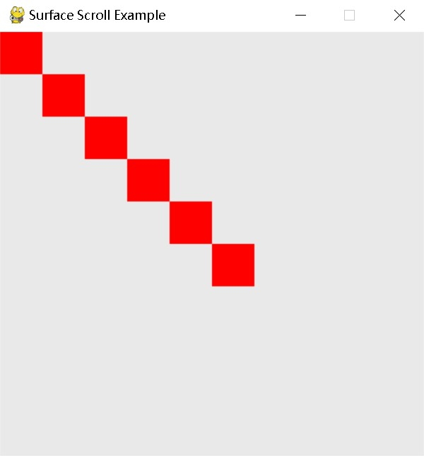
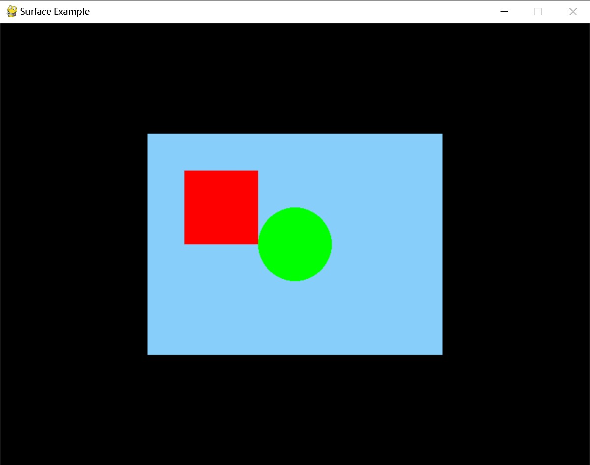

---
Surface 对象
---

## **pygame.Surface**

Pygame 中用于表示图像的对象。

Surface((width, height), flags=0, depth=0, masks=None) -> Surface

Surface((width, height), flags=0, Surface) -> Surface

---

## **属性 & 方法**

- pygame.Surface.blit() — 将一个图像（Surface 对象）绘制到另一个图像上方
- [pygame.Surface.blits](https://www.pygame.org/docs/ref/surface.html#pygame.Surface.blits)() — 把许多图像画在另一个图像上
- pygame.Surface.convert() — 修改图像（Surface 对象）的像素格式
- pygame.Surface.convert_alpha() — 修改图像（Surface 对象）的像素格式，包含 alpha 通道
- pygame.Surface.copy() — 创建一个 Surface 对象的拷贝
- pygame.Surface.fill() — 使用纯色填充 Surface 对象
- pygame.Surface.scroll() — 移动 Surface 对象
- pygame.Surface.set_colorkey() — 设置 colorkeys
- pygame.Surface.get_colorkey() — 获取 colorkeys
- pygame.Surface.set_alpha() — 设置整个图像的透明度
- pygame.Surface.get_alpha() — 获取整个图像的透明度
- pygame.Surface.lock() — 锁定 Surface 对象的内存使其可以进行像素访问
- pygame.Surface.unlock() — 解锁 Surface 对象的内存使其无法进行像素访问
- pygame.Surface.mustlock() — 检测该 Surface 对象是否需要被锁定
- pygame.Surface.get_locked() — 检测该 Surface 对象当前是否为锁定状态
- pygame.Surface.get_locks() — 返回该 Surface 对象的锁定
- pygame.Surface.get_at() — 获取一个像素的颜色值
- pygame.Surface.set_at() — 设置一个像素的颜色值
- pygame.Surface.get_at_mapped() — 获取一个像素映射的颜色索引号
- pygame.Surface.get_palette() — 获取 Surface 对象 8 位索引的调色板
- pygame.Surface.get_palette_at() — 返回给定索引号在调色板中的颜色值
- pygame.Surface.set_palette() — 设置 Surface 对象 8 位索引的调色板
- pygame.Surface.set_palette_at() — 设置给定索引号在调色板中的颜色值
- pygame.Surface.map_rgb() — 将一个 RGBA 颜色转换为映射的颜色值
- pygame.Surface.unmap_rgb() — 将一个映射的颜色值转换为 Color 对象
- pygame.Surface.set_clip() — 设置该 Surface 对象的当前剪切区域
- pygame.Surface.get_clip() — 获取该 Surface 对象的当前剪切区域
- pygame.Surface.subsurface() — 根据父对象创建一个新的子 Surface 对象
- pygame.Surface.get_parent() — 获取子 Surface 对象的父对象
- pygame.Surface.get_abs_parent() — 获取子 Surface 对象的顶层父对象
- pygame.Surface.get_offset() — 获取子 Surface 对象在父对象中的偏移位置
- pygame.Surface.get_abs_offset() — 获取子 Surface 对象在顶层父对象中的偏移位置
- pygame.Surface.get_size() — 获取 Surface 对象的尺寸
- pygame.Surface.get_width() — 获取 Surface 对象的宽度
- pygame.Surface.get_height() — 获取 Surface 对象的高度
- pygame.Surface.get_rect() — 获取 Surface 对象的矩形区域
- pygame.Surface.get_bitsize() — 获取 Surface 对象像素格式的位深度
- pygame.Surface.get_bytesize() — 获取 Surface 对象每个像素使用的字节数
- pygame.Surface.get_flags() — 获取 Surface 对象的附加标志
- pygame.Surface.get_pitch() — 获取 Surface 对象每行占用的字节数
- pygame.Surface.get_masks() — 获取用于颜色与映射索引号之间转换的掩码
- pygame.Surface.set_masks() — 设置用于颜色与映射索引号之间转换的掩码
- pygame.Surface.get_shifts() — 获取当位移动时在颜色与映射索引号之间转换的掩码
- pygame.Surface.set_shifts() — 设置当位移动时在颜色与映射索引号之间转换的掩码
- pygame.Surface.get_losses() — 获取最低有效位在颜色与映射索引号之间转换的掩码
- pygame.Surface.get_bounding_rect() — 获取最小包含所有数据的 Rect 对象
- pygame.Surface.get_view() — 获取 Surface 对象的像素缓冲区视图
- pygame.Surface.get_buffer() — 获取 Surface 对象的像素缓冲区对象
- pygame.Surface._pixels_address — 像素缓冲区地址
- [pygame.Surface.premul_alpha](https://www.pygame.org/docs/ref/surface.html#pygame.Surface.premul_alpha)() — 返回一个 RGB 通道与 alpha 通道相乘的曲面副本。

Pygame 的 Surface 对象用于表示任何一个图像，Surface 对象具有固定的分辨率和像素格式。Surface 对象通过 8 位索引调色板的 24 位色彩。

只需要指定尺寸，就能调用 pygame.Surface() 创建一个新的图像对象，创建出来的 Surface 默认是全黑色。如果没有指定其他参数，将创建出最适合当前显示器的 Surface 对象。

像素格式可以通过传递 depth 参数或一个已存在的 Surface 对象来控制。flags 参数是 Surface 对象额外功能的掩码。你可以传递任何下列标志的组合：

| HWSURFACE | 将创建出来的 Surface 对象存放于显存中 |
| :-------- | :------------------------------------ |
| SRCALPHA  | 每个像素包含一个 alpha 通道           |

高级用法可以结合 masks 和 depth 参数，masks 是由 4 个整数组（温馨提示：(R, G, B, A)），将于每个像素的颜色进行按位与计算。通常，Surface 对象不需要 masks 参数。

Surface 对象可以拥有许多其他额外的属性，例如 alpha 通道（控制透明度），colorkeys，源矩形剪切等。这些功能主要在一个 Surface 对象上绘制另一个 Surface 对象时发挥作用。 Pygame 在绘制时将会尽可能的尝试硬件加速，否则采用高度优化的绘制方式实现。

Pygame 支持三种透明度类型：colorkeys，surface alphas 和 pixel alphas（温馨提示：colorkeys 是指设置图像中的某个颜色值为透明，surface alphas 是调整整个图像的透明度，pixel alphas 则是独立设置图像中每一个像素的透明度）。surface alphas 可以和 colorkeys 混合使用，而 pixel alphas 不能和其他两个混合。

温馨提示：

- colorkeys 是设置图像中的某个颜色值为透明（任何像素的颜色值只要跟 colorkeys 的值相同即被设置为透明）；
- surface alphas 是调整整个图像的透明度，范围是 0 ~ 255（0 表示完全透明，255 表示完全不透明）；
- pixel alphas 是为图像中的每个像素设置一个独立的值，用于存放该像素的透明度。这是最精确的透明度设置，但也是最慢的。

Surface 对象支持像素访问。像素访问在硬件上实现的速度是很慢的，也不推荐大家这么做（但任性的 Pygame 还是提供了访问的途径……）。可以使用 get_at() 和 set_at() 方法获取和设置像素。简单的使用它们来访问某些像素是可以的，但如果用它们来进行所有的像素访问操作就会变得相当缓慢。

如果你打算做很多像素级别的操作，那么还是建议你使用 PixelArray 模块的方法，因为它提供了类似数组的方式来访问 Surface 对象上的像素。对于涉及数学运算的范围，建议使用 surfarray 模块，这个模块主要用于数学运算，因此速度很快，但需要 Numpy 模块的支持

任何函数如果需要访问 Surface 对象，需要将 Surface 先 lock()。这些函数可以独立 lock() 和 unlock() Surface 对象。但如果这些函数多次调用，就会有很多额外的上锁和解锁操作。最好的方法是在调用前先手动上锁，然后再完成所有调用后再手动解锁。所有需要锁定 Surface 对象的函数都在它们的文档中有仔细说明。一般情况下，完成函数的调用后要记得解锁哦。

Surface 对象内部会将像素的所有颜色重新编码为单一的数字。使用 map_rgb() 和 unmap_rgb() 方法可以手动地进行转换。

Surface 对象也可以引用部分其他 Surface 对象的内容。使用 subsurface() 方法即可创建子对象，其中任何 Surface 对象的改变均会影响到其他子对象。

每个 Surface 对象含有一个剪切区域，默认的剪切区域是整个对象表面。如果修改剪切区域，那么所有的绘制操作将只在剪切区域中生效。

---

## **属性 & 方法详解**

### **blit()**

将一个图像（Surface 对象）绘制到另一个图像上方。

blit(source, dest, area=None, special_flags=0) -> Rect

将 source 参数指定的 Surface 对象绘制到该对象上。dest 参数指定绘制的位置，dest 的值可以是 source 的左上角坐标。如果传入一个 Rect 对象给 dest，那么 blit() 会使用它的左上角坐标，而不关 Rect 的大小什么事~_~

可选参数 area 是一个 Rect 对象，表示限定 source 指定的 Surface 对象的范围。

可选参数 special_flags 是 Pygame 1.8.0 新增的内容，用于指定混合的模式：BLEND_ADD，BLEND_SUB，BLEND_MULT，BLEND_MIN，BLEND_MAX；1.8.1 增加：BLEND_RGBA_ADD，BLEND_RGBA_SUB，BLEND_RGBA_MULT，BLEND_RGBA_MIN，BLEND_RGBA_MAX，BLEND_RGB_ADD，BLEND_RGB_SUB, BLEND_RGB_MULT，BLEND_RGB_MIN，BLEND_RGB_MAX；将来还可能添加更多新的标志。

返回值是一个 Rect 对象，表示实际绘制的矩形区域。

注意1：当绘制到一个 8 位的 Surface 对象上时，pixel alphas 会被忽略。

注意2：通过 colorkeys 和 surface alphas 设置透明度的 Surface 对象，通过 blit() 绘制自身可能会导致颜色有少许不同。

### **blits**()

把许多图像画在另一个图像上

blits(blit_sequence=((source, dest), ...), doreturn=1) -> [Rect, ...] or None

blits(((source, dest, area), ...)) -> [Rect, ...]

blits(((source, dest, area, special_flags), ...)) -> [Rect, ...]

在此曲面上绘制多个曲面。它将一个序列作为输入，每个元素都与 blit() 的元素相对应。它至少需要一个（source, dest）序列。

### **convert()**

修改图像（Surface 对象）的像素格式。用于将一个表面（Surface）转换为与目标显示器的像素格式相匹配的表面。这可以提高图像的绘制性能，特别是在频繁更新屏幕时。

convert(Surface=None) -> Surface

convert(depth, flags=0) -> Surface

convert(masks, flags=0) -> Surface

创建一个新的 Surface 对象并返回，可以定制该对象的像素格式。新的像素格式可以从其他已存在的 Surface 对象中获取。另外，depth，flags，masks 参数的使用跟调用 Surface() 相似。

如果没有传入任何参数，那么创建一个相同像素格式的 Surface 对象。

如果原来包含 alpha 通道（温馨提示：即 pixel alphas，见前边讲的透明度控制部分）的 Surface 对象，那么转换后（新创建）的 Surface 对象将不会保留。如果需要保留 alpha 通道，请使用 convert_alpha() 方法。

注意：为了让 pygame 可以更快的处理图像绘制，请加载一个图像（不带透明）后立刻使用 convert() 对其像素格式进行转换。

### **convert_alpha()**

修改图像（Surface 对象）的像素格式，包含 alpha 通道（温馨提示：即 pixel alphas，见前边讲的透明度控制部分）。

convert_alpha(Surface) -> Surface

convert_alpha() -> Surface

创建一个新的 Surface 对象并返回，可以定制该对象的像素格式。新的像素格式可以从其他已存在的 Surface 对象中获取。另外，depth，flags，masks 参数的使用跟调用 Surface() 相似。

与 convert() 方法不同，convert_alpha() 转换后的 Surface 对象将专门为 alpha 通道做优化，使其可以更快的进行绘制。

注意：为了让 pygame 可以更快的处理图像绘制，请加载一个图像（带透明）后立刻使用 convert_alpha() 对其像素格式进行转换。

### **copy()**

创建一个 Surface 对象的拷贝。

copy() -> Surface

对当前 Surface 对象进行拷贝，返回的 Surface 对象拥有相同的像素格式、调色板和透明度设置。

### **fill()**

使用纯色填充 Surface 对象。

fill(color, rect=None, special_flags=0) -> Rect

默认情况下使用纯色填充整个 Surface 对象。rect 参数可以限制填充的矩形范围，color 参数可以是 RGB 序列、RGBA 序列和映射的颜色索引号。如果使用 RGBA，则只有当 Surface 对象使用 pixel alphas，alpha 通道才会被填充。

可选参数 special_flags 是 Pygame 1.8.0 新增加的内容，用于指定混合的模式：BLEND_ADD，BLEND_SUB，BLEND_MULT，BLEND_MIN，BLEND_MAX；1.8.1 增加：BLEND_RGBA_ADD，BLEND_RGBA_SUB，BLEND_RGBA_MULT，BLEND_RGBA_MIN，BLEND_RGBA_MAX，BLEND_RGB_ADD，BLEND_RGB_SUB, BLEND_RGB_MULT，BLEND_RGB_MIN，BLEND_RGB_MAX；将来还可能添加更多新的标志。

返回值是一个 Rect 对象，表示实际绘制的矩形区域。

温馨提示：RGB 很多鱼油应该不陌生了，即三原色 R（Red），G（Green）和 B（Blue），它们每个颜色的值为 0 ~ 255，通过不同程度的混合可以得到非常多的其他颜色。RGBA 其实就是在三原色的基础上添加一个 A（alpha）通道，用于控制每个像素的透明度，范围依然是 0 ~ 255。

### **scroll()**

移动 Surface 对象。

scroll(dx=0, dy=0) -> None

dx 和 dy 参数分别控制水平和垂直位置的偏移量，值为正表示向右（向下），为负表示向左（向上）偏移。没有被覆盖的范围则保留原来的像素值。Surface 对象的剪切范围将影响移动后的结果。当 dx 和 dy 参数的值大于 Surface 对象的尺寸，你将看不到移动的结果，但并不会出错。

很多人可能会“想当然的”理解所谓的“移动”就是简单的移动图像到一个新的位置，其实这个方法并不是这样的……

示例：

```python
import pygame
import sys

# 初始化 Pygame
pygame.init()

# 设置窗口
width, height = 400, 400
screen = pygame.display.set_mode((width, height))
pygame.display.set_caption("Surface Scroll Example")

# 主循环
while True:
    for event in pygame.event.get():
        if event.type == pygame.QUIT:
            # 退出 Pygame
            pygame.quit()
            sys.exit()


    screen.fill((233, 233, 233))
    pygame.draw.rect(screen, (255, 0, 0), (0, 0, 40, 40))
    for i in range(5):
        screen.scroll(40, 40)

    # 更新屏幕
    pygame.display.flip()

    # 控制帧率
    pygame.time.delay(30)
```

结果：


### **set_colorkey()**

设置 colorkeys。

set_colorkey(Color, flags=0) -> None

set_colorkey(None) -> None

设置当前 Surface 对象的 colorkeys，当绘制 Surface 对象时，将所有与 colorkeys 相同的颜色值绘制为透明。 Color 参数可以是 RGB 颜色，也可以是映射后的颜色索引号，如果传入 None，则取消 colorkeys 的设置。

如果 Surface 对象使用的是 pixel alphas 的方式设置透明度，那么 colorkeys 会被忽略（二者不能兼容）；如果 Surface 对象使用 surface alphas 方式设置透明度，那么二者可以混合设置。

可选参数 flags 可以设置为 pygame.RLEACCEL，提供非加速显示的情况下更好的性能。修改一个设置了 RLEACCEL 的 Surface 对象会变慢一些，但绘制到其他 Surface 对象上时会更快。

### **get_colorkey()**

获取当前的 colorkeys。

get_colorkey() -> RGB or None

返回 Surface 对象当前 colorkeys 的颜色值，如果没有设置 colorkeys，则返回 None。

### **set_alpha()**

设置整个图像的透明度。

set_alpha(value, flags=0) -> None

set_alpha(None) -> None

设置 Surface 对象的整体透明度（surface alpha），value 参数的范围是 0 ~ 255，0 表示完全透明，255 表示完全不透明。如果传入 None，那么取消 surface alphas 设置。

如果 Surface 对象使用的是 pixel alphas 的方式设置透明度，那么 surface alphas 会被忽略（二者不能兼容）；如果 Surface 对象使用 colorkeys 方式设置透明度，那么二者可以混合设置。

可选参数 flags 可以设置为 pygame.RLEACCEL，提供非加速显示的情况下更好的性能。修改一个设置了 RLEACCEL 的 Surface 对象会变慢一些，但绘制到其他 Surface 对象上时会更快。

注意：如果参数传入 None，pixel alphas 设置透明度的方式也会失效。

### **get_alpha()**

获取整个图像的透明度。

get_alpha() -> int_value

返回 Surface 对象当前的整体透明度，如果没有设置 surface alpha，则返回 None。

### **lock()**

锁定 Surface 对象的内存使其可以进行像素访问。

lock() -> None

锁定 Surface 的像素数据使得其可以访问。对于加速的 Surface 对象，像素数据可能存储在显存中或以非线性压缩的形式存储。当一个 Surface 对象锁定了像素内存，常规软件就可以对它进行访问。对 Surface 对象进行读取或写入需要将其先锁定。

一般情况下，不应该将 Surface 对象长期保持锁定状态。因为一旦 Surface 对象被锁定，常常无法进行绘制或者导致 Pygame 无法对其进行管理。

另外，并不是所有的 Surface 对象都需要锁定后才能访问。mustlock() 方法可以检测一个 Surface 对象是否确实需要锁定。对于有必要进行锁定和解锁的 Surface 对象，该过程并不会导致任何性能下降。

所有的 Pygame 函数在需要的时候都会自动锁定和解锁 Surface 对象。如果有部分代码需要反复锁定和解锁 Surface 对象很多次，那么将锁定和解锁这对操作封装成独立的块也是很有用的（温馨提示：就像文件操作的打开和关闭）。

嵌套的锁定和解锁是安全的，Surface 对象会在最终的锁定被解除的时候解锁。

### **unlock()**

解锁 Surface 对象的内存使其无法进行像素访问。

unlock() -> None

解锁已经锁定的 Surface 对象。解锁后的 Surface 对象才能再一次被绘制和被 Pygame 进行管理。

所有的 Pygame 函数在需要的时候都会自动锁定和解锁 Surface 对象。如果有部分代码需要反复锁定和解锁 Surface 对象很多次，那么将锁定和解锁这对操作封装成独立的块也是很有用的（温馨提示：就像文件操作的打开和关闭）。

嵌套的锁定和解锁是安全的，Surface 对象会在最终的锁定被解除的时候解锁。

### **mustlock()**

检测该 Surface 对象是否需要被锁定。

mustlock() -> bool

如果返回 True，说明该 Surface 对象需要被锁定才能访问像素数据。通常，纯软件的 Surface 对象不需要锁定。为了快捷安全地确认需要锁定的所有 Surface 对象，该方法是必要的。

所有的 Pygame 函数在需要的时候都会自动锁定和解锁 Surface 对象。如果有部分代码需要反复锁定和解锁 Surface 对象很多次，那么将锁定和解锁这对操作封装成独立的块也是很有用的（温馨提示：就像文件操作的打开和关闭）。

### **get_locked()**

检测该 Surface 对象当前是否为锁定状态。

get_locked() -> bool

当该 Surface 对象被锁定时（无论被重复锁定多少次），返回 True。

### **get_locks()**

返回该 Surface 对象的锁定。

get_locks() -> tuple

返回该 Surface 对象当前存在的锁定。

### **get_at()**

获取一个像素的颜色值。

get_at((x, y)) -> Color

返回指定像素点的 RGBA 颜色值。如果 Surface 对象的每个像素没有包含 alpha 通道，那么 alpha（A）的值将永远是 255（不透明）。如果指定像素的位置超出 Surface 对象的范围，将抛出 IndexError 异常。

在游戏或实时环境中，同时获取和设置多个像素会拖慢速度。更好的方法是使用一次性操作多个像素的方法，例如 blit()，fill() 和 draw() 方法，亦或者使用 surfarray / PixelArray 模块。

该函数会根据需求临时锁定和解锁 Surface 对象。

注意：Pygame 1.9.0 之前该函数是返回一个元祖，此后是返回一个 Color 对象。如果需要得到一个元祖，可以使用 tuple(surf.get_at((x,y))) 进行转换（一般只有在需要将颜色作为字典的键时，你才需要这么做）。

### **set_at()**

设置一个像素的颜色值。

set_at((x, y), Color) -> None

设置指定像素点的颜色值，Color 参数可以使 RGBA 值，也可以是映射的颜色索引号。如果 Surface 对象的每个像素没有包含 alpha 通道，那么 alpha（A）的值将被忽略。如果指定像素的位置超出 Surface 对象的范围或剪切区域，那么该设置并不会生效。

在游戏或实时环境中，同时获取和设置多个像素会拖慢速度。

该函数会根据需求临时锁定和解锁 Surface 对象。

### **get_at_mapped()**

获取一个像素映射的颜色索引号。

get_at_mapped((x, y)) -> Color

返回指定像素点映射的颜色索引号。如果指定像素的位置超出 Surface 对象的范围，将抛出 IndexError 异常。

该方法仅适用于 Pygame 的单元测试，不大适合在正式的应用程序中使用。

该函数会根据需求临时锁定和解锁 Surface 对象。

### **get_palette()**

获取 Surface 对象 8 位索引的调色板。

get_palette() -> [RGB, RGB, RGB, …]

返回一个最多包含 Surface 对象映射的 256 种颜色的列表，事实上返回的列表就是调色板的拷贝，因此这个列表的修改并不会影响到 Surface 对象本身。

注意：Pygame 1.9.0 以后，返回值是一个包含 Color（长度为 3）对象的列表；在此之前，每个 RGB 元素是以元祖来表示的。

### **get_palette_at()**

返回给定索引号在调色板中的颜色值。

get_palette_at(index) -> RGB

返回 index 参数在调色板中的颜色值，index 参数的取值范围是 0 ~ 255（8 位索引号）。

注意：Pygame 1.9.0 以后，返回值是一个包含 Color（长度为 3）对象；在此之前，是以元祖来表示 RGB 颜色值的。

### **set_palette()**

设置 Surface 对象 8 位索引的调色板。

set_palette([RGB, RGB, RGB, …]) -> None

设置 Surface 对象整个 8 位索引的调色板。该方法将会替换原有的调色板。

该函数将不会影响每个像素超过 8 位的 Surface 对象。

### **set_palette_at()**

设置给定索引号在调色板中的颜色值。

set_palette_at(index, RGB) -> None

设置 index 参数在调色板中的颜色值，index 参数的取值范围是 0 ~ 255（8 位索引号）。

该函数将不会影响每个像素超过 8 位的 Surface 对象。

### **map_rgb()**

将一个 RGBA 颜色转换为映射的颜色值。

map_rgb(Color) -> mapped_int

将一个 RGBA 颜色转换为该 Surface 对象映射的颜色值。返回值不会大于 Surface 对象的位深度。Pygame 常常不会使用这个映射的颜色值，但它可以用于传递给那些需要一个 Surface 对象以及其颜色的函数。

### **unmap_rgb()**

将一个映射的颜色值转换为 Color 对象。

unmap_rgb(mapped_int) -> Color

将一个映射的颜色值转换为该 Surface 对象的 RGB 颜色。返回值不会大于 Surface 对象的位深度。Pygame 常常不会使用这个映射的颜色值，但它可以用于传递给那些需要一个 Surface 对象以及其颜色的函数。

### **set_clip()**

设置该 Surface 对象的当前剪切区域。

set_clip(rect) -> None

set_clip(None) -> None

每个 Surface 对象拥有一个活跃的剪切区域。剪切区域是指 Surface 对象上的一个限定矩形，只有该矩形内的像素才可以被修改。如果传入 None，表示剪切区域覆盖整个 Surface 对象。

剪切区域受限于 Surface 对象本身。如果剪切区域过大，那么将被缩小到匹配 Surface 对象的范围。

### **get_clip()**

获取该 Surface 对象的当前剪切区域。

get_clip() -> Rect

返回该 Surface 对象的当前剪切区域，用一个 Rect 对象来描述。Surface 对象返回的限定矩形永远不会超出图像的边界。

如果该 Surface 对象没有设置剪切区域，那么将返回整个图像那么大的限定矩形。

### **subsurface()**

根据父对象创建一个新的子 Surface 对象。

subsurface(Rect) -> Surface

返回一个子 Surface 对象，它将与父对象共享所有的像素。修改子对象或父对象任一的像素均会影响到彼此，Surface 对象的信息像剪切区域，color keys 都是相同的。

新的子对象将从它的父对象中继承调色板、color keys 和 alpha 通道的设置。

存在多个子 Surface 对象以及子子 Surface 对象（subsubsurface）均是可以的。在显示模式不是硬件加速状态时，也是支持子 Surface 对象的。

更多有关子 Surface 对象的内容请查看：get_offset() 和 get_parent() 方法。

### **get_parent()**

获取子 Surface 对象的父对象。

get_parent() -> Surface

返回子 Surface 对象的父对象，如果不存在父对象，则返回 None。

### **get_abs_parent()**

获取子 Surface 对象的顶层父对象。

get_abs_parent() -> Surface

返回子 Surface 对象的父对象，如果不存在父对象，则返回该 Surface 对象本身（如果没有父对象，本身及顶层父对象）。

### **get_offset()**

获取子 Surface 对象在父对象中的偏移位置。

get_offset() -> (x, y)

获取子 Surface 对象在父对象中的偏移位置。如果该 Surface 对象不是子对象，则返回 (0, 0)。

### **get_abs_offset()**

获取子 Surface 对象在顶层父对象中的偏移位置。

get_abs_offset() -> (x, y)

获取子 Surface 对象在顶层父对象中的偏移位置。如果该 Surface 对象不是子对象，则返回 (0, 0)。

### **get_size()**

获取 Surface 对象的尺寸。

get_size() -> (width, height)

返回 Surface 对象的宽度和高度，以像素为单位。

### **get_width()**

获取 Surface 对象的宽度。

get_width() -> width

返回 Surface 对象的宽度，以像素为单位。

### **get_height()**

获取 Surface 对象的宽度。

get_height() -> height

返回 Surface 对象的高度，以像素为单位。

### **get_rect()**

获取 Surface 对象的矩形区域。

get_rect(**kwargs) -> Rect

返回一个 Rect 对象表示该 Surface 对象的矩形区域。该矩形对象（Rect）总是以 (0, 0) 为起点，width 和 height 为图像的尺寸。

你可以给该函数传递关键字参数，返回的结果将受参数的影响。

例如：

```python
# 图像的尺寸为 100 * 100
image = pygame.image.load("fishc.png").convert_alpha()
print(image.get_rect())
print(image.get_rect(center=(20, 20)))
print(image.get_rect())
```

打印的结果是：

```
<rect(0, 0, 100, 100)>
<rect(-30, -30, 100, 100)>
<rect(0, 0, 100, 100)>
```

### **get_bitsize()**

获取 Surface 对象像素格式的位深度。

get_bitsize() -> int

返回该 Surface 对象中每个像素用多少位来表示。该值可能不会完全与每个像素所使用的字节数相同。例如一个 15 位深度的 Surface 对象依然需要 2 个字节来存放。

### **get_bytesize()**

获取 Surface 对象每个像素使用的字节数。

get_bytesize() -> int

返回 Surface 对象每个像素使用的字节数。

### **get_flags()**

获取 Surface 对象的附加标志。

get_flags() -> int

返回当前 Surface 对象的特征。每个特征都是一个位掩码标志。典型标志有 HWSURFACE，RLEACCEL，SRCALPHA 和 SRCCOLORKEY。

下边是一个相对比较全面的标志列表，全部标志可在 SDL_video.h 文件中找到。

| SWSURFACE | 0x00000000 | 将创建出来的 Surface 对象存放于内存中 |
| :-------- | :--------- | :------------------------------------ |
| HWSURFACE | 0x00000001 | 将创建出来的 Surface 对象存放于显存中 |
| ASYNCBLIT | 0x00000004 | 使用异步绘制（如果可能的话）          |

以下标志 display 模块的 set_mode() 方法适用：

| ANYFORMAT  | 0x10000000 | 显存中可以是深度格式或者是像素格式           |
| :--------- | :--------- | :------------------------------------------- |
| HWPALETTE  | 0x20000000 | 该 Surface 对象独占一个调色板                |
| DOUBLEBUF  | 0x40000000 | 双缓冲模式                                   |
| FULLSCREEN | 0x80000000 | 全屏显示                                     |
| OPENGL     | 0x00000002 | 创建一个 OpenGL 渲染的环境                   |
| OPENGLBLIT | 0x0000000A | 创建一个 OpenGL 渲染的环境并用于绘制（过时） |
| RESIZABLE  | 0x00000010 | 允许调整尺寸                                 |
| NOFRAME    | 0x00000020 | 不显示窗口标题栏和边框                       |

内部使用（只读）：

| HWACCEL     | 0x00000100 | 使用硬件加速绘制           |
| :---------- | :--------- | :------------------------- |
| SRCCOLORKEY | 0x00001000 | 使用源 color key 绘制      |
| RLEACCELOK  | 0x00002000 | 私有标志                   |
| RLEACCEL    | 0x00004000 | 使用 RLE 编码 Surface 对象 |
| SRCALPHA    | 0x00010000 | 使用源 alpha 混合绘制      |
| PREALLOC    | 0x01000000 | 使用预分配内存             |

### **get_pitch()**

获取 Surface 对象每行占用的字节数。

get_pitch() -> int

返回该 Surface 对象每行占用的字节数，存放在显存中的 Surface 对象并不总是线性填充。子 Surface 对象会比实际拥有更大的间距。

该方法不适用于通常的 Pygame 开发。

### **get_masks()**

获取用于颜色与映射索引号之间转换的掩码。

get_masks() -> (R, G, B, A)

返回一个掩码，用于在颜色和映射索引号之间进行转换。

### **set_masks()**

设置用于颜色与映射索引号之间转换的掩码。

set_masks((r,g,b,a)) -> None

Pygame 1.8.1 新增加的，该方法不适用于通常的 Pygame 开发。

### **get_shifts()**

获取颜色和映射整数之间转换所需的位移

get_shifts() -> (R, G, B, A)

返回当像素移动时在颜色与映射索引号之间转换的掩码。

该方法不适用于通常的 Pygame 开发。

### **set_shifts()**

设置颜色和映射整数之间转换所需的位移

set_shifts((r,g,b,a)) -> None

Pygame 1.8.1 新增加的，该方法不适用于通常的 Pygame 开发。

### **get_losses()**

获取最低有效位在颜色与映射索引号之间转换的掩码。

get_losses() -> (R, G, B, A)

返回最低有效位在颜色与映射索引号之间转换的掩码。

该方法不适用于通常的 Pygame 开发。

### **get_bounding_rect()**

获取最小包含所有数据的 Rect 对象。

get_bounding_rect(min_alpha = 1) -> Rect

返回一个包含整个 Surface 对象所有的像素并且 alpha 值大于等于平均 alpha 值的最小矩形区域。

Pygame 1.8.1 新增加的。

### **get_view()**

获取 Surface 对象的像素缓冲区视图。

get_view(\<kind\>='2') -> BufferProxy

返回一个 BufferProxy 对象，它用 C 级别的数组结构输出 Surface 对象内部的像素缓冲区，Python 级别的数组或 C 级别的缓冲区作为接口。输出的像素缓冲区是可写的。新的缓冲区协议支持 Python 2.6 以上和 CPython。旧的缓冲区协议也支持 Python 2.x。旧的缓冲区数据是由一个 =’0’ 及多个其他缓冲区视图构成。

kind 参数是一个字节的字符串：’0’，’1’，’2’，’3’，’r’，’g’，’b’ 或 ‘a’。字母不区分大小写，因此 ‘A’ 也是可以的。参数可以是 Unicode 或 byte 字符串。默认值是 ‘2’。

‘0’ 返回一个连续的非结构化字节的视图。没有给出 Surface 对象形状的信息。如果 Surface 对象的像素是不连续的，将抛出 ValueError 异常。

‘1’ 返回一个连续像素的数组（宽 * 高）。如果 Surface 对象的像素是不连续的，将抛出 ValueError 异常。

‘2’ 返回一个原始像素的数组（宽，高）。Surface 对象的像素是字节尺寸的无符号整数。像素格式是由 Surface 对象指定。与其他的 Pygame 函数大相庭径，24 位的 Surface 对象用 3 个无符号整数表示。

‘3’ 返回一个由 RGB 组成的数组（宽，高，3）。红、绿、蓝每个组成颜色均是一个无符号字节。只有 24 位和 32 位的 Surface 对象支持。像素的颜色组合必须是 RGB 或 BGR 顺序。

‘r’ 表示红色，’g’ 表示绿色，’b’ 表示蓝色，’a’ 表示 alpha 通道。这几个表示返回 Surface 对象的单一颜色视图（宽，高）。颜色组合都是无符号字节。只有 24 位 和 32 位的 Surface 对象支持 ‘r’，’g’ 和 ‘b’，只有带有 SRCALPHA 标志的 Surface 对象支持 ‘a’。

只有当输出接口被访问时，该 Surface 对象是锁定的。对于访问新的缓冲区接口，一旦最后的缓冲区视图被释放，该 Surface 对象即解锁。对于访问数组接口和旧的缓冲区接口，该 Surface 对象保持锁定直到 BufferProxy 对象被释放。

Pygame 1.9.2 新增加的。

### **get_buffer()**

获取 Surface 对象的像素缓冲区对象。

get_buffer() -> BufferProxy

返回一个 BufferProxy 的缓冲区对象，用于表示 Surface 对象的像素。该缓冲区对象可以被直接访问和操作。Surface 对象的像素数据被表示为非结构化的块保存，拥有一个开始地址和长度描述。数据不需要连续，任何间隔均会被计算入长度中，但在其他方面中忽略。

该方法隐式地锁定 Surface 对象。当 BufferProxy 对象被释放时将会解锁。

Pygame 1.8 新增加的。

### **_pixels_address**

像素缓冲区地址。

_pixels_address -> int

该 Surface 对象原始像素的字节起始地址。

Pygame 1.9.2 新增加的。

---

## 示例

```python
import pygame
import sys

# 初始化 Pygame
pygame.init()

# 设置窗口尺寸
width, height = 800, 600
screen = pygame.display.set_mode((width, height))
pygame.display.set_caption("Surface Example")

# 创建一个表面
surface = pygame.Surface((400, 300))
surface.fill((135, 206, 250))  # 填充为天空蓝色

# 在表面上绘制图形
pygame.draw.rect(surface, (255, 0, 0), (50, 50, 100, 100))  # 红色矩形
pygame.draw.circle(surface, (0, 255, 0), (200, 150), 50)     # 绿色圆形

# 主循环
running = True
while running:
    for event in pygame.event.get():
        if event.type == pygame.QUIT:
            running = False

    # 清屏
    screen.fill((0, 0, 0))  # 黑色背景

    # 将表面绘制到屏幕上
    screen.blit(surface, (200, 150))  # 在窗口中绘制表面

    # 更新显示
    pygame.display.flip()

# 退出 Pygame
pygame.quit()
sys.exit()
```

结果：


---

## 参考文献

https://www.pygame.org/docs/ref/surface.html#pygame.Surface.get_at_mapped

https://www.kancloud.cn/lchy0987/pydic/3060864#get_at_mapped_367chatgpt

chatgpt