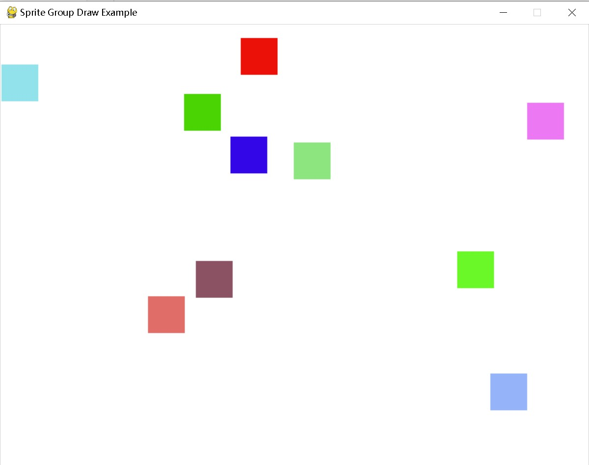

---
sprite 对象
---

# **pygame.sprite**

Pygame模块与基本游戏对象类

---

# 类 & 函数

- [pygame.sprite.Sprite](https://www.pygame.org/docs/ref/sprite.html#pygame.sprite.Sprite) — 可见游戏对象的简单基类。
- [pygame.sprite.WeakSprite](https://www.pygame.org/docs/ref/sprite.html#pygame.sprite.WeakSprite) — Sprite 的一个子类，它以弱方式引用组。这意味着它所属的任何组，只要没有在其他地方被引用，就会被自动回收。
- [pygame.sprite.DirtySprite](https://www.pygame.org/docs/ref/sprite.html#pygame.sprite.DirtySprite) — Sprite 的子类，具有更多属性和功能。
- [pygame.sprite.Group](https://www.pygame.org/docs/ref/sprite.html#pygame.sprite.Group) — 容器类，用于容纳和管理多个Sprite对象。
- [pygame.sprite.WeakDirtySprite](https://www.pygame.org/docs/ref/sprite.html#pygame.sprite.WeakDirtySprite) — WeakSprite 和 DirtySprite 的子类，结合了这两个类的优点。
- [pygame.sprite.RenderPlain](https://www.pygame.org/docs/ref/sprite.html#pygame.sprite.RenderPlain) — 与 pygame.sprite.Group 相同
- [pygame.sprite.RenderClear](https://www.pygame.org/docs/ref/sprite.html#pygame.sprite.RenderClear) — 与 pygame.sprite.Group 相同
- [pygame.sprite.RenderUpdates](https://www.pygame.org/docs/ref/sprite.html#pygame.sprite.RenderUpdates) — 跟踪脏更新的组子类。
- [pygame.sprite.OrderedUpdates](https://www.pygame.org/docs/ref/sprite.html#pygame.sprite.OrderedUpdates) — RenderUpdates 子类，按添加顺序绘制 Sprites。
- [pygame.sprite.LayeredUpdates](https://www.pygame.org/docs/ref/sprite.html#pygame.sprite.LayeredUpdates) — LayeredUpdates 是一个精灵组，它可以处理层并像 OrderedUpdates 一样绘制。
- [pygame.sprite.LayeredDirty](https://www.pygame.org/docs/ref/sprite.html#pygame.sprite.LayeredDirty) — LayeredDirty 组是用于 DirtySprite 对象的，继承自 LayeredUpdates。
- [pygame.sprite.GroupSingle](https://www.pygame.org/docs/ref/sprite.html#pygame.sprite.GroupSingle) — 容纳单个精灵的组容器。
- [pygame.sprite.spritecollide()](https://www.pygame.org/docs/ref/sprite.html#pygame.sprite.spritecollide) — 在一组精灵中查找与另一个精灵相交的精灵。
- [pygame.sprite.collide_rect](https://www.pygame.org/docs/ref/sprite.html#pygame.sprite.collide_rect)() — 使用矩形检测两个精灵之间的碰撞。
- [pygame.sprite.collide_rect_ratio](https://www.pygame.org/docs/ref/sprite.html#pygame.sprite.collide_rect_ratio)() — 使用按比例缩放的矩形进行两个精灵之间的碰撞检测。
- [pygame.sprite.collide_circle](https://www.pygame.org/docs/ref/sprite.html#pygame.sprite.collide_circle)() — 使用圆圈检测两个精灵之间的碰撞。
- [pygame.sprite.collide_circle_ratio](https://www.pygame.org/docs/ref/sprite.html#pygame.sprite.collide_circle_ratio)() — 使用按比例缩放的圆来检测两个精灵之间的碰撞。
- [pygame.sprite.collide_mask](https://www.pygame.org/docs/ref/sprite.html#pygame.sprite.collide_mask)() — 使用 Mask 检测两个精灵之间的碰撞。
- [pygame.sprite.groupcollide](https://www.pygame.org/docs/ref/sprite.html#pygame.sprite.groupcollide)() — 找出两组之间发生碰撞的所有精灵。
- [pygame.sprite.spritecollideany](https://www.pygame.org/docs/ref/sprite.html#pygame.sprite.spritecollideany)() — 简单测试一个精灵是否与组中的任何元素相交。

该模块包含几个简单的类，用于游戏中使用。主要有 Sprite 类和几个包含精灵的 Group 类。在使用 Pygame 时，这些类的使用是完全可选的。这些类相对轻量，只提供了大多数游戏中常见代码的起始点。

Sprite 类旨在作为游戏中不同类型对象的基类。此外，还有一个基础的 Group 类，简单地存储精灵。游戏可以创建新的 Group 类，以对其包含的特别定制的 Sprite 实例进行操作。

基本的 Group 类可以将其包含的精灵绘制到一个 Surface 上。Group.draw() 方法要求每个精灵具有 Surface.image 属性和 Surface.rect。Group.clear() 方法也需要这两个属性，可以用于用背景擦除所有精灵。此外，还有更高级的组：pygame.sprite.RenderUpdates() 和 pygame.sprite.OrderedUpdates()。

最后，该模块包含多个碰撞函数。这些函数帮助查找在多个组中具有相交边界矩形的精灵。要找到碰撞，精灵需要具有分配的 Surface.rect 属性。

这些组旨在高效地添加和移除精灵。同时，它们还允许快速测试某个精灵是否已经存在于组中。一个精灵可以存在于多个组中。游戏可以使用一些组来控制对象渲染，而使用完全不同的组来控制交互或玩家移动。与其在派生的 Sprite 类中添加类型属性或布尔值，不如考虑将精灵保持在有序的组中。这样可以在游戏中更方便地进行查找。

精灵和组通过 `add()` 和 `remove()` 方法管理它们之间的关系。这些方法可以接受单个或多个目标进行成员管理。这些类的默认初始化器也接受单个或列表形式的目标作为初始成员。反复将同一个精灵添加到组中或从组中移除是安全的。

虽然可以设计不从下面的 `Sprite` 和 `AbstractGroup` 类派生的精灵和组类，但强烈建议在添加精灵或组类时继承这些类。

请注意，精灵并不是线程安全的。如果使用线程，请自行进行锁定。

---

# 类 详解

## pygame.sprite.**Sprite 类**

可视化游戏对象的简单基类。

Sprite(*groups) -> Sprite

可视化游戏对象的基类。派生类通常需要重写 `Sprite.update()` 方法，并为 `Sprite.image` 和 `Sprite.rect` 属性赋值。初始化器可以接受任意数量的组实例以进行添加。

在子类化 `Sprite` 时，请确保在将精灵添加到组之前调用基类的初始化器。例如：

```python
class Block(pygame.sprite.Sprite):

    # 构造函数。传入块的颜色，
    # 以及它的 x 和 y 位置
    def __init__(self, color, width, height):
       # 调用父类（Sprite）构造函数
       pygame.sprite.Sprite.__init__(self)

       # 创建一个块的图像，并用颜色填充它。
       # 这也可以是从磁盘加载的图像。
       self.image = pygame.Surface([width, height])
       self.image.fill(color)

       # 获取具有图像尺寸的矩形对象
       # 通过设置 rect.x 和 rect.y 的值来更新该对象的位置
       self.rect = self.image.get_rect()
```

---

### **函数**

- [pygame.sprite.Sprite.update](https://www.pygame.org/docs/ref/sprite.html#pygame.sprite.Sprite.update)() — 控制精灵行为的方法。
- [pygame.sprite.Sprite.add](https://www.pygame.org/docs/ref/sprite.html#pygame.sprite.Sprite.add)() — 将精灵添加到组中。
- [pygame.sprite.Sprite.remove](https://www.pygame.org/docs/ref/sprite.html#pygame.sprite.Sprite.remove)() — 从组中移除精灵。
- [pygame.sprite.Sprite.kill](https://www.pygame.org/docs/ref/sprite.html#pygame.sprite.Sprite.kill)() — 从所有组中移除精灵。
- [pygame.sprite.Sprite.alive](https://www.pygame.org/docs/ref/sprite.html#pygame.sprite.Sprite.alive)() — 该精灵是否属于任何组
- [pygame.sprite.Sprite.groups](https://www.pygame.org/docs/ref/sprite.html#pygame.sprite.Sprite.groups)() — 包含此精灵的组列表。

---

### 函数详解

#### **update**()

控制精灵行为的方法。

update(*args, **kwargs) -> None

该方法的默认实现不执行任何操作；它只是一个方便的“钩子”，你可以重写该方法。此方法由 `Group.update()` 调用，并接收你传递的任何参数。

如果不使用 `Group` 类中同名的便利方法，则无需使用此方法。

#### **add**()

将精灵添加到组中。

add(*groups) -> None

可以将任意数量的 `Group` 实例作为参数传递。精灵将被添加到它尚未成为成员的组中。

#### **remove**()

从组中移除精灵。

remove(*groups) -> None

可以将任意数量的 `Group` 实例作为参数传递。精灵将从它当前是成员的组中移除。

#### **kill**()

从所有组中移除精灵。

kill() -> None

精灵将从所有包含它的组中移除。这不会改变精灵的状态。在调用此方法后，仍然可以继续使用该精灵，包括将其添加到组中。

#### **alive**()

该精灵是否属于任何组

alive() -> bool

当精灵属于一个或多个组时，返回 `True`。

#### **groups**()

返回包含此精灵的组列表。

groups() -> group_list

返回包含此精灵的所有组的列表。

## pygame.sprite.**WeakSprite 类**

这是一个 Sprite 的子类，它以弱引用的方式引用其组。这意味着如果这个精灵所属的组没有在其他地方被引用，它将会被自动垃圾回收。

WeakSprite(*groups) -> WeakSprite

## pygame.sprite.**DirtySprite** 类

这是一个具有更多属性和功能的精灵子类。

DirtySprite(*groups) -> DirtySprite

`DirtySprite` 的额外属性及其默认值如下：

- dirty = 1 —— 如果设置为 1，精灵将被重新绘制，然后再次设置为 0。如果设置为 2，它将始终标记为脏（每帧都重新绘制，标志不会重置）。设置为 0 则表示精灵不脏，因此不会再次被重新绘制。
- blendmode = 0 —— `special_flags` 参数用于 `blit` 和 `blendmodes`
- source_rect = None —— `source rect` 是用于指定在 `self.image` 中绘制的区域，它相对于 `self.image` 的左上角 (0, 0) 进行定义
- visible = 1 —— 通常为 1，如果设置为 0，则不会被重新绘制（你还必须将其标记为脏，以便从屏幕上擦除）。
- layer = 0 —— （只读值，在添加到 LayeredDirty 时读取，详情请参见 LayeredDirty 的文档）

## pygame.sprite.**Group** 类

一个容器类，用于持有和管理多个精灵（Sprite）对象。

Group(*sprites) -> Group

一个简单的精灵对象容器。这个类可以被继承以创建具有更具体行为的容器。构造函数可以接受任意数量的精灵参数，以将其添加到组中。该组支持以下标准 Python 操作：

```
in      测试一个精灵是否被包含在内。
len     包含的精灵数量。
bool    测试是否包含任何精灵。
iter    遍历所有精灵。
```

该组中的精灵在 Python 3.6 及更高版本中是有序的。在 Python 3.6 以下版本中，绘制和遍历精灵时没有特定顺序。

---

### 函数

- [pygame.sprite.Group.sprites](https://www.pygame.org/docs/ref/sprite.html#pygame.sprite.Group.sprites) —— 该组包含的精灵列表。
- [pygame.sprite.Group.copy](https://www.pygame.org/docs/ref/sprite.html#pygame.sprite.Group.copy) —— 复制该组。
- [pygame.sprite.Group.add](https://www.pygame.org/docs/ref/sprite.html#pygame.sprite.Group.add) —— add Sprites to this Group
- [pygame.sprite.Group.remove](https://www.pygame.org/docs/ref/sprite.html#pygame.sprite.Group.remove) —— remove Sprites from the Group
- [pygame.sprite.Group.has](https://www.pygame.org/docs/ref/sprite.html#pygame.sprite.Group.has) —— 测试一个组是否包含精灵。
- [pygame.sprite.Group.update](https://www.pygame.org/docs/ref/sprite.html#pygame.sprite.Group.update) —— 调用所包含精灵的更新方法。
- [pygame.sprite.Group.draw](https://www.pygame.org/docs/ref/sprite.html#pygame.sprite.Group.draw) —— 绘制精灵图像。
- [pygame.sprite.Group.clear](https://www.pygame.org/docs/ref/sprite.html#pygame.sprite.Group.clear) —— 在精灵上绘制背景。
- [pygame.sprite.Group.empty](https://www.pygame.org/docs/ref/sprite.html#pygame.sprite.Group.empty) —— 移除所有精灵。

---

### 函数详解

#### **sprites**()

返回该组包含的精灵列表。

sprites() -> sprite_list

返回该组包含的所有精灵的列表。您也可以从组中获取迭代器，但在修改组时无法进行迭代。

#### **copy**()

复制该组。

copy() -> Group

创建一个新的组，其中包含与原始组相同的所有精灵。如果您已经对子类进行了扩展，则新对象将具有与原始组相同的（子）类。这仅在派生类的构造函数接受与组类相同的参数时有效。

#### **add**()

向该组添加精灵。

add(*sprites) -> None

向该组添加任意数量的精灵。此操作仅会添加尚未成为该组成员的精灵。

每个精灵参数也可以是一个包含精灵的迭代器。

#### **remove**()

从该组中移除精灵。

remove(*sprites) -> None

从该组中移除任意数量的精灵。此操作仅会移除已经是该组成员的精灵。

每个精灵参数也可以是一个包含精灵的迭代器。

#### **has**()

测试该组是否包含精灵。

has(*sprites) -> bool

如果该组包含所有给定的精灵，则返回 True。这与在组上使用 "in" 操作符相似（例如，“if sprite in group: ...”），用于测试单个精灵是否属于该组。

每个精灵参数也可以是一个包含精灵的迭代器。

#### **update**()

对包含的精灵调用更新方法。

update(*args, **kwargs) -> None

对组中的所有精灵调用 `update()` 方法。基础精灵类具有一个 `update` 方法，可以接受任意数量的参数，但默认不执行任何操作。传递给 `Group.update()` 的参数将被转发给每个精灵。

无法获取来自 `Sprite.update()` 方法的返回值。

也就是调用 Sprite 类自带的 update() 函数，该函数用户可以重写。

#### **draw**()

绘制精灵图像。

draw(Surface, bgsurf=None, special_flags=0) -> List[Rect]

将包含的精灵绘制到指定的表面上。此方法使用 `Sprite.image` 属性作为源表面，并使用 `Sprite.rect` 确定位置。`special_flags` 会传递给 `Surface.blit()`。`bgsurf` 在该方法中未使用，但 `LayeredDirty.draw()` 方法会用到它。

组中的精灵没有特定顺序，因此绘制顺序是任意的。

示例：

```python
import pygame
import random

# 初始化 Pygame
pygame.init()

# 创建窗口
screen = pygame.display.set_mode((800, 600))
pygame.display.set_caption("Sprite Group Draw Example")

# 定义精灵类
class MySprite(pygame.sprite.Sprite):
    def __init__(self, color, width, height):
        super().__init__()
        self.image = pygame.Surface((width, height))
        self.image.fill(color)
        self.rect = self.image.get_rect()
        self.rect.x = random.randint(0, 800 - width)
        self.rect.y = random.randint(0, 600 - height)

# 创建精灵组
all_sprites = pygame.sprite.Group()

# 添加一些精灵到组中
for _ in range(10):
    sprite = MySprite((random.randint(0, 255), random.randint(0, 255), random.randint(0, 255)), 50, 50)
    all_sprites.add(sprite)

# 主循环
running = True
while running:
    for event in pygame.event.get():
        if event.type == pygame.QUIT:
            running = False

    # 清屏
    screen.fill((255, 255, 255))

    # 绘制精灵组
    all_sprites.draw(screen)

    # 更新显示
    pygame.display.flip()

# 退出 Pygame
pygame.quit()
```

结果：


#### **clear**()

在精灵上绘制背景。

clear(Surface_dest, background) -> None

擦除上次 `Group.draw()` 调用中使用的精灵。通过用背景填充绘制的精灵位置来清除目标表面。

背景通常是一个与目标表面尺寸相同的图像表面。不过，它也可以是一个回调函数，该函数接受两个参数：目标表面和要清除的区域。背景回调函数将在每次清除时被调用多次。

下面是一个示例回调函数，用于用纯红色清除精灵：

```
def clear_callback(surf, rect):
    color = 255, 0, 0
    surf.fill(color, rect)
```

#### **empty**()

删除所有精灵

empty() -> None

删除该组中的所有精灵。

---

## pygame.sprite.**WeakDirtySprite 类**

WeakSprite 和 DirtySprite 的子类，结合了这两个类的优点。

WeakDirtySprite(*groups) -> WeakDirtySprite

---

## pygame.sprite.**RenderPlain** 类

与 pygame.sprite.Group 相同

该类是 pygame.sprite.Group() 的别名。它没有额外的功能。

---

## pygame.sprite.**RenderClear** 类

与 pygame.sprite.Group 相同

该类是 pygame.sprite.Group() 的别名。它没有额外的功能。

---

## pygame.sprite.**RenderUpdates** 类

跟踪脏更新的组子类。

RenderUpdates(*sprites) -> RenderUpdates

这个类派生自 `pygame.sprite.Group()`。它具有一个扩展的 `draw()` 方法，用于跟踪屏幕的变化区域。

**函数：**

- [pygame.sprite.RenderUpdates.draw](https://www.pygame.org/docs/ref/sprite.html#pygame.sprite.RenderUpdates.draw)()

   绘制精灵图像并跟踪变化区域。

draw(surface, bgsurf=None, special_flags=0) -> Rect_list

将所有精灵绘制到表面上，功能与 `Group.draw()` 相同。此方法还返回一个矩形区域的列表，这些区域在屏幕上已被更改。返回的变化包括之前 `Group.clear()` 调用所影响的屏幕区域。`special_flags` 被传递给 `Surface.blit()`。

返回的矩形列表应传递给 `pygame.display.update()`。这将有助于在软件驱动的显示模式下提升性能。这种类型的更新通常仅对背景没有动画的目标有效。

---

## pygame.sprite.**OrderedUpdates**()

`RenderUpdates` 的一个子类，按照添加顺序绘制精灵。

OrderedUpdates(*sprites) -> OrderedUpdates

这个类派生自 `pygame.sprite.RenderUpdates()`。它维护了精灵添加到组中的顺序，以便进行渲染。这使得从组中添加和移除精灵的速度比普通组稍慢。

---

## pygame.sprite.**LayeredUpdates** 类

`LayeredUpdates` 是一个精灵组，处理层级并像 `OrderedUpdates` 一样进行绘制。

LayeredUpdates(*sprites, **kwargs) -> LayeredUpdates

这个组与 `pygame.sprite.Sprite` 基本类完全兼容，用于可见的游戏对象。

您可以通过 `kwargs` 设置默认层，使用 `'default_layer'` 和一个整数指定层级。默认层为 0。

如果您添加的精灵具有 `_layer` 属性，则将使用该层。如果 `**kwargs` 中包含 `'layer'`，那么传递的精灵将被添加到该层（覆盖精灵的 `layer` 属性）。如果这两个条件都不满足，则将使用默认层来添加精灵。

### 函数

- [pygame.sprite.LayeredUpdates.add](https://www.pygame.org/docs/ref/sprite.html#pygame.sprite.LayeredUpdates.add) —— 要将一个精灵或一系列精灵添加到一个组中
- [pygame.sprite.LayeredUpdates.sprites](https://www.pygame.org/docs/ref/sprite.html#pygame.sprite.LayeredUpdates.sprites) —— 返回一个有序的精灵列表（最下面的是第一个，最上面的是最后一个）。
- [pygame.sprite.LayeredUpdates.draw](https://www.pygame.org/docs/ref/sprite.html#pygame.sprite.LayeredUpdates.draw) —— 将所有精灵按照正确的顺序绘制到传入的表面上。
- [pygame.sprite.LayeredUpdates.get_sprites_at](https://www.pygame.org/docs/ref/sprite.html#pygame.sprite.LayeredUpdates.get_sprites_at) —— 返回一个包含该位置上所有精灵的列表。
- [pygame.sprite.LayeredUpdates.get_sprite](https://www.pygame.org/docs/ref/sprite.html#pygame.sprite.LayeredUpdates.get_sprite) —— 返回组中索引为 `idx` 的精灵。
- [pygame.sprite.LayeredUpdates.remove_sprites_of_layer](https://www.pygame.org/docs/ref/sprite.html#pygame.sprite.LayeredUpdates.remove_sprites_of_layer) —— 从层中移除所有精灵，并将它们作为列表返回。
- [pygame.sprite.LayeredUpdates.layers](https://www.pygame.org/docs/ref/sprite.html#pygame.sprite.LayeredUpdates.layers) —— 返回一个已定义的层列表（唯一），按从下到上的顺序排序。
- [pygame.sprite.LayeredUpdates.change_layer](https://www.pygame.org/docs/ref/sprite.html#pygame.sprite.LayeredUpdates.change_layer) —— 更改精灵的层级。
- [pygame.sprite.LayeredUpdates.get_layer_of_sprite](https://www.pygame.org/docs/ref/sprite.html#pygame.sprite.LayeredUpdates.get_layer_of_sprite) —— 返回精灵当前所在的层。
- [pygame.sprite.LayeredUpdates.get_top_layer](https://www.pygame.org/docs/ref/sprite.html#pygame.sprite.LayeredUpdates.get_top_layer) —— 返回最上层。
- [pygame.sprite.LayeredUpdates.get_bottom_layer](https://www.pygame.org/docs/ref/sprite.html#pygame.sprite.LayeredUpdates.get_bottom_layer) —— 返回最底层。
- [pygame.sprite.LayeredUpdates.move_to_front](https://www.pygame.org/docs/ref/sprite.html#pygame.sprite.LayeredUpdates.move_to_front) —— 将精灵移到最前面层。
- [pygame.sprite.LayeredUpdates.move_to_back](https://www.pygame.org/docs/ref/sprite.html#pygame.sprite.LayeredUpdates.move_to_back) —— 将精灵移动到最底层。
- [pygame.sprite.LayeredUpdates.get_top_sprite](https://www.pygame.org/docs/ref/sprite.html#pygame.sprite.LayeredUpdates.get_top_sprite) —— 返回最上面的精灵。
- [pygame.sprite.LayeredUpdates.get_sprites_from_layer](https://www.pygame.org/docs/ref/sprite.html#pygame.sprite.LayeredUpdates.get_sprites_from_layer) —— 返回来自某一层的所有精灵，按添加顺序排序。
- [pygame.sprite.LayeredUpdates.switch_layer](https://www.pygame.org/docs/ref/sprite.html#pygame.sprite.LayeredUpdates.switch_layer) —— 将精灵从层1切换到层2。

### 函数详解

#### **add**()

将一个精灵或一系列精灵添加到组中。

add(*sprites, **kwargs) -> None

如果精灵具有 `layer` 属性，则将使用该属性作为层。如果 `**kwargs` 中包含 `'layer'`，则精灵将被添加到该层（覆盖精灵的 `layer` 属性）。如果两者都未提供，则精灵将被添加到默认层。

#### **sprites**()

返回一个按顺序排列的精灵列表（最先是底部，最后是顶部）。

sprites() -> sprites

#### **draw**()

将所有精灵按照正确的顺序绘制到传入的表面上。

draw(surface, bgsurf=None, special_flags=0) -> Rect_list

#### **get_sprites_at**()

返回一个包含该位置上所有精灵的列表。

get_sprites_at(pos) -> colliding_sprites

底部的精灵在前，顶部的精灵在后。

#### **get_sprite**()

返回组中索引为 `idx` 的精灵。

get_sprite(idx) -> sprite

如果 `idx` 超出范围，将引发 `IndexOutOfBounds` 异常。

#### **remove_sprites_of_layer**()

从层中移除所有精灵，并将它们作为列表返回。

remove_sprites_of_layer(layer_nr) -> sprites

#### **layers**()

返回一个已定义的层列表（唯一），按从下到上的顺序排序。

layers() -> layers

#### **change_layer**()

更改精灵的层级

change_layer(sprite, new_layer) -> None

精灵必须已经添加到渲染器中。此项不会进行检查。

#### **get_layer_of_sprite**()

返回精灵当前所在的层。

get_layer_of_sprite(sprite) -> layer

如果未找到精灵，则将返回默认层。

#### **get_top_layer**()

返回最上层。

get_top_layer() -> layer

#### **get_bottom_layer**()

返回最底层。

get_bottom_layer() -> layer

#### **move_to_front**()

将精灵移到最前面层。

move_to_front(sprite) -> None

将精灵移动到最前面，调整精灵层为最上层（添加到该层的末尾）。

#### **move_to_back**()

将精灵移动到最底层。

move_to_back(sprite) -> None

将精灵移动到最底层，使其位于所有其他层之后，并增加一个额外的层。

#### **get_top_sprite**()

返回最上面的精灵。

get_top_sprite() -> Sprite

#### **get_sprites_from_layer**()

返回来自某一层的所有精灵，按添加顺序排序。

get_sprites_from_layer(layer) -> sprites

返回指定层中的所有精灵，按照它们被添加的顺序排列。该方法使用线性搜索，精灵不会从层中移除。

#### **switch_layer**()

将精灵从层1切换到层2。

switch_layer(layer1_nr, layer2_nr) -> None

层的编号必须存在，但不会进行检查。

---

## pygame.sprite.**LayeredDirty** 类

`LayeredDirty` 组用于 `DirtySprite` 对象，继承自 `LayeredUpdates`。

LayeredDirty(*sprites, **kwargs) -> LayeredDirty

该组需要 `pygame.sprite.DirtySprite`，这是 `Sprite` 的一个子类，具有更多属性和功能。或者任何具有以下属性的精灵：

```
image, rect, dirty, visible, blendmode (see doc of DirtySprite).
```

它使用脏标志技术，因此比跟踪脏更新的 `pygame.sprite.RenderUpdates` 子类更快，特别是在有许多静态精灵的情况下。它还会自动在脏矩形更新和全屏绘制之间切换，因此你无需担心哪种方式更快。

与 `pygame.sprite.Group` 相同，是一个容器类，用于持有和管理多个精灵对象。你可以通过 `kwargs` 指定一些额外的属性：

```
_use_update: True/False   default is False
_default_layer: 默认层，用于添加没有指定层的精灵。
_time_threshold: 切换脏矩形模式和全屏模式的阈值时间，默认值为 1000./80（即1000./fps）
```

### 函数

| 函数                                                         | 描述                                                    |
| ------------------------------------------------------------ | ------------------------------------------------------- |
| [pygame.sprite.LayeredDirty.draw](https://www.pygame.org/docs/ref/sprite.html#pygame.sprite.LayeredDirty.draw) | 将所有精灵按正确顺序绘制到传入的表面上。                |
| [pygame.sprite.LayeredDirty.clear](https://www.pygame.org/docs/ref/sprite.html#pygame.sprite.LayeredDirty.clear) | 用于设置背景。                                          |
| [pygame.sprite.LayeredDirty.repaint_rect](https://www.pygame.org/docs/ref/sprite.html#pygame.sprite.LayeredDirty.repaint_rect) | 重新绘制指定区域。                                      |
| [pygame.sprite.LayeredDirty.set_clip](https://www.pygame.org/docs/ref/sprite.html#pygame.sprite.LayeredDirty.set_clip) | 裁剪绘制区域。只需传入 `None`（默认值）以重置裁剪区域。 |
| [pygame.sprite.LayeredDirty.get_clip](https://www.pygame.org/docs/ref/sprite.html#pygame.sprite.LayeredDirty.get_clip) | 裁剪绘制区域。只需传入 `None`（默认值）以重置裁剪。     |
| [pygame.sprite.LayeredDirty.change_layer](https://www.pygame.org/docs/ref/sprite.html#pygame.sprite.LayeredDirty.change_layer) | 更改精灵的层级。                                        |
| [pygame.sprite.LayeredDirty.set_timing_treshold](https://www.pygame.org/docs/ref/sprite.html#pygame.sprite.LayeredDirty.set_timing_treshold) | 设置阈值，单位为毫秒。                                  |
| [pygame.sprite.LayeredDirty.set_timing_threshold](https://www.pygame.org/docs/ref/sprite.html#pygame.sprite.LayeredDirty.set_timing_threshold) | 设置阈值，以毫秒为单位。                                |

### 函数详解

#### **draw**()

将所有精灵按正确顺序绘制到传入的表面上。

draw(surface, bgsurf=None, special_flags=None) -> Rect_list

你也可以传递背景。如果背景已经设置，则 `bgsurf` 参数不会生效。如果存在，`special_flags` 参数将始终传递给 `Surface.blit()`，并覆盖 `DirtySprite.blendmode`。如果 `special_flags` 不存在，则会将 `DirtySprite.blendmode` 传递给 `Surface.blit()`。

#### **clear**()

用于设置背景。

clear(surface, bgd) -> None

#### **repaint_rect**()

重新绘制指定区域。

repaint_rect(screen_rect) -> None

`screen_rect` 是以屏幕坐标表示的。

#### **set_clip**()

裁剪绘制区域。只需传入 `None`（默认值）以重置裁剪区域。

set_clip(screen_rect=None) -> None

#### **get_clip**()

裁剪绘制区域。只需传入 `None`（默认值）以重置裁剪区域。

get_clip() -> Rect

#### **change_layer**()

更改精灵的层级。

change_layer(sprite, new_layer) -> None

精灵必须已被添加到渲染器中。这个检查不会执行。

#### **set_timing_treshold**()

设置阈值，单位为毫秒。

set_timing_treshold(time_ms) -> None

**已弃用：请改用 `set_timing_threshold()`。**

*自 Pygame 2.1.1 起弃用。*

#### **set_timing_threshold**()

设置阈值，单位为毫秒。

set_timing_threshold(time_ms) -> None

默认为 1000.0 / 80.0。这意味着如果更新方法花费太长时间以至于帧率降到 80 帧每秒以下，则屏幕将使用 flip 方法而不是 update 方法进行绘制。

引发**TypeError** -- 如果 `time_ms` 不是整数或浮点数。

---

# 函数详解

## pygame.sprite.**GroupSingle**()

包含单个精灵的组容器。

GroupSingle(sprite=None) -> GroupSingle

`GroupSingle` 容器仅包含一个精灵。当添加新的精灵时，旧的精灵会被移除。

有一个特殊属性 `GroupSingle.sprite`，用于访问该组包含的精灵。当组为空时，该属性可以为 `None`。该属性也可以被赋值，以将精灵添加到 `GroupSingle` 容器中。

## pygame.sprite.**spritecollide()**

*查找与另一个精灵相交的组中的精灵。*

spritecollide(sprite, group, dokill, collided = None) -> Sprite_list

返回一个列表，其中包含与另一个精灵相交的组中的所有精灵。相交是通过比较每个精灵的 `Sprite.rect` 属性来确定的。

`dokill` 参数为布尔值。如果设置为 `True`，则所有发生碰撞的精灵将从组中移除。

`collided` 参数是一个回调函数，用于计算两个精灵是否发生碰撞。它应该接受两个精灵作为参数，并返回一个布尔值，指示它们是否发生碰撞。如果未传递 `collided`，则所有精灵必须具有 `rect` 值，这是精灵区域的矩形，将用于计算碰撞。

**collided 可调用对象示例：**

```
collide_rect, collide_rect_ratio, collide_circle,
collide_circle_ratio, collide_mask
```

示例：

```python
# 检查精灵块是否与 block_list 中的任何内容发生了碰撞
# 设置为 True 的标志将移除 block_list 中的精灵
blocks_hit_list = pygame.sprite.spritecollide(player, block_list, True)

# 检查碰撞精灵的列表，并为每个碰撞的精灵增加一分。
for block in blocks_hit_list:
    score +=1
```

## pygame.sprite.**collide_rect**()

*使用矩形进行两个精灵之间的碰撞检测。*

collide_rect(left, right) -> bool

测试两个精灵之间的碰撞。使用 Pygame 的 rect colliderect 函数来计算碰撞。旨在作为回调函数传递给 *collide 函数。精灵必须具有 "rect" 属性。

## pygame.sprite.**collide_rect_ratio**()

*两个精灵之间的碰撞检测，使用按比例缩放的矩形。*

collide_rect_ratio(ratio) -> collided_callable

一个可调用的类，用于检查两个精灵之间的碰撞，使用缩放版本的精灵矩形。

该类使用一个比例值创建，实例随后可作为回调函数传递给 *collide 函数。

比例是一个浮点数——1.0 表示相同大小，2.0 表示大小为两倍，0.5 表示大小为一半。

## pygame.sprite.**collide_circle**()

*两个精灵之间的碰撞检测，使用圆形。*

collide_circle(left, right) -> bool

检测两个精灵之间的碰撞，通过测试两个以精灵为中心的圆形是否重叠。如果精灵具有“radius”属性，则使用该属性创建圆形；否则，将创建一个足够大的圆形，以完全包围由“rect”属性给出的精灵矩形。该函数旨在作为回调函数传递给 *collide 函数。精灵必须具有“rect”属性和可选的“radius”属性。

## pygame.sprite.**collide_circle_ratio**()

*两个精灵之间的碰撞检测，使用按比例缩放的圆形。*

collide_circle_ratio(ratio: float) -> collided_callable

一个可调用的类，用于检查两个精灵之间的碰撞，使用按比例缩放的精灵半径。

该类使用一个浮点数比例创建，实例随后可作为回调函数传递给 *collide 函数。

比例是一个浮点数——1.0 表示相同大小，2.0 表示大小为两倍，0.5 表示大小为一半。

创建的可调用对象通过测试两个以精灵为中心的圆形是否重叠来检测碰撞，圆形的半径经过存储的比例缩放。如果精灵具有“radius”属性，则使用该属性创建圆形；否则，将创建一个足够大的圆形，以完全包围由“rect”属性给出的精灵矩形。该函数旨在作为回调函数传递给 *collide 函数。精灵必须具有“rect”属性和可选的“radius”属性。

## pygame.sprite.**collide_mask**()

*两个精灵之间的碰撞检测，使用掩模。*

collide_mask(sprite1, sprite2) -> (int, int)

collide_mask(sprite1, sprite2) -> None

该类测试两个精灵之间的碰撞，方法是检查它们的位掩模是否重叠（使用 [`pygame.mask.Mask.overlap()` 返回交点](https://www.pygame.org/docs/ref/mask.html#pygame.mask.Mask.overlap)）。如果精灵具有 `mask` 属性，则使用该掩模；否则，从精灵的 `image` 创建一个掩模（使用 [`pygame.mask.from_surface()` 创建掩模](https://www.pygame.org/docs/ref/mask.html#pygame.mask.from_surface)）。精灵必须具有 `rect` 属性，`mask` 属性是可选的。

该类返回掩模之间的第一个碰撞点。碰撞点是相对于 `sprite1` 的掩模左上角的偏移（该点始终为 (0, 0)）。碰撞点是掩模内的一个位置，与 `sprite1` 的实际屏幕位置无关。

该函数旨在作为 `collided` 回调函数传递给组碰撞函数，例如 [`spritecollide()`](https://www.pygame.org/docs/ref/sprite.html#pygame.sprite.spritecollide)、[`groupcollide()`](https://www.pygame.org/docs/ref/sprite.html#pygame.sprite.groupcollide) 和 [`spritecollideany()`](https://www.pygame.org/docs/ref/sprite.html#pygame.sprite.spritecollideany)。

**注意**：为了提高性能，请为所有将使用此函数检查碰撞的精灵创建并设置 `mask` 属性。否则，每次调用此函数时都会创建新的掩模。

**注意**：每当精灵的图像更改时（例如，如果使用了新图像或旋转了现有图像），需要重新创建一个新的掩模。

```python
# Example of mask creation for a sprite.
sprite.mask = pygame.mask.from_surface(sprite.image)
```

**返回值**：返回掩模之间的第一个碰撞点，如果没有碰撞，则返回 `None`。

**返回类型**：`tuple(int, int)` 或 `NoneType`。

## pygame.sprite.**groupcollide**()

*找到两个组之间所有发生碰撞的精灵。*

groupcollide(group1, group2, dokill1, dokill2, collided = None) -> Sprite_dict

这将查找两个组中所有精灵之间的碰撞。碰撞是通过比较每个精灵的 `Sprite.rect` 属性来确定的，或者如果不为 None，可以使用已定义的碰撞函数。

`group1` 中的每个精灵都会被添加到返回的字典中。每个项目的值是与之相交的 `group2` 中精灵的列表。

如果 `dokill` 参数为 True，则发生碰撞的精灵将从各自的组中移除。

`collided` 参数是一个回调函数，用于计算两个精灵是否发生碰撞。它应该接受两个精灵作为参数，并返回一个布尔值，指示它们是否发生了碰撞。如果没有传递 `collided`，则所有精灵必须具有 "rect" 值，这个值是精灵区域的矩形，将用于计算碰撞。

## pygame.sprite.**spritecollideany**()

*简单测试一个精灵是否与组中的任何物体相交。*

spritecollideany(sprite, group, collided = None) -> Sprite Collision with the returned sprite.

spritecollideany(sprite, group, collided = None) -> None No collision

如果精灵与组中的任何单个精灵发生碰撞，则返回该组中的一个精灵。如果没有发生碰撞，则返回 None。

如果您不需要 `pygame.sprite.spritecollide()` 函数的所有功能，这个函数会更快一些。

`collided` 参数是一个回调函数，用于计算两个精灵是否发生碰撞。它应该接受两个精灵作为参数，并返回一个布尔值，指示它们是否发生了碰撞。如果没有传递 `collided`，则所有精灵必须具有 "rect" 值，这个值是精灵区域的矩形，将用于计算碰撞。

---

# 参考文献

https://www.pygame.org/docs/ref/sprite.html#pygame.sprite.OrderedUpdates