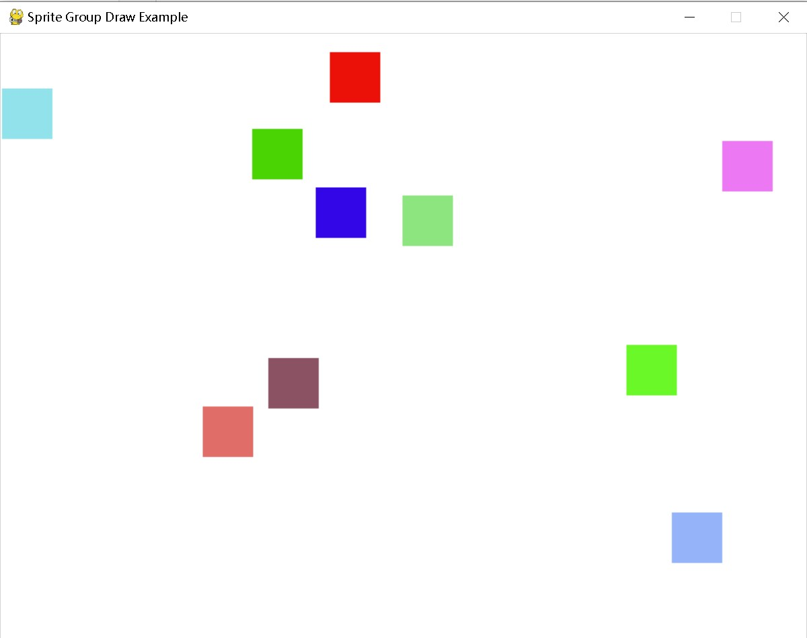

---
sprite 对象
---

# **pygame.sprite**

Pygame模块与基本游戏对象类

---

# 类 & 函数

- [pygame.sprite.Sprite](https://www.pygame.org/docs/ref/sprite.html#pygame.sprite.Sprite) — 可见游戏对象的简单基类。
- [pygame.sprite.WeakSprite](https://www.pygame.org/docs/ref/sprite.html#pygame.sprite.WeakSprite) — Sprite 的一个子类，它以弱方式引用组。这意味着它所属的任何组，只要没有在其他地方被引用，就会被自动回收。
- [pygame.sprite.DirtySprite](https://www.pygame.org/docs/ref/sprite.html#pygame.sprite.DirtySprite) — Sprite 的子类，具有更多属性和功能。
- [pygame.sprite.Group](https://www.pygame.org/docs/ref/sprite.html#pygame.sprite.Group) — 容器类，用于容纳和管理多个Sprite对象。
- [pygame.sprite.WeakDirtySprite](https://www.pygame.org/docs/ref/sprite.html#pygame.sprite.WeakDirtySprite) — WeakSprite 和 DirtySprite 的子类，结合了这两个类的优点。
- [pygame.sprite.RenderPlain](https://www.pygame.org/docs/ref/sprite.html#pygame.sprite.RenderPlain) — 与 pygame.sprite.Group 相同
- [pygame.sprite.RenderClear](https://www.pygame.org/docs/ref/sprite.html#pygame.sprite.RenderClear) — 与 pygame.sprite.Group 相同
- [pygame.sprite.RenderUpdates](https://www.pygame.org/docs/ref/sprite.html#pygame.sprite.RenderUpdates) — 跟踪脏更新的组子类。
- [pygame.sprite.OrderedUpdates](https://www.pygame.org/docs/ref/sprite.html#pygame.sprite.OrderedUpdates) — RenderUpdates 子类，按添加顺序绘制 Sprites。
- [pygame.sprite.LayeredUpdates](https://www.pygame.org/docs/ref/sprite.html#pygame.sprite.LayeredUpdates) — LayeredUpdates 是一个精灵组，它可以处理层并像 OrderedUpdates 一样绘制。
- [pygame.sprite.LayeredDirty](https://www.pygame.org/docs/ref/sprite.html#pygame.sprite.LayeredDirty) — LayeredDirty 组是用于 DirtySprite 对象的，继承自 LayeredUpdates。
- [pygame.sprite.GroupSingle](https://www.pygame.org/docs/ref/sprite.html#pygame.sprite.GroupSingle) — 容纳单个精灵的组容器。
- [pygame.sprite.spritecollide()](https://www.pygame.org/docs/ref/sprite.html#pygame.sprite.spritecollide) — 在一组精灵中查找与另一个精灵相交的精灵。
- [pygame.sprite.collide_rect](https://www.pygame.org/docs/ref/sprite.html#pygame.sprite.collide_rect)() — 使用矩形检测两个精灵之间的碰撞。
- [pygame.sprite.collide_rect_ratio](https://www.pygame.org/docs/ref/sprite.html#pygame.sprite.collide_rect_ratio)() — 使用按比例缩放的矩形进行两个精灵之间的碰撞检测。
- [pygame.sprite.collide_circle](https://www.pygame.org/docs/ref/sprite.html#pygame.sprite.collide_circle)() — 使用圆圈检测两个精灵之间的碰撞。
- [pygame.sprite.collide_circle_ratio](https://www.pygame.org/docs/ref/sprite.html#pygame.sprite.collide_circle_ratio)() — 使用按比例缩放的圆来检测两个精灵之间的碰撞。
- [pygame.sprite.collide_mask](https://www.pygame.org/docs/ref/sprite.html#pygame.sprite.collide_mask)() — 使用 Mask 检测两个精灵之间的碰撞。
- [pygame.sprite.groupcollide](https://www.pygame.org/docs/ref/sprite.html#pygame.sprite.groupcollide)() — 找出两组之间发生碰撞的所有精灵。
- [pygame.sprite.spritecollideany](https://www.pygame.org/docs/ref/sprite.html#pygame.sprite.spritecollideany)() — 简单测试一个精灵是否与组中的任何元素相交。

该模块包含几个简单的类，用于游戏中使用。主要有 Sprite 类和几个包含精灵的 Group 类。在使用 Pygame 时，这些类的使用是完全可选的。这些类相对轻量，只提供了大多数游戏中常见代码的起始点。

Sprite 类旨在作为游戏中不同类型对象的基类。此外，还有一个基础的 Group 类，简单地存储精灵。游戏可以创建新的 Group 类，以对其包含的特别定制的 Sprite 实例进行操作。

基本的 Group 类可以将其包含的精灵绘制到一个 Surface 上。Group.draw() 方法要求每个精灵具有 Surface.image 属性和 Surface.rect。Group.clear() 方法也需要这两个属性，可以用于用背景擦除所有精灵。此外，还有更高级的组：pygame.sprite.RenderUpdates() 和 pygame.sprite.OrderedUpdates()。

最后，该模块包含多个碰撞函数。这些函数帮助查找在多个组中具有相交边界矩形的精灵。要找到碰撞，精灵需要具有分配的 Surface.rect 属性。

这些组旨在高效地添加和移除精灵。同时，它们还允许快速测试某个精灵是否已经存在于组中。一个精灵可以存在于多个组中。游戏可以使用一些组来控制对象渲染，而使用完全不同的组来控制交互或玩家移动。与其在派生的 Sprite 类中添加类型属性或布尔值，不如考虑将精灵保持在有序的组中。这样可以在游戏中更方便地进行查找。

精灵和组通过 `add()` 和 `remove()` 方法管理它们之间的关系。这些方法可以接受单个或多个目标进行成员管理。这些类的默认初始化器也接受单个或列表形式的目标作为初始成员。反复将同一个精灵添加到组中或从组中移除是安全的。

虽然可以设计不从下面的 `Sprite` 和 `AbstractGroup` 类派生的精灵和组类，但强烈建议在添加精灵或组类时继承这些类。

请注意，精灵并不是线程安全的。如果使用线程，请自行进行锁定。

---

# 类 & 函数 详解

## pygame.sprite.**Sprite 类**

可视化游戏对象的简单基类。

Sprite(*groups) -> Sprite

可视化游戏对象的基类。派生类通常需要重写 `Sprite.update()` 方法，并为 `Sprite.image` 和 `Sprite.rect` 属性赋值。初始化器可以接受任意数量的组实例以进行添加。

在子类化 `Sprite` 时，请确保在将精灵添加到组之前调用基类的初始化器。例如：

```python
class Block(pygame.sprite.Sprite):

    # 构造函数。传入块的颜色，
    # 以及它的 x 和 y 位置
    def __init__(self, color, width, height):
       # 调用父类（Sprite）构造函数
       pygame.sprite.Sprite.__init__(self)

       # 创建一个块的图像，并用颜色填充它。
       # 这也可以是从磁盘加载的图像。
       self.image = pygame.Surface([width, height])
       self.image.fill(color)

       # 获取具有图像尺寸的矩形对象
       # 通过设置 rect.x 和 rect.y 的值来更新该对象的位置
       self.rect = self.image.get_rect()
```

---

### **函数**

- [pygame.sprite.Sprite.update](https://www.pygame.org/docs/ref/sprite.html#pygame.sprite.Sprite.update)() — 控制精灵行为的方法。
- [pygame.sprite.Sprite.add](https://www.pygame.org/docs/ref/sprite.html#pygame.sprite.Sprite.add)() — 将精灵添加到组中。
- [pygame.sprite.Sprite.remove](https://www.pygame.org/docs/ref/sprite.html#pygame.sprite.Sprite.remove)() — 从组中移除精灵。
- [pygame.sprite.Sprite.kill](https://www.pygame.org/docs/ref/sprite.html#pygame.sprite.Sprite.kill)() — 从所有组中移除精灵。
- [pygame.sprite.Sprite.alive](https://www.pygame.org/docs/ref/sprite.html#pygame.sprite.Sprite.alive)() — 该精灵是否属于任何组
- [pygame.sprite.Sprite.groups](https://www.pygame.org/docs/ref/sprite.html#pygame.sprite.Sprite.groups)() — 包含此精灵的组列表。

---

### 函数详解

#### **update**()

控制精灵行为的方法。

update(*args, **kwargs) -> None

该方法的默认实现不执行任何操作；它只是一个方便的“钩子”，你可以重写该方法。此方法由 `Group.update()` 调用，并接收你传递的任何参数。

如果不使用 `Group` 类中同名的便利方法，则无需使用此方法。

#### **add**()

将精灵添加到组中。

add(*groups) -> None

可以将任意数量的 `Group` 实例作为参数传递。精灵将被添加到它尚未成为成员的组中。

#### **remove**()

从组中移除精灵。

remove(*groups) -> None

可以将任意数量的 `Group` 实例作为参数传递。精灵将从它当前是成员的组中移除。

#### **kill**()

从所有组中移除精灵。

kill() -> None

精灵将从所有包含它的组中移除。这不会改变精灵的状态。在调用此方法后，仍然可以继续使用该精灵，包括将其添加到组中。

#### **alive**()

该精灵是否属于任何组

alive() -> bool

当精灵属于一个或多个组时，返回 `True`。

#### **groups**()

返回包含此精灵的组列表。

groups() -> group_list

返回包含此精灵的所有组的列表。

## pygame.sprite.**WeakSprite 类**

这是一个 Sprite 的子类，它以弱引用的方式引用其组。这意味着如果这个精灵所属的组没有在其他地方被引用，它将会被自动垃圾回收。

WeakSprite(*groups) -> WeakSprite

## pygame.sprite.**DirtySprite** 类

这是一个具有更多属性和功能的精灵子类。

DirtySprite(*groups) -> DirtySprite

`DirtySprite` 的额外属性及其默认值如下：

- dirty = 1 —— 如果设置为 1，精灵将被重新绘制，然后再次设置为 0。如果设置为 2，它将始终标记为脏（每帧都重新绘制，标志不会重置）。设置为 0 则表示精灵不脏，因此不会再次被重新绘制。
- blendmode = 0 —— `special_flags` 参数用于 `blit` 和 `blendmodes`
- source_rect = None —— `source rect` 是用于指定在 `self.image` 中绘制的区域，它相对于 `self.image` 的左上角 (0, 0) 进行定义
- visible = 1 —— 通常为 1，如果设置为 0，则不会被重新绘制（你还必须将其标记为脏，以便从屏幕上擦除）。
- layer = 0 —— （只读值，在添加到 LayeredDirty 时读取，详情请参见 LayeredDirty 的文档）

## pygame.sprite.**Group** 类

一个容器类，用于持有和管理多个精灵（Sprite）对象。

Group(*sprites) -> Group

一个简单的精灵对象容器。这个类可以被继承以创建具有更具体行为的容器。构造函数可以接受任意数量的精灵参数，以将其添加到组中。该组支持以下标准 Python 操作：

```
in      测试一个精灵是否被包含在内。
len     包含的精灵数量。
bool    测试是否包含任何精灵。
iter    遍历所有精灵。
```

该组中的精灵在 Python 3.6 及更高版本中是有序的。在 Python 3.6 以下版本中，绘制和遍历精灵时没有特定顺序。

---

### 函数

- [pygame.sprite.Group.sprites](https://www.pygame.org/docs/ref/sprite.html#pygame.sprite.Group.sprites) —— 该组包含的精灵列表。
- [pygame.sprite.Group.copy](https://www.pygame.org/docs/ref/sprite.html#pygame.sprite.Group.copy) —— 复制该组。
- [pygame.sprite.Group.add](https://www.pygame.org/docs/ref/sprite.html#pygame.sprite.Group.add) —— add Sprites to this Group
- [pygame.sprite.Group.remove](https://www.pygame.org/docs/ref/sprite.html#pygame.sprite.Group.remove) —— remove Sprites from the Group
- [pygame.sprite.Group.has](https://www.pygame.org/docs/ref/sprite.html#pygame.sprite.Group.has) —— 测试一个组是否包含精灵。
- [pygame.sprite.Group.update](https://www.pygame.org/docs/ref/sprite.html#pygame.sprite.Group.update) —— 调用所包含精灵的更新方法。
- [pygame.sprite.Group.draw](https://www.pygame.org/docs/ref/sprite.html#pygame.sprite.Group.draw) —— 绘制精灵图像。
- [pygame.sprite.Group.clear](https://www.pygame.org/docs/ref/sprite.html#pygame.sprite.Group.clear) —— 在精灵上绘制背景。
- [pygame.sprite.Group.empty](https://www.pygame.org/docs/ref/sprite.html#pygame.sprite.Group.empty) —— 移除所有精灵。

---

### 函数详解

#### **sprites**()

返回该组包含的精灵列表。

sprites() -> sprite_list

返回该组包含的所有精灵的列表。您也可以从组中获取迭代器，但在修改组时无法进行迭代。

#### **copy**()

复制该组。

copy() -> Group

创建一个新的组，其中包含与原始组相同的所有精灵。如果您已经对子类进行了扩展，则新对象将具有与原始组相同的（子）类。这仅在派生类的构造函数接受与组类相同的参数时有效。

#### **add**()

向该组添加精灵。

add(*sprites) -> None

向该组添加任意数量的精灵。此操作仅会添加尚未成为该组成员的精灵。

每个精灵参数也可以是一个包含精灵的迭代器。

#### **remove**()

从该组中移除精灵。

remove(*sprites) -> None

从该组中移除任意数量的精灵。此操作仅会移除已经是该组成员的精灵。

每个精灵参数也可以是一个包含精灵的迭代器。

#### **has**()

测试该组是否包含精灵。

has(*sprites) -> bool

如果该组包含所有给定的精灵，则返回 True。这与在组上使用 "in" 操作符相似（例如，“if sprite in group: ...”），用于测试单个精灵是否属于该组。

每个精灵参数也可以是一个包含精灵的迭代器。

#### **update**()

对包含的精灵调用更新方法。

update(*args, **kwargs) -> None

对组中的所有精灵调用 `update()` 方法。基础精灵类具有一个 `update` 方法，可以接受任意数量的参数，但默认不执行任何操作。传递给 `Group.update()` 的参数将被转发给每个精灵。

无法获取来自 `Sprite.update()` 方法的返回值。

也就是调用 Sprite 类自带的 update() 函数，该函数用户可以重写。

#### **draw**()

绘制精灵图像。

draw(Surface, bgsurf=None, special_flags=0) -> List[Rect]

将包含的精灵绘制到指定的表面上。此方法使用 `Sprite.image` 属性作为源表面，并使用 `Sprite.rect` 确定位置。`special_flags` 会传递给 `Surface.blit()`。`bgsurf` 在该方法中未使用，但 `LayeredDirty.draw()` 方法会用到它。

组中的精灵没有特定顺序，因此绘制顺序是任意的。

示例：

```python
import pygame
import random

# 初始化 Pygame
pygame.init()

# 创建窗口
screen = pygame.display.set_mode((800, 600))
pygame.display.set_caption("Sprite Group Draw Example")

# 定义精灵类
class MySprite(pygame.sprite.Sprite):
    def __init__(self, color, width, height):
        super().__init__()
        self.image = pygame.Surface((width, height))
        self.image.fill(color)
        self.rect = self.image.get_rect()
        self.rect.x = random.randint(0, 800 - width)
        self.rect.y = random.randint(0, 600 - height)

# 创建精灵组
all_sprites = pygame.sprite.Group()

# 添加一些精灵到组中
for _ in range(10):
    sprite = MySprite((random.randint(0, 255), random.randint(0, 255), random.randint(0, 255)), 50, 50)
    all_sprites.add(sprite)

# 主循环
running = True
while running:
    for event in pygame.event.get():
        if event.type == pygame.QUIT:
            running = False

    # 清屏
    screen.fill((255, 255, 255))

    # 绘制精灵组
    all_sprites.draw(screen)

    # 更新显示
    pygame.display.flip()

# 退出 Pygame
pygame.quit()
```

结果：


#### **clear**()

在精灵上绘制背景。

clear(Surface_dest, background) -> None

擦除上次 `Group.draw()` 调用中使用的精灵。通过用背景填充绘制的精灵位置来清除目标表面。

背景通常是一个与目标表面尺寸相同的图像表面。不过，它也可以是一个回调函数，该函数接受两个参数：目标表面和要清除的区域。背景回调函数将在每次清除时被调用多次。

下面是一个示例回调函数，用于用纯红色清除精灵：

```
def clear_callback(surf, rect):
    color = 255, 0, 0
    surf.fill(color, rect)
```

#### **empty**()

删除所有精灵

empty() -> None

删除该组中的所有精灵。

---

## pygame.sprite.**WeakDirtySprite 类**

WeakSprite 和 DirtySprite 的子类，结合了这两个类的优点。

WeakDirtySprite(*groups) -> WeakDirtySprite

---

## pygame.sprite.**RenderPlain** 类

与 pygame.sprite.Group 相同

该类是 pygame.sprite.Group() 的别名。它没有额外的功能。

---

## pygame.sprite.**RenderClear** 类

与 pygame.sprite.Group 相同

该类是 pygame.sprite.Group() 的别名。它没有额外的功能。

---

## pygame.sprite.**RenderUpdates** 类

跟踪脏更新的组子类。

RenderUpdates(*sprites) -> RenderUpdates

这个类派生自 `pygame.sprite.Group()`。它具有一个扩展的 `draw()` 方法，用于跟踪屏幕的变化区域。

**函数：**

- [pygame.sprite.RenderUpdates.draw](https://www.pygame.org/docs/ref/sprite.html#pygame.sprite.RenderUpdates.draw)()

   绘制精灵图像并跟踪变化区域。

draw(surface, bgsurf=None, special_flags=0) -> Rect_list

将所有精灵绘制到表面上，功能与 `Group.draw()` 相同。此方法还返回一个矩形区域的列表，这些区域在屏幕上已被更改。返回的变化包括之前 `Group.clear()` 调用所影响的屏幕区域。`special_flags` 被传递给 `Surface.blit()`。

返回的矩形列表应传递给 `pygame.display.update()`。这将有助于在软件驱动的显示模式下提升性能。这种类型的更新通常仅对背景没有动画的目标有效。

---

## pygame.sprite.**OrderedUpdates**()

`RenderUpdates` 的一个子类，按照添加顺序绘制精灵。

OrderedUpdates(*sprites) -> OrderedUpdates

这个类派生自 `pygame.sprite.RenderUpdates()`。它维护了精灵添加到组中的顺序，以便进行渲染。这使得从组中添加和移除精灵的速度比普通组稍慢。


