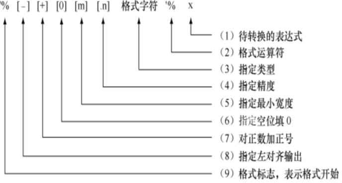

## 字符串

GB2312是我国制定的中文编码，使用1个字节表示英语，2个字节表示中文；GBK是GB2312的扩充，而CP936是微软在GBK基础上开发的编码方式。GB2312、GBK和CP936都是使用2个字节表示中文。

UTF-8国际通过的编码格式，它包含了全世界所有国家需要用到的字符，对全世界所有国家需要用到的字符进行了编码，以1个字节表示英语字符(兼容ASCII)，以3个字节表示常见汉字，还有些语言的符号使用2个字节（例如俄语和希腊语符号）或者4个字节。

Python 3.x完全支持中文字符，默认使用UTF8编码格式，无论是一个数字、英文字母，还是一个汉字，在统计字符串长度时都按一个字符对待和处理。

```python
>>> s = '中国ChinaNUM1'
>>> len(s)
11
```

---

### 字符串格式化

（1）“旧式”字符串解析（%操作符）

（2）“新式”字符串格式化（str.format）

（3）  字符串插值/f-Strings（Python 3.6+）

#### %操作符

“%”是Python风格的字符串格式化操作符，非常类似C语言里的printf()函数的字符串格式化。可以让很轻松的做基于位置的字符串格式化。



常用格式字符：

| **格式字符** | **说明**                       |
| ------------ | ------------------------------ |
| %s           | 字符串 (采用str()的显示)       |
| %r           | 字符串 (采用repr()的显示)      |
| %c           | 单个字符                       |
| %d           | 十进制整数                     |
| %i           | 十进制整数                     |
| %o           | 八进制整数                     |
| %x           | 十六进制整数                   |
| %e           | 指数 (基底写为e)               |
| %E           | 指数 (基底写为E)               |
| %f、%F       | 浮点数                         |
| %g           | 指数(e)或浮点数 (根据显示长度) |
| %G           | 指数(E)或浮点数 (根据显示长度) |
| %%           | 一个字符%                      |

如果你想要在单个字符串里做多个替换的话，你需要把右操作符放入一个元组中。如

```python
>>> print('a: %d, b: %d' % (12, 34))
a: 12, b: 34
>>> print('%10.2f' % 12.3456)
     12.35
```

---

#### str.format()

format() 方法的语法格式如下：

str.format(args)

str 用于指定字符串的显示样式；args 用于指定要进行格式转换的项，如果有多项，之间有逗号进行分割。

难点在于搞清楚str显示样式的书写格式，创建显示模板时，需要使用{}和：里指定占位符，完整格式如下：

{ [index][ : [ [fill] align] [sign] [#] [width] [.precision] [type] ] }

index：指定：后边设置的格式要作用到 args 中第几个数据，数据的索引值从 0 开始。如果省略此选项，则会根据 args 中数据的先后顺序自动分配。

fill：指定空白处填充的字符。注意，当填充字符为逗号(,)且作用于整数或浮点数时，该整数（或浮点数）会以逗号分隔的形式输出。

align：指定数据的对齐方式，<(左对齐)，>(右对齐)，=(数据右对齐，同时将符号放置在填充内容的最左侧), ^（居中）

sign：指定有无符号数， +(正数前加正号，负数前加负号)， -(正数前不加正号，负数前加负号)，(空格)正数前加空格，负数前加负号， #(对于二进制数、八进制数和十六进制数，使用此参数，各进制数前会分别显示 0b、0o、0x前缀；)

width：指定输出数据时所占的宽度

.precision：指定保留的小数位数

type：指定输出数据的具体类型

```python
>>> print("The number {0:,} in hex is: {0:#x}, the number {1} in oct is {1:#o}".format(5555,55))
The number 5,555 in hex is: 0x15b3, the number 55 in oct is 0o67
    
>>> print("The number {1:,} in hex is: {1:#x}, the number {0} in oct is {0:o}".format(5555,55))
The number 55 in hex is: 0x37, the number 5555 in oct is 12663
    
>>> position = (5, 8, 13)
>>> print("X:{0[0]};Y:{0[1]};Z:{0[2]}".format(position))
X:5;Y:8;Z:13    
```

---

#### f-strings

从Python 3.6.x开始支持一种新的字符串格式化方式，称为“f-strings”。f-string 格式化 就是在字符串模板前面加上f，然后占位符使用{} ,里面直接放入对应的数据对象。

```python
>>> width = 8
>>> height = 6
>>> print(f'Rectangle of {width}*{height}\nArea:{width*height}')
Rectangle of 8*6
Area:48
>>> print(f'{width*height=}')           # Python 3.8开始支持
width*height=48
print(f'税前薪资是：{salary:<8}元， 缴税：{tax:<8}元， 税后薪资是：{aftertax:<8}元')
税前薪资是：8320 元， 缴税：2080.0 元， 税后薪资是：6240.0 元
>>> print(f'{16:#x}')
0x10
```

---

### 字符串常用方法

**1、`find()、rfind()、index()、rindex()、count()`**

find()和rfind方法分别用来查找一个字符串在另一个字符串指定范围（默认是整个字符串）中首次和最后一次出现的位置，如果不存在则返回-1；

```python
str.find(sub[,start[,end]])
```

index()和rindex()方法用来返回一个字符串在另一个字符串指定范围中首次和最后一次出现的位置，如果不存在则**抛出异常**；

count()方法用来返回一个字符串在当前字符串中出现的次数。

**2、`split()、rsplit()、partition()、rpartition()`**

split()和rsplit()方法分别用来以指定字符为分隔符，这些子串会被保存到列表中（不包含分隔符）,把当前字符串从左往右或从右往左分隔成多个字符串，并返回包含分隔结果的列表；如果不指定分隔符，则字符串中的任何空白符号（空格、换行符、制表符等）都将被认为是分隔符，并删除切分结果中的空字符串。然而，明确传递参数指定split()使用的分隔符时，情况是不一样的，会保留切分得到的空字符串。

```python
>>> 'a,,,bb,,ccc'.split(',')       #每个逗号都被作为独立的分隔符
['a', '', '', 'bb', '', 'ccc']
>>> 'a\t\t\tbb\t\tccc'.split('\t') #每个制表符都被作为独立的分隔符
['a', '', '', 'bb', '', 'ccc']
>>> 'a\t\t\tbb\t\tccc'.split()     #连续多个制表符被作为一个分隔符
['a', 'bb', 'ccc']
```

split()和rsplit()方法还允许指定最大分割次数。

```python
>>> s.rsplit(None, 1)
['\n\nhello\t\t world \n\n\n My name is', 'Dong']
```

sep：用于指定分隔符，可以包含多个字符。此参数默认为 None，表示所有空字符，包括空格、换行符“\n”、制表符“\t”等。 maxsplit：可选参数，用于指定分割的次数。

partition()和rpartition()用来以指定字符串为分隔符将原字符串分隔为3部分，即分隔符前的字符串、分隔符字符串、分隔符后的字符串，如果指定的分隔符不在原字符串中，则返回原字符串和两个空字符串。

```python
>>> s = 'so,far,away'
>>> s.partition(',')
('so', ',', 'far,away')
>>> s.rpartition(',')
('so,far', ',', 'away')
```

**3、`join()`**

字符串连接join() ,它是 split() 方法的逆方法，用来将列表（或元组）中包含的多个字符串连接成一个字符串。

```python
>>> li = ["apple", "peach", "banana", "pear"]
>>> ','.join(li)
'apple,peach,banana,pear'
>>> '.'.join(li)
'apple.peach.banana.pear'
>>> '::'.join(li)
'apple::peach::banana::pear'

>>> ','.join(['good']*5)
'good,good,good,good,good'
```

**4、`lower()、upper()、capitalize()、title()、swapcase()`**

```python
>>> s = "What is Your Name?"
>>> s.lower()                   #返回小写字符串
'what is your name?'
>>> s.upper()                   #返回大写字符串
'WHAT IS YOUR NAME?'
>>> s.capitalize()              #字符串首字符大写
'What is your name?'
>>> s.title()                   #每个单词的首字母大写
'What Is Your Name?'
>>> s.swapcase()                #大小写互换
'wHAT IS yOUR nAME?'
```

**5、`replace()`**

查找替换replace()，类似于Word中的“全部替换”功能。

```python
>>> words = ('测试', '非法', '暴力', '话')
>>> text = '这句话里含有非法内容'
>>> for word in words:
    if word in text:
        text = text.replace(word, '***')		
>>> text
'这句***里含有***内容'
```

**6、`maketrans()`**

字符串对象的maketrans()方法用来生成字符映射表，而translate()方法用来根据映射表中定义的对应关系转换字符串并替换其中的字符，使用这两个方法的组合可以同时处理多个字符。

```python
str.maketrans(intab, outtab)
```

```python
#创建映射表，将字符"abcdef123"一一对应地转换为"uvwxyz@#$"
>>> table = ''.maketrans('abcdef123', 'uvwxyz@#$')
>>> s = "Python is a great programming language. I like it!"
>>> s.translate(table)          #按映射表进行替换
'Python is u gryut progrumming lunguugy. I liky it!'

>>> table = ''.maketrans('0123456789', '零一二三四伍陆柒捌玖')
>>> '2018年12月31日'.translate(table)
'二零一捌年一二月三一日'
```

**7、`strip()、rstrip()、lstrip()`**

```python
>>> s = " abc  "
>>> s.strip()                             #删除空白字符(从两边向中间删)
'abc'
>>> '\n\nhello world   \n\n'.strip()      #删除空白字符
'hello world'
>>> "aaaassddf".strip("a")                #删除指定字符
'ssddf'
>>> "aaaassddf".strip("af")
'ssdd'
>>> "aaaassddfaaa".rstrip("a")            #删除字符串右端指定字符
'aaaassddf'
>>> "aaaassddfaaa".lstrip("a")            #删除字符串左端指定字符
'ssddfaaa'
```

这三个方法的参数指定的字符串并不作为一个整体对待，而是在原字符串的两侧、右侧、左侧删除参数字符串中包含的所有字符，一层一层地从外往里扒

```python
>>> 'aabbccddeeeffg'.strip('af')  #字母f不在字符串两侧，所以不删除
'bbccddeeeffg'
>>> 'aabbccddeeeffg'.strip('gaf')
'bbccddeee'
>>> 'aabbccddeeeffg'.strip('gaef')
'bbccdd'
>>> 'aabbccddeeeffg'.strip('gbaef')
'ccdd'
>>> 'aabbccddeeeffg'.strip('gbaefcd')
''
```

**8、`eval()`**

内置函数eval()函数用来执行一个字符串表达式，并返回表达式的值（会去掉两边的引号）

```python
>>> eval("3+4")                             #计算表达式的值
7
>>> a = 3
>>> b = 5
>>> eval('a+b')                             #要求变量a和b已存在
8
>>> import math
>>> eval('math.sqrt(3)')
1.7320508075688772
>>> eval('aa')                              #当前上下文中不存在对象aa
NameError: name 'aa' is not defined
>>> eval('*'.join(map(str, range(1, 6))))   #5的阶乘
120
```

eval()函数是非常危险的

```python
>>> a = input("Please input:")
Please input:__import__('os').startfile(r'C:\Windows\notepad.exe')
>>> eval(a)
>>> eval("__import__('os').system('md testtest')")
```

9、`成员判断，关键字in`

```python
>>> "a" in "abcde"     #测试一个字符中是否存在于另一个字符串中
True
>>> 'ab' in 'abcde'
True
>>> 'ac' in 'abcde'    #关键字in左边的字符串作为一个整体对待
False
>>> "j" in "abcde"
False
```

10、`s.startswith(t)、s.endswith(t)`

判断字符串是否以指定字符串开始或结束

```python
>>> s = 'Beautiful is better than ugly.'
>>> s.startswith('Be')           #检测整个字符串
True
>>> s.startswith('Be', 5)        #指定检测范围起始位置
False
>>> s.startswith('Be', 0, 5)     #指定检测范围起始和结束位置
True
>>> import os
>>> [filename for filename in os.listdir(r'c:\\')
     if filename.endswith(('.bmp','.jpg','.gif'))]
```

11、`center()、ljust()、rjust()`

center()、ljust()、rjust()，返回指定宽度的新字符串，原字符串居中、左对齐或右对齐出现在新字符串中，如果指定宽度大于字符串长度，则使用指定的字符（默认为空格）进行填充。

```python
>>> 'Hello world!'.center(20)        #居中对齐，以空格进行填充
'    Hello world!    '
>>> 'Hello world!'.center(20, '=')   #居中对齐，以字符=进行填充
'====Hello world!===='
>>> 'Hello world!'.ljust(20, '=')    #左对齐
'Hello world!========'
>>> 'Hello world!'.rjust(20, '=')    #右对齐
'========Hello world!'
```

12、`isalnum()、isalpha()、isdigit()、isdecimal()、isnumeric()、isspace()、isupper()、islower()`

用来测试字符串是否为数字或字母、是否为字母、是否为数字字符、是否为空白字符、是否为大写字母以及是否为小写字母。

isnumeric()方法支持汉字数字、罗马数字

13、切片也适用于字符串，但仅限于读取其中的元素，不支持字符串修改。

---

### 可变字符串

在Python中，字符串属于不可变对象，不支持原地修改，如果需要修改其中的值，只能重新创建一个新的字符串对象。然而，如果确实需要一个支持原地修改的数据对象，可以使用io.StringIO对象或array模块。

StringIO顾名思义就是在内存中读写str。要把str写入StringIO，我们需要先创建一个StringIO，然后，像文件一样写入即可

```python
>>> import io
>>> s = "Hello, world"
>>> sio = io.StringIO(s)
>>> sio.getvalue()
'Hello, world'
>>> sio.seek(7)
7
>>> sio.write("there!")
6
>>> sio.getvalue()
'Hello, there!'
```

```python
>>> import array
>>> a = array.array('u', s)# Unicode character
>>> print(a)
array('u', 'Hello, world')
>>> a[0] = 'y'
>>> print(a)
array('u', 'yello, world')
>>> a.tounicode()
'yello, world'
```

---

### 中文分词与拼音处理

```python
>>> import jieba    #导入jieba模块, jieba库是一款优秀的 Python 第三方中文分词库
>>> x = '分词的准确度直接影响了后续文本处理和挖掘算法的最终效果。'
>>> jieba.cut(x)                     #使用默认词库进行分词
<generator object Tokenizer.cut at 0x000000000342C990>
>>> list(_)
['分词', '的', '准确度', '直接', '影响', '了', '后续', '文本处理', '和', '挖掘', '算法', '的', '最终', '效果', '。']
>>> jieba.lcut('Python可以这样学，Python程序设计开发宝典') #直接给出列表
Dumping model to file cache C:\Users\d\AppData\Local\Temp\jieba.cache
['Python', '可以', '这样', '学', '，', 'Python', '程序设计', '开发', '宝典']
>>> list(jieba.cut('花纸杯'))
['花', '纸杯']
>>> jieba.add_word('花纸杯')         #增加词条
>>> list(jieba.cut('花纸杯'))        #使用新词库进行分词
['花纸杯']
```

```python
>>> from jieba import posseg
>>> text = '分词的准确度直接影响了后续文本处理和挖掘算法的最终效果。'
>>> for word, tag in posseg.cut(text):  # 得到分词及其词性
    print(word, tag, sep=':', end='\t')
	
分词:n	的:uj	准确度:n	直接:ad	影响:vn	了:ul	后续:v	文本处理:n	和:c	挖掘:v	算法:n	的:uj	最终:d	效果:n	。:x
```

```python
>>> import snownlp   #导入snownlp模块,针对中文文本进行文本挖掘的,中#文分词，词性标注，文本分类等
>>> snownlp.SnowNLP('学而时习之，不亦说乎').words
['学而', '时习', '之', '，', '不亦', '说乎']
>>> snownlp.SnowNLP(x).words
['分词', '的', '准确度', '直接', '影响', '了', '后续', '文本', '处理', '和', '挖掘', '算法', '的', '最终', '效果', '。']
```

```python
应用：过滤字符串中的空白字符和中英文标点符号。
from jieba import cut

def delPuncs(s):
    f = lambda word: len(word)>1 or '\u4e00'<=word<='\u9fa5'
    return ''.join(filter(f, cut(s)))

sentence = '''
东边来个小朋友叫小松，手里拿着一捆葱。西边来个小朋友叫小丛，手里拿着小闹钟。
小松手里葱捆得松，掉在地上一些葱。小丛忙放闹钟去拾葱，帮助小松捆紧葱.
小松夸小丛像雷锋，小丛说小松爱劳动。'''
print(delPuncs(sentence))
```

```python
>>> from pypinyin import lazy_pinyin, pinyin
>>> lazy_pinyin('董付国')               #返回拼音
['dong', 'fu', 'guo']
>>> lazy_pinyin('董付国', 1)            #带声调的拼音
['dǒng', 'fù', 'guó']
>>> lazy_pinyin('董付国', 2)            #另一种拼音形式，数字表示前面字母的声调
['do3ng', 'fu4', 'guo2']
>>> lazy_pinyin('董付国', 3)            #只返回拼音首字母
['d', 'f', 'g']
>>> lazy_pinyin('重要', 1)              #能够根据词组智能识别多音字
['zhòng', 'yào']
>>> lazy_pinyin('重阳', 1)
['chóng', 'yáng']
>>> pinyin('重阳')                      #返回拼音
[['chóng'], ['yáng']]
>>> pinyin('重阳节', heteronym=True)    #返回多音字的所有读音
[['zhòng', 'chóng', 'tóng'], ['yáng'], ['jié', 'jiē']]
```

```python
>>> import jieba          #其实不需要导入jieba，这里只是说明已安装
>>> x = '中英文混合test123'
>>> lazy_pinyin(x)        #自动调用已安装的jieba扩展库分词功能
['zhong', 'ying', 'wen', 'hun', 'he', 'test123']
>>> lazy_pinyin(jieba.cut(x))
['zhong', 'ying', 'wen', 'hun', 'he', 'test123']
>>> x = '山东烟台的大樱桃真好吃啊'
>>> sorted(x, key=lambda ch: lazy_pinyin(ch)) #按拼音对汉字进行排序
['啊', '吃', '大', '的', '东', '好', '山', '台', '桃', '烟', '樱', '真']
```

