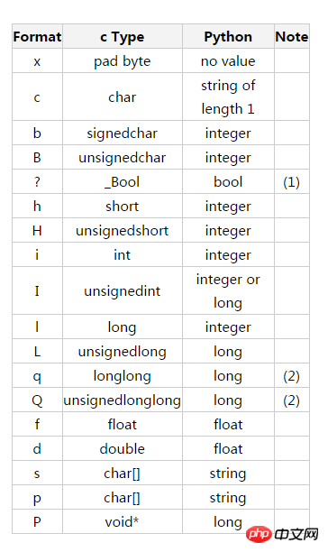

## 基本操作

按文件中数据的组织形式把文件分为**文本文件**和**二进制文件**两类。

### open() 函数

打开文件：使用 open() 函数，该函数会返回一个文件对象；

```
open(file, mode='r', buffering=-1, encoding=None, errors=None,
     newline=None, closefd=True, opener=None)
```

- file参数指定了被打开的文件名称。 

- mode参数指定了打开文件后的处理方式。

- buffering参数指定了读写文件的缓存模式。0表示不缓存，1表示缓存，如大于1则表示缓冲区的大小。默认值-1表示由系统管理缓存。

- encoding参数指定对文本进行编码和解码的方式，只适用于文本模式，可以使用Python支持的任何格式，如GBK、utf8、CP936等等。
- 如果执行正常，open()函数返回1个文件对象，通过该文件对象可以对文件进行读写操作。如果指定文件不存在、访问权限不够、磁盘空间不足或其他原因导致创建文件对象失败则抛出异常。
- 当对文件内容操作完以后，一定要关闭文件对象，这样才能保证所做的任何修改都确实被保存到文件中。

```
fp.close()
```

---

### with as 语句

使用with 语句 打开文件，像这样，就不需要我们调用close方法关闭文件。 Python解释器会帮我们调用文件对象的close方法,而程序员不需要主动调用close。

with语句的用法如下：

```python
with open(filename, mode, encoding) as fp:
    #这里写通过文件对象fp读写文件内容的语句
    
    
with open('test.txt', 'r') as src, open('test_new.txt', 'w') as dst:
    dst.write(src.read())
```

使用 with as 语句，即便最终没有关闭文件，修改文件内容的操作也能成功。

---

### 文件对象

- 文件打开方式

| **模式** | **说明**                                             |
| -------- | ---------------------------------------------------- |
| r        | 读模式（默认模式，可省略），如果文件不存在则抛出异常 |
| w        | 写模式，如果文件已存在，先清空原有内容               |
| x        | 写模式，创建新文件，如果文件已存在则抛出异常         |
| a        | 追加模式，不覆盖文件中原有内容                       |
| b        | 二进制模式（可与其他模式组合使用）                   |
| t        | 文本模式（默认模式，可省略）                         |
| +        | 读、写模式（可与其他模式组合使用）                   |

- 文件对象常用属性

| **属性** | **说明**                                   |
| -------- | ------------------------------------------ |
| `buffer` | `返回当前文件的缓冲区对象`                 |
| `closed` | `判断文件是否关闭，若文件已关闭则返回True` |
| `fileno` | `文件号，一般不需要太关心这个数字`         |
| `mode`   | `返回文件的打开模式`                       |
| `name`   | `返回文件的名称`                           |

- 文件对象常用方法

| 方法                     | 功能说明                                                     |
| ------------------------ | ------------------------------------------------------------ |
| `close()`                | `把缓冲区的内容写入文件，同时关闭文件，并释放文件对象`       |
| `read([size])`           | `从文本文件中读取size个字符（Python 3.x）的内容作为结果返回，或从二进制文件中读取指定数量的字节并返回，如果省略size则表示读取所有内容` |
| `readable()`             | `测试当前文件是否可读`                                       |
| `readline()`             | `从文本文件中读取一行内容作为结果返回`                       |
| `readlines()`            | `把文本文件中的每行文本作为一个字符串存入列表中，返回该列表，对于大文件会占用较多内存，不建议使用` |
| `seek(offset[, whence])` | `把文件指针移动到新的字节位置，offset表示相对于whence的位置。whence为0表示从文件头开始计算，1表示从当前位置开始计算，2表示从文件尾开始计算，默认为0` |
| `write(s)`               | `把s的内容写入文件`                                          |
| `writable()`             | `测试当前文件是否可写`                                       |
| `writelines(s)`          | `把字符串列表写入文本文件，不添加换行符`                     |

---

---

## 文本文件

- 例1：向文本文件中写入内容，然后再读出。

```python
s = 'Hello world\n文本文件的读取方法\n文本文件的写入方法\n'

with open('sample.txt', 'w') as fp:    #默认使用cp936编码
    fp.write(s)

with open('sample.txt') as fp:         #默认使用cp936编码
    print(fp.read())
```

- 例2：读取并显示文本文件的前5个字符。

```python
with open('sample.txt', 'r') as f:
    s = f.read(5)

print('s=',s)
print('字符串s的长度(字符个数)=', len(s))
```

- 例3：读取并显示文本文件所有行。

```python
with open('sample.txt') as fp:      #假设文件采用CP936编码
    for line in fp:                 #文件对象可以直接迭代
        print(line)
```

- 例4：移动文件指针，然后读取并显示文本文件中的内容。

```python
>>> s = '中国山东烟台SDIBT'
>>> with open(r'D:\sample.txt', 'w') as fp:
    fp.write(s)

>>> fp = open(r'D:\sample.txt', 'r')
>>> print(fp.read(3))
中国山
>>> fp.seek(2)
2
>>> print(fp.read(1))
国
>>> fp.seek(13)
13
>>> print(fp.read(1))
D
>>> fp.seek(3)
3
>>> print(fp.read(1))
UnicodeDecodeError: 'gbk' codec can't decode byte 0xfa in position 0: illegal multibyte sequence
```

例5：用 print() 函数向文件写入数据

```python
with open('白生.txt', 'a', encoding='utf-8') as fp:
    print('print()函数也能向文件中写入数据', file=fp)
```


---

## 二进制文件

所谓**序列化**，简单地说就是把内存中的数据在不丢失其类型信息的情况下转成对象的二进制形式的过程（程序的各种类型数据对象 变成 表示该数据对象的 二进制形式这个过程 称之为 序列化，说白了，就是将代码转化为字符串的形式，进行传输和存储），对象序列化后的形式经过正确的**反序列化**过程应该能够准确无误地恢复为原来的对象。

### 使用pickle模块

Python 中有个序列化过程叫作 pickle，它能够实现任意对象与文本之间的相互转化，也可以实现任意对象与二进制之间的相互转化。也就是说，pickle 可以实现 Python 对象的存储及恢复。

pickle 模块提供了以下 4 个函数供我们使用：

- dumps()：将 Python 中的对象序列化成二进制对象，并返回；
      pickle.dumps(obj[, protocol])将obj对象序列化为string形式，
- loads()：读取给定的二进制对象数据，并将其转换为 Python 对象；
- dump()：将 Python 中的对象序列化成二进制对象，并写入文件；
      pickle.dump(obj, file, [,protocol])
- load()：读取指定的序列化数据文件，并返回对象。

以上这 4 个函数可以分成两类，其中 dumps 和 loads 实现基于内存的 Python 对象与二进制互转；dump 和 load 实现基于文件的 Python 对象与二进制互转。

例1：写入二进制文件。

```python
import pickle

i = 13000000
a = 99.056
s = '中国人民123abc'
lst = [[1, 2, 3], [4, 5, 6], [7, 8, 9]]
tu = (-5, 10, 8)
coll = {4, 5, 6}
dic = {'a':'apple', 'b':'banana', 'g':'grape', 'o':'orange'}
data = [i, a, s, lst, tu, coll, dic]

with open('sample_pickle.dat', 'wb') as f:
    try:
         pickle.dump(len(data), f) #表示后面将要写入的数据个数
         for item in data:
              pickle.dump(item, f)
    except:
        print('写文件异常!')        #如果写文件异常则跳到此处执行
```

例2：读取二进制文件。

```python
import pickle

with open('sample_pickle.dat', 'rb') as f:
    n = pickle.load(f)        #读出文件的数据个数
    for i in range(n):
        x = pickle.load(f)
        print(x)
```

---

### 使用struct模块

```
struct.pack(fmt, v1, v2, …) 
struct.pack用于将Python的值根据格式符，转换为字符串

struct.unpack(fmt, va, v2, ...)		
struct.unpack与上面作用相反
```



例1：使用struct模块写入二进制文件。

```python
import struct

n = 1300000000
x = 96.45
b = True
s = 'a1@中国'
sn = struct.pack('if?', n, x, b)       #序列化
with open('sample_struct.dat', 'wb') as fp:
    fp.write(sn)                       #写入字节串 
    fp.write(s.encode())               #字符串直接编码为字节串写入
```

例2：使用struct模块读取二进制文件。

```python
import struct

with open('sample_struct.dat', 'rb') as fp:
    sn = fp.read(9)
    tu = struct.unpack('if?', sn) 
    print(tu)
    n, x, bl = tu
    print('n=', n)
    print('x=', x)
    print('bl=', bl)
    s = fp.read(9).decode()
    print('s=', s)
```

---

## os与os.path模块

- os模块常用的文件操作函数

| **方法**                                                  | **功能说明**                                             |
| --------------------------------------------------------- | -------------------------------------------------------- |
| `access(path, mode)`                                      | 测试是否可以按照mode指定的权限访问文件                   |
| `chdir(path)`                                             | 把path设为当前工作目录                                   |
| `chmod(path, mode, *, dir_fd=None, follow_symlinks=True)` | 改变文件的访问权限                                       |
| `curdir`                                                  | 当前文件夹                                               |
| `environ`                                                 | 包含系统环境变量和值的字典                               |
| `extsep`                                                  | 当前操作系统所使用的文件扩展名分隔符                     |
| `get_exec_path()`                                         | 返回可执行文件的搜索路径                                 |
| `getcwd()`                                                | 返回当前工作目录/查看当前所在路径                        |
| `listdir(path)`                                           | 返回path目录下的文件,结果是列表                          |
| `open(path, flags, mode=0o777, *, dir_fd=None)`           | 按照mode指定的权限打开文件，默认权限为可读、可写、可执行 |
| `popen(cmd, mode='r', buffering=-1)`                      | 创建进程，启动外部程序                                   |

| **方法**                            | **功能说明**                                                 |
| ----------------------------------- | ------------------------------------------------------------ |
| `remove(path)`                      | 删除指定的文件，要求用户拥有删除文件的权限，并且文件没有只读或其他特殊属性 |
| `rename(src, dst)`                  | 重命名文件或目录，可以实现文件的移动，若目标文件已存在则抛出异常，不能跨越磁盘或分区 |
| `replace(old, new)`                 | 重命名文件或目录，若目标文件已存在则直接覆盖，不能跨越磁盘或分区 |
| `scandir(path='.')`                 | 返回包含指定文件夹中所有DirEntry对象的迭代对象，遍历文件夹时比listdir()更加高效 |
| `sep`                               | 当前操作系统所使用的路径分隔符                               |
| `startfile(filepath [, operation])` | 使用关联的应用程序打开指定文件或启动指定应用程序             |
| `stat(path)`                        | 返回文件的所有属性                                           |
| `system()`                          | 启动外部程序                                                 |
| `truncate(path, length)`            | 将文件截断，只保留指定长度的内容                             |
| `write(fd, data)`                   | 将bytes对象data写入文件fd                                    |

- os.path常用的文件操作函数

| **方法**              | **功能说明**                     |
| --------------------- | -------------------------------- |
| `abspath(path)`       | 返回给定路径的绝对路径           |
| `basename(path)`      | 返回指定路径的最后一个组成部分   |
| `commonpath(paths)`   | 返回给定的多个路径的最长公共路径 |
| `commonprefix(paths)` | 返回给定的多个路径的最长公共前缀 |
| `dirname(p)`          | 返回给定路径的文件夹部分         |
| `exists(path)`        | 判断文件是否存在                 |
| `getatime(filename)`  | 返回文件的最后访问时间           |
| `getctime(filename)`  | 返回文件的创建时间               |
| `getmtime(filename)`  | 返回文件的最后修改时间           |
| `getsize(filename)`   | 返回文件的大小                   |

| **方法**             | **功能说明**                                                 |
| -------------------- | ------------------------------------------------------------ |
| `isabs(path)`        | 判断path是否为绝对路径                                       |
| `isdir(path)`        | 判断path是否为文件夹                                         |
| `isfile(path)`       | 判断path是否为文件                                           |
| `join(path, *paths)` | 连接两个或多个path                                           |
| `realpath(path)`     | 返回给定路径的绝对路径                                       |
| `relpath(path)`      | 返回给定路径的相对路径，不能跨越磁盘驱动器或分区             |
| `samefile(f1, f2)`   | 测试f1和f2这两个路径是否引用的同一个文件                     |
| `split(path)`        | 以路径中的最后一个斜线为分隔符把路径分隔成两部分，以元组形式返回 |
| `splitext(path)`     | 从路径中分隔文件的扩展名                                     |
| `splitdrive(path)`   | 从路径中分隔驱动器的名称                                     |

---

## shutil模块

shutil 模块里面有很多目录文件操作的函数

| **方法**                                                     | **功能说明**                                                 |
| ------------------------------------------------------------ | ------------------------------------------------------------ |
| `copy(src, dst)`                                             | 复制文件，新文件具有同样的文件属性，如果目标文件已存在则抛出异常 |
| `copy2(src, dst)`                                            | 复制文件，新文件具有原文件完全一样的属性，包括创建时间、修改时间和最后访问时间等等，如果目标文件已存在则抛出异常 |
| `copyfile(src, dst)`                                         | 复制文件，不复制文件属性，如果目标文件已存在则直接覆盖       |
| `copyfileobj(fsrc, fdst)`                                    | 在两个文件对象之间复制数据，例如copyfileobj(open('123.txt'), open('456.txt', 'a')) |
| `copymode(src, dst)`                                         | 把src的模式位（mode bit）复制到dst上，之后二者具有相同的模式 |
| `copystat(src, dst)`                                         | 把src的模式位、访问时间等所有状态都复制到dst上               |
| `copytree(src, dst)`                                         | 递归复制文件夹，拷贝一个目录里面所有的内容                   |
| `disk_usage(path)`                                           | 查看磁盘使用情况                                             |
| `move(src, dst)`                                             | 移动文件或递归移动文件夹，也可以给文件和文件夹重命名         |
| `rmtree(path)`                                               | 递归删除文件夹                                               |
| `make_archive(base_name, format, root_dir=None, base_dir=None)` | 创建tar或zip格式的压缩文件                                   |
| `unpack_archive(filename, extract_dir=None, format=None)`    | 解压缩压缩文件                                               |

---

## 目录操作

- os模块常用的目录操作函数

| **函数名称**                            | **使用说明**                                                 |
| --------------------------------------- | ------------------------------------------------------------ |
| `mkdir(path[, mode=0o777])`             | 递归的创建目录，要求上级目录必须存在                         |
| `makedirs(path1/path2…, mode=511)`      | 创建多级目录，会根据需要自动创建中间缺失的目录               |
| `rmdir(path)`                           | 删除目录，要求该文件夹中不能有文件或子文件夹                 |
| `removedirs(path1/path2…)`              | 删除多级目录                                                 |
| `listdir(path)`                         | 返回指定目录下所有文件信息                                   |
| `getcwd()`                              | 返回当前工作目录                                             |
| `chdir(path)`                           | 把path设为当前工作目录                                       |
| `walk(top, topdown=True, onerror=None)` | 遍历目录树，该方法返回一个元组，包括3个元素：所有路径名、所有目录列表与文件列表 |

例：

```python
>>> import os
>>> os.getcwd()                         #返回当前工作目录
'C:\\Python35'
>>> os.mkdir(os.getcwd()+'\\temp')      #创建目录
>>> os.chdir(os.getcwd()+'\\temp')      #改变当前工作目录
>>> os.getcwd()
'C:\\Python35\\temp'
>>> os.mkdir(os.getcwd()+'\\test')
>>> os.listdir('.')
['test']
>>> os.rmdir('test')                    #删除目录
>>> os.listdir('.')
[]
```

