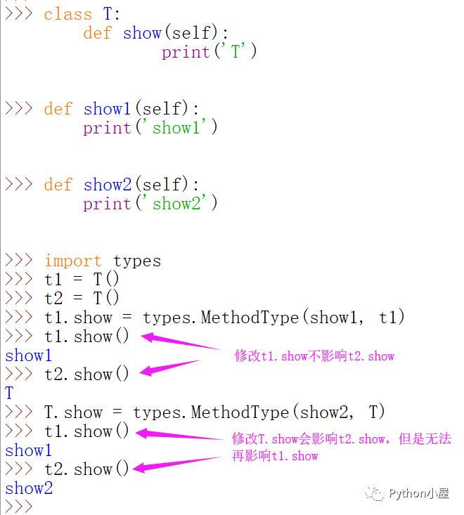
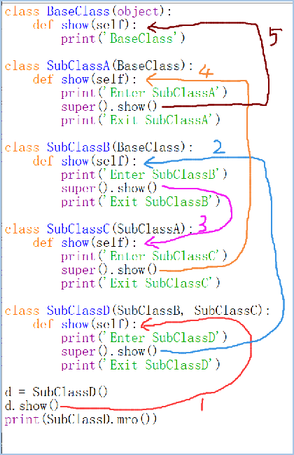
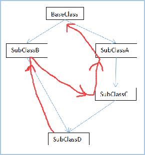
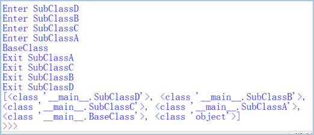
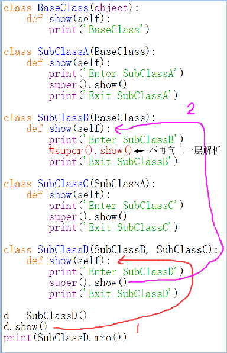
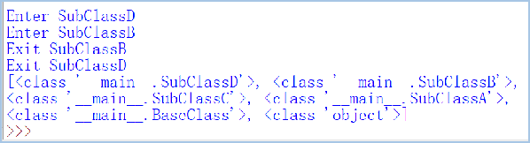

## 类定义语法

创建类时用变量形式表示的对象属性称为**数据成员**，用函数形式表示的对象行为称为**成员方法**，成员属性和成员方法统称为**类的成员。**

Python使用**class**关键字来定义类

类名的首字母一般要大写。

**注意：**无论是类属性还是类方法，对于类来说，它们都不是必需的，可以有也可以没有。另外，Python 类中属性和方法所在的位置是任意的，即它们之间并没有固定的前后次序。

```python
class 类名：
	多个（≥0）类属性...
	多个（≥0）类方法...
```

定义了类之后，可以用来实例化对象，并通过“对象名.成员”的方式来访问其中的数据成员或成员方法。

在Python中，可以使用内置方法`isinstance()`来测试一个对象是否为某个类的实例。

Python提供了一个关键字“**pass**”，表示空语句，可以用在类和函数的定义中或者选择结构中。当暂时没有确定如何实现功能，或者为以后的软件升级预留空间，或者其他类型功能时，可以使用该关键字来“占位”。

```python
class A:
    pass

def demo():
    pass

if 5>3:
    pass
```

---

## self参数

类的所有实例方法都必须至少有一个名为self的参数，并且必须是方法的第一个形参，self参数含义代表将来要创建的对象本身，表示的都是实际调用该方法的对象。

在类的实例方法中访问实例属性时需要以self为前缀。

为self传参：情况1：对象调用方法，在外部通过对象调用对象方法时并不需要传递这个参数；情况2：类调用方法，如果在外部通过类调用对象方法则需要显式为self参数传值。

```python
class A:
    def a_1(self):
        print('this is a_1')

    def a_2():
        print('this is a_2')

a = A()
a.a_1()
# a.a_2()     # 报错
# A.a_1()     # 报错
A.a_2()
A.a_1(a)
# A.a_2(a)    # 报错
```

当成员方法中没有self参数，那么表示这个方法只能被静态调用。

而静态调用有self参数的成员方法，需要传入一个实例对象，表明调用的是哪一个实例的实例方法。

---

## 类成员与实例成员

在类体中，根据变量定义的位置不同，以及定义的方式不同，属性又可细分为以下 3 种类型：

1、**类属性或类变量**：在类体中、所有函数之外定义的变量，类属性属于类，可以通过类名或对象名都可以访问；

2、**实例属性或实例变量**：在类体中所有函数内部以“self.变量名”的方式定义的变量，实例属性属于实例(对象)，只能通过对象名访问；

3、**局部变量**：类体中所有函数内部：以“变量名=变量值”的方式定义的变量。

在实例方法中可以调用该实例的其他方法，也可以访问类属性以及实例属性。

所有类的实例化对象都同时**共享**类变量，也就是说，类属性在所有实例化对象中是作为公用资源存在的；注意，因为类属性为所有实例化对象共有，通过类名修改类属性的值，会影响所有的实例化对象。

在Python中，可以动态地为自定义类和对象增加或删除成员。

```python
class BenzCar: 
         brand = '奔驰' # 品牌属性 
         country = '德国' # 产地属性 
         def __init__(self): 
               self.color = 'red' # 颜色 
               self.engineSN = '837873398' # 发动机编号
print(BenzCar. country )#通过类名不仅可以调用类变量，也可以修改它的值
Car1= BenzCar()
print(Car1.country) #也可以使用类对象来调用所属类中的类变量（此方式不推荐使用，因为实例变量和类变量存在同名的情况）
BenzCar.country=‘中国’#类属性为所有实例化对象共有，通过类名修改类属性的值，会影响所有的实例化对象。
```

```python
class Language :
     name=“java”
     def __init__(self):
          self.add = “cuit"
     # 下面定义了一个say实例方法
     def say(self):
          self.catalog = 13#  catalog 也是实例变量
lang = Language()
lang.name = “Python“#存储引用修改的仅仅是lang对象name成员，其他对象不受影响，如果为不可变类型，变相的增加了一个实例变量，如果为可变类型，原地修改，会影响所有的类变量。
print(lang.name)        #
print(Language.name)#

'''
结果：
Python
java
'''
```

实例变量和类变量可以同名，但这种情况下使用类对象将无法调用类变量，它会首选实例变量。

```python
class Car:
    price = 100000                     #定义类属性
    def __init__(self, c):
        self.color = c                 #定义实例属性

car1 = Car("Red")                      #实例化对象
car2 = Car("Blue")
print(car1.color, Car.price)           #查看实例属性和类属性的值
Car.price = 110000                     #修改类属性
Car.name = 'QQ'                        #动态增加类属性
car1.we  = 10
car1.color = "Yellow"                  #修改实例属性
print(car2.color, Car.price, Car.name)
print(car1.color, Car.price, Car.name)
print(car1.we)

'''
结果：
Red 100000
Blue 110000 QQ
Yellow 110000 QQ
10
'''
```

动态增加成员方法

```python
import types

def setSpeed(self, s): 
    self.speed = s

car1.setSpeed = types.MethodType(setSpeed, car1) #动态增加成员方法
car1.setSpeed(50)                                #调用成员方法
print(car1.speed)
```



如果通过类把成员的值进行了修改，该类对象都能得到体现。然而，如果通过其中某个对象修改了value的值，不会影响类和该类其他对象。

```python
class T:
    value = 3

t1 = T()
t2 = T()
t1.value = 5
print(t1.value,t2.value)
T.value = 7
print(t1.value,t2.value)

'''
结果：
5 3
5 7
'''
```

如果类为列表时,不管是通过类还是通过该类的对象，只要使用列表自身的原地修改方法或者下标的形式，修改的都是同一个列表。

```python
class T:
    value = [1,2,3]

t1 = T()
t2 = T()
t1.value.append(4)
print(t1.value, t2.value)
t2.value.insert(0,0)
print(t1.value, t2.value)
T.value[-1] = 5
print(t1.value, t2.value)

'''
结果:
[1, 2, 3, 4] [1, 2, 3, 4]
[0, 1, 2, 3, 4] [0, 1, 2, 3, 4]
[0, 1, 2, 3, 5] [0, 1, 2, 3, 5]
'''
```

---

## 私有成员与公有成员

在定义类的成员时，如果成员名以两个下划线“\_\_”或更多下划线开头而不以两个或更多下划线结束则表示是私有成员。

私有成员在类的外部不能直接访问，需要通过调用对象的公开成员方法来访问，也可以通过Python支持的特殊方式来访问

```python
>>> class A:
    def __init__(self, value1=0, value2=0):
        self.value1 = value1
        self.__value2 = value2
    def setValue(self, value1, value2):
	        self.value1 = value1
	        self.__value2 = value2
    def show(self):
	        print(self.value1)
	        print(self.__value2)

>>> a = A()
>>> a.value1
0
>>> a .__value2 
>>> a._A__value2             #在外部访问对象的私有数据成员
0
```

- 在Python中，以下划线开头的变量名和方法名有特殊的含义，尤其是在类的定义中。
  \_xxx：受保护成员，不能用'from module import *'导入；
  \_\_xxx\_\_：系统定义的特殊成员；
  \_\_xxx：私有成员，只有类对象自己能访问，子类对象不能直接访问到这个成员，但在对象外部可以通过“对象名._类名__xxx”这样的特殊方式来访问。
  **注意**：Python中不存在严格意义上的私有成员。

- 在IDLE交互模式下，一个下划线“_”表示解释器中最后一次显示的内容或最后一次语句正确执行的输出结果。

```python
>>> 3 + 5
8
>>> 8 + 2
10
>>> _ * 3
30
>>> _ / 5
6.0
>>> 1 / 0
ZeroDivisionError: integer division or modulo by zero
>>> _
6.0
```

- 在程序中，可以使用一个下划线来表示不关心该变量的值。

```python
>>> for _ in range(5):
    print(3, end=' ')
	
3 3 3 3 3 
>>> a, _ = divmod(60, 18)          #只关心整商，不关心余数，
                                   #等价于a = 60//18
>>> a
3
```

---

## 方法

在类中定义的方法可以粗略分为四大类：公有方法、私有方法、静态方法和类方法

- 实例方法(公有方法和私有方法)一般指与特定实例绑定的函数，通过对象调用方法时，对象本身将被作为第一个参数自动传递过去。
- 私有方法的名字以两个下划线“\_\_”开始，每个对象都有自己的公有方法和私有方法，在这两类方法中可以访问属于类和对象的成员；
- 公有方法调用：公有方法通过对象名直接调用，也可以通过类名来调用，但是如果通过类名来调用属于对象的公有方法，需要显式为该方法的self参数传递一个对象名，用来明确指定访问哪个对象的数据成员。
- 私有方法不能通过对象名直接调用，只能在属于对象的方法中通过self调用或在外部通过Python支持的特殊方式来调用。
- 语法特点 `@classmethod` 修饰的方法为**类方法**；采用 `@staticmethod` 修饰的方法为**静态方法**；不用任何修改的方法为实例方法。静态方法和类方法不属于任何实例，不会绑定到任何实例，当然也不依赖于任何实例的状态。
- 静态方法和类方法都可以通过类名和对象名调用，但不能直接访问属于对象的成员，只能访问属于类的成员。静态方法可以没有参数。
- Python 类方法和实例方法相似，它最少也要包含一个参数，只不过类方法中通常将其命名为 cls，Python 会自动将类本身绑定给 cls 参数（注意，绑定的不是类对象）。也就是说，我们在调用类方法时，无需显式为 cls 参数传参。

```python
>>> class Root:
    __total = 0
    def __init__(self, v):    #构造方法，实际也是实例方法
        self.__value = v
        Root.__total += 1

    def show(self):           #普通实例方法
        print('self.__value:', self.__value)
        print('Root.__total:', Root.__total)

    @classmethod              #修饰器，声明类方法
    def classShowTotal(cls):  #类方法
        print(cls.__total)

    @staticmethod             #修饰器，声明静态方法，静态方法没有类似 self、cls 这样的特殊参数，因此 Python 解释器不会对它包含的参数做任何类或对象的绑定。也正因为如此，类的静态方法中无法直接调用任何类属性和类方法。
    def staticShowTotal():    #静态方法
        print(Root.__total)
```

```python
>>> r = Root(3)
>>> r.classShowTotal()              #通过对象来调用类方法
1
>>> r.staticShowTotal()             #通过对象来调用静态方法
1
>>> r.show()
self.__value: 3
Root.__total: 1
>>> rr = Root(5)
>>> Root.classShowTotal()           #类方法推荐使用类名直接调用，当然也可以使用实例对象来调用（不推荐）
2
>>> Root.staticShowTotal()          #通过类名调用静态方法
2
```

```python
>>> Root.show()    #试图通过类名直接调用实例方法，失败
TypeError: unbound method show() must be called with Root instance as first argument (got nothing instead)
>>> Root.show(r)   #但是可以通过这种方法来调用方法并访问实例成员
self.__value: 3
Root.__total: 2
>>> Root.show(rr)  #通过类名调用实例方法时为self参数显式传递对象名，通过类名直接调用实例方法时，Python 并不会自动给 self 参数传值，必须手动为 self 参数传值。
self.__value: 5
Root.__total: 2
```

---

## 属性

- 对象.属性。  对象.方法()
   对象.方法()->对象.方法
- 既要保护类的封装特性，又要让开发者可以使用“对象.属性”的方式操作操作类属性， Python提供了 @property 装饰器和 property() 函数。通过 @property 装饰器，可以直接通过方法名来访问方法，不需要在方法名后添加一对“（）”小括号。

- 只读属性

```python
>>> class Test:
	    def __init__(self, value):
		self.__value = value

	    @property
	    def value(self):               #只读，无法修改和删除
		return self.__value

>>> t = Test(3)
>>> t.value                      #直接通过方法名来访问方法
3
>>> t.value = 5                        #只读属性不允许修改值
AttributeError: can't set attribute
>>> t.v=5                              #动态增加新成员
>>> t.v
5
>>> del t.v                            #动态删除成员
>>> del t.value                        #试图删除对象属性，失败
AttributeError: can't delete attribute
>>> t.value
3
```

- 可读、可写属性：属性名=property(fget=None, fset=None, fdel=None, doc=None)； fget 参数用于指定获取该属性值的类方法，fset 参数用于指定设置该属性值的方法，fdel 参数用于指定删除该属性值的方法，最后的 doc 是一个文档字符串，用于说明此函数的作用。

```python
>>> class Test:
	    def __init__(self, value):
	        self.__value = value	

	    def __get(self):
        return self.__value

	    def __set(self, v):
        self.__value = v

	    value = property(__get, __set)

	    def show(self):
        print(self.__value)
        
>>> t = Test(3)
>>> t.value      #允许读取属性值
3
>>> t.value = 5  #允许修改属性值
>>> t.value
5
>>> t.show()     #属性对应的私有变量也得到了相应的修改
5
>>> del t.value  #试图删除属性，失败
AttributeError: can't delete attribute
```

- 可读、可修改、可删除的属性。

```python
>>> class Test:
	    def __init__(self, value):
	        self.__value = value

	    def __get(self):
        return self.__value

	    def __set(self, v):
        self.__value = v

	    def __del(self):
	        del self.__value

	    value = property(__get, __set, __del)
	    def show(self):
	        print(self.__value)

>>> del t.value            #删除属性
>>> t.value                #对应的私有数据成员已删除
AttributeError: 'Test' object has no attribute '_Test__value'
>>> t.show()
AttributeError: 'Test' object has no attribute '_Test__value'
>>> t.value = 1            #为对象动态增加属性和对应的私有数据成员
>>> t.show()
1
>>> t.value
1
```

---

## 常用特殊方法

- Python中类的构造函数是`__init__()`，一般用来为数据成员设置初值或进行其他必要的初始化工作，在创建对象时被自动调用和执行。如果用户没有设计构造函数，Python将提供一个默认的构造函数用来进行必要的初始化工作。
- Python中类的析构函数是`__del__()`，一般用来释放对象占用的资源，在Python删除对象和收回对象空间时被自动调用和执行。如果用户没有编写析构函数，Python将提供一个默认的析构函数进行必要的清理工作。

| `**方法**`                                                   | `**功能说明**`                         |
| ------------------------------------------------------------ | -------------------------------------- |
| `__new__()`                                                  | `类的静态方法，用于确定是否要创建对象` |
| `__init__()`                                                 | `构造方法，创建对象时自动调用`         |
| `__del__()`                                                  | `析构方法，释放对象时自动调用`         |
| `__add__()`                                                  | `+`                                    |
| `__sub__()`                                                  | `-`                                    |
| `__mul__()`                                                  | `*`                                    |
| `__truediv__()`                                              | `/`                                    |
| `__floordiv__()`                                             | `//`                                   |
| `__mod__()`                                                  | `%`                                    |
| `__pow__()`                                                  | `**`                                   |
| `__eq__()、 __ne__()、__lt__()、 __le__()、__gt__()、 __ge__()` | `==、 !=、<、 <=、>、 >=`              |
| `__lshift__()、__rshift__()`                                 | `<<、>>`                               |
| `__and__()、__or__()、__invert__()、__xor__()`               | `&、|、~、^`                           |

| 方法                     | 功能说明                                                     |
| ------------------------ | ------------------------------------------------------------ |
| `__iadd__()、__isub__()` | `+=、-=，很多其他运算符也有与之对应的复合赋值运算符`         |
| `__pos__()`              | `一元运算符+，正号`                                          |
| `__neg__()`              | `一元运算符-，负号`                                          |
| `__contains__ ()`        | `与成员测试运算符in对应`                                     |
| `__radd__()、__rsub__`   | `反射加法、反射减法，一般与普通加法和减法具有相同的功能，但操作数的位置或顺序相反，很多其他运算符也有与之对应的反射运算符` |
| `__abs__()`              | `与内置函数abs()对应`                                        |
| `__bool__()`             | `与内置函数bool()对应，要求该方法必须返回True或False`        |
| `__bytes__()`            | `与内置函数bytes()对应`                                      |
| `__complex__()`          | `与内置函数complex()对应，要求该方法必须返回复数`            |
| `__dir__()`              | `与内置函数dir()对应`                                        |
| `__divmod__()`           | `与内置函数divmod()对应`                                     |
| `__float__()`            | `与内置函数float()对应，要求该该方法必须返回实数`            |
| `__hash__()`             | `与内置函数hash()对应`                                       |
| `__int__()`              | `与内置函数int()对应，要求该方法必须返回整数`                |

| **方法**         | **功能说明**                                           |
| ---------------- | ------------------------------------------------------ |
| `__len__()`      | `与内置函数len()对应`                                  |
| `__next__()`     | `与内置函数next()对应`                                 |
| `__reduce__()`   | `提供对reduce()函数的支持`                             |
| `__reversed__()` | `与内置函数reversed()对应`                             |
| `__round__()`    | `对内置函数round()对应`                                |
| `__str__()`      | `与内置函数str()对应，要求该方法必须返回str类型的数据` |
| `__repr__()`     | `打印、转换，要求该方法必须返回str类型的数据`          |
| `__getitem__()`  | `按照索引获取值`                                       |
| `__setitem__()`  | `按照索引赋值`                                         |
| `__delattr__()`  | `删除对象的指定属性`                                   |
| `__getattr__()`  | `获取对象指定属性的值，对应成员访问运算符“.”`          |

| **方法**                                 | **功能说明**                                                 |
| ---------------------------------------- | ------------------------------------------------------------ |
| `__getattribute__()`                     | `获取对象指定属性的值，如果同时定义了该方法与__getattr__()，那么__getattr__()将不会被调用，除非在__getattribute__()中显式调用__getattr__()或者抛出AttributeError异常` |
| `__setattr__()`                          | `设置对象指定属性的值`                                       |
| `__base__`                               | `该类的基类`                                                 |
| `__class__`                              | `返回对象所属的类`                                           |
| `__dict__`                               | `对象所包含的属性与值的字典`                                 |
| `__subclasses__()`                       | `返回该类的所有子类`                                         |
| `__call__()`                             | `包含该特殊方法的类的实例可以像函数一样调用`                 |
| `__get__()`、`__set__()`、`__delete__()` | `定义了这三个特殊方法中任何一个的类称作描述符（descriptor），描述符对象一般作为其他类的属性来使用，这三个方法分别在获取属性、修改属性值或删除属性时被调用` |

```python
class A(int) :
    def __add__(self, other):
        return int.__add__(self,other)
    def __sub__(self, other):
        return int.__sub__(self,other)
    def __mul__(self, other):
        return int.__mul__(self,other)

a = A(3)
b = A(5)

print(a+b)
print(a-b)
print(a*b)

'''
结果：
8
-2
15
'''
```

---

## 继承

- 在继承关系中，已有的、设计好的类称为父类或基类，新设计的类称为子类或派生类。派生类可以继承父类的公有成员，但是不能继承其私有成员。如果需要在派生类中调用基类的方法，可以使用内置函数super()或者通过“基类名.方法名()”的方式来实现这一目的。
- Python支持多继承，如果父类中有相同的方法名，而在子类中使用时没有指定父类名，则Python解释器将从左向右按顺序进行搜索。
- 构造函数、私有方法以及普通公开方法的继承原理。

```python
>>> class A(object):
	    def __init__(self):  #构造方法可能会被派生类继承
	        self.__private() fu zi
	        self.public()   fu zi 

	    def __private(self): #私有方法在派生类中不能直接访问
	        print('__private() method in A')	
	
	    def public(self):    #公开方法在派生类中可以直接访问，也可以被覆盖
	        print('public() method in A')
            
>>> class B(A):            #类B没有构造方法，会继承基类的构造方法
	    def __private(self):   #这不会覆盖基类的私有方法
	        print('__private() method in B')
	
	    def public(self):      #覆盖了继承自A类的公开方法public
        print('public() method in B')

>>> b = B()                #自动调用基类构造方法
__private() method in A
public() method in B
>>> dir(b)                 #基类和派生类的私有方法访问方式不一样
['_A__private', '_B__private', '__class__', ...]

>>> class C(A):
	    def __init__(self):     #显式定义构造函数
	        self.__private()    #这里调用的是类C的私有方法
	        self.public()

	    def __private(self):
	        print('__private() method in C')

    def public(self):
	        print('public() method in C')	

>>> c = C()                 #调用类C的构造方法
__private() method in C
public() method in C
>>> dir(c)
['_A__private', '_C__private', '__class__', ...]
```

- 在Python 3.x的多继承树中，如果在中间层某类有向上一层解析的迹象(调用父类的方法)，则会先把本层右侧的其他类方法解析完，然后从本层最后一个解析的类方法中直接进入上一层并继续解析，也就是在从子类到超类的反向树中按广度优先解析。

  			

- 如果在解析过程中，不再有向基类方向上一层解析的迹象，则同一层中右侧其他类方法不再解析。

  		

---

## 多态

- 所谓多态（polymorphism），是指基类的同一个方法在不同派生类对象中具有不同的表现和行为。派生类继承了基类行为和属性之后，还会增加某些特定的行为和属性，同时还可能会对继承来的某些行为进行一定的改变，这都是多态的表现形式。
- 类的多态特性，还要满足以下 2 个前提条件：继承：多态一定是发生在子类和父类之间；重写：子类重写了父类的方法。

```python
>>> class Animal(object):      #定义基类
    def show(self):
        print('I am an animal.')
>>> class Cat(Animal):         #派生类，覆盖了基类的show()方法
    def show(self):
        print('I am a cat.')
>>> class Dog(Animal):         #派生类
    def show(self):
        print('I am a dog.')
>>> class Tiger(Animal):       #派生类
    def show(self):
        print('I am a tiger.')
>>> class Test(Animal):        #派生类，没有覆盖基类的show()方法
    pass

>>> x = [item() for item in (Animal, Cat, Dog, Tiger, Test)]
>>> for item in x:        #遍历基类和派生类对象并调用show()方法
    item.show()

'''
结果：
I am an animal.
I am a cat.
I am a dog.
I am a tiger.
I am an animal.
'''
```


---

## 代码

```python
# 继承
class father:
    def __init__(self, x=0):
        self.x = x

    def hello(self):
        print("正在第调用父类...")

    def world(self):
        print("super的调用")


class son1(father):
    pass


class son2(father):
    def hello(self):
        print("正在调用子类...")
        super(son2, self).world()  # super 函数


p1 = father()
print(p1.hello())
p2 = son1()
print(p2.hello())
p3 = son2()
print(p3.hello())

print(issubclass(son1, father))             # 判断 son1 是否是 father 的子类

print(isinstance(p2, father))               # 判断 p2 是否是 father 的实例化对象
print(isinstance(p2, son1))
print(isinstance(p2, son2))
print(isinstance(p2, (father, son1, son2))) # 判断 p2 是否是 元组中某一个类 的实例化对象

print(hasattr(p1, 'x'))         # 检查是否存在一个属性
print(hasattr(p1, 'y'))

print(getattr(p1, 'x', "您所访问的参数不存在。。。"))   # 访问类中指定对象的属性，若该属性不存在，则返回最后一个参数
print(getattr(p1, 'y', "您所访问的参数不存在。。。"))

setattr(p1, 'y', "流年")                          # 给类中指定属性赋值，若该属性不存在，则创造一个再赋值
print(getattr(p1, 'y', "您所访问的参数不存在。。。"))

delattr(p1, 'y')            # 删除对象中的属性，若属性不存在，则报错
delattr(p1, 'z')

'''//////////////////////////////////////////////////////////////////////////////////////////////////////////////////'''
class A:
    def __init__(self, size = 10):              # 初始化
        self.size = size
    def getsize(self):
        return self.size
    def setsize(self, value):
        self.size = value
    def delsize(self):
        del self.size
    x = property(getsize, setsize, delsize)         # property 函数, 好像顺序不能改变


k = A()
print(k.x)
k.x = 45
print(k.x)
del k.x
print(hasattr(k, 'size'))

'''//////////////////////////////////////////////////////////////////////////////////////////////////////////////////'''
class Cap(str) :
    def __new__(cls, string):           #重写
        string = string.capitalize()
        return str.__new__(cls, string)

a = Cap('you are my girl.')
print(a)

class bbb(list) :
    def __new__(cls, List1):
        List = List1[::-1]
        return List

b = bbb([3,5,2, 5, 8])
print(b)

'''//////////////////////////////////////////////////////////////////////////////////////////////////////////////////'''
class A(int) :
    def __add__(self, other):
        return int.__add__(self,other)
    def __sub__(self, other):
        return int.__sub__(self,other)
    def __mul__(self, other):
        return int.__mul__(self,other)

a = A(3)
b = A(5)

print(a+b)
print(a-b)
print(a*b)

'''
__getattr__(self, name)  #定义当用户试图获取一个不存在的属性时的行为
__getattribute__(self, name)  #定义当该类属性被访问时的行为
__setattr__(self, name, value)  #定义当一个属性被设置时的行为
__delattr__(self, name)  #定义当一个属性被删除时的行为
'''

'''//////////////////////////////////////////////////////////////////////////////////////////////////////////////////'''
# 反运算
class B(int):
    def __rsub__(self, other):
        return int.__sub__(self,other)

a = B(3)
print(1-a)
b = B(5)
print(a-b)
print(b-3)

'''//////////////////////////////////////////////////////////////////////////////////////////////////////////////////'''

'''__get__(self, instance, owner)  #用于访问属性，它返回属性的值
__set__(self, instance, owner)  #将在属性分配操作中被调用，不返回任何内容
__delete__(self, instance)  #控制删除操作，不返回任何内容'''

class C():
    def __init__(self, value = 36):
        self.value = value

    def __get__(self, instance, owner):
        return self.value

    def __set__(self, instance, value):
        self.value = (value)

class F():
    def __get__(self, instance, owner):
        return instance.cal*1.8+32

    def __set__(self, instance, value):
        instance.cal = (float(value-32))/1.8

class Temp():
    cal = C()
    fah = F()

'''//////////////////////////////////////////////////////////////////////////////////////////////////////////////////'''

'''
__len__(self)  # 定义当被len()调用时的行为（返回容器中元素的个数）
__getitem__(self,key)  # 定义获取容器中指定元素的行为，相当于self[key]
__setitem__(self,key,value)__  # 定于设置容器中指定元素的行为，相当于self[key] = value
__delitem__(self, key)  # 定义删除容器中指定元素的行为，相当于del self[key]
'''
class A:
    def __init__(self, *k):
        self.values = [x for x in k]
        self.count = {}.fromkeys(range(len(self.values)), 0)

    def __len__(self):
        return len(self.values)

    def __getitem__(self, item):
        self.count[item] += 1
        return self.values[item]


'''//////////////////////////////////////////////////////////////////////////////////////////////////////////////////'''
'''迭代器'''
''' 斐波拉的数列'''
class A():
    def __init__(self, n = 20):
        self.a = 0
        self.b = 1
        self.n = n

    def __iter__(self):
        return self

    def __next__(self):
        if self.a>self.n:
            raise StopIteration      # raise 手动设置出错
        else :
            self.a, self.b = self.b, self.a + self.b
            return self.a


'''//////////////////////////////////////////////////////////////////////////////////////////////////////////////////'''
def fun():
    print('hello world')

if __name__ == '__main__':     #  表示如果这个程序是主函数的话可以执行下面的语句，但是如果这个程序是被当作库被引用的话，下面的代码不被执行
    print('这是模块保重')

import sys
sys.path.append('路径')

import model.操作台 as C     # 引入新的模块
C.fun()
print('这是主函数')
```

结果：

```python
Traceback (most recent call last):
  File "D:\py代码\语法\类.py", line 47, in <module>
    delattr(p1, 'z')
AttributeError: z
正在第调用父类...
None
正在第调用父类...
None
正在调用子类...
super的调用
None
True
True
True
False
True
True
False
0
您所访问的参数不存在。。。
流年
```

