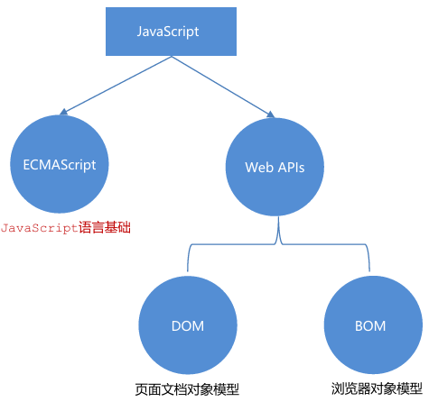
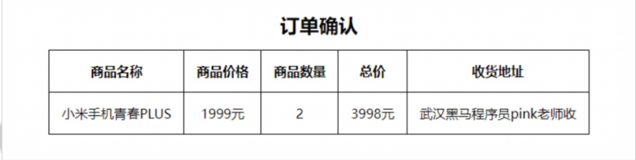

## 介绍

1. JavaScript （是什么？） 

是一种运行在客户端（浏览器）的编程语言，实现人机交互效果。

2. 作用（做什么？）

– 网页特效 (监听用户的一些行为让网页作出对应的反馈)

– 表单验证 (针对表单数据的合法性进行判断)

– 数据交互 (获取后台的数据, 渲染到前端)

– 服务端编程 (node.js) 

3. JavaScript的组成（有什么？）

**ECMAScript：**

规定了js 基础语法核心知识。

- 比如：变量、分支语句、循环语句、对象等等

**Web APIs :**

- DOM 操作文档，比如对页面元素进行移动、大小、添加删除等操作
- BOM 操作浏览器，比如页面弹窗，检测窗口宽度、存储数据到浏览器等等

权威网站: MDN

JavaScript权威网站: https://developer.mozilla.org/zh-CN/docs/Web/JavaScript



### 书写位置

JavaScript 程序不能独立运行，它需要被嵌入 HTML 中，然后浏览器才能执行 JavaScript 代码。通过 `script` 标签将 JavaScript 代码引入到 HTML 中，有两种方式：

#### 内部 JavaScript

直接写在html文件里，用script标签包住 

**规范：**script标签写在</body>上面 

拓展：alert('你好, js') 页面弹出警告对话框

```js
<script>
    alert('嗨，欢迎来传智播学习前端技术！')
</script>
</body>
```

> 我们将 `<script>` 放在 **HTML 文件的底部**附近的原因是浏览器会按照代码在文件中的**顺序加载** HTML。如果先加载的 JavaScript 期望修改其下方的 HTML，那么它可能由于 HTML 尚未被加载而失效。因此，将 JavaScript 代码放在 HTML 页面的底部附近通常是最好的策略。

示例：

```html
<!DOCTYPE html>
<html lang="en">

<head>
    <meta charset="UTF-8">
    <meta name="viewport" content="width=device-width, initial-scale=1.0">
    <title>Document</title>
</head>

<body>
    <!-- 内部js -->
    <script>
        alert('你好，js')
        // 页面弹出警示框
    </script>
</body>

</html>
```

#### 外部 JavaScript

代码写在以.js结尾的文件里 

**语法：**通过script标签，引入到html页面中。

```js
<body>
    <!-- 通过src引入外部js文件 -->
    <script src="my.js"></script>
</body>
```

> 1. **script标签中间无需写代码，否则会被忽略！** 
>
> 2. 外部JavaScript会使代码更加有序，更易于复用，且没有了脚本的混合，HTML 也会更加易读，因此这是个好的习惯。

#### 内联 JavaScript

代码写在标签内部

**语法：**

```js
<body>
    <button onclick="alert('逗你玩~~~')">点击我月薪过万</button>
</body>
```

注意： 此处作为了解即可，但是后面vue框架会用这种模式

----

### 注释

#### 单行注释

使用 `// ` 注释单行代码

```html
<!DOCTYPE html>
<html lang="en">
<head>
  <meta charset="UTF-8">
  <title>JavaScript 基础 - 注释</title>
</head>
<body>
  
  <script>
    // 这种是单行注释的语法
    // 一次只能注释一行
    // 可以重复注释
    document.write('嗨，欢迎来传智播学习前端技术！');
  </script>
</body>
</html>
```

**注：编辑器中单行注释的快捷键为 `ctrl + /`**

#### 多行注释

使用 `/* */` 注释多行代码

```html
<!DOCTYPE html>
<html lang="en">
<head>
  <meta charset="UTF-8">
  <title>JavaScript 基础 - 注释</title>
</head>
<body>
  
  <script>
    /* 这种的是多行注释的语法 */
    /*
    	更常见的多行注释是这种写法
    	在些可以任意换行
    	多少行都可以
      */
    document.write('嗨，欢迎来传智播学习前端技术！')
  </script>
</body>
</html>
```

**注：编辑器中多行注释的快捷键为 `shift + alt + A`**

---

### 结束符

作用： 使用英文的 ; 代表语句结束

实际情况： 实际开发中，可写可不写, 浏览器(JavaScript 引擎) 可以自动推断语句的结束位置

现状： 在实际开发中，越来越多的人主张，书写 JavaScript 代码时省略结束符

**约定：为了风格统一，结束符要么每句都写，要么每句都不写（按照团队要求.）**

```js
<!DOCTYPE html>
<html lang="en">
<head>
  <meta charset="UTF-8">
  <title>JavaScript 基础 - 结束符</title>
</head>
<body>
  
  <script> 
    alert(1);
    alert(2);
    alert(1)
    alert(2)
  </script>
</body>
</html>
```

---

### 输入和输出

输出和输入也可理解为人和计算机的交互，用户通过键盘、鼠标等向计算机输入信息，计算机处理后再展示结果给用户，这便是一次输入和输出的过程。

举例说明：如按键盘上的方向键，向上/下键可以滚动页面，按向上/下键这个动作叫作输入，页面发生了滚动了这便叫输出。

#### 输出

- 语法1：

```js
document.write('要出的内容')
```

作用: 向body内输出内容

注意: 如果输出的内容写的是标签, 也会被解析成网页元素

- 语法2：

```js
alert('要出的内容')
```

作用：页面弹出警告对话框

- 语法3：

```js
console.log('控制台打印')
```

作用：控制台输出语法，程序员调试使用

示例：

```js
<script>
  // 1. 文档输出内容
  document.write("要输出的内容")
  document.write('<h1>这是一级标题</h1>')
  // 2. alert
  alert('警告')
  // 3. 控制台打印输出 给 程序员
  console.log("这是给程序员看的")
</script>
```

#### 输入

- 语法：

```js
prompt('请输入您的姓名:')
```

作用: 显示一个对话框，对话框中包含一条文字信息，用来提示用户输入文字

----

### 代码执行顺序

按HTML文档流顺序执行JavaScript代码

`alert() `和 `prompt()` 它们会跳过页面渲染先被执行（目前作为了解，后期讲解详细执行过程）

----

## 变量

> 理解变量是计算机存储数据的“容器”，掌握变量的声明方式

变量是计算机中用来存储数据的“容器”，它可以让计算机变得有记忆，通俗的理解变量就是使用【某个符号】来代表【某个具体的数值】（数据）

```html
<script>
  // x 符号代表了 5 这个数值
  x = 5
  // y 符号代表了 6 这个数值
  y = 6
    
  //举例： 在 JavaScript 中使用变量可以将某个数据（数值）记录下来！

  // 将用户输入的内容保存在 num 这个变量（容器）中
  num = prompt('请输入一数字!')

  // 通过 num 变量（容器）将用户输入的内容输出出来
  alert(num)
  document.write(num)
</script>
```

### 声明

声明(定义)变量有两部分构成：声明关键字、变量名（标识）

```html
<!DOCTYPE html>
<html lang="en">
<head>
  <meta charset="UTF-8">
  <title>JavaScript 基础 - 声明和赋值</title>
</head>
<body>
  
  <script> 
    // let 变量名
    // 声明(定义)变量有两部分构成：声明关键字、变量名（标识）
    // let 即关键字，所谓关键字是系统提供的专门用来声明（定义）变量的词语
    // age 即变量的名称，也叫标识符
    let age
  </script>
</body>
</html>
```

关键字是 JavaScript 中内置的一些英文词汇（单词或缩写），它们代表某些特定的含义，如 `let` 的含义是声明变量的，看到 `let`  后就可想到这行代码的意思是在声明变量，如 `let age;` 

`let` 和 `var` 都是 JavaScript 中的声明变量的关键字，推荐使用 `let` 声明变量！！！

### 赋值

声明（定义）变量相当于创造了一个空的“容器”，通过赋值向这个容器中添加数据。

```html
<!DOCTYPE html>
<html lang="en">
<head>
  <meta charset="UTF-8">
  <title>JavaScript 基础 - 声明和赋值</title>
</head>
<body>
  
  <script> 
    // 声明(定义)变量有两部分构成：声明关键字、变量名（标识）
    // let 即关键字，所谓关键字是系统提供的专门用来声明（定义）变量的词语
    // age 即变量的名称，也叫标识符
    let age
    // 赋值，将 18 这个数据存入了 age 这个“容器”中
    age = 18
    // 这样 age 的值就成了 18
    document.write(age)
    
    // 也可以声明和赋值同时进行
    let str = 'hello world!'
    alert(str);
  </script>
</body>
</html>
```

### 更新变量

变量赋值后，还可以通过简单地给它一个不同的值来更新它。

```js
// 声明了一个age变量，同时里面存放了 18 这个数据
let age = 18
// 变量里面的数据发生变化更改为 19
age = 19
// 页面输出的结果为 19
document.write(age)
```

> 注意： let 不允许多次声明一个变量。

### 声明多个变量

语法：多个变量中间用逗号隔开。

```js
let age = 18, uname = 'pink'
```

说明：看上去代码长度更短，但并**不推荐**这样。为了更好的可读性，请一行只声明一个变量。

```js
//多行变量声明有点长，但更容易阅读
let age = 18
let uname = 'pink'
```

示例：

```js
let age = 18, name = '张三'
document.write(name + ' : ' + age)
```

### 变量案例

1. **输出用户名案例**

需求： 浏览器中弹出对话框： 请输入姓名，     页面中输出：刚才输入的姓名

```js
// 输出用户名案例
// 1. 用户输入
// prompt('请输入姓名')
// 2. 内部处理保存数据
let name = prompt('请输入姓名')
document.write(name)
```

2. **交换变量的值**

需求： 

有2个变量： num1 里面放的是 10， num2 里面放的是20 

最后变为 num1 里面放的是 20 ， num2 里面放的是 10

```js
let num1 = 10
let num2 = 20
let num3 = num1
num1 = num2
num2 = num3
document.write(num1 + " " + num2)
```

### let 和 var 的区别

 在较旧的JavaScript，使用关键字 `var`来声明变量 ，而不是 `let`。

`var`现在开发中一般不再使用它，只是我们可能再老版程序中看到它。

`let`为了解决 `var`的一些问题。

`var `声明：

- 可以先使用 在声明 (不合理)
- `var `声明过的变量可以重复声明(不合理)
- 比如变量提升、全局变量、没有块级作用域等等

结论：**`var `就是个bug，别迷恋它了，以后声明变量我们统一使用 `let`** 

### 命名规则与规范

关于变量的名称（标识符）有一系列的规则需要遵守：

1. 只能是字母、数字、下划线、$，且不能以数字开头
2. 字母**区分大小写**，如 Age 和 age 是不同的变量
3. JavaScript 内部已占用于单词（关键字或保留字）不允许使用
4. 尽量保证变量具有一定的语义，见字知义
5. 遵守小驼峰命名法（可选）

注：所谓关键字是指 JavaScript 内部使用的词语，如 `let` 和`var`，保留字是指 JavaScript 内部目前没有使用的词语，但是将来可能会使用词语。

示例：

```js
let name = prompt('输入姓名')
let age = prompt('输入年龄')
let gender = prompt('输入性别')
document.write("姓名: " + name)
document.write("年龄: " + age)
document.write("性别: " + gender)
```

----

## 数组

数组 (Array) —— 一种将 **一组数据存储在单个变量名下** 的优雅方式

### 基本使用

**1、声明语法：**

```js
let 数组名 = [数据1， 数据2, ..., 数据n]
```

例：

```js
let names = ['小明', '小红', '小黄', '小黑']
```

- 数组是按顺序保存，所以每个数据都有自己的编号
- 计算机中的编号从0开始，所以小明的编号为0，小刚编号为1，以此类推
- 在数组中，数据的编号也叫**索引或下标**
- 数组可以存储任意类型的数据

**2、取值语法：**

```js
数组名[下标]
```

例：

```js
let names = ['小明', '小刚', '小红', '小丽', '小米']
names[0] // 小明
names[1] // 小刚
```

- 通过下标取数据
- 取出来是什么类型的，就根据这种类型特点来访问

示例：

需求：定义一个数组，里面存放星期一、星期二…… 直到星期日（共7天），在控制台输出：星期日

```js
let days = ['星期一', '星期二', '星期三', '星期四', '星期五', '星期六', '星期日']
console.log(days[6])
```

**3、 一些术语：**

**元素：**数组中保存的每个数据都叫数组元素

**下标：**数组中数据的编号

**长度：**数组中数据的个数，通过数组的`length`属性获得

示例：

```JS
let days = ['星期一', '星期二', '星期三', '星期四', '星期五', '星期六', '星期日']
console.log(days[6])				// 星期日
console.log(days.length)		// 7
```

----

## 常量

概念：使用 `const `声明的变量称为“常量”。

使用场景：当某个变量永远**不会改变**的时候，就可以使用 `const `来声明，而不是`let`。

命名规范：和变量一致

~~~javascript
const PI = 3.14
~~~

>注意： **常量不允许重新赋值，声明的时候必须赋值（初始化）**
>
>小技巧：**不需要重新赋值的数据使用`const`**

---

## 数据类型

JS 数据类型整体分为两大类：**基本数据类型** 和 **引用数据类型**

**基本数据类型：**

- number 数字型 

- string 字符串型 

- boolean 布尔型 

- undefined 未定义型 

- null 空类型

**引用数据类型：**

- object 对象

### 数字类型（Number）

即我们数学中学习到的数字，可以是整数、小数、正数、负数。

```js
let age =18	// 整数
let price = 88.99	// 小数
```

JavaScript 中的正数、负数、小数等 统一称为 数字类型。

> JS 是弱数据类型，变量到底属于那种类型，只有赋值之后，我们才能确认
>
> Java是强数据类型   例如  int  a = 3    必须是整数

数字可以有很多操作，比如，乘法 * 、除法 / 、加法 + 、减法 - 等等，所以经常和算术运算符一起。

数学运算符也叫**算术运算符**，主要包括加、减、乘、除、取余（求模）。

- `+`：求和
- `-`：求差
- `*`：求积
- `/`：求商
- `%`：取模（取余数）（开发中经常作为某个数字是否被整除）

同时使用多个运算符编写程序时，会按着某种顺序先后执行，我们称为优先级。

JavaScript中 优先级越高越先被执行，**优先级相同时以书从左向右执行**。

- 乘、除、取余优先级相同
- 加、减优先级相同
- 乘、除、取余优先级大于加、减
- 使用 () 可以提升优先级
- 总结： 先乘除后加减，有括号先算括号里面的~~~

示例1：

```js
console.log(1 + 2 * 3)
console.log(10 - 8 / 2)
console.1og(2 % 5 + 4 * 2)
```

输出：

```
7
6
10
```

示例2：

需求：对话框中输入圆的半径，算出圆的面积并显示到页面

```js
let r = prompt('输入圆的半径：')
const PI = 3.14
let area = PI * r * r
document.write('圆的面积为 ' + area)
```

`NaN `(not a number)代表一个计算错误。它是一个不正确的或者一个未定义的数学操作所得到的结果

```js
console.log('老师' - 2)		// 输出 NaN
```

NaN 是粘性的。任何对 NaN 的操作都会返回 NaN

```js
console.log(NaN + 2)		// 输出NaN
```

### 字符串类型（string）

**通过单引号（ ''） 、双引号（ ""）或反引号( ` ) 包裹的数据都叫字符串**，单引号和双引号没有本质上的区别，推 荐使用**单引号**。

```js
let uname = '小明' // 使用单引号
let gender = "男"  // 使用双引号
let goods = `小米`  // 使用反引号
let tel = '13681113456'  // 看上去是数字，但是引号包裹了就是字符串
let str = '' // 这种情况叫空字符串
```

> **注意事项：**
>
> 1. 无论单引号或是双引号必须成对使用
> 2. 单引号/双引号可以互相嵌套，但是不以自已嵌套自已（口诀：外双内单，或者外单内双）
> 3. 必要时可以使用转义符 \，输出单引号或双引号

**字符串拼接：**

**场景：** + 运算符 可以实现字符串的拼接。

口诀：数字相加，字符相连

```js
document.write('我叫' + '刘德华')  // 我叫刘德华
let uname = '刘德华'
let song = '忘情水'
document.write(uname + song)  // 刘德华忘情水
```

**模板字符串：**

使用场景：拼接字符串和变量，在没有它之前，要拼接变量比较麻烦

```js
document.write('我今年' + age + '岁了')
```

语法：

- ``  (反引号)
- 在英文输入模式下按键盘的tab键上方那个键（1左边那个键）
- 内容拼接变量时，用 ${ } 包住变量

**示例：**

需求：页面弹出对话框，输入名字和年龄，页面显示： 大家好，我叫xxx，今年xx岁了

```js
let name = prompt("输入姓名")
let age = prompt('输入年龄')
document.write(`大家好，我叫${name}， 今年${age}岁了`)
```

### 布尔类型（boolean）

表示肯定或否定时在计算机中对应的是布尔类型数据。

它有两个固定的值 `true `和 `false`，表示肯定的数据用 true（真），表示否定的数据用 false（假）。

```js
// JavaScript 好玩不？
let isCool = true
console.log(isCool)
```

### 未定义类型（undefined）

未定义是比较特殊的类型，只有一个值 `undefined`。

**什么情况出现未定义类型？**

只声明变量，不赋值的情况下，变量的默认值为 undefined，一般很少【直接】为某个变量赋值为 undefined。

```js
let age  // 声明变量但是未赋值
document.write(age)  // 输出 undefined
```

**工作中的使用场景：**

我们开发中经常声明一个变量，等待传送过来的数据。

如果我们不知道这个数据是否传递过来，此时我们可以通过检测这个变量是不是undefined，就判断用户是否有数据传递过来 。

### null（空类型）

JavaScript 中的 `null `仅仅是一个代表“无”、“空”或“值未知”的特殊值

```js
let obj = null
console.log(obj)  // null
```

**null 和 undefined 区别：**

- undefined  表示没有赋值
- null 表示赋值了，但是内容为空

**null 开发中的使用场景：**

官方解释：把 null 作为尚未创建的对象

大白话： 将来有个变量里面存放的是一个对象，但是对象还没创建好，可以先给个null

### 检测数据类型

- **控制台输出语句：**

```js
let age = 18;
let uname = '刘德华';
let flag = false;
let buy;

console.log(age);
console.log(uname);
console.log(flag);
console.log(buy);
```

控制台语句经常用于测试结果来使用。

可以看出数字型和布尔型颜色为蓝色，字符串和undefined颜色为灰色

- **通过 `typeof `关键字检测数据类型**

typeof 运算符可以返回被检测的数据类型。它支持两种语法形式： 

1. 作为运算符： **`typeof x`** （常用的写法）
2. 函数形式：` typeof(x) `

换言之，有括号和没有括号，得到的结果是一样的，所以我们直接使用运算符的写法。

```js
let age = 18;
let uname = '刘德华';
let flag = false;
let buy;

console.log(typeof age);
console.log(typeof uname);
console.log(typeof flag);
console.log(typeof buy);
```

输出：

```
number
string
boolean
undefined
```

---

## 类型转换

### 隐式转换

某些运算符被执行时，系统内部自动将数据类型进行转换，这种转换称为隐式转换。

**规则：**

- `+` 号两边只要有一个是字符串，都会把另外一个转成字符串
- **除了`+`以外**的算术运算符 比如 `-  *  /`  等都会把数据转成数字类型

**缺点：**

- 转换类型不明确，靠经验才能总结

**小技巧：**

- **`+`号作为正号解析可以转换成数字型**
- **任何数据和字符串相加结果都是字符串**

```js
<script>
    console.log(11 + 11);
    console.log('11' + 11);
    console.log(11 - 11);
    console.log('11' - 11);
    console.log(1 * 1);
    console.log('1' * 1);
    console.log(typeof '123');
    console.log(typeof + '123');
    console.log(+ '11' + 11);
</script>
```

输出：

```
22
1111
0
0
1
1
string
number
22
```

### 显式转换

编写程序时过度依靠系统内部的隐式转换是不严禁的，因为隐式转换规律并不清晰，大多是靠经验总结的规律。

为了避免因隐式转换带来的问题，通常根逻辑需要对数据进行显示转换。

**转换为数字型：**

- **`Number`(数据)**
  - 转成数字类型
  - 如果字符串内容里有非数字，转换失败时结果为 NaN（Not a Number）即不是一个数字
  - NaN也是number类型的数据，代表非数字
- **`parseInt`(数据)**
  - **只保留整数**
- **`parseFloat`(数据)**
  - **可以保留小数**

**转换为字符型：**

- **`String`(数据)**
- **`变量.toString`(进制) **

```js
let str = 3.14
console.log(Number(str))    // 3.14
console.log(parseInt(str))  // 3
console.log(parseInt('12px'))   // 12
console.log(parseInt('px12'))   // NaN
console.log(parseFloat(str))    // 3.14

let num = 3
console.log(String(num))
console.log(typeof String(num)) // string
console.log(num.toString()) // 3
console.log(num.toString(2))    // 11 (二进制)
```

**示例：**

需求：输入2个数，计算两者的和，打印到页面中

```js
let num1 = Number(prompt('输入第一个数字:'))
let num2 = Number(prompt('输入第二个数字:'))
document.write(`${num1} + ${num2} = ${num1 + num2}`)
```

---

## 综合案例- 用户订单信息案例

需求：用户输入商品价格和商品数量，以及收货地址，可以自动打印订单信息



```html
<!DOCTYPE html>
<html lang="en">

<head>
    <meta charset="UTF-8">
    <meta name="viewport" content="width=device-width, initial-scale=1.0">
    <title>Document</title>
    <style>
        table {
            /* 合并相邻边框 */
            border-collapse: collapse;
            height: 80px;
            margin: 0 auto;
            text-align: center;
        }

        th {
            padding: 5px 30px;
        }

        table,
        th,
        td {
            border: 1px solid #000;
        }
    </style>
</head>

<body>

    <script>
        let goodName = '手机'
        let price = Number(prompt('输入商品的价格：'))
        let num = Number(prompt('输入商品的数量：'))
        let addr = prompt('输入收货地址：')
        let total = price * num
        document.write(`
            <table>
                <caption><strong>订单确认</strong></caption>
                <tr>
                    <th>商品名称</th>
                    <th>商品价格</th>
                    <th>商品数量</th>
                    <th>总价</th>
                    <th>收货地址</th>
                </tr>
                <tr>
                    <td>${goodName}</td>
                    <td>${price}元</td>
                    <td>${num}</td>
                    <td>${total}元</td>
                    <td>${addr}</td>
                </tr>
            </table>
        `)
    </script>
</body>

</html>
```


