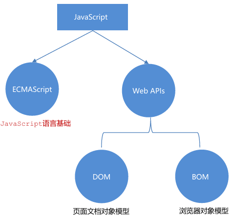

## 介绍

1. JavaScript （是什么？） 

是一种运行在客户端（浏览器）的编程语言，实现人机交互效果。

2. 作用（做什么？）

– 网页特效 (监听用户的一些行为让网页作出对应的反馈)

– 表单验证 (针对表单数据的合法性进行判断)

– 数据交互 (获取后台的数据, 渲染到前端)

– 服务端编程 (node.js) 

1. JavaScript的组成（有什么？）

**ECMAScript：**

规定了js 基础语法核心知识。

- 比如：变量、分支语句、循环语句、对象等等

**Web APIs :**

- DOM 操作文档，比如对页面元素进行移动、大小、添加删除等操作
- BOM 操作浏览器，比如页面弹窗，检测窗口宽度、存储数据到浏览器等等

权威网站: MDN

JavaScript权威网站: https://developer.mozilla.org/zh-CN/docs/Web/JavaScript



### 书写位置

JavaScript 程序不能独立运行，它需要被嵌入 HTML 中，然后浏览器才能执行 JavaScript 代码。通过 `script` 标签将 JavaScript 代码引入到 HTML 中，有两种方式：

#### 内部 JavaScript

直接写在html文件里，用script标签包住 

**规范：**script标签写在</body>上面 

拓展：alert('你好, js') 页面弹出警告对话框

```js
<script>
    alert('嗨，欢迎来传智播学习前端技术！')
</script>
</body>
```

> 我们将 `<script>` 放在 **HTML 文件的底部**附近的原因是浏览器会按照代码在文件中的**顺序加载** HTML。如果先加载的 JavaScript 期望修改其下方的 HTML，那么它可能由于 HTML 尚未被加载而失效。因此，将 JavaScript 代码放在 HTML 页面的底部附近通常是最好的策略。

示例：

```html
<!DOCTYPE html>
<html lang="en">

<head>
    <meta charset="UTF-8">
    <meta name="viewport" content="width=device-width, initial-scale=1.0">
    <title>Document</title>
</head>

<body>
    <!-- 内部js -->
    <script>
        alert('你好，js')
        // 页面弹出警示框
    </script>
</body>

</html>
```

#### 外部 JavaScript

代码写在以.js结尾的文件里 

**语法：**通过script标签，引入到html页面中。

```js
<body>
    <!-- 通过src引入外部js文件 -->
    <script src="my.js"></script>
</body>
```

> 1. **script标签中间无需写代码，否则会被忽略！** 
>
> 2. 外部JavaScript会使代码更加有序，更易于复用，且没有了脚本的混合，HTML 也会更加易读，因此这是个好的习惯。

#### 内联 JavaScript

代码写在标签内部

**语法：**

```js
<body>
    <button onclick="alert('逗你玩~~~')">点击我月薪过万</button>
</body>
```

注意： 此处作为了解即可，但是后面vue框架会用这种模式

----

### 注释

#### 单行注释

使用 `// ` 注释单行代码

```html
<!DOCTYPE html>
<html lang="en">
<head>
  <meta charset="UTF-8">
  <title>JavaScript 基础 - 注释</title>
</head>
<body>
  
  <script>
    // 这种是单行注释的语法
    // 一次只能注释一行
    // 可以重复注释
    document.write('嗨，欢迎来传智播学习前端技术！');
  </script>
</body>
</html>
```

**注：编辑器中单行注释的快捷键为 `ctrl + /`**

#### 多行注释

使用 `/* */` 注释多行代码

```html
<!DOCTYPE html>
<html lang="en">
<head>
  <meta charset="UTF-8">
  <title>JavaScript 基础 - 注释</title>
</head>
<body>
  
  <script>
    /* 这种的是多行注释的语法 */
    /*
    	更常见的多行注释是这种写法
    	在些可以任意换行
    	多少行都可以
      */
    document.write('嗨，欢迎来传智播学习前端技术！')
  </script>
</body>
</html>
```

**注：编辑器中多行注释的快捷键为 `shift + alt + A`**

---

### 结束符

作用： 使用英文的 ; 代表语句结束

实际情况： 实际开发中，可写可不写, 浏览器(JavaScript 引擎) 可以自动推断语句的结束位置

现状： 在实际开发中，越来越多的人主张，书写 JavaScript 代码时省略结束符

**约定：为了风格统一，结束符要么每句都写，要么每句都不写（按照团队要求.）**

```js
<!DOCTYPE html>
<html lang="en">
<head>
  <meta charset="UTF-8">
  <title>JavaScript 基础 - 结束符</title>
</head>
<body>
  
  <script> 
    alert(1);
    alert(2);
    alert(1)
    alert(2)
  </script>
</body>
</html>
```

---

### 输入和输出

输出和输入也可理解为人和计算机的交互，用户通过键盘、鼠标等向计算机输入信息，计算机处理后再展示结果给用户，这便是一次输入和输出的过程。

举例说明：如按键盘上的方向键，向上/下键可以滚动页面，按向上/下键这个动作叫作输入，页面发生了滚动了这便叫输出。

#### 输出

- 语法1：

```js
document.write('要出的内容')
```

作用: 向body内输出内容

注意: 如果输出的内容写的是标签, 也会被解析成网页元素

- 语法2：

```js
alert('要出的内容')
```

作用：页面弹出警告对话框

- 语法3：

```js
console.log('控制台打印')
```

作用：控制台输出语法，程序员调试使用

示例：

```js
<script>
  // 1. 文档输出内容
  document.write("要输出的内容")
  document.write('<h1>这是一级标题</h1>')
  // 2. alert
  alert('警告')
  // 3. 控制台打印输出 给 程序员
  console.log("这是给程序员看的")
</script>
```


#### 输入

- 语法：

```js
prompt('请输入您的姓名:')
```

作用: 显示一个对话框，对话框中包含一条文字信息，用来提示用户输入文字


