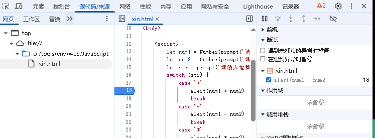
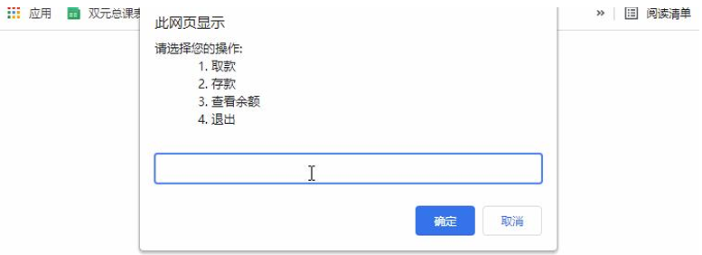

---
JavaScript 基础 - 第2天
---

## 运算符

### 赋值运算符

赋值运算符：对变量进行赋值的运算符

已经学过的赋值运算符：`=` **将等号右边的值赋予给左边, 要求左边必须是一个容器**

其他赋值运算符：

- **`+=`**
- `-=`
- `*=`
- `/=`
- `%=`

使用这些运算符可以在对变量赋值时进行快速操作

我们以 += 赋值运算符来举例

1. 以前我们让一个变量加 1 如何做的？

```js
<script>
    let num = 1;
    num = num + 1;
    console.log(num); // 结果是 2
</script>
```

2. 现在我们有一个简单的写法啦~~~

```js
<script>
    let num = 1;
    num += 1;
    console.log(num); // 结果是 2
</script>
```

### 一元运算符

众多的 JavaScript 的运算符可以根据所需表达式的个数，分为一元运算符、二元运算符、三元运算符

**二元运算符：**

```js
let num = 10 + 20
```

**一元运算符：**

如：正负号

**自增运算符的用法：**

| 符号 | 作用 | 说明                       |
| ---- | ---- | -------------------------- |
| `++` | 自增 | 变量自身的值加1，例如: x++ |
| `--` | 自减 | 变量自身的值减1，例如: x-- |

使用场景：经常用于**计数**来使用。  比如进行10次操作，用它来计算进行了多少次了

```js
// 前置自增
let num = 10
++num

// 后置自增
let num1 = 10
num1++
```

1. ++在前和++在后在单独使用时二者并没有差别，而且一般开发中我们都是独立使用
2. ++在后（后缀式）我们会使用更多

> 注意：
>
> 1. 只有变量能够使用自增和自减运算符
> 2. ++、-- 可以在变量前面也可以在变量后面，比如: x++  或者  ++x 

**前置自增和后置自增如果参与运算就有区别: (难点,但是了解即可)**

- **前置自增：**

前置自增：先自加再使用（记忆口诀：++在前 **先加**）

```js
let i = 1;
console.log(++i + 2); // 结果是 4

// 注意: i 是 2
// i 先自加 1, 变成 2 之后, 在和后面的 2 相加
```

- **后置自增：**

 后置自增：先使用再自加（记忆口诀：++在后 **后加**） 

```js
let i = 1;
console.log(i++ + 2); // 结果是 3

// 注意: 此时的 i 是 1
// 先和2相加, 先运算输出完毕后, i再自加是2
```

**然而：**

1. 前置自增和后置自增独立使用时二者并没有差别！
2. 一般开发中我们都是独立使用
3. **后面 i++ 后置自增会使用相对较多,并且都是单独使用**

### 比较运算符

使用场景：比较两个数据大小、是否相等，根据比较结果返回一个布尔值（true / false）

| 运算符    | 作用                                       |
| --------- | ------------------------------------------ |
| >         | 左边是否大于右边                           |
| <         | 左边是否小于右边                           |
| >=        | 左边是否大于或等于右边                     |
| <=        | 左边是否小于或等于右边                     |
| **`===`** | **左右两边是否`类型`和`值`都相等（重点）** |
| **`==`**  | **左右两边`值`是否相等**                   |
| !=        | 左右值不相等                               |
| !==       | 左右两边是否不全等                         |

对比：

- =  单等是赋值
- == 是判断
- === 是全等
- **开发中判断是否相等，强烈推荐使用 === **

1. 字符串比较，是比较的字符对应的ASCII码

- 从左往右依次比较
- 如果第一位一样再比较第二位，以此类推

2. NaN不等于任何值，包括它本身

- 涉及到"NaN“ 都是false

3. 尽量不要比较小数，因为小数有精度问题

4. 不同类型之间比较会发生隐式转换

- 最终把数据隐式转换转成number类型再比较
- 所以开发中，如果进行准确的比较我们**`更喜欢 ===`** 或者 !==

```js
let str = '1'
let num = 1
console.log(str == num)     // true
console.log(str === num)    // false
console.log(NaN == NaN)     // false
console.log(NaN === NaN)    // false
```

### 逻辑运算符

使用场景：可以把多个布尔值放到一起运算，最终返回一个布尔值

| 符号 | 名称   | 日常读法 | 特点                       | 口诀           |
| ---- | ------ | -------- | -------------------------- | -------------- |
| &&   | 逻辑与 | 并且     | 符号两边有一个假的结果为假 | 一假则假       |
| \|\| | 逻辑或 | 或者     | 符号两边有一个真的结果为真 | 一真则真       |
| !    | 逻辑非 | 取反     | true变false  false变true   | 真变假，假变真 |

| A     | B     | A && B | A \|\| B | !A    |
| ----- | ----- | ------ | -------- | ----- |
| false | false | false  | false    | true  |
| false | true  | false  | true     | true  |
| true  | false | false  | true     | false |
| true  | true  | true   | true     | false |

```js
console.log(7 > 5 && 7 < 10)    // true
console.log(3 < 5 || 3 > 10)    // true
console.log(!true)  // false
```

### 运算符优先级

| 优先级 | 运算符     | 顺序                |
| ------ | ---------- | ------------------- |
| 1      | 小括号     | ()                  |
| 2      | 一元运算符 | `++ -- !`           |
| 3      | 算数运算符 | 先 `* / %` 后 `+ -` |
| 4      | 关系运算符 | `>` `>=` `<` `<=`   |
| 5      | 相等运算符 | `== != === !==`     |
| 6      | 逻辑运算符 | 先 `&&` 后 `||`     |
| 7      | 赋值运算符 | `=`                 |
| 8      | 逗号运算符 | `,`                 |

- 一元运算符里面的**逻辑非优先级很高**
- **逻辑与比逻辑或优先级高**

---

## 语句

### 表达式和语句

**表达式：**

表达式是可以被求值的代码，JavaScript 引擎会将其计算出一个结果。

```js
x = 7
3 + 4
num++
```

**语句：**

语句是一段可以执行的代码。

比如： `prompt()`  可以弹出一个输入框，还有 if语句    for 循环语句等等

### 分支语句

- 分支语句包含：
  - **If 分支语句**
  - 三元运算符
  - switch 语句

#### **if 语句**

`if` 语句有三种使用：单分支、双分支、多分支

单分支使用语法：

```js
if (条件) {
    满足条件要执行的代码
}
```

小括号内的条件结果是布尔值，为 true 时，进入大括号里执行代码；为false，则不执行大括号里面代码

小括号内的结果若不是布尔类型时，会发生类型转换为布尔值，类似Boolean()

如果大括号只有一个语句，大括号可以省略，但是，俺们不提倡这么做~

条件除了0，其余的数字都为真；条件除了空字符串，其余的字符串都为真。

#### if 双分支语句

如果有两个条件的时候，可以使用 if else 双分支语句

~~~javascript
if (条件表达式){
  // 满足条件要执行的语句
} else {
  // 不满足条件要执行的语句
}
~~~

**示例：**

需求：让用户输入年份，判断这一年是闰年还是平年并弹出对应的警示框

```js
let year = Number(prompt('输入年份: '))
if ((year % 4 === 0 && year % 100 !== 0) || (year % 400 === 0)) {
  alert(`${year}是闰年`)
} else {
  alert(`${year}是平年`)
}
```

#### if 多分支语句

```js
if (条件1) {
    代码1
} else if (条件2) {
    代码2
} else if (条件3) {
    代码3
} else {
    代码n
}
```

**示例：**

需求：根据输入不同的成绩，反馈不同的评价

```js
let score = Number(prompt('输入你的成绩: '))
if (score >= 90 && score <= 100) {
  alert('优秀')
} else if (score >= 70 && score < 90) {
  alert('良好')
} else if (score >= 60 && score < 70) {
  alert('及格')
} else {
  alert('不及格')
}
```

#### 三元运算符

**使用场景**： 一些简单的双分支，可以使用  三元运算符（三元表达式），写起来比 if  else双分支 更简单

**符号**：`? `与` :` 配合使用

**语法：**

~~~javascript
条件 ? 表达式1 ： 表达式2

// 等价于
if( 条件 ) {
  表达式1
} else {
  表达式2
}
~~~

**示例1：**

需求：用户输入2个数，控制台输出最大的值

```js
let num1 = Number(prompt('请输入第一个数: '))
let num2 = Number(prompt('请输入第二个数: '))
alert(num1 > num2 ? num1 : num2)
```

**示例2：**

需求：用户输入1个数，如果数字小于10，则前面进行补0， 比如 09   03 等

```js
let num = Number(prompt('请输入数字: '))
alert(num < 10 ? '0' + num : num)
```

#### switch 语句

使用场景： 适合于有多个条件的时候，也属于分支语句，大部分情况下和 if多分支语句 功能相同（使用的是 `===` ）

**语法：**

```js
switch (数据) {
    case 值1:
        代码1
        break;
    case 值2:
        代码2
        break;
    default:
        代码n
        break;
}
```

注意：

1. switch-case语句一般用于等值判断, if适合于区间判断
2. switch-case一般需要配合break关键字使用 没有break会造成case穿透
3. if 多分支语句开发要比switch更重要，使用也更多

**示例：**

需求：用户输入2个数字，然后输入 + - *  /  任何一个，可以计算结果

```js
let num1 = Number(prompt('请输入第一个数字:'))
let num2 = Number(prompt('请输入第二个数字:'))
let str = prompt('请输入运算符:')
switch (str) {
  case '+':
    alert(num1 + num2)
    break
  case '-':
    alert(num1 - num2)
    break
  case '*':
    alert(num1 * num2)
    break
  case '/':
    alert(num1 / num2)
    break
  default:
    alert('数据错误！')
}
```

#### 断点调试

**作用：**学习时可以帮助更好的理解代码运行，工作时可以更快找到bug

浏览器打开调试界面

1. 按F12打开开发者工具
2. 点到源代码一栏 （ sources ）
3. 选择代码文件

**断点：**在某句代码上加的标记就叫断点，当程序执行到这句有标记的代码时会暂停下来



### 循环语句

#### while 循环

`while `:  在…. 期间， 所以 while循环 就是在满足条件期间，重复执行某些代码。

**语法：**

~~~javascript
while (循环条件) {
   要重复执行的代码(循环体)    
}
~~~

跟if语句很像，都要满足小括号里的条件为true才会进入 循环体 执行代码

while大括号里代码执行完毕后不会跳出，而是继续回到小括号里判断条件是否满足，若满足又执行大括号里的代码，然后再回到 小括号判断条件，直到括号内条件不满足，即跳出

**循环三要素：**

1.变量起始值

2.终止条件（没有终止条件，循环会一直执行，造成死循环）

3.变量变化量（用自增或者自减）

**示例：**

需求：在页面中打印输出10句“月薪过万”，使用while循环，页面中打印，可以添加换行效果

```js
let i = 0
while (i < 10) {
  document.writeln(`第${i + 1}句：月薪过万<br>`)
  i++
}
```

#### 中止循环

`break`   中止整个循环，一般用于结果已经得到, 后续的循环不需要的时候可以使用（提高效率）  

`continue`  中止本次循环，一般用于排除或者跳过某一个选项的时候

#### 无限循环

1.`while(true) `来构造“无限”循环，需要使用break退出循环。（常用）

2.`for(;;) `也可以来构造“无限”循环，同样需要使用break退出循环。

**示例：**

需求：页面弹出对话框，‘你爱我吗’，如果输入‘爱’，则结束，否则一直弹出对话框

```js
let answer
while (true) {
  answer = prompt('你爱我吗')
  if (answer === '爱') {
    break
  }
}
```

----

## 综合案例-ATM存取款机

需求：用户可以选择存钱、取钱、查看余额和退出功能



```JS
while (true) {
  let OperationType = +prompt('请选择您的操作：\n1.取款\n2.存款\n3.查看余额\n4.退出')
  switch (OperationType) {
    case 1:
      let withdrawalAmount = +prompt('输入取款金额: ')
      break
    case 2:
      let depositAmount = +prompt('输入存款金额: ')
      break
    case 3:
      alert('您的有账户余额为: 正无穷')
      break
  }
  if (OperationType === 4) {
    break
  }
}
```


