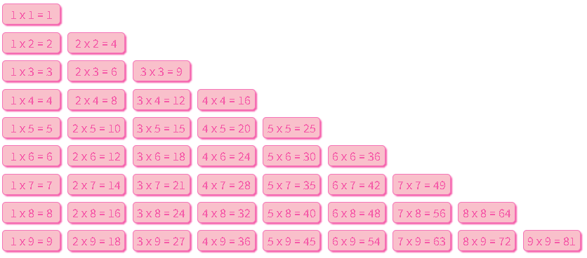

## if 多分支语句和 switch的区别

1. 共同点

   - 都能实现多分支选择， 多选1 
   - 大部分情况下可以互换

2. 区别：

   - switch…case语句通常处理case为比较**确定值**的情况，而if…else…语句更加灵活，通常用于**范围判断**(大于，等于某个范围)。
   - switch 语句进行判断后直接执行到程序的语句，效率更高，而if…else语句有几种判断条件，就得判断多少次
   - switch 一定要注意 必须是 ===  全等，一定注意 数据类型，同时注意break否则会有穿透效果
   - 结论：
     - 当分支比较少时，if…else语句执行效率高。
     - 当分支比较多时，switch语句执行效率高，而且结构更清晰。

---

##  for 循环

### 基本使用

**语法：**

```JS
for (变量起始值; 终止条件; 变量变化量) {
    // 循环体
}
```

**示例：**

```JS
for(let i = 1; i <= 6; i++) {
  document.write(`<h${i}>循环控制，即重复执行<h${i}>`)
}
```

> 注意：`for` 的语法结构更简洁，故 `for` 循环的使用频次会更多。

**示例：**

需求：  请将 数组    [‘马超’，‘赵云’， ‘张飞’, ‘关羽‘，’黄忠’]    依次打印出来

```JS
let arr = ['关羽', '张飞', '赵云', '黄忠', '马超']
for (let i = 0; i < arr.length; i++) {
  document.write(arr[i] + '<br>')
}
```

**跳出和终止循环：**

```JS
// 跳出本次循环
for (let i = 0; i < 10; i++) {
  if (i === 3) {
    continue
  }
  document.write(i + '<br>')
}

// 结束循环
for (let i = 0; i < 10; i++) {
  if (i === 3) {
    break
  }
  document.write(i + '<br>')
}
```

> 当如果明确了循环的次数的时候推荐使用for循环
>
> 当不明确循环的次数的时候推荐使用while循环

### 循环嵌套

**语法：**

```JS
for (外部声明记录循环次数的变量; 循环条件; 变化值) {
  	语句
    for (内部声明记录循环次数的变量; 循环条件; 变化值) {
        语句
    }
}
```

一个循环里再套一个循环，一般用在for循环里

**示例1：**

需求：页面中打印出5行5列的星星

```JS
for (let i = 0; i < 5; i++) {
  for (let j = 0; j < 5; j++) {
    document.write('★')
  }
  document.write('<br>')
}
```

**示例2：**

需求：打印倒三角形星星

```
★
★★
★★★
★★★★
```

```JS
let row = +prompt('请输入打印的行数:')
for (let i = 0; i < row; i++) {
  for (let j = 0; j <= i; j++) {
    document.write('★')
  }
  document.write('<br>')
}
```

**示例3：**

需求：打印九九乘法表

```html
<!DOCTYPE html>
<html lang="en">

<head>
    <meta charset="UTF-8">
    <meta name="viewport" content="width=device-width, initial-scale=1.0">
    <title>Document</title>
    <style>
        div {
            width: 80px;
            display: inline-block;
            background-color: #F9C0CB;
            color: #F55BA8;
            margin: 5px;
            padding: 2px 5px;
            border-radius: 5px;
            border: 1px solid #F575B8;
            text-align: center;
            box-shadow: 2PX 2PX 2PX;
            box-sizing: border-box;
        }
    </style>
</head>

<body>

    <script>
        for (i = 1; i <= 9; i++) {
            for (j = 1; j <= i; j++) {
                document.write(`<div>${j} x ${i} = ${i * j}</div>`)
            }
            document.write('<br>')
        }

    </script>
</body>

</html>
```



---

## 数组

### 数组是什么？

**数组：**(Array)是一种可以按顺序保存数据的**数据类型**

**使用场景：**如果有多个数据可以用数组保存起来，然后放到一个变量中，管理非常方便

### 数组的基本使用

#### 定义数组和数组单元

**声明语法:**

```JS
// 数组声明方式1
let 数组名 = [数据1, 数据2, ..., 数据n];

// 数组声明方式2
let arr = new Array(数据1, 数据2, ..., 数据n);
```

例：

```JS
let names = ['小明', '小刚', '小红', '小丽', '小米'];
```

数组是按顺序保存，所以每个数据都有自己的编号

计算机中的编号从0开始，所以小明的编号为0，小刚编号为1，以此类推

在数组中，数据的编号也叫**索引或下标**

数组可以存储任意类型的数据

#### 访问数组和数组索引

**取值语法：**

```JS
数组名[下标]
```

**示例：**

```js
 <script>
   let classes = ['小明', '小刚', '小红', '小丽', '小米']
   
   // 1. 访问数组，语法格式为：变量名[索引值]
   document.write(classes[0]) // 结果为：小明
   document.write(classes[1]) // 结果为：小刚
   document.write(classes[4]) // 结果为：小米
   
   // 2. 通过索引值还可以为数组单重新赋值
   document.write(classes[3]) // 结果为：小丽
   // 重新为索引值为 3 的单元赋值
   classes[3] = '小小丽'
   document.wirte(classes[3]); // 结果为： 小小丽
 </script>
```

#### 数据单元值类型

数组做为数据的集合，它的单元值可以是任意数据类型

```JS
 <script>
   // 6. 数组单值类型可以是任意数据类型
 
   // a) 数组单元值的类型为字符类型
   let list = ['HTML', 'CSS', 'JavaScript']
   // b) 数组单元值的类型为数值类型
   let scores = [78, 84, 70, 62, 75]
   // c) 混合多种类型
   let mixin = [true, 1, false, 'hello']
 </script>
```

#### 数组长度属性

重申一次，数组在 JavaScript 中并不是新的数据类型，它属于对象类型。

```JS
 <script>
   // 定义一个数组
   let arr = ['html', 'css', 'javascript']
   // 数组对应着一个 length 属性，它的含义是获取数组的长度
   console.log(arr.length) // 3
 </script>
```

### 操作数组

数组做为对象数据类型，不但有 `length` 属性可以使用，还提供了许多方法：

1. `push `动态向数组的尾部添加一个单元
2. `unshit `动态向数组头部添加一个单元
3. `pop `删除最后一个单元
4. `shift `删除第一个单元
5. `splice `动态删除任意单元

使用以上4个方法时，都是直接在原数组上进行操作，即成功调任何一个方法，原数组都跟着发生相应的改变。并且在添加或删除单元时 `length` 并不会发生错乱。

#### 新增

1. `数组.push()  `方法将一个或多个元素添加到数组的**末尾**，并返回该数组的新长度 (**重点**)

**语法：**

```JS
arr.push(元素1, ..., 元素n)
```

例如：

```JS
let arr = ['red', 'green']
arr.push('pink')
console.log(arr) // ['red', 'green', 'pink']
```

```JS
let arr = ['red', 'green']
arr.push('pink', 'hotpink')
console.log(arr) // ['red', 'green', 'pink', 'hotpink']
```

2. `arr.unshift(新增的内容) ` 方法将一个或多个元素添加到数组的**开头**，并返回该数组的新长度

**语法：**

```JS
arr.unshift(元素1, ..., 元素n)
```

例如：

```JS
let arr = ['red', 'green']
arr.unshift('pink')
console.log(arr) // ['pink', 'red', 'green']
```

```JS
let arr = ['red', 'green']
arr.unshift('pink', 'hotpink')
console.log(arr) // ['pink', 'hotpink', 'red', 'green']
```

**示例1：**

需求：将数组 [2, 0, 6, 1, 77, 0, 52, 0, 25, 7] 中大于等于 10 的元素选出来，放入新数组

```js
let arr = [2, 0, 6, 1, 77, 0, 52, 0, 25, 7]
let newArr = []
for (let i = 0; i < arr.length; i++) {
  if (arr[i] > 10) {
    newArr.push(arr[i])
  }
}
document.write(newArr)
```

**示例2：**

需求：将数组 [2, 0, 6, 1, 77, 0, 52, 0, 25, 7] 中的 0 去掉后，形成一个不包含 0 的新数组

```JS
let oldArr = [2, 0, 6, 1, 77, 0, 52, 0, 25, 7]
let newArr = []
for (let i = 0; i < oldArr.length; i++) {
  if (oldArr[i] === 0) {
    continue
  }
  newArr.push(oldArr[i])
}
document.write(newArr)
```

#### 删除

1. `数组.pop()` 方法从数组中删除**最后**一个元素，并返回该元素的值

**语法：**

```JS
arr.pop()
```

例如：

```JS
let arr = ['red', 'green']
arr.pop()
console.log(arr) // ['red']
```

2. `数组.shift()` 方法从数组中删除**第一个**元素，并返回该元素的值

**语法：**

```JS
arr.shift()
```

例如：

```JS
let arr = ['red', 'green']
arr.shift()
console.log(arr) // ['green']
```

3. `数组.splice()` 方法  删除**指定**元素

**语法：**

```JS
arr.splice(start, deleteCount)

arr.splice(起始位置, 删除几个元素)
```

start 起始位置：指定修改的开始位置（从0计数）

deleteCount：表示要移除的数组元素的个数。可选的， 如果省略则默认从指定的起始位置删除到最后

例如：

```JS
arr.splice(2, 1) // 从索引值为2的位置开始删除1个单元
```

#### 数组排序

`数组.sort()`  方法可以排序（如果没有参数侧默认为升序排序）

**语法：**

```JS
let arr = [4, 2, 5, 1, 3]
// 1.升序排列写法
// arr.sort(),或者下面那种方法
arr.sort(function (a, b) {
    return a - b
})
console.log(arr) // [1, 2, 3, 4, 5]

// 2.降序排列写法
arr.sort(function (a, b) {
    return b - a
})
console.log(arr) // [5,4, 3, 2, 1]
```

---

## 综合案例-根据数据生成柱形图

需求： 用户输入四个季度的数据，可以生成柱形图

```html
<!DOCTYPE html>
<html lang="en">

<head>
    <meta charset="UTF-8">
    <meta name="viewport" content="width=device-width, initial-scale=1.0">
    <title>Document</title>
    <style>
        * {
            box-sizing: border-box;
        }

        .mapper {
            margin: 50px auto;
            height: 300px;
            width: 500px;
        }

        .img {
            display: flex;
            /* height: 500px; */
            justify-content: space-around;
            align-items: end;
            border-left: 1px solid gray;
            border-bottom: 1px solid gray;
        }

        .box p {
            margin: 2px;
            text-align: center;
        }

        .box div {
            width: 35px;
            height: 100px;
            background-color: pink;
        }

        .text {
            display: flex;
            justify-content: space-around;
        }
    </style>
</head>

<body>

    <script>
        let dataArr = []
        for (let i = 0; i < 4; i++) {
            let data = +prompt(`请输入第${i + 1}季度的数据:`)
            if (data < 0) {
                alert('数据有误，请重新输入')
                i--
                continue
            }
            dataArr.push(data)
        }
        console.log(dataArr)
        document.write(`
        <div class="mapper">
            <div class="img">
        `)
        for (let i = 0; i < dataArr.length; i++) {
            document.write(`
            <div class="box">
                <p>${dataArr[i]}</p>
                <div style="height:${dataArr[i]}px;"></div>
            </div>
            `)
        }
        document.write(`
        </div>
        <div class="text">
            <div>第1季度</div>
            <div>第2季度</div>
            <div>第3季度</div>
            <div>第4季度</div>
        </div>
    </div>
        `)
    </script>
</body>

</html>
```


---

## 综合案例-冒泡排序

1. 方法一

```javascript
<script>
  let n = +prompt('请输入数据个数:')
  let num = []
  let temp
  for (let i = 0; i < n; i++) {
    num.push(+prompt(`请输入第${i + 1}个数据:`))
  }
  for (let i = 0; i < num.length - 1; i++) {
    for (let j = i + 1; j < num.length; j++) {
      if (num[i] > num[j]) {
        temp = num[i]
        num[i] = num[j]
        num[j] = temp
      }
    }
  }
  document.write('排序后的结果为:<br>')
  document.write(num)
</script>
```

2. 方法二

```JS
<script>
  let n = +prompt('请输入数据个数:')
  let num = []
  let temp
  for (let i = 0; i < n; i++) {
    num.push(+prompt(`请输入第${i + 1}个数据:`))
  }

  num.sort(function (a, b) {
    return a - b
  })

  document.write('排序后的结果为:<br>')
  document.write(num)
</script>
```


