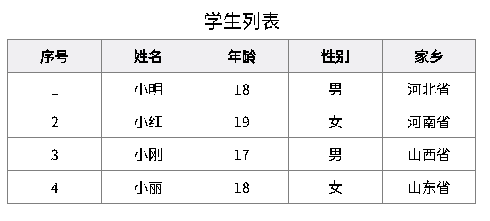

## 对象

### 对象是什么

- 对象（object）：JavaScript里的一种数据类型

- 可以理解为是一种无序的数据集合， 注意数组是有序的数据集合
- 用来描述某个事物，例如描述一个人
  - 人有姓名、年龄、性别等信息、还有吃饭睡觉打代码等功能
  - 如果用多个变量保存则比较散，用对象比较统一
- 比如描述 班主任 信息：
  -  静态特征 (姓名, 年龄, 身高, 性别, 爱好) => 可以使用数字, 字符串, 数组, 布尔类型等表示
  - 动态行为 (点名, 唱, 跳, rap) => 使用函数表示

例如：

```JS
let obj = {
    uname: 'pink老师',
    age: 18,
    gender: '女'
}
```

### 对象使用

#### 对象的声明

```Js
// 方法一
let 对象名 = {}

// 方法二
let 对象名 = new Object()
```

例如：

```JS
// 声明了一个person对象
let person = {}
```

实际开发中，我们多用花括号。 **{} 是对象字面量**

#### 对象的属性

数据描述性的信息称为属性，如人的姓名、身高、年龄、性别等，一般是名词性的。

1. 属性都是成 对出现的，包括属性名和值，它们之间使用英文 `:` 分隔
2. 多个属性之间使用英文 `,` 分隔
3. 属性就是依附在对象上的变量
4. 属性名可以使用 `""` 或 `''`，一般情况下省略，除非名称遇到特殊符号如空格、中横线等

例如：

```JS
let person = {
  name: '小明', // 描述人的姓名
  age: 18, // 描述人的年龄
  stature: 185, // 描述人的身高
  gender: '男', // 描述人的性别
}
```

1.  **属性-查**

**语法一**：`对象名.属性`

示例：

```JS
let person = {
    uname: 'pink老师',
    age: 18,
    gender: '女'
}

console.log(person.uname)
console.log(person.age)
console.log(person.gender)
```

**语法二：**`对象名['属性名']`

对于多词属性或则 - 等属性，点操作就不能用了。

- 我们可以采取：  对象[‘属性’]  方式， 单引号和双引号都阔以
- 也可以用于其他正常属性，比如`console.log(person['age'])`
- []语法里面的值如果不添加引号 默认会当成变量解析

示例：

```JS
let person = {
    'user-name': 'pink老师',
    age: 18,
    gender: '女'
}

console.log(person.user-name) // NaN

// 修改后的代码
console.log(person['user-name']) // pink老师
```

> 总结：没有必要的时候直接使用点语法, 在需要解析变量的时候使用 [] 语法

2. **属性-改**

**语法**：`对象名.属性 = 新值`

示例：

```JS
let person = {
    uname: 'pink老师',
    age: 18,
    gender: '女'
}

person.gender = '男'
console.log(person.gender) // 修改了为男
console.log(person)
```

3. **属性-增**

**语法**：`对象名.新属性 = 新值`

示例：

```JS
let person = {
    uname: 'pink老师',
    age: 18,
    gender: '女'
}

person.address = '武汉黑马'
console.log(person)
```

4. **属性-删**

**语法**：`delete 对象名.属性 `

示例：

```javascript
let person = {
    uname: 'pink老师',
    age: 18,
    gender: '女'
}

delete person.gender // 删除 gender属性
console.log(person)
```

#### 对象的方法

对象中的方法，其本质是函数。

```JS
let person = {
    name: 'andy',
    sayHi: function() {
        document.write('hi~~')
    }
}
```

1. 方法是由方法名和函数两部分构成，它们之间使用 : 分隔
2. 多个属性之间使用英文 `,` 分隔
3. 方法是依附在对象中的函数
4. 方法名可以使用 `""` 或 `''`，一般情况下省略，除非名称遇到特殊符号如空格、中横线等
5. 声明对象，并添加了若干方法后，可以使用 `.` 或 `[]` 调用对象中函数，称之为方法调用
6. 可以添加形参和实参
7. 也可以动态为对象添加方法，动态添加与直接定义是一样的，只是语法上更灵活

> **注：无论是属性或是方法，同一个对象中出现名称一样的，后面的会覆盖前面的。**

示例：

```JS
let obj = {
  uname: '小明',
  sing: function () {
    console.log('在唱歌')
  },
  add: function (x, y) {
    console.log(x + y)
  }
}
// 方法调用
obj.sing()
obj.add(2, 3)
obj['sing']()
// 动态添加方法
obj.dance = function () {
  console.log('在跳舞')
}
obj.dance()
```

### null

null 也是 JavaScript 中数据类型的一种，通常只用它来表示不存在的对象。使用 typeof 检测类型它的类型时，结果为 `object`。

### 遍历对象

对象没有像数组一样的length属性，所以无法确定长度

对象里面是无序的键值对, 没有规律. 不像数组里面有规律的下标

**语法：**

```JS
let obj = {
    uname: 'andy',
    age: 18,
    sex: '男'
}

for (let k in obj) {
    console.log(k) // 打印属性名
    console.log(obj[k]) // 打印属性值
}
```

- 一般不用这种方式遍历数组、主要是用来遍历对象（for in 不提倡遍历数组 因为 k 是 字符串）
- for in语法中的 k 是一个变量, 在循环的过程中依次代表对象的'属性名'
- 由于 k 是变量, 所以必须使用 [ ] 语法解析
- 一定记住： **k** 是获得对象的**属性名（加了引号的）**， **对象名[k]** 是获得 **属性值**

**示例1：**

需求：请把下面数据中的对象打印出来：

```
// 定义一个存储了若干学生信息的数组
let students = [
 {name: '小明', age: 18, gender: '男', hometown: '河北省'},
 {name: '小红', age: 19, gender: '女', hometown: '河南省'},
 {name: '小刚', age: 17, gender: '男', hometown: '山西省'},
 {name: '小丽', age: 18, gender: '女', hometown: '山东省'}
 ]
```

```JS
let students = [
  { name: '小明', age: 18, gender: '男', hometown: '河北省' },
  { name: '小红', age: 19, gender: '女', hometown: '河南省' },
  { name: '小刚', age: 17, gender: '男', hometown: '山西省' },
  { name: '小丽', age: 18, gender: '女', hometown: '山东省' }
]
for (let i = 0; i < students.length; i++) {
  document.write(`第${i + 1}个学生的信息：<br>`)
  for (let k in students[i]) {
    document.write(k + ': ' + students[i][k] + '<br>')
  }
  document.write('<br>')
}
```

**示例2：**

需求：根据以上数据渲染生成表格

```html
<!DOCTYPE html>
<html lang="en">

<head>
    <meta charset="UTF-8">
    <meta name="viewport" content="width=device-width, initial-scale=1.0">
    <title>Document</title>
    <style>
        * {
            box-sizing: border-box;
        }

        .table {
            margin: 20px auto;
            width: 800px;
            height: 600px;
        }

        .table h4 {
            text-align: center;
            font-weight: 400;
            font-size: 20px;
            margin-bottom: 5px;
        }

        .table table {
            border-collapse: collapse;
            margin: 0 auto;
        }

        .table table th {
            background-color: #F0EFF2;
        }

        .table table th,
        .table table td {
            text-align: center;
            border: 1px solid gray;
            width: 100px;
            height: 35px;
        }

        .table table tr:not(:first-child):hover {
            background-color: #eee;
        }
    </style>
</head>

<body>
    <div class="table">
        <h4>学生列表</h4>
        <table>
            <tr>
                <th>序号</th>
                <th>姓名</th>
                <th>年龄</th>
                <th>性别</th>
                <th>家乡</th>
            </tr>

            <script>
                let students = [
                    { name: '小明', age: 18, gender: '男', hometown: '河北省' },
                    { name: '小红', age: 19, gender: '女', hometown: '河南省' },
                    { name: '小刚', age: 17, gender: '男', hometown: '山西省' },
                    { name: '小丽', age: 18, gender: '女', hometown: '山东省' }
                ]

                for (let i = 0; i < students.length; i++) {
                    document.write(`<tr><td>${i + 1}</td>`)
                    for (let k in students[i]) {
                        document.write(`<td>${students[i][k]}</td>`)
                    }
                    document.write(`</tr>`)
                }
            </script>
        </table>
    </div>
</body>

</html>
```



---

## 内置对象

回想一下我们曾经使用过的 `console.log`，`console`其实就是 JavaScript 中内置的对象，该对象中存在一个方法叫 `log`，然后调用 `log` 这个方法，即 `console.log()`。

除了 `console` 对象外，JavaScritp 还有其它的内置的对象

### 内置对象-Math

**介绍**：Math对象是JavaScript提供的一个“数学”对象

**作用**：提供了一系列做数学运算的方法

#### 属性

- `Math.PI`，获取圆周率

```
 // 圆周率
 console.log(Math.PI);
```

#### 方法

- `Math.random`，生成 0 到 1 间的随机数

```
 // 0 ~ 1 之间的随机数, 包含 0 不包含 1
 Math.random()
```

- `Math.ceil`，数字向上取整

```
 // 舍弃小数部分，整数部分加1
 Math.ceil(3.4)
```

- `Math.floor`，数字向下取整

```
 // 舍弃小数部分，整数部分不变
 Math.floor(4.68)
```

- `Math.round`，四舍五入取整

```
 // 取整，四舍五入原则
 Math.round(5.46539)
 Math.round(4.849)
```

- `Math.max`，在一组数中找出最大的

```
 // 找出最大值
 Math.max(10, 21, 7, 24, 13)
```

- `Math.min`，在一组数中找出最小的

```
 // 找出最小值
 Math.min(24, 18, 6, 19, 21)
```

- `Math.pow`，幂方法

```
 // 求某个数的多少次方
 Math.pow(4, 2) // 求 4 的 2 次方
 Math.pow(2, 3) // 求 2 的 3 次方
```

- `Math.sqrt`，平方根

```
 // 求某数的平方根
 Math.sqrt(16)
```

数学对象提供了比较多的方法，这里不要求强记，通过演示数学对象的使用，加深对对象的理解。

#### 生成任意范围随机数

Math.random()  随机数函数， 返回一个0 - 1之间，并且包括0不包括1的随机小数  [0, 1）

如何生成0-10的随机数呢？

```JS
Math.floor(Math.random() * (10 + 1))
```

如何生成5-10的随机数？

```JS
Math.floor(Math.random() * (5 + 1)) + 5
```

如何生成N-M之间的随机数?

```JS
Math.floor(Math.random() * (M - N + 1)) + N
```

#### 示例

**示例1：**

需求：请把    [‘赵云’, ‘黄忠’, ‘关羽’, ‘张飞’, ‘马超’, ‘刘备’, ‘曹操’]  随机显示一个名字到页面中

```JS
let arr = ['赵云', '黄忠', '关羽', '张飞', '马超', '刘备', '曹操']
for (let i = 0; i < 7; i++) {
  let k = Math.floor(Math.random() * arr.length)
  document.write(arr[k] + '<br>')
  arr.splice(k, 1)
}
console.log(arr)
```

**示例2：**

需求：程序随机生成 1~10 之间的一个数字，用户输入一个数字

①：如果大于该数字，就提示，数字猜大了，继续猜

②：如果小于该数字，就提示，数字猜小了，继续猜

③：如果猜对了，就提示猜对了，程序结束

```JS
let ranNum = Math.floor(Math.random() * 10) + 1
let num = -1
while (num !== ranNum) {
  num = +prompt('猜猜这是几?(1-10)')
  if (num > ranNum) {
    alert('大了')
  }
  if (num < ranNum) {
    alert('小了')
  }
}
alert('恭喜你，猜对了')
```

**示例3：**

需求：该函数接收一个布尔类型参数，表示颜色的格式是十六进制还是rgb格式。 

分析： 提示： 16进制颜色格式为: ‘#ffffff’  其中f可以是任意 0-f之间的字符,需要用到数组， let arr = ['0', '1', '2', '3', '4', '5', '6', '7', '8', '9', 'a', 'b', 'c', 'd', 'e', 'f'] 

提示:  rgb颜色格式为: ‘rgb(255,255,255) ’ 其中255可以是任意0-255之间的数字

```html
	<!DOCTYPE html>
<html lang="en">

<head>
    <meta charset="UTF-8">
    <meta name="viewport" content="width=device-width, initial-scale=1.0">
    <title>Document</title>
    <style>
        div {
            width: 200px;
            height: 200px;
            margin: 10px;
        }
    </style>
</head>

<body>

    <script>
        function getRandomColor(flag = true) {
            let color = ''
            if (flag) {
                color += '#'
                let colorArr = ['0', '1', '2', '3', '4', '5', '6', '7', '8', '9', 'a', 'b', 'c', 'd', 'f']
                for (i = 0; i < 6; i++) {
                    let k = Math.floor(Math.random() * colorArr.length)
                    color += colorArr[k]
                }
            } else {
                let r = Math.floor(Math.random() * 256)
                let g = Math.floor(Math.random() * 256)
                let b = Math.floor(Math.random() * 256)
                color = `rgb(${r}, ${g}, ${b})`
            }
            return color
        }
        let color1 = getRandomColor(true)
        let color2 = getRandomColor(false)
        console.log(color1)
        console.log(color2)
        document.write(`<div style='background-color:${color1};'></div>`)
        document.write(`<div style='background-color:${color2};'></div>`)
    </script>
</body>

</html>
```


---

## 综合案例-学成在线页面渲染案例


---

## 拓展

### 术语解释

| 术语           | 解释                                                       | 举例                                              |
| -------------- | ---------------------------------------------------------- | ------------------------------------------------- |
| 关键字         | 在JavaScript中有特殊意义的词汇                             | let、var、function、if、else、switch、case、break |
| 保留字         | 在目前的JavaScript中没意义，但未来可能会具有特殊意义的词汇 | int、short、long、char                            |
| 标识（标识符） | 变量名、函数名的另一种叫法                                 | 无                                                |
| 表达式         | 能产生值的代码，一般配合运算符出现                         | 10 + 3、age >= 18                                 |
| 语句           | 一段可执行的代码                                           | if() for()                                        |

### 基本数据类型和引用数据类型

简单类型又叫做基本数据类型或者**值类型**，复杂类型又叫做**引用类型**。

- 值类型：简单数据类型/基本数据类型，在存储时变量中存储的是值本身，因此叫做值类型。如string ，number，boolean，undefined，null
- 引用类型：复杂数据类型，在存储时变量中存储的仅仅是地址（引用），因此叫做引用数据类型 通过 new 关键字创建的对象（系统对象、自定义对象），如 Object、Array、Date等

堆栈空间分配区别：

- 栈（操作系统）：由操作系统自动分配释放存放函数的参数值、局部变量的值等。其操作方式类似于数据结构中的 栈；（**简单数据类型存放到栈里面**）
- 堆（操作系统）：存储复杂类型(对象)，一般由程序员分配释放，若程序员不释放，由垃圾回收机制回收。（**引用数据类型存放到堆里面**）


