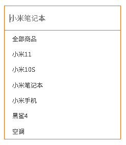

## 事件监听（绑定）

- 什么是事件？

事件是在编程时系统内发生的**动作**或者发生的事情

比如用户在网页上**单击**一个按钮

- **语法：**

```JS
元素对象.addEventListener('事件类型', 要执行的函数)
```

- **事件监听三要素：**

**事件源：**  那个dom元素被事件触发了，要获取dom元素 

**事件类型：** 用什么方式触发，比如鼠标单击 click、鼠标经过 mouseover 等

**事件调用的函数：** 要做什么事

- 例如

```JS
<button class="btn">按钮</button>
<script>
    const btn = document.querySelector('.btn')
    // 修改元素样式
    btn.addEventListener('click', function () {
        alert('点击了~')
    })
</script>
```

> 注意：
>
> 1. 事件类型要**加引号**
> 2. 函数是点击之后再去执行，每 次点击都会执行一次

- **事件监听版本**

DOM L0：事件源.on事件 = function() { }

DOM L2：事件源.addEventListener(事件， 事件处理函数)

区别：on方式会被覆盖，`addEventListener`方式可绑定多次，拥有事件更多特性，推荐使用

- **示例1：**点击关闭顶部广告

需求：点击关闭之后，顶部关闭

```html
<!DOCTYPE html>
<html lang="en">

<head>
    <meta charset="UTF-8">
    <meta http-equiv="X-UA-Compatible" content="IE=edge">
    <meta name="viewport" content="width=device-width, initial-scale=1.0">
    <title>Document</title>
    <style>
        .box {
            position: relative;
            width: 1000px;
            height: 200px;
            background-color: pink;
            margin: 100px auto;
            text-align: center;
            font-size: 50px;
            line-height: 200px;
            font-weight: 700;
        }

        .box1 {
            position: absolute;
            right: 20px;
            top: 10px;
            width: 20px;
            height: 20px;
            background-color: skyblue;
            text-align: center;
            line-height: 20px;
            font-size: 16px;
            cursor: pointer;
        }
    </style>
</head>

<body>
    <div class="box">
        我是广告
        <div class="box1">X</div>
    </div>
    <script>
        const x = document.querySelector('.box1')
        x.addEventListener('click', function () {
            document.querySelector('.box').style.display = 'none'
        })
    </script>
</body>

</html>
```

- **示例2：**随机点名案例

业务分析：

点击开始按钮随机抽取数组的一个数据，放到页面中

点击结束按钮删除数组当前抽取的一个数据

当抽取到最后一个数据的时候，两个按钮同时禁用（写点开始里面，只剩最后一个数据不用抽了 ）

核心：利用定时器快速展示，停止定时器结束展示

```JS
<!DOCTYPE html>
<html lang="en">

<head>
    <meta charset="UTF-8">
    <meta name="viewport" content="width=device-width, initial-scale=1.0">
    <title>Document</title>
    <style>
        * {
            margin: 0;
            padding: 0;
        }

        h2 {
            text-align: center;
        }

        .box {
            width: 600px;
            margin: 50px auto;
            display: flex;
            font-size: 25px;
            line-height: 40px;
        }

        .qs {

            width: 450px;
            height: 40px;
            color: red;

        }

        .btns {
            text-align: center;
        }

        .btns button {
            width: 120px;
            height: 35px;
            margin: 0 50px;
        }
    </style>
</head>

<body>
    <h2>随机点名</h2>
    <div class="box">
        <span>名字是：</span>
        <div class="qs">这里显示姓名</div>
    </div>
    <div class="btns">
        <button class="start">开始</button>
        <button class="end">结束</button>
    </div>

    <script>
        // 数据数组
        const arr = ['马超', '黄忠', '赵云', '关羽', '张飞']
        let random
        let timer
        const start = document.querySelector('.btns .start')
        start.addEventListener('click', function () {
            timer = setInterval(function () {
                random = Math.floor(Math.random() * arr.length)
                const qs = document.querySelector('.box .qs')
                qs.innerText = arr[random]
            }, 200)
        })

        const end = document.querySelector('.btns .end')
        end.addEventListener('click', function () {
            clearInterval(timer)
            arr.splice(random, 1)
            if (arr.length === 1) {
                start.disabled = true
                this.disabled = true
            }
            console.log(arr)
        })
    </script>
</body>

</html>
```

---

## 事件类型

将众多的事件类型分类可分为：鼠标事件、键盘事件、表单事件、焦点事件等。

### 鼠标事件

- `click `  鼠标点击
- `mouseenter` 鼠标经过
- `mouseleave`  鼠标离开

**示例：**轮播图点击切换

需求：当点击左右的按钮，可以切换轮播图

分析：

右侧按钮点击，变量++，如果大于等于8，则复原0

左侧按钮点击，变量--，如果小于0，则复原最后一张

鼠标经过暂停定时器

鼠标离开开启定时器

```JS
前面的代码见前面的轮播图示例
<script>
  // 1. 初始数据
  const sliderData = [
    { url: './images/slider01.jpg', title: '对人类来说会不会太超前了？', color: 'rgb(100, 67, 68)' },
    { url: './images/slider02.jpg', title: '开启剑与雪的黑暗传说！', color: 'rgb(43, 35, 26)' },
    { url: './images/slider03.jpg', title: '真正的jo厨出现了！', color: 'rgb(36, 31, 33)' },
    { url: './images/slider04.jpg', title: '李玉刚：让世界通过B站看到东方大国文化', color: 'rgb(139, 98, 66)' },
    { url: './images/slider05.jpg', title: '快来分享你的寒假日常吧~', color: 'rgb(67, 90, 92)' },
    { url: './images/slider06.jpg', title: '哔哩哔哩小年YEAH', color: 'rgb(166, 131, 143)' },
    { url: './images/slider07.jpg', title: '一站式解决你的电脑配置问题！！！', color: 'rgb(53, 29, 25)' },
    { url: './images/slider08.jpg', title: '谁不想和小猫咪贴贴呢！', color: 'rgb(99, 72, 114)' },
  ]

  // 函数：切换图片
  function changeImg(i = 0) {
    document.querySelector('.slider-indicator .active').classList.remove('active')
    const img = document.querySelector('.slider-wrapper img')
    const p = document.querySelector('.slider-footer p')
    const footer = document.querySelector('.slider-footer')
    img.src = sliderData[i].url
    p.innerText = sliderData[i].title
    footer.style.backgroundColor = sliderData[i].color
    document.querySelector(`.slider-indicator li:nth-child(${i + 1})`).classList.add('active')
  }

  let i = 0   // 当前展示的图片序号

  // 鼠标经过暂停定时器
  const slider = document.querySelector('.slider')
  slider.addEventListener('mouseenter', function () {
    clearInterval(timerId)
  })

  // 鼠标离开开启定时器
  slider.addEventListener('mouseleave', function () {
    clearInterval(timerId)
    timerId = setInterval(function () {
      i = (i + 1) % sliderData.length
      changeImg(i)
    }, 1000)
  })

  // 右侧按钮添加事件
  const prev = document.querySelector('.toggle .prev')
  prev.addEventListener('click', function () {
    i = (i - 1 + sliderData.length) % sliderData.length
    changeImg(i)
  })

  // 左侧按钮添加事件
  const next = document.querySelector('.toggle .next')
  next.addEventListener('click', function () {
    i = (i + 1) % sliderData.length
    changeImg(i)
  })

  // 轮播效果
  let timerId = setInterval(function () {
    next.click()    // 调用 next 的点击事件
  }, 1000)
</script>
```

### 键盘事件

- `keydown`   键盘按下触发

- `keyup`   键盘抬起触发

### 焦点事件

主要是与表单的输入有关

- `focus`  获得焦点

- `blur` 失去焦点

**示例：**小米搜索框案例

需求：当表单得到焦点，显示下拉菜单，失去焦点隐藏下来菜单

分析：

开始下拉菜单要进行隐藏

表单获得焦点 focus，则显示下拉菜单，并且文本框变色（添加类）

表单失去焦点，反向操作

```html
<!DOCTYPE html>
<html lang="en">

<head>
    <meta charset="UTF-8">
    <meta http-equiv="X-UA-Compatible" content="IE=edge">
    <meta name="viewport" content="width=device-width, initial-scale=1.0">
    <title>Document</title>
    <style>
        * {
            margin: 0;
            padding: 0;
            box-sizing: border-box;
        }

        ul {

            list-style: none;
        }

        .mi {
            position: relative;
            width: 223px;
            margin: 100px auto;
        }

        .mi input {
            width: 223px;
            height: 48px;
            padding: 0 10px;
            font-size: 14px;
            line-height: 48px;
            border: 1px solid #e0e0e0;
            outline: none;
        }

        .mi .search {
            border: 1px solid #ff6700;
        }

        .result-list {
            display: none;
            position: absolute;
            left: 0;
            top: 48px;
            width: 223px;
            border: 1px solid #ff6700;
            border-top: 0;
            background: #fff;
        }

        .result-list a {
            display: block;
            padding: 6px 15px;
            font-size: 12px;
            color: #424242;
            text-decoration: none;
        }

        .result-list a:hover {
            background-color: #eee;
        }
    </style>

</head>

<body>
    <div class="mi">
        <input type="search" placeholder="小米笔记本">
        <ul class="result-list">
            <li><a href="#">全部商品</a></li>
            <li><a href="#">小米11</a></li>
            <li><a href="#">小米10S</a></li>
            <li><a href="#">小米笔记本</a></li>
            <li><a href="#">小米手机</a></li>
            <li><a href="#">黑鲨4</a></li>
            <li><a href="#">空调</a></li>
        </ul>
    </div>
    <script>
        const input = document.querySelector('[type=search]')
        input.addEventListener('focus', function () {
            const list = document.querySelector('.result-list')
            list.style.display = 'block'
            input.classList.add('search')
        })
        input.addEventListener('blur', function () {
            const list = document.querySelector('.result-list')
            list.style.display = 'none'
            input.classList.remove('search')
        })
    </script>
</body>

</html>
```



### 文本框输入事件

- `input` 用户输入事件

**示例：**评论字数统计

需求：用户输入文字，可以计算用户输入的字数

提示：使用`value.length`获取文本长度

```html
<!DOCTYPE html>
<html lang="en">

<head>
    <meta charset="UTF-8">
    <meta http-equiv="X-UA-Compatible" content="IE=edge">
    <meta name="viewport" content="width=device-width, initial-scale=1.0">
    <title>评论回车发布</title>
    <style>
        .wrapper {
            min-width: 400px;
            max-width: 800px;
            display: flex;
            justify-content: flex-end;
        }

        .avatar {
            width: 48px;
            height: 48px;
            border-radius: 50%;
            overflow: hidden;
            background: url(./images/avatar.jpg) no-repeat center / cover;
            margin-right: 20px;
        }

        .wrapper textarea {
            outline: none;
            border-color: transparent;
            resize: none;
            background: #f5f5f5;
            border-radius: 4px;
            flex: 1;
            padding: 10px;
            transition: all 0.5s;
            height: 30px;
        }

        .wrapper textarea:focus {
            border-color: #e4e4e4;
            background: #fff;
            height: 50px;
        }

        .wrapper button {
            background: #00aeec;
            color: #fff;
            border: none;
            border-radius: 4px;
            margin-left: 10px;
            width: 70px;
            cursor: pointer;
        }

        .wrapper .total {
            margin-right: 80px;
            color: #999;
            margin-top: 5px;
            opacity: 0;
            transition: all 0.5s;
        }
    </style>
</head>

<body>
    <div class="wrapper">
        <i class="avatar"></i>
        <textarea id="tx" placeholder="发一条友善的评论" rows="2" maxlength="200"></textarea>
        <button>发布</button>
    </div>
    <div class="wrapper">
        <span class="total">0/200字</span>
    </div>

    <script>
        const textarea = document.querySelector('#tx')
        const total = document.querySelector('.wrapper .total')
        // 当文本域获得焦点，字数显示
        textarea.addEventListener('focus', function () {
            total.style.opacity = '1'
        })
        // 当文本域失去焦点，字数不显示
        textarea.addEventListener('blur', function () {
            total.style.opacity = '0'
        })

        textarea.addEventListener('input', function () {
            const textLength = textarea.value.length
            total.innerText = `${textLength}/200字`
        })
    </script>
</body>

</html>
```

----

## 事件对象

任意事件类型被触发时与事件相关的信息会被以对象的形式记录下来，我们称这个对象为事件对象。

使用场景：

- 可以判断用户按下哪个键，比如按下回车键可以发布新闻
- 可以判断用户按下哪个键，比如按下回车键可以发布新闻

### 获取事件对象

- **语法：**

在事件绑定的回调函数的第一个参数就是事件对象

一般命名为event、ev、e

```JS
元素.addEventListener('click', function (e) {
})
```

### 事件对象常用属性

**部分常用属性：**

- `type` ：获取当前的事件类型
- `clientX/clientY` ： 获取光标相对于浏览器可见窗口左上角的位置
- `offsetX/offsetY` ： 获取光标相对于当前DOM元素左上角的位置
- `key` ： 用户按下的键盘键的值（现在不提倡使用keyCode）

**示例：**评论回车发布

需求：按下回车键盘，可以发布信息

> **`trim()`** 去除字符串两端的空白字符，包括空格、制表符（`\t`）以及换行符（`\n`、`\r\n` ）

```html
<!DOCTYPE html>
<html lang="en">

<head>
    <meta charset="UTF-8">
    <meta http-equiv="X-UA-Compatible" content="IE=edge">
    <meta name="viewport" content="width=device-width, initial-scale=1.0">
    <title>评论回车发布</title>
    <style>
        .wrapper {
            min-width: 400px;
            max-width: 800px;
            display: flex;
            justify-content: flex-end;
        }

        .avatar {
            width: 48px;
            height: 48px;
            border-radius: 50%;
            overflow: hidden;
            background: url(./images/avatar.jpg) no-repeat center / cover;
            margin-right: 20px;
        }

        .wrapper textarea {
            outline: none;
            border-color: transparent;
            resize: none;
            background: #f5f5f5;
            border-radius: 4px;
            flex: 1;
            padding: 10px;
            transition: all 0.5s;
            height: 30px;
        }

        .wrapper textarea:focus {
            border-color: #e4e4e4;
            background: #fff;
            height: 50px;
        }

        .wrapper button {
            background: #00aeec;
            color: #fff;
            border: none;
            border-radius: 4px;
            margin-left: 10px;
            width: 70px;
            cursor: pointer;
        }

        .wrapper .total {
            margin-right: 80px;
            color: #999;
            margin-top: 5px;
            opacity: 0;
            transition: all 0.5s;
        }

        .list {
            min-width: 400px;
            max-width: 800px;
            display: flex;
        }

        .list .item {
            width: 100%;
            display: flex;
        }

        .list .item .info {
            flex: 1;
            border-bottom: 1px dashed #e4e4e4;
            padding-bottom: 10px;
        }

        .list .item p {
            margin: 0;
        }

        .list .item .name {
            color: #FB7299;
            font-size: 14px;
            font-weight: bold;
        }

        .list .item .text {
            color: #333;
            padding: 10px 0;
        }

        .list .item .time {
            color: #999;
            font-size: 12px;
        }
    </style>
</head>

<body>
    <div class="wrapper">
        <i class="avatar"></i>
        <textarea id="tx" placeholder="发一条友善的评论" rows="2" maxlength="200"></textarea>
        <button>发布</button>
    </div>
    <div class="wrapper">
        <span class="total">0/200字</span>
    </div>
    <div class="list">
        <div class="item" style="display: none;">
            <i class="avatar"></i>
            <div class="info">
                <p class="name">清风徐来</p>
                <p class="text">大家都辛苦啦，感谢各位大大的努力，能圆满完成真是太好了[笑哭][支持]</p>
                <p class="time">2022-10-10 20:29:21</p>
            </div>
        </div>
    </div>

    <script>
        const textarea = document.querySelector('#tx')
        const total = document.querySelector('.wrapper .total')
        // 当文本域获得焦点，字数显示
        textarea.addEventListener('focus', function () {
            total.style.opacity = '1'
        })
        // 当文本域失去焦点，字数不显示
        textarea.addEventListener('blur', function () {
            total.style.opacity = '0'
        })

        textarea.addEventListener('input', function () {
            const textLength = textarea.value.length
            total.innerText = `${textLength}/200字`
        })

        textarea.addEventListener('keyup', function (e) {
            if (e.key === 'Enter') {
                if (textarea.value.trim() !== '') {
                    const item = document.querySelector('.list .item')
                    const text = document.querySelector('.list .item .info .text')
                    text.innerText = textarea.value.trim()
                    item.style.display = 'block'
                }
                textarea.value = ''     // 清空文本域
                total.innerText = `0/200字`
            }
        })
    </script>
</body>

</html>
```

----

## 环境对象

环境对象指的是函数内部特殊的变量 `this` ，它代表着当前函数运行时所处的环境。每个函数里面都有`this`。

1. `this` 本质上是一个变量，数据类型为对象
2. 函数的调用方式不同 `this` 变量的值也不同
3. 【谁调用 `this` 就是谁】是判断 `this` 值的粗略规则
4. 函数直接调用时实际上 `window.sayHi()` 所以 `this` 的值为 `window`

```JS
<script>
  // 声明函数
  function sayHi() {
    // this 是一个变量
    console.log(this);
  }

  // 声明一个对象
  let user = {
    name: '张三',
    sayHi: sayHi // 此处把 sayHi 函数，赋值给 sayHi 属性
  }
  
  let person = {
    name: '李四',
    sayHi: sayHi
  }

  // 直接调用
  sayHi() // window
  window.sayHi() // window

  // 做为对象方法调用
  user.sayHi()// user
	person.sayHi()// person
</script>
```

----

## 回调函数

如果将函数 A 做为参数传递给函数 B 时，我们称函数 A 为**回调函数**

```html
<script>
  // 声明 foo 函数
  function foo(arg) {
    console.log(arg);
  }

  // 普通的值做为参数
  foo(10);
  foo('hello world!');
  foo(['html', 'css', 'javascript']);

  function bar() {
    console.log('函数也能当参数...');
  }
  // 函数也可以做为参数！！！！
  foo(bar);
</script>
```

函数 `bar` 做参数传给了 `foo` 函数，`bar` 就是所谓的回调函数了！！！

我们回顾一下间歇函数 `setInterval` 

```html
<script>
	function fn() {
    console.log('我是回调函数...');
  }
  // 调用定时器
  setInterval(fn, 1000);
</script>
```

`fn` 函数做为参数传给了 `setInterval` ，这便是回调函数的实际应用了，结合刚刚学习的函数表达式上述代码还有另一种更常见写法。

```html
<script>
  // 调用定时器，匿名函数做为参数
  setInterval(function () {
    console.log('我是回调函数...');
  }, 1000);
</script>
```

结论：

1. 回调函数本质还是函数，只不过把它当成参数使用
2. 使用匿名函数做为回调函数比较常见

----

## 综合案例-Tab栏切换

需求：鼠标经过不同的选项卡，底部可以显示 不同的内容


