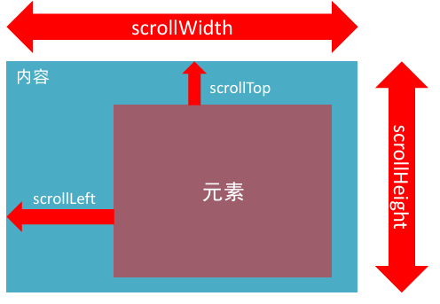
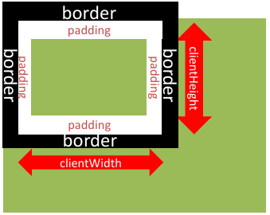

## 事件流

**事件流**指的是事件完整执行过程中的流动路径


如上图所示，任意事件被触发时总会经历两个阶段：【捕获阶段】和【冒泡阶段】。

简言之，捕获阶段是【从父到子】的传导过程，冒泡阶段是【从子向父】的传导过程。

**实际工作都是使用事件冒泡为主**

### 事件捕获

事件捕获：从DOM的根元素开始去执行对应的事件 (从外到里)

事件捕获需要写对应代码才能看到效果

代码：

```JS
DOM.addEventListener(事件类型, 事件处理函数, 是否使用捕获机制)
```

说明：

- addEventListener第三个参数传入 **`true`** 代表是捕获阶段触发（很少使用）
- 若传入false代表冒泡阶段触发，默认就是false
- 若是用 L0 事件监听，则只有冒泡阶段，没有捕获

### 事件冒泡

事件冒泡：当一个元素的事件被触发时，同样的事件将会在该元素的所有祖先元素中依次被触发。这一过程被称为事件冒 泡

简单理解：当一个元素触发事件后，会依次向上调用所有父级元素的 **同名事件**

事件冒泡是默认存在的

L2事件监听第三个参数是 false，或者默认都是冒泡

例如：

```JS
const father = document.querySelector('.father')
const son = document.querySelector('.son')
document.addEventListener('click', function () {
    alert('我是爷爷')
})
father.addEventListener('click', function () {
    alert('我是爸爸')
})
son.addEventListener('click', function () {
    alert('我是儿子')
})
```

### 阻止冒泡

**问题：**因为默认就有冒泡模式的存在，所以容易导致事件影响到父级元素

**需求：**若想把事件就限制在当前元素内，就需要阻止事件冒泡

**前提：**阻止事件冒泡需要拿到事件对象

**语法：**

```JS
事件对象.stopPropagation()
```

> 注意：此方法可以阻断事件流动传播，不光在冒泡阶段有效，捕获阶段也有效

例如：

```JS
const father = document.querySelector('.father')
const son = document.querySelector('.son')
document.addEventListener('click', function () {
    alert('我是爷爷')
})
fa.addEventListener('click', function () {
    alert('我是爸爸')
})
son.addEventListener('click', function (e) {
  	alert('我是儿子')
    // 阻止冒泡
    e.stopPropagation()
})
```

### 阻止默认行为

**我们某些情况下需要**阻止默认行为的发生，比如 阻止 链接的跳转，表单域跳转

**语法：**

```JS
e.preventDefault()
```

例如：

```Js
<form action="http://www.baidu.com">
    <input type="submit" value="提交">
</form>
<script>
const form = document.querySelector('form')
form.addEventListener('click', function (e) {
    // 阻止表单默认提交行为
    e.preventDefault()
})
```

### 解绑事件

- on事件方式，直接使用null覆盖偶就可以实现事件的解绑

**语法：**

```JS
// 绑定事件
btn.onclick = function () {
    alert('点击了')
}
// 解绑事件
btn.onclick = null
```

- addEventListener方式，必须使用：

`removeEventListener(事件类型, 事件处理函数,  [获取捕获或者冒泡阶段])`

```JS
function fn() {
    alert('点击了')
}
// 绑定事件
btn.addEventListener('click', fn)
// 解绑事件
btn.removeEventListener('click', fn)
```

> **注意：匿名函数无法被解绑**

### 鼠标经过事件的区别

鼠标经过事件：

`mouseover `和 `mouseout `会有冒泡效果

`mouseenter  `和 `mouseleave   `没有冒泡效果 (推荐)

### 两种注册事件的区别

1. **传统on注册（L0）**

- 同一个对象,后面注册的事件会覆盖前面注册(同一个事件)
- 直接使用null覆盖偶就可以实现事件的解绑
- 都是冒泡阶段执行的

2. **事件监听注册（L2）**

- 语法: addEventListener(事件类型, 事件处理函数, 是否使用捕获)
- 后面注册的事件不会覆盖前面注册的事件(同一个事件)
- 可以通过第三个参数去确定是在冒泡或者捕获阶段执行
- 必须使用removeEventListener(事件类型, 事件处理函数, 获取捕获或者冒泡阶段)
- 匿名函数无法被解绑

----

## 事件委托

事件委托是利用事件流的特征解决一些现实开发需求的知识技巧，主要的作用是提升程序效率。

**优点：**减少注册次数，可以提高程序性能（大量的事件监听是比较耗费性能的）

**原理：**事件委托其实是利用事件冒泡的特点。给**父元素注册事件**，当我们触发子元素的时候，会冒泡到父元素身上，从而触发父元素的事 件

**实现：**`事件对象.target.tagName `可以获得真正触发事件的元素

如：

```JS
const ul = document.querySelector('ul')
ul.addEventListener('click', function (e) {
    // console.dir(e.target)
    if (e.target.tagName === 'LI') {
        e.target.style.color = 'pink'
    }
})
```

**示例：**tab栏切换改造

需求：优化程序，将tab切换案例改为事件委托写法

> 1. 使用`mouseover`
> 2. 使用自定义属性

```html
<!DOCTYPE html>
<html lang="en">

<head>
    <meta charset="UTF-8" />
    <meta http-equiv="X-UA-Compatible" content="IE=edge" />
    <meta name="viewport" content="width=device-width, initial-scale=1.0" />
    <title>tab栏切换</title>
    <style>
        * {
            margin: 0;
            padding: 0;
        }

        .tab {
            width: 590px;
            height: 340px;
            margin: 20px;
            border: 1px solid #e4e4e4;
        }

        .tab-nav {
            width: 100%;
            height: 60px;
            line-height: 60px;
            display: flex;
            justify-content: space-between;
        }

        .tab-nav h3 {
            font-size: 24px;
            font-weight: normal;
            margin-left: 20px;
        }

        .tab-nav ul {
            list-style: none;
            display: flex;
            justify-content: flex-end;
        }

        .tab-nav ul li {
            margin: 0 20px;
            font-size: 14px;
        }

        .tab-nav ul li a {
            text-decoration: none;
            border-bottom: 2px solid transparent;
            color: #333;
        }

        .tab-nav ul li a.active {
            border-color: #e1251b;
            color: #e1251b;
        }

        .tab-content {
            padding: 0 16px;
        }

        .tab-content .item {
            display: none;
        }

        .tab-content .item.active {
            display: block;
        }
    </style>
</head>

<body>
    <div class="tab">
        <div class="tab-nav">
            <h3>每日特价</h3>
            <ul>
                <li><a class="active" href="javascript:;" data-id="0">精选</a></li>
                <li><a href="javascript:;" data-id="1">美食</a></li>
                <li><a href="javascript:;" data-id="2">百货</a></li>
                <li><a href="javascript:;" data-id="3">个护</a></li>
                <li><a href="javascript:;" data-id="4">预告</a></li>
            </ul>
        </div>
        <div class="tab-content">
            <div class="item active"></div>
            <div class="item"></div>
            <div class="item"></div>
            <div class="item"></div>
            <div class="item"></div>
        </div>
    </div>

    <script>
        // mouseenter 和 mouseleave 没有冒泡效果
        // mouseover 和 mouseout 有冒泡效果
        const ul = document.querySelector('.tab-nav ul')
        ul.addEventListener('mouseover', function (e) {
            if (e.target.tagName === 'A') {
                document.querySelector('.tab-nav ul .active').classList.remove('active')
                e.target.classList.add('active')
                // 切换图片
                const index = Number(e.target.dataset.id)
                document.querySelector('.tab-content .active').classList.remove('active')
                document.querySelector(`.tab-content .item:nth-child(${index + 1})`).classList.add('active')
            }
        })
    </script>
</body>

</html>
```

---

## 其他事件

### 页面加载事件

加载外部资源（如图片、外联CSS和JavaScript等）加载完毕时触发的事件

有些时候需要等页面资源全部处理完了做一些事情

**事件名：load**

监听页面所有资源加载完毕：

~~~javascript
window.addEventListener('load', function() {
    // xxxxx
})
~~~

> 注意：不光可以监听整个页面资源加载完毕，也可以针对某个资源绑定load事件

​	当初始的 HTML 文档被完全加载和解析完成之后，DOMContentLoaded 事件被触发，而无需等待样式表、图像等完 全加载

**事件名：DOMContentLoaded**

监听页面DOM加载完毕：

```JS
document.addEventListener('DOMContentLoaded', function () {
    // 执行的操作
})
```

### 元素滚动事件

滚动条在滚动的时候持续触发的事件

**事件名：scroll**

监听整个页面滚动：

~~~javascript
window.addEventListener('scroll', function() {
    // xxxxx
})
~~~

给 window 或 document 添加 scroll 事件

监听某个元素的内部滚动直接给某个元素加即可

#### 获取位置

1. `scrollLeft`和`scrollTop `（属性）

- 获取被卷去的大小

- 获取元素内容往左、往上滚出去看不到的距离

- 这两个值是可**读写**的

2. 尽量在scroll事件里面获取被卷去的距离

```JS
div.addEventListener('scroll', function () {
    console.log(this.scrollTop)
})
```



- 开发中，我们经常检测页面滚动的距离，比如页面滚动100像素，就可以显示一个元素，或者固定一个元素

```JS
window.addEventListener('scroll', function () {
  // document.documentElement 是html元素获取方式
  const n = document.documentElement.scrollTop;
  console.log(n);
  if (n >= 800) {
    document.documentElement.scrollTop = 0
  }
});
```

> 注意：document.documentElement   HTML 文档返回对象为HTML元素

#### 滚动到指定的坐标

`scrollTo()` 方法可把内容滚动到指定的坐标

**语法：**`元素.scrollTo(x, y)`

```JS
// 让页面滚动到 y 轴 1000 像素的位置
window.scrollTo(0, 1000);
```

### 页面尺寸事件

会在窗口尺寸改变的时候触发事件：

事件名: **resize**

~~~javascript
window.addEventListener('resize', function() {
    // xxxxx
})
~~~

检测屏幕宽度：

```JS
window.addEventListener('resize', function () {
    let w = document.documentElement.clientWidth;
    console.log(w);
});
```

获取元素宽高：

- **获取宽高：**

获取元素的可见部分宽高（不包含边框，margin，滚动条等）

`clientWidth`和`clientHeight`



- **Rem基准值**

需求：分析 flexible.js 源码

```JS
// 声明一个计算字号的函数
const setFontSize = function () {
    // 获取 html 元素
    const html = document.documentElement;
    // 获取 html 元素的宽度
    const clientWidth = html.clientWidth;
    // html 根字号设置：当前页面宽度（html 元素） / 10 划分为10等份
    html.style.fontSize = clientWidth / 10 + 'px';
}

// 页面加载先调用执行一次
setFontSize();

// 如果页面尺寸发生变化，则重新执行函数，重新计算
window.addEventListener('resize', setFontSize);
```

----

## 元素尺寸与位置

- **使用场景：**

前面案例滚动多少距离，都是我们自己算的，最好是页面滚动到某个元素，就可以做某些事

简单说，就是通过js的方式，得到**元素在页面中的位置**

这样我们可以做，页面滚动到这个位置，就可以做某些操作，省去计算了

- **获取宽高：**

获取元素的自身宽高、包含元素自身设置的宽高、padding、border

`offsetWidth`和`offsetHeight  `

获取出来的是数值,方便计算

注意: 获取的是**可视宽高**, 如果盒子是隐藏的,获取的结果是0

- **获取位置：**

获取元素距离自己定位父级元素的左、上距离，如果都没有则以 文档左上角 为准

**`offsetLeft`和`offsetTop  `注意是只读属性**

- **示例：**仿京东固定导航栏案例

需求：当页面滚动到秒杀模块，导航栏自动滑入，否则滑出

```html
<!DOCTYPE html>
<html lang="en">

<head>
    <meta charset="UTF-8">
    <meta http-equiv="X-UA-Compatible" content="IE=edge">
    <meta name="viewport" content="width=device-width, initial-scale=1.0">
    <title>Document</title>
    <style>
        * {
            margin: 0;
            padding: 0;
            box-sizing: border-box;
        }

        .content {
            overflow: hidden;
            width: 1000px;
            height: 3000px;
            background-color: pink;
            margin: 0 auto;
        }

        .backtop {
            display: none;
            width: 50px;
            left: 50%;
            margin: 0 0 0 505px;
            position: fixed;
            bottom: 60px;
            z-index: 100;
        }

        .backtop a {
            height: 50px;
            width: 50px;
            background: url(./images/bg2.png) 0 -600px no-repeat;
            opacity: 0.35;
            overflow: hidden;
            display: block;
            text-indent: -999em;
            cursor: pointer;
        }

        .header {
            position: fixed;
            top: 0;
            left: 0;
            width: 100%;
            height: 80px;
            background-color: purple;
            text-align: center;
            color: #fff;
            line-height: 80px;
            font-size: 30px;
            transition: all .3s;
        }

        .sk {
            width: 300px;
            height: 300px;
            background-color: skyblue;
            margin-top: 500px;
        }
    </style>
</head>

<body>
    <div class="header">我是顶部导航栏</div>
    <div class="content">
        <div class="sk">秒杀模块</div>
    </div>
    <div class="backtop">
        
        <a href="javascript:;"></a>
    </div>
    <script>
        const sk = document.querySelector('.content .sk')
        const backtop = document.querySelector('.backtop')
        const header = document.querySelector('.header')
        window.addEventListener('scroll', function () {
            const n = document.documentElement.scrollTop
            if (n >= (sk.offsetTop - header.offsetHeight)) {
                backtop.style.display = 'block'
            } else {
                backtop.style.display = 'none'
            }
        })

        // 返回顶部
        const backtopImg = document.querySelector('.backtop img')
        backtopImg.addEventListener('click', function () {
            backtop.style.display = 'none'
        })

        const backtopA = document.querySelector('.backtop a')
        backtopA.addEventListener('click', function () {
            document.documentElement.scrollTop = 0
        })

    </script>
</body>

</html>
```


