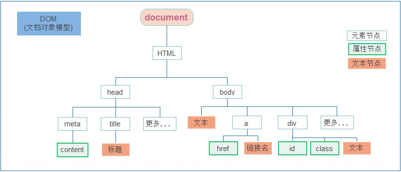
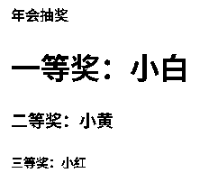

## Web API 基本认知

### 介绍

> 知道 ECMAScript 与 JavaScript 的关系，Web APIs 是浏览器扩展的功能。

严格意义上讲，我们在 JavaScript 阶段学习的知识绝大部分属于 ECMAScript 的知识体系，ECMAScript 简称 ES 它提供了一套语言标准规范，如变量、数据类型、表达式、语句、函数等语法规则都是由 ECMAScript 规定的。浏览器将 ECMAScript 大部分的规范加以实现，并且在此基础上又扩展一些实用的功能，这些被扩展出来的内容我们称为 Web APIs。


ECMAScript 运行在浏览器中然后再结合 Web APIs 才是真正的 JavaScript，Web APIs 的核心是 DOM 和 BOM。

扩展阅读：ECMAScript 规范在不断的更新中，存在多个不同的版本，早期的版本号采用数字顺序编号如 ECMAScript3、ECMAScript5，后来由于更新速度较快便采用年份做为版本号，如 ECMAScript2017、ECMAScript2018 这种格式，ECMAScript6 是 2015 年发布的，常叫做 EMCAScript2015。

关于 JavaScript 历史的[扩展阅读](https://javascript.ruanyifeng.com/introduction/history.html)。

> 知道 DOM 相关的概念，建立对 DOM 的初步认识，学习 DOM 的基本操作，体会 DOM 的作用

DOM（Document Object Model）是将整个 HTML 文档的每一个标签元素视为一个对象，这个对象下包含了许多的属性和方法，通过操作这些属性或者调用这些方法实现对 HTML 的动态更新，为实现网页特效以及用户交互提供技术支撑。

简言之 DOM 是用来动态修改 HTML 的，其目的是开发网页特效及用户交互。

观察一个小例子：


上述的例子中当用户分分别点击【开始】或【结束】按钮后，通过右侧调试窗口可以观察到 html 标签的内容在不断的发生改变，这便是通过 DOM 实现的。

### 作用和分类

作用: 就是使用 JS 去操作 html 和浏览器

分类：**DOM** (文档对象模型)、**BOM**（浏览器对象模型）

### DOM的概念

DOM（Document Object Model——**文档对象模型**）是用来呈现以及与任意 HTML 或 XML文档交互的API

白话文：DOM是浏览器提供的一套专门用来 **操作网页内容** 的功能

DOM作用：开发网页内容特效和实现用户交互

### DOM树

DOM树是什么？

- 将 HTML 文档以树状结构直观的表现出来，我们称之为文档树或 DOM 树
- 描述网页内容关系的名词
- 作用：**文档树直观的体现了标签与标签之间的关系**

如下图所示



### DOM对象

`html`中的每个标签在`JS`中都是一个`DOM`对象，有各自的属性和方法

- DOM对象：浏览器根据html标签生成的 **JS对象**
  - 所有的标签属性都可以在这个对象上面找到
  - 修改这个对象的属性会自动映射到标签身上
- DOM的核心思想
  - 把网页内容当做**对象**来处理
- document 对象
  - 是 DOM 里提供的一个**对象**
  - 所以它提供的属性和方法都是**用来访问和操作网页内容的**（如document.write()）
  - 网页所有内容都在document里面

### DOM 节点

节点是文档树的组成部分，**每一个节点都是一个 DOM 对象**，主要分为元素节点、属性节点、文本节点等。

1. 【元素节点】其实就是 HTML 标签，如上图中 `head`、`div`、`body` 等都属于元素节点。
2. 【属性节点】是指 HTML 标签中的属性，如上图中 `a` 标签的 `href` 属性、`div` 标签的 `class` 属性。
3. 【文本节点】是指 HTML 标签的文字内容，如 `title` 标签中的文字。
4. 【根节点】特指 `html` 标签。
5. 其它...

### document

`document` 是 JavaScript 内置的专门用于 DOM 的对象，该对象包含了若干的属性和方法，`document` 是学习 DOM 的核心。

```html
<script>
  // document 是内置的对象
  // console.log(typeof document);

  // 1. 通过 document 获取根节点
  console.log(document.documentElement); // 对应 html 标签

  // 2. 通过 document 节取 body 节点
  console.log(document.body); // 对应 body 标签

  // 3. 通过 document.write 方法向网页输出内容
  document.write('Hello World!');
</script>
```

上述列举了 `document` 对象的部分属性和方法，我们先对 `document` 有一个整体的认识。

---

## 获取DOM元素

**查找元素DOM元素就是利用 JS 选择页面中标签元素**

### 根据CSS选择器来获取DOM元素（重点）

1. **选择匹配的第一个元素**

- **语法：**

```JS
document.querySelector('css选择器')
```

- **参数：**

包含一个或多个有效的CSS选择器 **字符串**

- **返回值：**

CSS选择器匹配的**第一个元素**,一个 HTMLElement对象。

如果没有匹配到，则返回null。

参考文档：[document.querySelector（） - Web API |MDN 系列](https://developer.mozilla.org/zh-CN/docs/Web/API/Document/querySelector)

- **示例：**

```JS
const div = document.querySelector('div')
const box = document.querySelector('.box')
```

2. **选择匹配的多个元素**

- **语法：**

```JS
document.querySelectorAll('css选择器')
```

- **参数：**

包含一个或多个有效的CSS选择器 **字符串**

- **返回值：**

CSS选择器匹配的**NodeList  对象集合**

得到的是一个**伪数组**：有长度有索引号的数组，但是没有 pop()   push() 等数组方法

想要得到里面的每一个对象，则需要遍历（for）的方式获得。

- **例如：**

```JS
const liArr = document.querySelectorAll('ul li')
for (let i = 0; i < liArr.length; i++) {
  const li = liArr[i]
  console.log(li)
}
```

> 哪怕只有一个元素，通过querySelectAll() 获取过来的也是一个伪数组，里面只有一个元素而已

### 其他获取DOM元素方法（了解）

```JS
// 根据id获取一个元素
document.getElementById('nav')
// 根据 标签获取一类元素 获取页面 所有div
document.getElementsByTagName('div')
// 根据 类名获取元素 获取页面 所有类名为 w的
document.getElementsByClassName('w')
```

- document.getElementById 专门获取元素类型节点，根据标签的 `id`  属性查找
- 任意 DOM 对象都包含 nodeType 属性，用来检检测节点类型

---

## 操作元素内容

通过修改 DOM 的文本内容，动态改变网页的内容。

1. `innerText` 将文本内容添加/更新到任意标签位置，**文本中包含的标签不会被解析。**

```html
<script>
  // innerText 将文本内容添加/更新到任意标签位置
  const intro = document.querySelector('.intro')
  // intro.innerText = '嗨~ 我叫李雷！'
  // intro.innerText = '<h4>嗨~ 我叫李雷！</h4>'
</script>
```

2. `innerHTML` 将文本内容添加/更新到任意标签位置，**文本中包含的标签会被解析。**

```html
<script>
  // innerHTML 将文本内容添加/更新到任意标签位置
  const intro = document.querySelector('.intro')
  intro.innerHTML = '嗨~ 我叫韩梅梅！'
  intro.innerHTML = '<h4>嗨~ 我叫韩梅梅！</h4>'
</script>
```

总结：如果文本内容中包含 `html` 标签时推荐使用 `innerHTML`，否则建议使用 `innerText` 属性。

**示例：**

需求：从数组随机抽取一等奖、二等奖和三等奖，显示到对应的标签里面。

```HTML
<!DOCTYPE html>
<html lang="en">

<head>
    <meta charset="UTF-8" />
    <meta http-equiv="X-UA-Compatible" content="IE=edge" />
    <meta name="viewport" content="width=device-width, initial-scale=1.0" />
    <title>年会抽奖</title>
    <style>
        .wrapper {
            width: 840px;
            height: 420px;
            padding: 100px 250px;
            box-sizing: border-box;
        }
    </style>
</head>

<body>
    <div class="wrapper">
        <strong>年会抽奖</strong>
        <h1>一等奖：<span id="one">???</span></h1>
        <h3>二等奖：<span id="two">???</span></h3>
        <h5>三等奖：<span id="three">???</span></h5>
    </div>
    <script>
        const peoples = ['小明', '小红', '小白', '小黑', '小黄']
        const ids = ['one', 'two', 'three']
        for (let i = 0; i < 3; i++) {
            const random = Math.floor(Math.random() * peoples.length)
            const span = document.querySelector(`#${ids[i]}`)
            span.innerText = peoples[random]
            peoples.splice(random, 1)
        }
        console.log(peoples)
    </script>
</body>

</html>
```



---

## 操作元素属性

### 操作元素常用属性

可以通过 JS 设置/修改标签元素属性，比如通过 src更换 图片

最常见的属性比如： href、title、src 等

**语法：**

```JS
对象.属性 = 值
```

例如：

```JS
<body>
    

    <script>
        const img = document.querySelector('img')
        img.src = './images/course02.png'
        img.title = '这是一张新图片'
    </script>
</body>
```

### 操作元素样式属性

1. **通过 style 属性操作CSS**

**语法：**

```JS
对象.style.样式属性 = 值
```

例如：

```JS
const box = document.querySelector('.box')
// 修改元素样式
box.style.width = '200px'
box.style.marginTop = '15px'
box.style.backgroundColor = 'pink'
```

> 1. 修改样式通过`style`属性引出
> 2. 如果属性有`-`连接符，需要转换为**小驼峰**命名法，如 `background-color` 要写成 `box.style.backgroundColor`
> 3. 赋值的时候，需要的时候不要忘记加**css单位**

2. **操作类名(className) 操作CSS**

如果修改的样式比较多，直接通过style属性修改比较繁琐，我们可以通过借助于css类名的形式。

**语法：**

```JS
// active 是一个css类名
元素.className = 'active'
元素.className = 'active box'
```

> 注意：
>
> 1.由于class是关键字, 所以使用className去代替
>
> 2.`className`是使用新值**换**旧值, 如果需要添加一个类,需要保留之前的类名（会覆盖原有的类名）

3. **通过 classList 操作类控制CSS（重点）**

为了解决className 容易覆盖以前的类名，我们可以通过classList方式追加和删除类名

**语法：**

```JS
// 追加一个类
元素.classList.add('类名')
// 删除一个类
元素.classList.remove('类名')
// 切换一个类，有就删除，没有就加上
元素.classList.toggle('类名')
```

**示例：**

需求：当我们刷新页面，页面中的轮播图会显示不同图片以及样式

```html
<!DOCTYPE html>
<html lang="en">

<head>
    <meta charset="UTF-8" />
    <meta http-equiv="X-UA-Compatible" content="IE=edge" />
    <meta name="viewport" content="width=device-width, initial-scale=1.0" />
    <title>轮播图点击切换</title>
    <style>
        * {
            box-sizing: border-box;
        }

        .slider {
            width: 560px;
            height: 400px;
            overflow: hidden;
        }

        .slider-wrapper {
            width: 100%;
            height: 320px;
        }

        .slider-wrapper img {
            width: 100%;
            height: 100%;
            display: block;
        }

        .slider-footer {
            height: 80px;
            background-color: rgb(100, 67, 68);
            padding: 12px 12px 0 12px;
            position: relative;
        }

        .slider-footer .toggle {
            position: absolute;
            right: 0;
            top: 12px;
            display: flex;
        }

        .slider-footer .toggle button {
            margin-right: 12px;
            width: 28px;
            height: 28px;
            appearance: none;
            border: none;
            background: rgba(255, 255, 255, 0.1);
            color: #fff;
            border-radius: 4px;
            cursor: pointer;
        }

        .slider-footer .toggle button:hover {
            background: rgba(255, 255, 255, 0.2);
        }

        .slider-footer p {
            margin: 0;
            color: #fff;
            font-size: 18px;
            margin-bottom: 10px;
        }

        .slider-indicator {
            margin: 0;
            padding: 0;
            list-style: none;
            display: flex;
            align-items: center;
        }

        .slider-indicator li {
            width: 8px;
            height: 8px;
            margin: 4px;
            border-radius: 50%;
            background: #fff;
            opacity: 0.4;
            cursor: pointer;
        }

        .slider-indicator li.active {
            width: 12px;
            height: 12px;
            opacity: 1;
        }
    </style>
</head>

<body>
    <div class="slider">
        <div class="slider-wrapper">
            
        </div>
        <div class="slider-footer">
            <p>对人类来说会不会太超前了？</p>
            <ul class="slider-indicator">
                <li></li>
                <li></li>
                <li></li>
                <li></li>
                <li></li>
                <li></li>
                <li></li>
                <li></li>
            </ul>
            <div class="toggle">
                <button class="prev">&lt;</button>
                <button class="next">&gt;</button>
            </div>
        </div>
    </div>
    <script>
        // 1. 初始数据
        const sliderData = [
            { url: './images/slider01.jpg', title: '对人类来说会不会太超前了？', color: 'rgb(100, 67, 68)' },
            { url: './images/slider02.jpg', title: '开启剑与雪的黑暗传说！', color: 'rgb(43, 35, 26)' },
            { url: './images/slider03.jpg', title: '真正的jo厨出现了！', color: 'rgb(36, 31, 33)' },
            { url: './images/slider04.jpg', title: '李玉刚：让世界通过B站看到东方大国文化', color: 'rgb(139, 98, 66)' },
            { url: './images/slider05.jpg', title: '快来分享你的寒假日常吧~', color: 'rgb(67, 90, 92)' },
            { url: './images/slider06.jpg', title: '哔哩哔哩小年YEAH', color: 'rgb(166, 131, 143)' },
            { url: './images/slider07.jpg', title: '一站式解决你的电脑配置问题！！！', color: 'rgb(53, 29, 25)' },
            { url: './images/slider08.jpg', title: '谁不想和小猫咪贴贴呢！', color: 'rgb(99, 72, 114)' },
        ]

        const random = Math.floor(Math.random() * sliderData.length)

        const li = document.querySelector(`.slider-indicator li:nth-child(${random + 1})`)
        li.classList.add('active')

        const img = document.querySelector('.slider-wrapper img')
        img.src = sliderData[random].url

        const p = document.querySelector('.slider-footer p')
        p.innerText = sliderData[random].title

        const sliderFooter = ocument.querySelector('.slider-footer')
        sliderFooter.style.backgroundColor = sliderData[random].color
    </script>
</body>

</html>
```

### 操作表单元素 属性

表单很多情况，也需要修改属性，比如点击眼睛，可以看到密码，本质是把表单类型转换为文本框

正常的有属性有取值的跟其他的标签属性没有任何区别

**获取**:`DOM对象.属性名`

**设置**:`DOM对象.属性名= 新值`

例如：

```JS
表单.value = '用户名'
表单.type = 'password'
```

表单属性中添加就有效果,移除就没有效果,一律使用布尔值表示 如果为`true `代表添加了该属性 如果是`false `代 表移除了该属性

比如： disabled、checked、selected

### 自定义属性

标准属性: 标签天生自带的属性 比如class id title等, 可以直接使用点语法操作比如： disabled、checked、selected

自定义属性：

- 在html5中推出来了专门的`data-`自定义属性  


- 在标签上一律以`data-`开头


- 在DOM对象上一律以dataset对象方式获取

例如：

```html
<body>
  <div class="box" data-id="10">盒子</div>
  <script>
    const box = document.querySelector('.box')
    console.log(box.dataset.id)
  </script>
</body>
```


