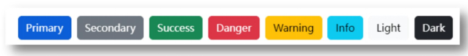
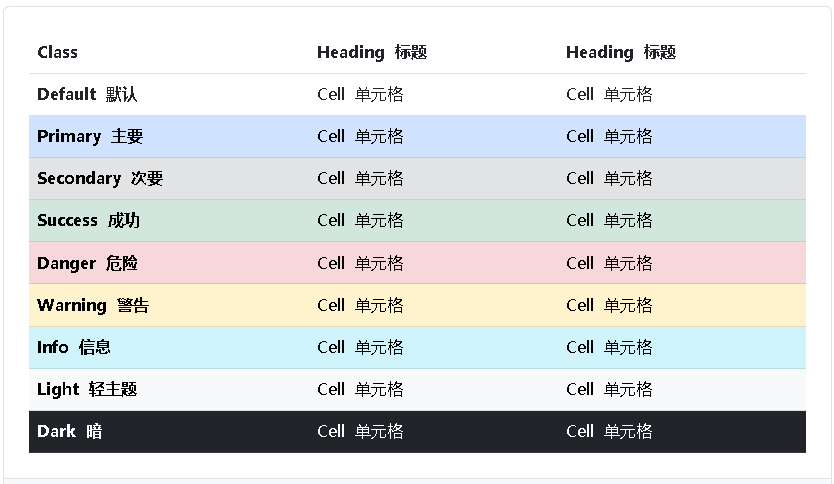

## 响应式布局方案

* 媒体查询

```css
@media (条件) {
  html {
    background-color: green;
  }
}
```

* Bootstrap框架

---

## 媒体查询

### 基本写法

```css
@media (媒体特性) {
  选择器 {
    样式
  }
}
```

* **max-width**：最大宽度（小于等于）
* **min-width：**最小宽度（大于等于）

示例：

```html
<!DOCTYPE html>
<html lang="en">
<head>
  <meta charset="UTF-8">
  <meta name="viewport" content="width=device-width, initial-scale=1.0">
  <title>媒体查询</title>
  <style>
     /* 屏幕宽度小于等于768，网页背景色是粉色 → max-width */
     @media (max-width: 768px) {
      body {
        background-color: pink;
      }
     }

     /* 屏幕宽度大于等于1200，网页背景色是绿色 → min-width */
     @media (min-width: 1200px) {
      body {
        background-color: green;
      }
     }
  </style>
</head>
<body>
  
</body>
</html>
```

### 书写顺序

需求：

- 默认网页背景色是灰色
- 屏幕宽度大于等于768px，网页背景色是粉色
- 屏幕宽度大于等于992px，网页背景色是绿色
- 屏幕宽度大于等于1200px，网页背景色是skyblue

提示：

- **min-width（从小到大）**

- **max-width（从大到小）**

**样式覆盖问题**

示例：

```css
/* 网页默认背景色是灰色 */
body {
  background-color: grey;
}

/* 屏幕宽度 大于等于 768px，网页背景色是粉色 min */
@media (min-width: 768px) {
  body {
    background-color: pink;
  }
}

/* 屏幕宽度 大于等于 992px，网页背景色是绿色 min */
@media (min-width: 992px) {
  body {
    background-color: green;
  }
}

/* 屏幕宽度 大于等于 1200px，网页背景色是 skyblue  min */
@media (min-width: 1200px) {
  body {
    background-color: skyblue;
  }
}
```

### 案例-左侧隐藏

需求：网页宽度小于等于768px则隐藏左侧区域

示例：

```html
<!DOCTYPE html>
<html lang="en">
<head>
  <meta charset="UTF-8">
  <meta name="viewport" content="width=device-width, initial-scale=1.0">
  <title>隐藏效果</title>
  <style>
     * {
      margin: 0;
      padding: 0;
     }

     .box {
      display: flex;
     }

     .left {
      width: 300px;
      height: 500px;
      background-color: pink;
     }

     .main {
      flex: 1;
      height: 500px;
      background-color: skyblue;
     }

     @media (max-width: 768px) {
      .left {
        display: none;
      }
     }
  </style>
</head>
<body>
  <div class="box">
    <div class="left">left</div>
    <div class="main">响应式网页效果响应式网页效果响应式网页效果响应式网页效果响应式网页效果响应式网页效果响应式网页效果响应式网页效果响应式网页效果响应式网页效果响应式网页效果响应式网页效果响应式网页效果响应式网页效果响应式网页效果响应式网页效果响应式网页效果响应式网页效果响应式网页效果响应式网页效果响应式网页效果响应式网页效果响应式网页效果响应式网页效果响应式网页效果响应式网页效果响应式网页效果响应式网页效果响应式网页效果响应式网页效果响应式网页效果响应式网页效果响应式网页效果响应式网页效果响应式网页效果响应式网页效果响应式网页效果响应式网页效果响应式网页效果响应式网页效果响应式网页效果响应式网页效果响应式网页效果响应式网页效果响应式网页效果响应式网页效果响应式网页效果响应式网页效果</div>
  </div>
</body>
</html>
```

### 媒体查询-完整写法

```css
@media 关键词 媒体类型 and (媒体特性) { CSS代码 }
```

#### 关键词 / 逻辑操作符

* and
* only
* not

#### 媒体类型

媒体类型用来**区分设备类型**

| 类型名称   | 值     | 描述                      |
| ---------- | ------ | ------------------------- |
| 屏幕       | screen | 带屏幕的设备              |
| 打印预览   | print  | 打印预览模式              |
| 阅读器     | speech | 屏幕阅读模式              |
| 不区分类型 | all    | 默认值，包括以上 3 种情形 |

#### 媒体特性

* 视口宽高：width / height
* **视口最大宽高**：**max-width** ；max-height
* 视口最小宽高：**min-width**；min-height
* 屏幕方向：orientation
  * protrait：竖屏
  * landscape：横屏

### 媒体查询-外部CSS

```css
<link rel="stylesheet" media="逻辑符 媒体类型 and (媒体特性)" href="xx.css">
```

示例：

```html
<!-- 视口宽度 小于等于 768px， 网页背景色是粉色 -->
<link rel="stylesheet" media="(max-width: 768px)" href="./pink.css">
<!-- 视口宽度 大于等于 1200px，网页背景色是绿色 -->
<link rel="stylesheet" media="(min-width: 1200px)" href="./green.css">
```

-----

## Bootstrap

### 简介

Bootstrap 是由 Twitter 公司开发维护的**前端 UI 框架**，它提供了大量**编写好的 CSS 样式**，允许开发者结合一定 HTML 结构及JavaScript，**快速**编写功能完善的**网页**及**常见交互效果**。 

中文官网: <https://www.bootcss.com/> 

### 使用步骤

#### 下载

下载：Bootstrap V5中文文档 → 进入中文文档 → 下载 →下载 Bootstrap 生产文件

#### 使用

1. 引入 Bootstrap CSS 文件

```html
<link rel="stylesheet" href="./Bootstrap/css/bootstrap.min.css">
```

2. 调用类名： **container：** 响应式布局版心类

```html
<div class="container">测试</div>
```

### 栅格系统

作用：响应式布局

栅格化是指将整个网页的宽度分成**12**等份，每个盒子占用的对应的份数

例如：一行排**4**个盒子，则每个盒子占 **3份** 即可（12 / 4 = 3）

| Breakpoint        | Class infix | Dimensions |
| ----------------- | ----------- | ---------- |
| Extra small       | None        | <576px     |
| Small             | sm          | ≥576px     |
| Medium            | md          | ≥768px     |
| Large             | lg          | ≥992px     |
| Extra large       | xl          | ≥1200px    |
| Extra extra large | xxl         | ≥1400px    |

| Breakpoint          | xs (<576px) | sm (≥576px) | md (≥768px) | lg (≥992px) | xl (≥1200px) | xxl (≥1400px) |
| ------------------- | ----------- | ----------- | ----------- | ----------- | ------------ | ------------- |
| Container max-width | None (auto) | 540px       | 720px       | 960px       | 1140px       | 1320px        |
| Class prefix        | .col-       | .col-sm-    | .col-md-    | .col-lg-    | .col-xl-     | .col-xxl-     |

常用布局类：

- col-\*-\*：列（例如：col-xxl-3）

- row 类：行，可以让内容在一行排（flex布局）

> vs 安装 “IntelliSense for CSS class names in HTML” 插件，那么在写类名时就会有代码提示了

### 全局样式

#### 按钮

类名

* btn：默认样式
* btn-success：成功
* btn-warning：警告
* ……
* 按钮尺寸：btn-lg / btn-sm



示例：

```html
<!DOCTYPE html>
<html lang="en">
<head>
  <meta charset="UTF-8">
  <meta name="viewport" content="width=device-width, initial-scale=1.0">
  <title>按钮样式</title>
  <link rel="stylesheet" href="./Bootstrap/css/bootstrap.min.css">
</head>
<body>
  <button class="btn btn-success btn-sm">按钮1</button>
  <button class="btn btn-warning btn-lg">按钮2</button>
</body>
</html>
```

可以去 Bootstrap中文网站 -> 中文文档 -> Components -> Buttons 查看更多的内容

#### 表格



表格类：

* table：默认样式
* table-striped：隔行变色
* table-success：表格颜色
* ……

官方文档 -> Content -> Tables

示例：

```html
<!DOCTYPE html>
<html lang="en">
<head>
  <meta charset="UTF-8">
  <meta name="viewport" content="width=device-width, initial-scale=1.0">
  <title>按钮样式</title>
  <link rel="stylesheet" href="./Bootstrap/css/bootstrap.min.css">
</head>
<body>
  <table class="table table-striped table-hover">
    <tr class="table-success">
        <th>姓名</th>
        <th>年龄</th>
        <th>性别</th>
      </tr>
      <tr>
        <td>张三</td>
        <td>18</td>
        <td>男</td>
      </tr>
      <tr>
        <td>李四</td>
        <td>20</td>
        <td>女</td>
      </tr>
      <tr>
        <td>王五</td>
        <td>18</td>
        <td>男</td>
      </tr>
      <tr>
        <td>赵六</td>
        <td>20</td>
        <td>女</td>
      </tr>
  </table>
</body>
</html>
```

### 组件

1.引入样式表

2.引入 js 文件（可选，视功能而定）

3.复制结构，修改内容

示例：

```html
<!DOCTYPE html>
<html lang="en">
<head>
  <meta charset="UTF-8">
  <meta name="viewport" content="width=device-width, initial-scale=1.0">
  <title>组件</title>
  <link rel="stylesheet" href="./Bootstrap/css/bootstrap.min.css">
  <style>
    .bg-body-tertiary {
      background-color: pink !important;
    }
  </style>
</head>
<body>
  <!-- 导航 -->
  <nav class="navbar navbar-expand-lg bg-body-tertiary">
  <div class="container-fluid">
    <a class="navbar-brand" href="#">Navbar</a>
    <button class="navbar-toggler" type="button" data-bs-toggle="collapse" data-bs-target="#navbarNav" aria-controls="navbarNav" aria-expanded="false" aria-label="Toggle navigation">
      <span class="navbar-toggler-icon"></span>
    </button>
    <div class="collapse navbar-collapse" id="navbarNav">
      <ul class="navbar-nav">
        <li class="nav-item">
          <a class="nav-link active" aria-current="page" href="#">首页</a>
        </li>
        <li class="nav-item">
          <a class="nav-link" href="#">课程</a>
        </li>
        <li class="nav-item">
          <a class="nav-link" href="#">课程资料</a>
        </li>
        <li class="nav-item">
          <a class="nav-link" href="#">视频</a>
        </li>
      </ul>
    </div>
  </div>
</nav>

  <!-- 轮播图 -->
  <div id="carouselExampleIndicators" class="carousel slide">
  <div class="carousel-indicators">
    <button type="button" data-bs-target="#carouselExampleIndicators" data-bs-slide-to="0" class="active" aria-current="true" aria-label="Slide 1"></button>
    <button type="button" data-bs-target="#carouselExampleIndicators" data-bs-slide-to="1" aria-label="Slide 2"></button>
    <button type="button" data-bs-target="#carouselExampleIndicators" data-bs-slide-to="2" aria-label="Slide 3"></button>
    <button type="button" data-bs-target="#carouselExampleIndicators" data-bs-slide-to="3" aria-label="Slide 4"></button>
  </div>
  <div class="carousel-inner">
    <div class="carousel-item active">
      
    </div>
    <div class="carousel-item">
      
    </div>
    <div class="carousel-item">
      
    </div>
    <div class="carousel-item">
      
    </div>
  </div>
  <button class="carousel-control-prev" type="button" data-bs-target="#carouselExampleIndicators" data-bs-slide="prev">
    <span class="carousel-control-prev-icon" aria-hidden="true"></span>
    <span class="visually-hidden">Previous</span>
  </button>
  <button class="carousel-control-next" type="button" data-bs-target="#carouselExampleIndicators" data-bs-slide="next">
    <span class="carousel-control-next-icon" aria-hidden="true"></span>
    <span class="visually-hidden">Next</span>
  </button>
</div>

  <script src="./Bootstrap/js/bootstrap.min.js"></script>
</body>
</html>
```

### 字体图标

#### 下载

导航 / Extend：图标库 → 安装 → 下载安装包 → [bootstrap-icons-1.X.X.zip](https://github.com/twbs/icons/releases/download/v1.10.3/bootstrap-icons-1.10.3.zip)

#### 使用

1. 复制 **fonts 文件夹**到项目目录
2. 网页引入 **bootstrap-icons.css** 文件
3. 调用 **CSS 类名**（图标对应的类名）

```html
<i class="bi-android2"></i>
```

示例：

```html
<!DOCTYPE html>
<html lang="en">
<head>
  <meta charset="UTF-8">
  <meta name="viewport" content="width=device-width, initial-scale=1.0">
  <title>字体图标</title>
  <link rel="stylesheet" href="./Bootstrap/font/bootstrap-icons.min.css">
  <style>
    .bi-airplane-engines-fill {
      font-size: 100px;
      color: green;
    }
  </style>
</head>
<body>
  <span class="bi-airplane-engines-fill"></span>
</body>
</html>
```


----

## 综合案例-alloyTeam

### 项目结构

```yaml
.
├── Bootstrap
│   ├── css
│   │   └── bootstrap.min.css
│   ├── font
│   │   ├── bootstrap-icons.css
│   │   ├── bootstrap-icons.json
│   │   ├── bootstrap-icons.scss
│   │   └── fonts
│   └── js
│       └── bootstrap.min.js
├── assets
│   ├── images
│   │   ├── alloyimage.png
│   │   ├── alloytouch.png
│   │   ├── css.png
│   │   ├── fire.png
│   │   ├── javascript.png
│   │   ├── logo.png
│   │   ├── logo.svg
│   │   ├── mobile.png
│   │   ├── nodejs.png
│   │   ├── omi.png
│   │   ├── performance.png
│   │   ├── soda.png
│   │   └── users.png
│   └── uploads
│       ├── alloydesigner.png
│       ├── alloyphoto.jpg
│       ├── alloystick.jpg
│       ├── banner_1.jpg
│       ├── banner_2.jpg
│       ├── banner_3.jpg
│       ├── banner_4.jpg
│       ├── codetank.jpg
│       ├── dntzhang.jpg
│       ├── dorsywang.jpg
│       ├── hm.jpg
│       └── jetyu.jpg
├── css
│   └── index.css
├── favicon.ico
├── index.html
└── less
    └── index.less
```

### HTML 结构

```html
<!DOCTYPE html>
<html lang="en">

<head>
    <meta charset="UTF-8">
    <meta name="viewport" content="width=device-width, initial-scale=1.0">
    <title>腾讯全端</title>
    <!-- 层叠性：咱们的css 要 层叠 框架的 -->
    <link rel="shortcut icon" href="favicon.ico" type="image/x-icon">
    <link rel="stylesheet" href="./Bootstrap/css/bootstrap.min.css">
    <link rel="stylesheet" href="./Bootstrap/font/bootstrap-icons.css">
    <link rel="stylesheet" href="./css/index.css">
</head>

<body>
    <!-- 导航 -->
    <nav class="navbar navbar-expand-lg bg-body-tertiary fixed-top">
        <div class="container">
            <a class="navbar-brand" href="#"></a>
            <button class="navbar-toggler" type="button" data-bs-toggle="collapse" data-bs-target="#navbarNav"
                aria-controls="navbarNav" aria-expanded="false" aria-label="Toggle navigation">
                <span class="navbar-toggler-icon"></span>
            </button>
            <div class="collapse navbar-collapse" id="navbarNav">
                <ul class="navbar-nav">
                    <li class="nav-item">
                        <a class="nav-link active" aria-current="page" href="#">首页</a>
                    </li>
                    <li class="nav-item">
                        <a class="nav-link" href="#">博客</a>
                    </li>
                    <li class="nav-item">
                        <a class="nav-link" href="#">Github</a>
                    </li>
                    <li class="nav-item">
                        <a class="nav-link" href="#">TWeb Conf</a>
                    </li>
                    <li class="nav-item">
                        <a class="nav-link" href="#">SuperStar</a>
                    </li>
                    <li class="nav-item">
                        <a class="nav-link" href="#">Web前端导航</a>
                    </li>
                    <li class="nav-item">
                        <a class="nav-link" href="#">关于</a>
                    </li>
                </ul>
            </div>
        </div>
    </nav>

    <!-- 轮播图 -->
    <div id="carouselExampleIndicators" class="carousel slide">
        <div class="carousel-indicators">
            <button type="button" data-bs-target="#carouselExampleIndicators" data-bs-slide-to="0" class="active"
                aria-current="true" aria-label="Slide 1"></button>
            <button type="button" data-bs-target="#carouselExampleIndicators" data-bs-slide-to="1"
                aria-label="Slide 2"></button>
            <button type="button" data-bs-target="#carouselExampleIndicators" data-bs-slide-to="2"
                aria-label="Slide 3"></button>
            <button type="button" data-bs-target="#carouselExampleIndicators" data-bs-slide-to="3"
            aria-label="Slide 4"></button>
        </div>
        <div class="carousel-inner">
            <div class="carousel-item active">
            </div>
            <div class="carousel-item">
            </div>
            <div class="carousel-item">
            </div>
            <div class="carousel-item">
            </div>
        </div>
        <button class="carousel-control-prev" type="button" data-bs-target="#carouselExampleIndicators"
            data-bs-slide="prev">
            <span class="carousel-control-prev-icon" aria-hidden="true"></span>
            <span class="visually-hidden">Previous</span>
        </button>
        <button class="carousel-control-next" type="button" data-bs-target="#carouselExampleIndicators"
            data-bs-slide="next">
            <span class="carousel-control-next-icon" aria-hidden="true"></span>
            <span class="visually-hidden">Next</span>
        </button>
    </div>

    <!-- 开源项目 -->
     <div class="project container">
        <div class="title">
            <h2>OpenSource / 开源项目</h2>
            <p>种类众多的开源项目，让你爱不释手</p>
        </div>
        <div class="content">
            <div class="row">
                <div class="col-md-6 col-lg-3"><a href="#">1</a></div>
                <div class="col-md-6 col-lg-3"><a href="#">1</a></div>
                <div class="col-md-6 col-lg-3"><a href="#">1</a></div>
                <div class="col-md-6 col-lg-3"><a href="#">1</a></div>
            </div>
        </div>
     </div>

    <script src="./Bootstrap/js/bootstrap.min.js"></script>
</body>

</html>
```

### less 样式

```less
// out: ../css/index.css

// 导航
.bg-body-tertiary {
    background-color: transparent !important;
    .navbar-collapse {
        flex-grow: 0;
        text-align: center;
        .nav-item:nth-child(3) {
            a {
                color: orange;
            }
        }
    }
}
// 轮播图: 小于768图片高度250 max；大于等于768图片高度400 min；大于等于992图片高度500
// 轮播图
.carousel {
    // 响应式 → 媒体查询
    @media (max-width: 768px) {
        .carousel-item {
            height: 250px;
        }
    }
    @media (min-width: 768px) {
        .carousel-item {
            height: 400px;
        }
    }
     @media (min-width: 992px) {
        .carousel-item {
            height: 500px;
        }
    }

    .carousel-item {
        background-size: cover;
        background-position: center 0;
    }
    .carousel-item:nth-child(1) {
        background-image: url(../assets/uploads/banner_1.jpg);
    }
    .carousel-item:nth-child(2) {
        background-image: url(../assets/uploads/banner_2.jpg);
    }
    .carousel-item:nth-child(3) {
        background-image: url(../assets/uploads/banner_3.jpg);
    }
    .carousel-item:nth-child(4) {
        background-image: url(../assets/uploads/banner_4.jpg);
    }
}

// 开源项目
// 视口宽度大于992；一行排4个盒子  col-lg-3
// 视口宽度大于768；一行排2个盒子  col-md-6
.project {
    margin-top: 60px;
    text-align: center;
    .row {
        div {
            margin-bottom: 10px;
            height: 200px;
            a {
                display: block;
                border-radius: 4px;
                height: 100%;
            }
            &:nth-child(1) a {
                background-color: #70c3ff;
            }
            &:nth-child(2) a {
                background-color: #fd6a7f;
            }
            &:nth-child(3) a {
                background-color: #7f8ea0;
            }
            &:nth-child(4) a {
                background-color: #89d04f;
            }
        }
    }
}
```

