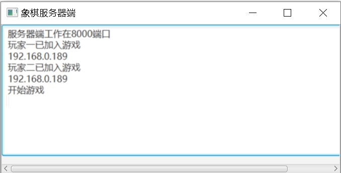

---
title:Java——分布式象棋
---


## 接口Chess

```java
interface Chess{
	int RED_TOKEN = 0;
	int BLACK_TOKEN = 1;
	int RED_WIN = 2;
	int BLACK_WIN = 3;
	int CONTINUE = 5;
	int END = 6;
	int MUST_DIE = 7;
	int PLAYER1 = 8;
	int PLAYER2 = 9;
}
```

## 类 Qi

| 成员                                                   | 作用                                                       |
| ------------------------------------------------------ | ---------------------------------------------------------- |
| `-c1、c2、c3: Circle`                                  | 组成棋子的三个圆                                           |
| `-lblQi: Label`                                        | 棋子上的字                                                 |
| `+move(doube x, double y): void`                       | 在棋盘上移动棋子的位置                                     |
| `+setRadius(double rC1, double rC2, double rC3): void` | 改变棋子的大小                                             |
| `+setC2Effect(Effect effect): void`                    | 当棋子选中或落下时改变棋子的效果                           |
| `+qiUp(): void`                                        | 当棋子被选中时，使棋子向上移动一段距离，达到棋子浮起的效果 |


```java
class Qi {
	private Circle c1;
	private Circle c2;
	private Circle c3;
	private Label lblQi;
	
	public Qi(Circle c1, Circle c2, Circle c3, Label lblQi) {
		this.c1 = c1;
		this.c2 = c2;
		this.c3 = c3;
		this.lblQi = lblQi;
	}
	
	public void move(double x, double y) {
		lblQi.setLayoutX(x-13);
		lblQi.setLayoutY(y-16);
		c1.setCenterX(x);
		c1.setCenterY(y);
		c2.setCenterX(x);
		c2.setCenterY(y);
		c3.setCenterX(x);
		c3.setCenterY(y);
	}
	
	public void setRadius(double rC1, double rC2, double rC3) {
		c1.setRadius(rC1);
		c2.setRadius(rC2);
		c3.setRadius(rC3);
	}
	
	public void setC2Effect(Effect effect) {
		c2.setEffect(effect);
	}
	
	public void qiUp() {
		move(c1.getCenterX(), c1.getCenterY()-4);
	}

	public Circle getC1() {
		return c1;
	}

	public Circle getC2() {
		return c2;
	}

	public Circle getC3() {
		return c3;
	}

	public Label getLblQi() {
		return lblQi;
	}
}
```

## 类 Rule

| 成员                                                         | 作用                                                       |
| ------------------------------------------------------------ | ---------------------------------------------------------- |
| `-cell: String[][]`                                          | 二维数组，记录所有棋子在棋盘上的位置（行列颠倒）           |
| `+che(int x, int y): ArrayList<int[]>`                       | 传入棋子‘车’的位置，判断该棋子的所有下一步可走的位置       |
| `+pao(int x, int y): ArrayList<int[]>`                       | 传入棋子‘炮’的位置，判断该棋子的所有下一步可走的位置       |
| `+xiang(int x, int y): ArrayList<int[]>`                     | 传入棋子‘象’或‘相’的位置，判断该棋子的所有下一步可走的位置 |
| `+ma(int x, int y): ArrayList<int[]>`                        | 传入棋子‘馬’的位置，判断该棋子的所有下一步可走的位置       |
| `+shuai(int x, int y): ArrayList<int[]>`                     | 传入棋子‘帥‘或’将’的位置，判断该棋子的所有下一步可走的位置 |
| `+shi(int x, int y): ArrayList<int[]>`                       | 传入棋子‘士‘或’仕’的位置，判断该棋子的所有下一步可走的位置 |
| `+bing(int x, int y): ArrayList<int[]>`                      | 传入棋子‘兵‘或’卒’的位置，判断该棋子的所有下一步可走的位置 |
| `+isInRule(int oldX, int oldY, int newX, int newY): boolean` | 判断棋子移动的位置是否在所有的下一步中                     |
| `+nextOptionLocation(int oldX, int oldY): ArrayList<int[]>`  | 用于找出棋子符合走法上的所有下一步                         |
| `+isAGeneral(int newX, int newY, int token): boolean`        | 判断某个棋子的下一步是否能将军                             |
| `+isGeneral(int token): boolean`                             | 判断是是否将军                                             |
| `+isCheckmate(int token): boolean`                           | 判断是否将死                                               |

代码：

```java
class Rule implements Chess {
	private String[][] cell;
	
	public Rule(String[][] cell) {
		this.cell = cell;
	}
	
	/* 車 */
	public ArrayList<int[]> che(int x, int y){
		ArrayList<int[]> optionLocation = new ArrayList<>();
		char team = cell[y][x].charAt(0);
		for(int i=x-1; i>=0; i--) {
			if( cell[y][i]=="" )
				optionLocation.add(new int[] {i, y});
			else {
				if( cell[y][i].charAt(0)!=team )
					optionLocation.add(new int[] {i, y});
				break;
					
			}
		}
		for(int i=x+1; i<=8; i++) {
			if( cell[y][i]=="" )
				optionLocation.add(new int[] {i, y});
			else {
				if( cell[y][i].charAt(0)!=team )
					optionLocation.add(new int[] {i, y});
				break;
					
			}
		}
		for(int i=y-1; i>=0; i--) {
			if( cell[i][x]=="" )
				optionLocation.add(new int[] {x, i});
			else {
				if( cell[i][x].charAt(0)!=team )
					optionLocation.add(new int[] {x, i});
				break;
					
			}
		}
		for(int i=y+1; i<=9; i++) {
			if( cell[i][x]=="" )
				optionLocation.add(new int[] {x, i});
			else {
				if( cell[i][x].charAt(0)!=team )
					optionLocation.add(new int[] {x, i});
				break;
					
			}
		}
		return optionLocation;
	}
	
	/* 炮 */
	public ArrayList<int[]> pao(int x, int y){
		ArrayList<int[]> optionLocation = new ArrayList<>();
		char team = cell[y][x].charAt(0);
		int viaQiNum = 0;	// 路过的棋子数
		for(int i=x-1; i>=0 && viaQiNum<=2; i--) {
			if( !cell[y][i].equals("") ) {
				if( viaQiNum==1 && cell[y][i].charAt(0)!=team )
					optionLocation.add(new int[]{i, y});
				viaQiNum++;
			}
			else {
				if( viaQiNum==0 )
					optionLocation.add(new int[]{i, y});
			}
		}
		viaQiNum = 0;
		for(int i=x+1; i<=8 && viaQiNum<=2; i++) {
			if( !cell[y][i].equals("") ) {
				if( viaQiNum==1 && cell[y][i].charAt(0)!=team )
					optionLocation.add(new int[]{i, y});
				viaQiNum++;
			}
			else {
				if( viaQiNum==0 )
					optionLocation.add(new int[]{i, y});
			}
		}
		viaQiNum = 0;
		for(int i=y-1; i>=0 && viaQiNum<=2; i--) {
			if( !cell[i][x].equals("") ) {
				if( viaQiNum==1 && cell[i][x].charAt(0)!=team )
					optionLocation.add(new int[]{x, i});
				viaQiNum++;
			}
			else {
				if( viaQiNum==0 )
					optionLocation.add(new int[]{x, i});
			}
		}
		viaQiNum = 0;
		for(int i=y+1; i<=9 && viaQiNum<=2; i++) {
			if( !cell[i][x].equals("") ) {
				if( viaQiNum==1 && cell[i][x].charAt(0)!=team )
					optionLocation.add(new int[]{x, i});
				viaQiNum++;
			}
			else {
				if( viaQiNum==0 )
					optionLocation.add(new int[]{x, i});
			}
		}
		
		return optionLocation;
	}
	
	/* 相、象 */
	public ArrayList<int[]> xiang(int x, int y){
		int marginY; 
		int team = cell[y][x].charAt(0);
		if( y<=4 ) 
			marginY = 0;
		else 
			marginY = 5;
		ArrayList<int[]> optionLocation = new ArrayList<>();
		if( (x-2)>=0 && (y-2)>=marginY ) {
			if( cell[y-1][x-1]=="" )
				if( cell[y-2][x-2].equals("") || cell[y-2][x-2].charAt(0)!=team )
					optionLocation.add(new int[]{x-2, y-2});
		}
		if( (x+2)<=8 && (y-2)>=marginY ) {
			if( cell[y-1][x+1]=="" )
				if( cell[y-2][x+2].equals("") || cell[y-2][x+2].charAt(0)!=team )
					optionLocation.add(new int[]{x+2, y-2});
		}
		if( (x-2)>=0 && (y+2)<=(marginY+4) ) {
			if( cell[y+1][x-1]=="" )
				if( cell[y+2][x-2].equals("") || cell[y+2][x-2].charAt(0)!=team )
					optionLocation.add(new int[]{x-2, y+2});
		}
		if( (x+2)<=8 && (y+2)<=(marginY+4) ) {
			if( cell[y+1][x+1]=="" )
				if( cell[y+2][x+2].equals("") || cell[y+2][x+2].charAt(0)!=team )
					optionLocation.add(new int[]{x+2, y+2});
		}
			
		return optionLocation;
	}
	
	/* 馬 */
	public ArrayList<int[]> ma(int x, int y){
		char team = cell[y][x].charAt(0);
		ArrayList<int[]> optionLocation = new ArrayList<>();
		// 上两点
		if( (x-1)>=0 && (y-2)>=0 && cell[y-1][x]=="" ) 
			if( cell[y-2][x-1].equals("") || cell[y-2][x-1].charAt(0)!=team )
				optionLocation.add(new int[]{x-1, y-2});
		if( (x+1)<=8 && (y-2)>=0 && cell[y-1][x]=="" )
			if( cell[y-2][x+1].equals("") || cell[y-2][x+1].charAt(0)!=team )
				optionLocation.add(new int[]{x+1, y-2});
		// 下两点
		if( (x-1)>=0 && (y+2)<=9 && cell[y+1][x]=="" )
			if( cell[y+2][x-1].equals("") || cell[y+2][x-1].charAt(0)!=team )
				optionLocation.add(new int[]{x-1, y+2});
		if( (x+1)<=8 && (y+2)<=9 && cell[y+1][x]=="" )
			if( cell[y+2][x+1].equals("") || cell[y+2][x+1].charAt(0)!=team )
				optionLocation.add(new int[]{x+1, y+2});
		// 左两点
		if( (x-2)>=0 && (y-1)>=0 && cell[y][x-1]=="" )
			if( cell[y-1][x-2].equals("") || cell[y-1][x-2].charAt(0)!=team )
				optionLocation.add(new int[]{x-2, y-1});
		if( (x-2)>=0 && (y+1)<=9 && cell[y][x-1]=="" )
			if( cell[y+1][x-2].equals("") || cell[y+1][x-2].charAt(0)!=team )
				optionLocation.add(new int[]{x-2, y+1});
		// 右两点
		if( (x+2)<=8 && (y-1)>=0 && cell[y][x+1]=="" )
			if( cell[y-1][x+2].equals("") || cell[y-1][x+2].charAt(0)!=team )
				optionLocation.add(new int[]{x+2, y-1});
		if( (x+2)<=8 && (y+1)<=9 && cell[y][x+1]=="" )
			if( cell[y+1][x+2].equals("") || cell[y+1][x+2].charAt(0)!=team )
				optionLocation.add(new int[]{x+2, y+1});
		
		return optionLocation;
	}
	
	/* 帥、将 */
	public ArrayList<int[]> shuai(int x, int y){
		char team = cell[y][x].charAt(0);
		ArrayList<int[]> optionLocation = new ArrayList<>();
		int marginX = 3, marginY;
		if( y<=4 ) 
			marginY = 0;
		else 
			marginY = 7;
		
		if( (y-1)>=marginY )
			if( cell[y-1][x].equals("") || cell[y-1][x].charAt(0)!=team )
				optionLocation.add(new int[]{x, y-1});
		if( (y+1)<=(marginY+2) )
			if( cell[y+1][x].equals("") || cell[y+1][x].charAt(0)!=team )
				optionLocation.add(new int[]{x, y+1});
		if( (x-1)>=marginX )
			if( cell[y][x-1].equals("") || cell[y][x-1].charAt(0)!=team )
				optionLocation.add(new int[]{x-1, y});
		if( (x+1)<=(marginX+2) )
			if( cell[y][x+1].equals("") || cell[y][x+1].charAt(0)!=team )
				optionLocation.add(new int[]{x+1, y});
		
		if( marginY==0 ) {
			for(int i=y+1; i<=9; i++) {
				if( cell[i][x].equals("r1帥") || cell[i][x].equals("b1将") )
					optionLocation.add(new int[]{x, i});
				if( !cell[i][x].equals("") )
					break;
					
			}
		}
		else {
			for(int i=y-1; i>=0; i--) {
				if( cell[i][x].equals("r1帥") || cell[i][x].equals("b1将") )
					optionLocation.add(new int[]{x, i});
				if( !cell[i][x].equals("") )
					break;
			}
		}
		
		return optionLocation;
	}
	
	/* 士、仕 */
	public ArrayList<int[]> shi(int x, int y){
		char team = cell[y][x].charAt(0);
		ArrayList<int[]> optionLocation = new ArrayList<>();
		int marginX = 3, marginY;
		if( y<=4 ) 
			marginY = 0;
		else 
			marginY = 7;
		
		if( (x-1)>=marginX && (y-1)>=marginY )
			if( cell[y-1][x-1].equals("") || cell[y-1][x-1].charAt(0)!=team )
				optionLocation.add(new int[]{x-1, y-1});
		if( (x+1)<=(marginX+2) && (y+1)<=(marginY+2) )
			if( cell[y+1][x+1].equals("") || cell[y+1][x+1].charAt(0)!=team )
				optionLocation.add(new int[]{x+1, y+1});
		if( (x-1)>=marginX && (y+1)<=(marginY+2) )
			if( cell[y+1][x-1].equals("") || cell[y+1][x-1].charAt(0)!=team )
				optionLocation.add(new int[]{x-1, y+1});
		if( (x+1)<=(marginX+2) && (y-1)>=marginY )
			if( cell[y-1][x+1].equals("") || cell[y-1][x+1].charAt(0)!=team )
				optionLocation.add(new int[]{x+1, y-1});
		
		return optionLocation;
	}
	
	/* 兵、卒 */
	public ArrayList<int[]> bing(int x, int y){
		ArrayList<int[]> optionLocation = new ArrayList<>();
		String name = cell[y][x];
		char team = name.charAt(0);
		name = name.substring(2);
		String aimName;
		if( name.equals("兵") )
			aimName = "r1帥";
		else
			aimName = "b1将";
		int shuaiY = -1;
		// 找出己方帥(将)的位置
		for(int i=0; i<10; i++) {
			for(int j=0; j<9; j++) {
				if( cell[i][j]==aimName ) {
					shuaiY = i;
					break;
				}
			}
			if( shuaiY!=-1 )
				break;
		}
		if( shuaiY<=4 ) {
			if( y==3 || y==4 ) {		// 在己方棋盘
				if( cell[y+1][x].equals("") || cell[y+1][x].charAt(0)!=team )
					optionLocation.add(new int[]{x, y+1});
			}
			else {	// 在敌方棋盘
				if( x-1>=0 ) {
					if( cell[y][x-1].equals("") || cell[y][x-1].charAt(0)!=team )
						optionLocation.add(new int[]{x-1, y});
				}
				if( x+1<=8 ) {
					if( cell[y][x+1].equals("") || cell[y][x+1].charAt(0)!=team )
						optionLocation.add(new int[]{x+1, y});
				}
				if( y+1<=9 ) {
					if( cell[y+1][x].equals("") || cell[y+1][x].charAt(0)!=team )
						optionLocation.add(new int[]{x, y+1});
				}
			}
		}
		else {
			if( y==5 || y==6 ) {	// 在己方棋盘
				if( cell[y-1][x].equals("") || cell[y-1][x].charAt(0)!=team )
					optionLocation.add(new int[]{x, y-1});
			}
			else {	// 在敌方棋盘
				if( x-1>=0 )
					if( cell[y][x-1].equals("") || cell[y][x-1].charAt(0)!=team )
						optionLocation.add(new int[]{x-1, y});
				if( x+1<=8 )
					if( cell[y][x+1].equals("") || cell[y][x+1].charAt(0)!=team )
						optionLocation.add(new int[]{x+1, y});
				if( y-1>=0 )
					if( cell[y-1][x].equals("") || cell[y-1][x].charAt(0)!=team )
						optionLocation.add(new int[]{x, y-1});
			}
		}
		
		return optionLocation;
	}
	
	/* 是否符合走法 */
	public boolean isInRule(int oldX, int oldY, int newX, int newY) {
		ArrayList<int[]> optionLocation = nextOptionLocation(oldX, oldY);
		
		for(int[] i: optionLocation) {
			if( newX==i[0] && newY==i[1] )
				return true;
		}
		
		return false;
	}
	
	/* 用于找出棋子符合走法上的所有下一步 */
	public ArrayList<int[]> nextOptionLocation(int oldX, int oldY){
		String name = cell[oldY][oldX].substring(2);
		ArrayList<int[]> optionLocation = new ArrayList<>();
		
		switch( name ) {
		case "車": optionLocation = che(oldX, oldY);break;
		case "炮": optionLocation = pao(oldX, oldY);break;
		case "象":
		case "相": optionLocation =  xiang(oldX, oldY);break;
		case "馬": optionLocation = ma(oldX, oldY);break;
		case "帥":
		case "将": optionLocation = shuai(oldX, oldY);break;
		case "士":
		case "仕": optionLocation = shi(oldX, oldY);break;
		case "兵":
		case "卒": optionLocation = bing(oldX, oldY);break;
		}
		return optionLocation;
	}
	
	/* 判断某个棋子的下一步是否能将军 */
	public boolean isAGeneral(int newX, int newY, int token) {
		String enemyName = "b1将";
		if( token==BLACK_TOKEN )
			enemyName = "r1帥";
			
		int x, y;
		ArrayList<int[]> pointSList = nextOptionLocation(newX, newY);
		for(int[] i : pointSList) {
			x = i[0];
			y = i[1];
			if( cell[y][x].equals(enemyName) )
				return true;
		}

		return false;
	}
	
	/* 判断是是否将军 */
	public boolean isGeneral(int token) {
		char team = 'r';
		if( token==BLACK_TOKEN )
			team = 'b';
		for(int i=0; i<10; i++) {
			for(int j=0; j<9; j++) {
				if( cell[i][j]!="" && cell[i][j].charAt(0)==team ) {
					if( isAGeneral(j, i, token) )
						return true;
				}
			}
		}
		
		return false;
	}
	
	/* 是否将死 */
	public boolean isCheckmate(int token) {
		String tmpStr;
		ArrayList<int[]> optionLocation = new ArrayList<>();
		int oldX = -1, oldY = -1, newX = -1, newY = -1;
		boolean flag = true;
		String[] myQiList;
		if( token==BLACK_TOKEN ){
			myQiList = new String[]{"r1帥","r1仕","r2仕","r1相","r2相","r1馬","r2馬",
					"r1炮","r2炮","r1車","r2車","r1兵","r2兵","r3兵","r4兵","r5兵"};
		}
		else {
			myQiList = new String[]{"b1将","b1士","b2士","b1象","b2象","b1馬","b2馬",
					"b1炮","b2炮","b1車","b2車","b1卒","b2卒","b3卒","b4卒","b5卒"};
		}
		for(String str : myQiList) {
			
			for(int i=0; i<10; i++) {
				for(int j=0; j<9; j++) {
					if( cell[i][j].equals(str) ) {
						oldX = j;
						oldY = i;
						break;
					}
				}
				if( oldX!=-1 )
					break;
			}
			
			if( oldX==-1 )
				continue;
			
			optionLocation = nextOptionLocation(oldX, oldY);
			for(int[] m : optionLocation) {
				newX = m[0];
				newY = m[1];
				tmpStr = cell[newY][newX];
				cell[newY][newX] = cell[oldY][oldX];
				cell[oldY][oldX] = "";
				flag = isGeneral(token);
				cell[oldY][oldX] = cell[newY][newX];
				cell[newY][newX] = tmpStr;
				if( !flag ) {
					return flag;
				}
			}
			
			oldX = -1;
			oldY = -1;
		}
		
		return true;
	}
}
```

## 服务器类代码


```java
import java.io.DataInputStream;
import java.io.DataOutputStream;
import java.io.IOException;
import java.net.ServerSocket;
import java.net.Socket;

import javafx.application.Application;
import javafx.application.Platform;
import javafx.scene.Scene;
import javafx.scene.control.ScrollPane;
import javafx.scene.control.TextArea;
import javafx.stage.Stage;

public class Server extends Application implements Chess{
	private int sessionNo = 0;
	
	public static void main(String[] args) {
		launch(args);
	}

	@Override
	public void start(Stage primaryStage) throws Exception {
		TextArea ta = new TextArea();
		
		ScrollPane pane = new ScrollPane(ta);
		Scene scene = new Scene(pane, 450, 200);
		primaryStage.setTitle("象棋服务器端");
		primaryStage.setScene(scene);
		primaryStage.setOnCloseRequest(e -> {	// 窗口关闭时同时终止所有进程和线程
			System.exit(0);
		});
		primaryStage.show();
		
		new Thread(()->{
			try {
				ServerSocket serverSocket = new ServerSocket(8000);
				Platform.runLater(()->{
					ta.appendText("服务器端工作在8000端口\n");
				});
				
				while( true ) {
					// 连接玩家一
					Socket player1 = serverSocket.accept();
					Platform.runLater(()->{
						ta.appendText("玩家一已加入游戏\n");
						ta.appendText(player1.getInetAddress().getHostAddress()+'\n');
						
					});
					new DataOutputStream(player1.getOutputStream()).writeInt(PLAYER1);
					
					// 连接玩家二
					Socket player2 = serverSocket.accept();
					Platform.runLater(()->{
						ta.appendText("玩家二已加入游戏\n");
						ta.appendText(player2.getInetAddress().getHostAddress()+'\n');
						ta.appendText("开始游戏\n");
					});
					new DataOutputStream(player2.getOutputStream()).writeInt(PLAYER2);
					
					new Thread(new HandleASession(player1, player2, ta)).start();
				}
			} catch (IOException e) {
				e.printStackTrace();
			}
		}).start();
	}
}

class HandleASession implements Runnable, Chess {
	private Socket player1;
	private Socket player2;
	private DataOutputStream toPlayer1;
	private DataOutputStream toPlayer2;
	private DataInputStream fromPlayer1;
	private DataInputStream fromPlayer2;
	private int status;
	private TextArea ta;
	
	public HandleASession(Socket player1, Socket player2, TextArea ta) {
		this.player1 = player1;
		this.player2 = player2;
		this.ta = ta;
	}

	@Override
	public void run() {
		try {
			toPlayer1 = new DataOutputStream(player1.getOutputStream());
			toPlayer2 = new DataOutputStream(player2.getOutputStream());
			fromPlayer1 = new DataInputStream(player1.getInputStream());
			fromPlayer2 = new DataInputStream(player2.getInputStream());
			
			toPlayer1.writeInt(1);	// 告诉玩家一游戏已开始
			
			while( true ) {
				int oldX, oldY, newX, newY;
				// 玩家一落子
				status = fromPlayer1.readInt();
				toPlayer2.writeInt(status);
				if( status==CONTINUE ) {
					oldX = fromPlayer1.readInt();
					oldY = fromPlayer1.readInt();
					newX = fromPlayer1.readInt();
					newY = fromPlayer1.readInt();
					toPlayer2.writeInt(oldX);
					toPlayer2.writeInt(oldY);
					toPlayer2.writeInt(newX);
					toPlayer2.writeInt(newY);
				}
				else {
					ta.appendText("游戏结束!");
					break;
				}
				
				// 玩家二落子
				status = fromPlayer2.readInt();
				toPlayer1.writeInt(status);
				if( status==CONTINUE ) {
					oldX = fromPlayer2.readInt();
					oldY = fromPlayer2.readInt();
					newX = fromPlayer2.readInt();
					newY = fromPlayer2.readInt();
					toPlayer1.writeInt(oldX);
					toPlayer1.writeInt(oldY);
					toPlayer1.writeInt(newX);
					toPlayer1.writeInt(newY);
				}
				else {
					ta.appendText("游戏结束!");
					break;
				}
			}
		} catch (IOException e) {
			e.printStackTrace();
		}
	}
	
}
```

## 客户端代码

| 类 Client                                                  | 作用                                                  |
| ---------------------------------------------------------- | ----------------------------------------------------- |
| `-host: String`                                            | 服务器的ip地址                                        |
| `-lblTip: Label`                                           | 显示提示信息的标签                                    |
| `-toServer: DataOutputStream`                              | 输出数据流                                            |
| `-fromServer: DataInputStrea`                              | 输入数据流                                            |
| `-player: int`                                             | 玩家                                                  |
| `-turn: boolean`                                           | 当前是否是自己的会合                                  |
| `-waiting: boolean`                                        | 用于等待玩家落子                                      |
| `-myToken、otherToken: int`                                | 我的棋子、对手的棋子                                  |
| `-oldXSlected、oldYSlected、newXSlected、newYSlected: int` | 接受到的棋子的新、旧位置坐标                          |
| `-pane: ChessPane`                                         | 内部类。用于画出棋盘、棋子                            |
| `+connectToServer(): void`                                 | 连接服务器，并控制游戏流程                            |
| `+waitForPlayerAction(): void`                             | 等待玩家落子                                          |
| `+seedMove(): void`                                        | 发送自己移动的棋子的前后位置                          |
| `+receiveMove(): void`                                     | 接受对手的移动                                        |
| `+handleReceivedX(int x): int`                             | 对手的棋盘与自己的是相反的，该函数用来调整棋子的x坐标 |
| `+handleReceivedY(int y): int`                             | 对手的棋盘与自己的是相反的，该函数用来调整棋子的y坐标 |


| 类 ChessPane（成员变量）         | 作用                                                         |
| -------------------------------- | ------------------------------------------------------------ |
| `-w、h: double`                  | 面板的宽和高                                                 |
| `-marginX、marginY: double`      | 棋盘左右、上下距面板的距离                                   |
| `-spacing: double`               | 线与线之间的间隔                                             |
| `-dropShadow: DropShadow`        | 阴影效果                                                     |
| `-is: InnerShadow`               | 内部阴影效果                                                 |
| `-ds: DropShadow`                | 棋子被选中后的效果                                           |
| `-hashMap: HashMap<String, Qi>`  | 散列表，用来存放所有棋子对象，移动棋子时通过散列表来得到棋子的对象，然后用对象中的方法对其进行移动 |
| `-moveQi: Qi`                    | 移动的棋子对象                                               |
| `-signalCircle: Circle`          | 当棋子被选中时用该圆进行标记。初始位置不可见                 |
| `-oldLocationCircle: Circle`     | 移动的棋子原位置的标记                                       |
| `-rule: Rule`                    | 外部类，程序中会大量用到这个类中的方法进行判定               |
| `-nodeList: ArrayList<Node>`     | 可走的位置的点的集合                                         |
| `-chessManual: ArrayList<int[]>` | 位置棋谱，记录每一次棋子的移动。用在悔棋功能上               |
| `-nameManual: ArrayList<String>` | 棋子棋谱，记录每一次棋子移动的下一个位置上的棋子的名字（下一个位置上无棋子就用“”表示）。用来吃棋后的悔棋上。 |
| `-cnt: int[]`                    | 记录鼠标点击次数。偶数次为选中棋子；奇数次为选中落点。如果用int等基本数据类型的话，在事件处理函数中无法使用 |
| `+cell: String[][]`              | 二维数组，记录所有棋子在棋盘上的位置（行列颠倒）             |


| 类 ChessPane（成员方法）                                     | 作用                                                         |
| ------------------------------------------------------------ | ------------------------------------------------------------ |
| `+ChessPane()`                                               | 构造函数，主要对一些成员变量进行初始化和画出棋盘             |
| `+cellReverse(): void`                                       | 对cell中的内容进行倒转。使玩家操控的一方始终位于玩家一方。   |
| `+run(int token): void`                                      | 开始游戏                                                     |
| `+handlerChoose(int oldX, int oldY): void`                   | 棋子被选中时调用，标记被选中的棋子，并找出所有可能的落子位置 |
| `+handlerFallen(): void`                                     | 棋子落下时调用，判断是否吃棋、将军和绝杀。移动棋子的位置     |
| `MouseHandler`                                               | 事件处理类，用在鼠标点击事件处理中。作用是判断鼠标点击位置是否合理和进行选子和落子 |
| `+drawNextOptionLocation(ArrayList<int[]> pointSList): void` | 标记出棋子所有可能的落点                                     |
| `+isWin(): void`                                             | 判断是都获得胜利，在本程序几乎没有起到作用                   |
| `+killQi(int oldX, int oldY, int newX, int newY): void`      | 吃棋                                                         |
| `+isHaveQi(int x, int y): boolean`                           | 判断鼠标点击的位置是否有棋子                                 |
| `+isMyQi(int x, int y, int token): boolean`                  | 判断（x,y）坐标对应的棋子是否与token相同                     |
| `+isInCheckerBard(double x, double y): boolean`              | 判断鼠标点击的位置是否在棋盘内                               |
| `+qiPicked(double x, double y): void`                        | 棋子升起                                                     |
| `+isGeneral(int token): void`                                | 判断token一方是否将军                                        |
| `+qiFallen(int oldX, int oldY, int newX, int newY): void`    | 棋子落下                                                     |
| `+write(String str, double x, double y): void`               | 在棋盘上写楚河、汉界                                         |
| `+drawLine(double startX, double startY, double endX, double endY, double lineWidth, Color color): void` | 画棋盘线                                                     |
| `+drawCheckerboard(): void`                                  | 画棋盘                                                       |
| `+drawAPiece(double x, double y, String str, Color color): void` | 画一个棋子                                                   |
| `+drawAllPiece(int token): void`                             | 画所有棋子                                                   |
| `+setButton(): void`                                         | 设置悔棋、认输按钮                                           |
| `+paneToCell(double m, double margin): int`                  | 面板位置到棋盘位置的转换                                     |
| `+drawFocusing(int chessX, int chessY): void`                | 画兵、炮处的对焦线                                           |


```java
import java.io.DataInputStream;
import java.io.DataOutputStream;
import java.io.IOException;
import java.net.Socket;
import java.util.ArrayList;
import java.util.HashMap;

import javafx.application.Application;
import javafx.application.Platform;
import javafx.event.EventHandler;
import javafx.geometry.Pos;
import javafx.scene.Node;
import javafx.scene.Scene;
import javafx.scene.control.Button;
import javafx.scene.control.Label;
import javafx.scene.effect.DropShadow;
import javafx.scene.effect.InnerShadow;
import javafx.scene.input.MouseEvent;
import javafx.scene.layout.Background;
import javafx.scene.layout.BackgroundFill;
import javafx.scene.layout.Pane;
import javafx.scene.paint.Color;
import javafx.scene.shape.Circle;
import javafx.scene.shape.Line;
import javafx.scene.shape.Polyline;
import javafx.scene.text.Font;
import javafx.scene.text.FontPosture;
import javafx.scene.text.FontWeight;
import javafx.stage.Stage;

public class Client extends Application implements Chess{
	private String host = "192.168.43.1";
	private Label lblTip = new Label();
	private DataOutputStream toServer;
	private DataInputStream fromServer;
	private int player;
	private boolean turn = false;
	private boolean waiting = true;
	private int myToken;
	private int otherToken;
	private int status = CONTINUE;
	private int oldXSlected = -1, oldYSlected = -1;
	private int newXSlected = -1, newYSlected = -1;		// 棋子在棋局中的位置
	ChessPane pane = new ChessPane(); // 棋盘面板

	public static void main(String[] args) {
		launch(args);
	}
	

	@Override
	public void start(Stage primaryStage) throws Exception {
		
		Scene scene = new Scene(pane, 640, 480);
		primaryStage.setTitle("分布式象棋-客户端");
		primaryStage.setScene(scene);
		primaryStage.setOnCloseRequest(e -> {	// 窗口关闭时同时终止所有进程和线程
			System.exit(0);
		});
		primaryStage.show();
		
		connectToServer();
	}
	
	public void connectToServer() {
		try {
			Socket socket = new Socket(host, 8000);
			toServer = new DataOutputStream(socket.getOutputStream());
			fromServer = new DataInputStream(socket.getInputStream());
		} catch (IOException e) {
			e.printStackTrace();
            Platform.runLater(()->{
				lblTip.setText("连\n接\n失\n败");
			});
		}
		
		new Thread(()->{
			try {
				player = fromServer.readInt();	// 判断是玩家几
				
				if( player==PLAYER1 ) {
					myToken = RED_TOKEN;
					otherToken = BLACK_TOKEN;
					
					Platform.runLater(()->{
						lblTip.setText("你\n是\n红\n方!");
					});
					pane.run(myToken);
					fromServer.readInt();
					Platform.runLater(()->{
						lblTip.setText("你\n先\n走");
					});
					
					turn = true;
				}
				else if( player==PLAYER2 ) {
					myToken = BLACK_TOKEN;
					otherToken = RED_TOKEN;
					
					Platform.runLater(()->{
						lblTip.setText("你\n是\n黑\n方!");
					});
					pane.run(myToken);
				}
				
				while( status==CONTINUE ) {
					if( player==PLAYER1 ) {
						waitForPlayerAction();
						seedMove();
						receiveMove();
					}
					else if( player==PLAYER2 ) {
						receiveMove();
						waitForPlayerAction();
						seedMove();
					}
				}
				
			} catch (IOException e) {
				e.printStackTrace();
			} catch (InterruptedException e) {
				e.printStackTrace();
			}
		}).start();
		
	}
	
	public void waitForPlayerAction() throws InterruptedException {
		while( waiting ) {
			Thread.sleep(100);
		}
		waiting = true;
	}
	
	public void seedMove() throws IOException {
		toServer.writeInt(status);
		toServer.writeInt(oldXSlected);
		toServer.writeInt(oldYSlected);
		toServer.writeInt(newXSlected);
		toServer.writeInt(newYSlected);
	}
	
	public void receiveMove() throws IOException {
		status = fromServer.readInt();
		oldXSlected = handleReceivedX(fromServer.readInt());
		oldYSlected = handleReceivedY(fromServer.readInt());
		newXSlected = handleReceivedX(fromServer.readInt());
		newYSlected = handleReceivedY(fromServer.readInt());
		pane.handlerChoose(oldXSlected, oldYSlected);
		pane.handlerFallen(oldXSlected, oldYSlected, newXSlected, newYSlected, otherToken);
		turn = true;
	}
	
	public int handleReceivedX(int x) {
		return 8-x;
	}
	
	public int handleReceivedY(int y) {
		return 9-y;
	}
	
	class ChessPane extends Pane implements Chess{
		private double w = 640;
		private double h = 480;
		private double marginY = 60;	// 棋盘上下距面板的距离
		private double marginX = 160;	// 棋盘左右距面板的距离
		private double spacing = 40;	// 线与线之间的间隔
		private DropShadow dropShadow = new DropShadow();	// 阴影效果
		private InnerShadow is = new InnerShadow();			// 内部阴影效果
		private DropShadow ds = new DropShadow();	// 棋子被选中后的效果
		private HashMap<String, Qi> hashMap = new HashMap<String, Qi>();	// 棋子的集合
		private Qi moveQi = null;
		private Circle signalCircle = new Circle(1000, 1000, 19);		// 标记棋子的圆,初始位置不可见
		private Circle oldLocationCircle = new Circle(4);	// 移动的棋子原位置的标记
		private Rule rule;
		private ArrayList<Node> nodeList = new ArrayList<>();	// 可走的位置的点的集合
		private ArrayList<int[]> chessManual = new ArrayList<int[]>();		// 棋谱，位置的移动
		private ArrayList<String> nameManual = new ArrayList<String>();		// 下一个位置上棋子的名字
		private int[] cnt = {0};	// 鼠标点击次数
		private String[][] cell;
		
		public ChessPane() {
			// 初始化
			dropShadow.setOffsetX(4.0f);
	        dropShadow.setOffsetY(4.0f);
	        dropShadow.setColor(Color.GRAY);
	        
	        ds.setOffsetX(8.0f);
	        ds.setOffsetY(8.0f);
	        ds.setColor(Color.GRAY);
	        
	        is.setOffsetX(1.0f);
		    is.setOffsetY(1.0f);
		    
		    signalCircle.setStroke(Color.GREEN);
			signalCircle.setFill(Color.rgb(0, 0, 0, 0));
			signalCircle.setEffect(dropShadow);
			signalCircle.setStrokeWidth(4);
			this.getChildren().add(signalCircle);
			
			oldLocationCircle.setFill(Color.rgb(225, 127, 80, 0.5));
			oldLocationCircle.setStrokeWidth(3);
			oldLocationCircle.setStroke(Color.rgb(225, 127, 80));
			
			cell = new String[][]{{"r1車","r1馬","r1相","r1仕","r1帥","r2仕","r2相","r2馬","r2車"},
								{"","","","","","","","",""},
								{"","r1炮","","","","","","r2炮",""},
								{"r1兵","","r2兵","","r3兵","","r4兵","","r5兵"},
								{"","","","","","","","",""},
								{"","","","","","","","",""},
								{"b1卒","","b2卒","","b3卒","","b4卒","","b5卒"},
								{"","b1炮","","","","","","b2炮",""},
								{"","","","","","","","",""},
								{"b1車","b1馬","b1象","b1士","b1将","b2士","b2象","b2馬","b2車"}};
		    
		    Label lblNotice = new Label("诸\n君\n，\n落\n子\n无\n悔!");
			lblNotice.setFont(Font.font("华文新魏", FontWeight.BOLD, 30));
			lblNotice.setLayoutX(marginX/2-25);
			lblNotice.setLayoutY(marginY);
			this.getChildren().add(lblNotice);
			
			lblTip.setFont(Font.font("华文新魏", FontWeight.BOLD, FontPosture.ITALIC, 60));
			lblTip.setAlignment(Pos.CENTER);
			lblTip.setPrefWidth(80);
			lblTip.setPrefHeight(320);
			lblTip.setLayoutX(w-100);
			lblTip.setLayoutY(h/2-160);
			this.getChildren().add(lblTip);
			
			// 设置背景
			Background background = new Background(new BackgroundFill(Color.ANTIQUEWHITE, null, null));
			this.setBackground(background);
			
			drawCheckerboard();		// 画棋盘
			setButton();			// 设置悔棋、求和按钮
		}
		
		public void cellReverse() {
			String[] tmpArr;
			String tmpString;
			int arrLength = cell.length;
			int length = cell[0].length;
			for(int i=0; i<arrLength/2; i++) {
				tmpArr = cell[i];
				cell[i] = cell[arrLength-1-i];
				cell[arrLength-1-i] = tmpArr;
			}
			
			for(int i=0; i<arrLength; i++) {
				for(int j=0; j<length/2; j++) {
					tmpString = cell[i][j];
					cell[i][j] = cell[i][length-1-j];
					cell[i][length-1-j] = tmpString;
				}
			}
		}

		public void run(int token) {
			Platform.runLater(()->{
				if( token==RED_TOKEN ) {
					cellReverse();
				}
				rule = new Rule(cell);
				drawAllPiece(token); 		// 画棋子
				// 鼠标处理器，点击棋子移动
				MouseHandler mouseHandler = new MouseHandler();
				this.setOnMouseClicked(mouseHandler);
			});
		}
		
		public void handlerChoose(int oldX, int oldY) {
			String qiName;
			qiName = cell[oldY][oldX];
			moveQi = (Qi)hashMap.get(qiName);
			qiPicked(oldX*spacing+marginX, oldY*spacing+marginY);
			cnt[0]++;
			
			drawNextOptionLocation(rule.nextOptionLocation(oldX, oldY));
		}
		
		public void handlerFallen(int oldX, int oldY, int newX, int newY, int token) {
			Platform.runLater(()->{
				// 判断落子处是否有敌方棋子，有，则吃掉
				if( isHaveQi(newX, newY) && !isMyQi(newX, newY, token) ) {
					killQi(oldX, oldY, newX, newY);
					isWin();
					if( status==RED_WIN ) {
						lblTip.setText("红\n棋\n赢!");
						return ;
					}
					else if( status==BLACK_WIN ) {
						lblTip.setText("黑\n棋\n赢!");
						return ;
					}
				}
				else {
					moveQi.move(newX*spacing+marginX, newY*spacing+marginY);
					cell[newY][newX] = cell[oldY][oldX];
					cell[oldY][oldX] = "";
					qiFallen(oldX, oldY, newX, newY);
				}
				// 转变回合
				
				// 将这一步走动的位置记录在棋谱中
				chessManual.add(new int[]{oldX, oldY, newX, newY});
				cnt[0]++;
				isGeneral(token);	// 判断是否将军和绝杀
			});
		}
			
		/* 鼠标点击事件处理器 */
		class MouseHandler implements EventHandler<MouseEvent>{
			private int oldX = -1, oldY = -1, newX = -1, newY = -1;		// 棋子在棋局中的位置

			@Override
			public void handle(MouseEvent e) {
				if( status==CONTINUE && isInCheckerBard(e.getX(), e.getY()) && turn ) {
					if( cnt[0]%2==0 ) {
						oldX = paneToCell(e.getX(), marginX);
						oldY = paneToCell(e.getY(), marginY);
						if( isHaveQi(oldX, oldY) && isMyQi(oldX, oldY, myToken) ) {
							handlerChoose(oldX, oldY);
						}
					} 
					else {
						newX = paneToCell(e.getX(), marginX);
						newY = paneToCell(e.getY(), marginY);
						// 判断落子位置是否符合该棋子的走法
						if( rule.isInRule(oldX, oldY, newX, newY)) {
							// 保存落子位置的名字
							nameManual.add(cell[newY][newX]);
							
							// 判断落子后是否会被将军
							String tmpStr = cell[newY][newX];
							cell[newY][newX] = cell[oldY][oldX];
							cell[oldY][oldX] = "";
							if( myToken==RED_TOKEN ) {
								if( rule.isGeneral(BLACK_TOKEN) ) {
									Platform.runLater(()->{
										lblTip.setText("被\n将\n军");
									});
									cell[oldY][oldX] = cell[newY][newX];
									cell[newY][newX] = tmpStr;
									return ;
								}
							}
							else {
								if( rule.isGeneral(RED_TOKEN)  ) {
									Platform.runLater(()->{
										lblTip.setText("被\n将\n军");
									});
									cell[oldY][oldX] = cell[newY][newX];
									cell[newY][newX] = tmpStr;
									return ;
								}
							}
							cell[oldY][oldX] = cell[newY][newX];
							cell[newY][newX] = tmpStr;
							
							handlerFallen(oldX, oldY, newX, newY, myToken);
							waiting = false;
							turn = false;
							oldXSlected = oldX;
							oldYSlected = oldY;
							newXSlected = newX;
							newYSlected = newY;
						}
						if( newX==oldX && newY==oldY ) {
							cnt[0]--;	// 若落子的位置与原棋子位置相同，则将棋子放下，回合不会交替
							moveQi.move(newX*spacing+marginX, newY*spacing+marginY);
							qiFallen(oldX, oldY, newX, newY);
						} 
					}
				}
			}
		}
		
		/* 标记出棋子下一步可走的位置） */
		public void drawNextOptionLocation(ArrayList<int[]> pointSList) {
			int x, y;
			for(int[] i : pointSList) {
				x = i[0];
				y = i[1];
				Circle c = new Circle(marginX+x*spacing,marginY+y*spacing,4);
				c.setFill(Color.rgb(0, 255, 0, 0.8));
				nodeList.add(c);
			}
			Platform.runLater(()->{
				this.getChildren().addAll(nodeList);
			});
		}
		
		/* 判胜 */
		public void isWin() {
			if( hashMap.get("r1帥")==null  )
				status = BLACK_WIN;
			else if( hashMap.get("b1将")==null )
				status = RED_WIN;
			else
				status = CONTINUE;
		}
		
		/* 吃棋 */
		public void killQi(int oldX, int oldY, int newX, int newY) {
			Platform.runLater(()->{
				String name = cell[newY][newX];
				cell[newY][newX] = "";
				Qi enemyQi = hashMap.get(name);
				hashMap.remove(name, enemyQi);
				this.getChildren().remove(enemyQi.getC1());
				this.getChildren().remove(enemyQi.getC2());
				this.getChildren().remove(enemyQi.getC3());
				this.getChildren().remove(enemyQi.getLblQi());
				lblTip.setText("吃!");
				// 移棋
				moveQi.move(newX*spacing+marginX, newY*spacing+marginY);
				cell[newY][newX] = cell[oldY][oldX];
				cell[oldY][oldX] = "";
				qiFallen(oldX, oldY, newX, newY);
			});
		}
		
		/* 判断鼠标点击的位置是否有棋子 */
		public boolean isHaveQi(int x, int y) {
			if( cell[y][x]=="" )
				return false;
			return true;
		}
		
		/* 判断选中的棋子是否选择的是自己方的 */
		public boolean isMyQi(int x, int y, int token) {
			String name = cell[y][x];
			if( token==RED_TOKEN ) {
				if( name.charAt(0)!='r' )
					return false;
			}
			else if( token==BLACK_TOKEN ){
				if( name.charAt(0)!='b' )
					return false;
			}
			return true;
		}
		
		/* 判断鼠标点击的位置是否在棋盘内 */
		public boolean isInCheckerBard(double x, double y) {
			if( x<(marginX-spacing/2) || x>(marginX+spacing*8.5) )
				return false;
			if( y<(marginY-spacing/2) || y>(marginY+spacing*9.5) )
				return false;
			return true;
		}
		
		/* 棋子选中 */
		public void qiPicked(double x, double y) {
			Platform.runLater(()->{
				signalCircle.setCenterX(x);
				signalCircle.setCenterY(y-4);
				moveQi.setC2Effect(ds);
				moveQi.qiUp();
				this.getChildren().remove(oldLocationCircle);
				lblTip.setText("");
			});
			
		}
		
		/* 判断是否将军 */
		public void isGeneral(int token) {
			Platform.runLater(()->{
				if( rule.isGeneral(token) ) {
					lblTip.setText("将\n军!");
					if( rule.isCheckmate(token) ) {
						lblTip.setText("绝\n杀!");
						status = END;
					}
				}
			});
		}
		
		/* 棋子落下 */
		public void qiFallen(int oldX, int oldY, int newX, int newY) {
			Platform.runLater(()->{
				moveQi.setC2Effect(dropShadow);
				signalCircle.setCenterX(marginX+newX*spacing);
				signalCircle.setCenterY(marginY+newY*spacing);
				// 标记棋子原位置
				oldLocationCircle.setCenterX(marginX+oldX*spacing);
				oldLocationCircle.setCenterY(marginY+oldY*spacing);
				this.getChildren().add(oldLocationCircle);
				// 清除原棋子的可选落子标记
				this.getChildren().removeAll(nodeList);
				nodeList.clear();
			});
		}
		
		/* 写楚河、汉界 */
		public void write(String str, double x, double y) {
			Label lblChuRiver = new Label(str);
			lblChuRiver.setPrefWidth(spacing*4);
			lblChuRiver.setPrefHeight(spacing);
			lblChuRiver.setLayoutX(x);
			lblChuRiver.setLayoutY(y);
			lblChuRiver.setAlignment(Pos.CENTER);
			lblChuRiver.setFont(Font.font("华文行楷",spacing-12));
			lblChuRiver.setTextFill(Color.GRAY);
			this.getChildren().add(lblChuRiver);
		}
		
		/* 画棋盘线 */
		public void drawLine(double startX, double startY, double endX, double endY, double lineWidth, Color color) {
			Line line = new Line(startX, startY, endX, endY);
			line.setStroke(color);
			line.setStrokeWidth(lineWidth);
			this.getChildren().add(line);
		}
		
		/* 画棋盘 */
		public void drawCheckerboard() {
			// 边框线
			drawLine(marginX, marginY, w-marginX, marginY, 2, Color.GRAY);		// 上边框线
			drawLine(marginX, h-marginY, w-marginX, h-marginY, 2, Color.GRAY);	// 下边框线
			drawLine(marginX, marginY, marginX, h-marginY, 2, Color.GRAY);		// 左边框线
			drawLine(w-marginX, marginY, w-marginX, h-marginY, 2, Color.GRAY);	// 右边框线
			
			// 斜线
			drawLine(marginX+spacing*3, marginY, marginX+spacing*5, marginY+spacing*2, 1, Color.GRAY);	
			drawLine(marginX+spacing*5, marginY, marginX+spacing*3, marginY+spacing*2, 1, Color.GRAY);
			drawLine(marginX+spacing*3, marginY+spacing*7, marginX+spacing*5, marginY+spacing*9, 1, Color.GRAY);
			drawLine(marginX+spacing*5, marginY+spacing*7, marginX+spacing*3, marginY+spacing*9, 1, Color.GRAY);
			
			write("楚河", marginX, marginY+4*spacing);
			write("汉界", marginX+4*spacing, marginY+4*spacing);
			
			// 棋局线
			for(int i=1; i<9; i++) 
				drawLine(marginX, i*spacing+marginY, w-marginX, i*spacing+marginY, 1, Color.GRAY);
			for(int i=1; i<8; i++) 
				drawLine(i*spacing+marginX,marginY,i*spacing+marginX,160+marginY, 1, Color.GRAY);
			for(int i=1; i<8; i++) 
				drawLine(i*spacing+marginX,marginY+spacing*5,i*spacing+marginX,160+marginY+spacing*5, 1, Color.GRAY);
			
			// 对焦线
			drawFocusing(1, 2);
			drawFocusing(7, 2);
			drawFocusing(1, 7);
			drawFocusing(7, 7);
			for(int i=3; i<=6; i=i+3) {
				for(int j=0; j<=8; j=j+2)
					drawFocusing(j,i);
			}
		}
		
		/* 画一个棋子 */
		public void drawAPiece(double x, double y, String str, Color color) {
	        Circle b = new Circle(x, y, 19);
	        b.setFill(Color.web("#f9c288"));
	        this.getChildren().add(b);
			
			Circle c = new Circle(x, y, 17);
			c.setFill(Color.web("#fcce91"));
			c.setEffect(dropShadow);
			this.getChildren().add(c);
			
			Circle t = new Circle(x, y, 15);
			t.setFill(Color.web("#fcce91"));
			t.setStroke(Color.web("#8d581f"));
			this.getChildren().add(t);
			
			Label lblQi = new Label(str.substring(2));
			lblQi.setFont(Font.font("隶书", FontWeight.BOLD, 26));
			lblQi.setTextFill(color);
			lblQi.setLayoutX(x-13);
			lblQi.setLayoutY(y-16);
			lblQi.setAlignment(Pos.CENTER);
			lblQi.setPrefWidth(26);
			lblQi.setPrefHeight(26);
			lblQi.setEffect(is);
			this.getChildren().add(lblQi);

			Qi qi = new Qi(b, c, t, lblQi);
			hashMap.put(str, qi);
		}
		
		/* 画所有棋子 */
		public void drawAllPiece(int token) {
			double x, y;
			Color color;
			if( token==RED_TOKEN )
				color = Color.BLACK;
			else
				color = Color.RED;
			for(int i=0; i<10; i++) {
				if( i==5 ) {
					color = Color.RED;
					if( token==BLACK_TOKEN )
						color = Color.BLACK;
				}
				for(int j=0; j<9; j++) {
					if( cell[i][j]!="" ) {
						x = marginX+spacing*j;
						y = marginY+spacing*i;
						drawAPiece(x, y, cell[i][j], color);
					}
				}
			}
		}
		
		/* 设置悔棋、认输按钮 */
		public void setButton() {
			Button backBt = new Button("悔 棋");
			backBt.setFont(Font.font("华文新魏", 18));
			backBt.setPrefWidth(80);
			backBt.setPrefHeight(20);
			backBt.setAlignment(Pos.CENTER);
			backBt.setLayoutX(marginX/2-40);
			backBt.setLayoutY(h/2+100);
			
			Button peaceBt = new Button("认 输");
			peaceBt.setFont(Font.font("华文新魏", 18));
			peaceBt.setPrefWidth(80);
			peaceBt.setPrefHeight(20);
			peaceBt.setAlignment(Pos.CENTER);
			peaceBt.setLayoutX(marginX/2-40);
			peaceBt.setLayoutY(h/2+150);
			
			this.getChildren().addAll(backBt, peaceBt);
		}
		
		/* 面板位置到棋盘位置的转换 */
		public int paneToCell(double m, double margin) {
			m = m - margin;
			int w = (int)(m / spacing);
			if( (m%spacing)>=(spacing/2+2) ) 
				w++;
			return w;
		}
		
		/* 画兵、炮处的对焦线 */
		public void drawFocusing(int chessX, int chessY) {
			double x = chessX*spacing+marginX;
			double y = chessY*spacing+marginY;
			if( chessX!=0 ) {
				Polyline line1 = new Polyline(new double[]{x-3,y-8, x-3,y-3, x-8,y-3});
				line1.setStroke(Color.GRAY);
				Polyline line3 = new Polyline(new double[]{x-3,y+8, x-3,y+3, x-8,y+3});
				line3.setStroke(Color.GRAY);
				this.getChildren().addAll(line1, line3);
			}
			if( chessX!=8 ) {
				Polyline line2 = new Polyline(new double[]{x+3,y-8, x+3,y-3, x+8,y-3});
				line2.setStroke(Color.GRAY);
				Polyline line4 = new Polyline(new double[]{x+3,y+8, x+3,y+3, x+8,y+3});
				line4.setStroke(Color.GRAY);
				this.getChildren().addAll(line2, line4);
			}
		}
		
	}
}
```

---

## 程序执行流程

**服务器端：**

连接玩家一、连接玩家二。当玩家二已连接后，向玩家一发送一个int型数据，表示游戏开始。

然后进行循环，接受玩家一的落子，发送给玩家二；接收玩家二的落子，发送给玩家一。

**客户端**：

当点击运行程序时，首先会出来一个棋盘界面，但是没有棋子。然后开始连接服务器。若连接失败，则会显示“连接失败”。若连接成功，服务器会告诉你时玩家几。玩家一使用红棋，玩家二使用黑棋。

在自己的回合选子时，程序首先会判断鼠标点击的位置是的否在棋盘内，然后判断点击的位置是否有棋子并是否是己方的棋子。若不是，本次选子不算，重选；若是，则将棋子进项标记，然后标记出所有可能的落子位置，进行落子。落子时，也会先判断鼠标点击的位置是否合理，然后再判断落子位置是否合理。若不合理，则重新选择落子位置；若合理，则移动棋子。然后判断是否有吃棋、将军、绝杀情况，并将这一步记录在棋谱中。然后将移动棋子的新旧位置传给服务器，由服务器在传给另一个玩家。

接受对手移动时，先从服务器哪里读取对方一定棋子的新旧位置，然后根据旧位置将棋子标记，然后将棋子移动新位置处，若有吃棋、将军、绝杀情况，则调用相应的函数进行处理，然后将这一步记录在棋谱中，以用作悔棋时用。

当己方绝杀对方或被对方绝杀时，游戏结束。

当己方被将军时，程序规定玩家必须做出应对措施。

---

## 结果截图




---

## 可改进之处

1、程序写了许多的成员方法，有些方法是可以合并在一起的，但我懒，未合并。

2、悔棋和求和按钮功能并未实现，想了几个办法均未能实现。还有一个想法，那就是在服务器和客户端间 再用一个socket套接字进行连接，在服务器端新开一个线程来用这个套接字来进行悔棋、求和请求的传递。

3、可在客户端程序开始时设置一个开始界面。由玩家选择分布式象棋还是面对面象棋，将选择分布式象棋和面对面象棋整合到一起。

4、可设置背景音乐。

5、本程序只能在同一个局域网下进行对战，若想任意的玩耍，可参考https://blog.csdn.net/weixin_45909571/article/details/123818361

6、当一局赢了或输了后，未设置再来一局功能

7、可新增加一个窗口用来实现玩家间的对话

8、还有一个逻辑问题尚未解决，就是在一方只剩下帅或者将时，对方将其团团围住，这个帅（将）无论怎么走都必输，而程序规定，当你的下一步会被将军时，这个落点位置不会让你走的。也就是说，此时你没有路可走，但是程序不会判你被绝杀。

9、可设置计时功能。

10、可设置求和功能。

11、可设置棋子移动、吃棋、将军、绝杀的音效。由于本人并未找到这些音效素材，所以暂未设置。

12、服务器端代码需要对转发数据的过程进行改写一下，因为现在的程序当一方绝杀后，最后一步棋子是无法传给另一方的

13、对服务器端和客户端的socket链接手动关闭。

注：本程序已在云服务器上测试过，能正常运行。